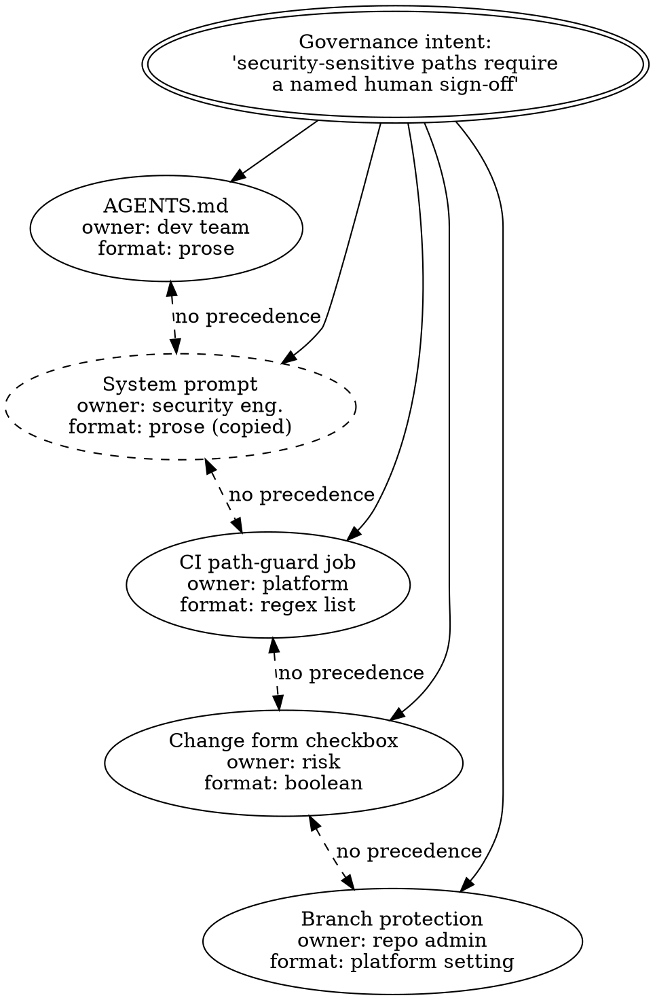

# The Governance Gap

> **Opening scenario.** Northstar Services' Engineering Platform division has been running Forge, its software-development agent, against the repository `northstar/payments-api` for four months. On a Tuesday, Forge opens a pull request that renames a configuration module and, along the way, edits a file under `auth/`. Five separate controls exist for exactly this situation: the repository's `AGENTS.md` states that security-sensitive paths require human sign-off; the continuous-integration (CI) pipeline runs a job blocking changes to protected paths; the ticket system's change form has a checkbox labelled "security-sensitive change"; branch protection requires a second reviewer on `main`; and Forge's system prompt repeats the whole charter. The pull request merges in eleven minutes with a single approval from the engineer who prompted Forge. The reconstruction is uncomfortable reading. The `AGENTS.md` rule was correct and current. The prompt Forge actually ran with was a shortened copy assembled by a helper script eight weeks earlier, and the copy had dropped the sign-off clause. The CI job's protected-path list named `src/auth/`, written before a restructure moved the directory to `services/auth/`. The ticket checkbox was optional and nobody ticked it. The second-reviewer rule had been relaxed "temporarily" during an incident in March. Five controls, none individually wrong, and no answer to the question the incident review actually asked: which of them was supposed to be authoritative?

> **Learning objectives.**
> - Describe the set of informal control artifacts a typical organization accumulates around an agentic system, and explain why they constitute a distributed control system without a protocol.
> - Define governance debt and explain the specific respects in which it behaves like, and differs from, technical debt.
> - Define and distinguish four kinds of drift — control, policy, configuration, and framework-adapter — and identify which one a given incident exhibits.
> - Explain, along four independent axes, why model alignment, system prompts, and guardrail services do not close the governance gap.
> - Draw a bounded architectural lesson from telecommunications' move from standalone appliances to layered control planes, and state precisely where that analogy fails.

> **Prerequisites.** Chapter 1: the four properties of agentic execution (non-reproducible decision paths, instruction–data confusion, the reachability–authorization gap, emergent action sequences) and the observation that the inherited controls degrade in character rather than disappearing.

## 2.1 An unprotocoled distributed control system

Nothing in the opening scenario was negligent. Each of Northstar's five controls was created by a competent person solving a real problem at the moment it appeared: a developer wrote the rule where he could edit it, a security engineer added it to the prompt because that was the artifact she controlled, a platform engineer built the CI job when asked for something enforceable, a risk analyst added a checkbox to a form that already existed. Every step was locally rational. The accumulated result is what this chapter calls the <span class="ix" data-ix="governance gap">governance gap</span>: the distance between the controls an organization believes it operates and the controls that actually constrain what its agents do.

The gap is not primarily a documentation problem, and a better `AGENTS.md` does not solve it. It is architectural, and it becomes visible the moment we describe the five artifacts in the language we would use for any other distributed system. Each control is a component holding state — the rule it encodes — updated independently by a different owner on a different cadence and consulted at a different point in the lifecycle. The components have no way to talk to one another: no shared identifier for the rule they all claim to implement, no shared version, no defined <span class="ix" data-ix="precedence!absence of">precedence</span> when they disagree, and no mechanism that notices when they do. A distributed system whose replicas cannot detect divergence is not a system with a consistency bug; it is a system with no consistency model at all.

Figure 2.1 renders the scenario in exactly those terms. One governance intent — *security-sensitive paths require a named human sign-off* — is projected into five representations, none of which references any other.



**Figure 2.1 — One intent, five unprotocoled representations.** Solid arrows project a single intent into an artifact; dashed bidirectional arrows mark pairs that can contradict each other with no defined resolution; the dashed node is a copy that has already diverged from its source. The teaching purpose is that the opening scenario's failure is structural rather than clerical: no edge in this graph is one along which disagreement could be detected.

Table 2.1 makes the same point by inventory, asking of each control the questions an engineer would ask of any control. Read down the last two columns and the shape of the gap is unmistakable.

| Artifact | Owner | When it acts | Behavior when violated | Evidence left behind |
|---|---|---|---|---|
| `AGENTS.md` | Repository developers | Whenever the model happens to read it | None; the text is advisory context | None |
| System prompt | Security engineering | Every inference, in-band with untrusted content | None; competes with other text for the model's attention | None |
| CI path-guard job | Platform engineering | On pull-request events matching a branch filter | Pipeline failure, if the surface is in scope | Build log, retained by pipeline policy |
| Change-form checkbox | Risk and audit | When a human remembers to fill it in | None; the field is optional | Ticket record, unbound to a revision |
| Branch protection | Repository administrator | On merge to a configured branch | Merge blocked | Platform audit log, coarse-grained |

**Table 2.1 — Inventory of the informal control set from the opening scenario.** Its teaching purpose is the asymmetry between the first two rows and the rest: the artifacts stating the rule most completely have no enforcement and no evidence, while the artifacts that enforce something encode only a fragment of the rule.

Two structural properties follow. First, *statement and enforcement are separated by construction*: the complete rule lives in prose that nothing evaluates, while the evaluable fragments live in a regex, a checkbox, and a platform toggle. Nobody decided on that division of labour; it is a byproduct of which artifacts each team could edit. Second, *no artifact carries the identity of the rule it implements*. The CI job does not know it implements the same proposition as the branch-protection setting. Because the rule has no identity it has no version, and so "has this control changed since the risk committee reviewed it?" is not a question the system can answer.

> **Key idea.** Informal controls are not a smaller version of a control system; they are a distributed system that was never given a protocol. Adding another control to such a set can *reduce* assurance: it adds another representation that can disagree, another surface that can be bypassed, and another reason for a reviewer to believe the matter is handled.

## 2.2 Governance debt

Software engineering already has a name for the accumulated cost of locally rational shortcuts: technical debt. The analogue is worth stating precisely, because it is close enough to be useful and different enough to mislead if taken too far.

Define <span class="ix" data-ix="governance debt">governance debt</span> as the accumulated cost of maintaining multiple uncoordinated representations of the same authority, policy, evidence, or approval requirement. Its unit is the <span class="ix" data-ix="representation pair">representation pair</span>: every additional artifact expressing a rule adds a pairwise relationship someone must keep consistent, by hand, forever. Five representations create ten pairs; a sixth artifact raises the number to fifteen. Nobody is assigned to any of them.

The debt accrues interest in three recognizable ways. Change becomes more expensive, because modifying the rule means locating and editing every representation, and that set is not enumerated anywhere. Review becomes less reliable, because a reviewer inspecting one artifact cannot tell whether the others agree. And confidence becomes *anti-correlated* with reality: each new control makes the organization feel better protected while making the actual protective set harder to determine. That last property has no clean analogue in technical debt. A messy codebase feels messy; a thicket of governance artifacts feels thorough.

Two further differences matter. Technical debt is usually paid by the team that incurred it, on a timescale of sprints, and its failure mode is slowness. Governance debt is typically paid by a different function entirely — the risk office, an auditor, an incident responder — on a timescale of years, and its failure mode is a confident but false statement made to someone outside the organization. When Northstar's Risk & Audit chief tells a regulator that production changes require human approval, the truth of that sentence depends on the least reliable representation in the set, not the most articulate one. Interest on governance debt is paid in one currency, and that currency is drift.

## 2.3 Four kinds of drift

<span class="ix" data-ix="drift">Drift</span> is disagreement, over time, between representations of the same governance intent, or between a control and the world it was written for. The word is used loosely, which obscures four quite different failures hiding beneath it, with different causes, detection strategies, and owners. An incident review that cannot name which kind occurred usually prescribes the wrong remedy.

### Control drift

<span class="ix" data-ix="drift!control">Control drift</span> is divergence between the set of controls an organization believes are operating and the set that actually operates. The rule text is unchanged and correct; what changed is <span class="ix" data-ix="coverage">coverage</span> — which surfaces, branches, environments, or code paths the control reaches, or whether it runs at all.

The opening scenario contains a clean instance. Branch protection on `main` was relaxed during a March incident and never restored: the rule ("two reviewers on protected branches") was never edited, discussed, or downgraded, it simply stopped running. A subtler instance is the CI path-guard job, configured to run on pull requests targeting `main`, with a `release/2.4` branch created in June sitting outside its filter. No control was disabled; a new surface appeared that the control's coverage never grew to include. Control drift grows silently with the system, which is why Chapter 14 treats <span class="ix" data-ix="coverage inventory">coverage inventories</span> as first-class artifacts rather than documentation.

### Policy drift

<span class="ix" data-ix="drift!policy">Policy drift</span> is divergence in *content* between two or more representations of the same rule. Each is running, each is covered, and they say different things. Listing 2.1 shows Northstar's instance as it appeared in the three files: the prose list, the pipeline's pattern list, and the fragment the prompt builder assembles.

```text
# AGENTS.md (repository root)
Security-sensitive paths requiring human sign-off:
  auth/  crypto/  .github/workflows/  db/migrations/

# .ci/path-guard.yml (platform-owned)
protected:
  - "^src/auth/"
  - "^src/crypto/"
  - "^\\.github/workflows/"

# prompt_fragments/forge_charter.txt (assembled by build_prompt.py)
You may propose changes on branches and open pull requests.
```

**Listing 2.1 — Three representations of one rule, in three formats, with three different contents.** Illustrative — not drawn from the repository. The first block names four path prefixes; the second names three, each prefixed with a directory that no longer exists; the third has lost the clause entirely.

All three are consulted, all three are alive, and they disagree. Because no artifact references any other, the disagreement is invisible until an action falls into the difference. Note the direction of the failure: the *weakest* representation determines the actual guarantee, while the *strongest* determines what people say the guarantee is. Chapter 8 treats the structural cure — deriving representations from a single source and comparing them as canonical sets rather than as text — and shows why weakening must be made loud rather than merely discouraged.

### Configuration drift

<span class="ix" data-ix="drift!configuration">Configuration drift</span> is divergence between a control's text, which is unchanged, and its *effect*, which has changed because something the control depends on moved. The control runs, it is covered, and it agrees with every other representation. It has simply stopped meaning what it meant.

The opening scenario's instance is the restructure that moved `auth/` from `src/auth/` to `services/auth/`: the CI job still executes, still matches its pattern faithfully, and now matches nothing. A more insidious variety runs through an external system — a branch-protection rule requiring review from a code-owning team stays correct while the identity provider's group behind that team is emptied in a reorganization, after which the rule is satisfied by zero reviewers. Configuration drift is distinguished from policy drift by *where* the change happened: in policy drift someone edited a rule; in configuration drift nobody edited any rule, and the environment the rule referenced moved underneath it.

### Framework-adapter drift

<span class="ix" data-ix="drift!framework-adapter">Framework-adapter drift</span> is divergence between a governance integration and the framework it wraps. It is specific to agentic systems and the most dangerous of the four, because the failure signal is usually silence.

Governance that acts at run time must intercept the agent's actions somewhere, and in practice that means binding to a framework's extension point: overriding a tool base class, wrapping a graph node, registering a callback. The binding is an assumption about someone else's internals. Consider a wrapper that overrides a framework's synchronous tool-execution method. It is correct and complete for every synchronous call. The framework then gains an asynchronous tool path; the planner, given a task with parallel steps, routes three tool invocations through it; and those three calls execute with no authorization check and produce no record. The wrapper still imports, still initializes, still reports itself as installed. Nothing failed, the dashboard is green, and the coverage simply moved.

The problem is tractable when taken seriously. The reference framework adapters distributed alongside Nornyx, for example, pin the frameworks they wrap to exact versions rather than ranges — CrewAI at `==1.15.4` and LangGraph at `==1.2.2` at the snapshot this book describes — refusing to operate against any other version, on the stated grounds that a wider range is not claimed until test evidence supports it. They also publish a machine-readable coverage inventory naming each framework surface as <span class="ix" data-ix="surface!wrapped">wrapped</span>, <span class="ix" data-ix="surface!unwrapped">unwrapped</span>, or <span class="ix" data-ix="surface!unsupported">unsupported</span>, so that the asynchronous path above is a declared, testable gap rather than an incident discovery. Chapters 22 and 25 develop both mechanisms; framework-adapter drift is a design obligation, not an unavoidable hazard.

Table 2.2 sets the four side by side; its final column determines what kind of engineering closes each gap.

| Drift type | What changed | Worked example | Why it is hard to see | What detects it |
|---|---|---|---|---|
| Control | Coverage or execution of a control | Branch protection relaxed in March and not restored; new `release/2.4` branch outside the CI filter | The control still exists and still passes where it runs | An enumerated inventory of surfaces compared against controls applied |
| Policy | Content of one representation | `AGENTS.md` lists four protected prefixes, the CI regex three, the prompt copy none | Each artifact reads correctly in isolation | Deriving representations from one source, or comparing them as canonical sets |
| Configuration | The environment a control names | `src/auth/` moved to `services/auth/`; code-owner team emptied in the identity provider | Nothing in the governance artifacts changed at all | Testing the control against its intent, not just executing it |
| Framework-adapter | The framework beneath the integration | New asynchronous tool path bypasses a wrapper that overrides only the synchronous method | The wrapper loads and reports success; failure is silent | Version pinning plus a declared coverage inventory with negative tests |

**Table 2.2 — The four drift types.** The teaching purpose is diagnostic: name the type before proposing a fix, because a policy-drift remedy (single-sourcing) does nothing for framework-adapter drift, and a control-drift remedy (broader coverage) does nothing for configuration drift.

Figure 2.2 places each type on the path from intent to executed action, the fastest way to see why they need different remedies.

<figure class="nx-fig" id="fig-2-2">
  <div class="fig-body">
    <div class="flow-col">
      <div class="flow"><div class="node">Intent</div><div class="arr">→</div><div class="node">Rule text</div><div class="arr">→</div><div class="node">Control instance</div><div class="arr deny">⛔</div><div class="node">Surface not covered</div></div>
      <div class="flow"><div class="node">Intent</div><div class="arr">→</div><div class="node">Rule text A</div><div class="arr">→</div><div class="node">Rule text B (weaker)</div><div class="arr">→</div><div class="node">Effective rule = B</div></div>
      <div class="flow"><div class="node">Intent</div><div class="arr">→</div><div class="node">Rule text (stable)</div><div class="arr">→</div><div class="node">Names a moved path</div><div class="arr">→</div><div class="node">Matches nothing</div></div>
      <div class="flow"><div class="node">Intent</div><div class="arr">→</div><div class="node">Adapter hook</div><div class="arr dashed">⇢</div><div class="node">New framework path</div><div class="arr dashed">⇢</div><div class="node">Action, unobserved</div></div>
    </div>
  </div>
  <figcaption><b>Figure 2.2 — Where each drift type enters the chain from intent to action.</b> Rows top to bottom: control drift (the control never reaches the surface), policy drift (a weaker representation becomes the effective rule), configuration drift (the rule survives but references a world that moved), framework-adapter drift (the dashed path executes outside the integration entirely). The teaching purpose is that the four failures occupy four different positions in the chain, so no single mechanism addresses all of them.</figcaption>
</figure>

> **Case study — Forge.** The Tuesday merge is now diagnosable: not one failure but four, stacked. Control drift (relaxed branch protection, an uncovered release branch), policy drift (three protected-path lists with three different contents), configuration drift (the restructured `auth/` directory), and — found a week later — framework-adapter drift, when the platform team discovered that a tool-logging wrapper added in April had stopped recording anything after a framework upgrade in June. Engineering Platform's first instinct was a sixth control: a pre-merge script asking Forge to self-certify that it had respected the charter. The Risk & Audit chief rejected it in one sentence — "that is the agent attesting to its own compliance" — and asked instead the question that organizes the rest of Part I: *what would have to be true for the answer to "was this change approved by a qualified human, bound to this exact revision?" to be computable rather than reconstructable?* Forge returns in Chapter 9, where approval becomes a bound record, and in Chapters 29 and 30, where the merge lane becomes fail-closed.

## 2.4 Why alignment, prompts, and guardrails do not close the gap

The obvious objection is that all of this describes an outdated problem. Models are improving, instruction-following is improving, and a growing product category offers guardrails, prompt filters, and content classifiers that sit around the model and block bad behavior. Why is scattered-artifact archaeology the right frame rather than a stronger model with a good safety layer?

Because all three are valuable and all positioned to solve a different problem. Chapter 1 argued this from one direction: alignment shifts a distribution, and an obligation of the form "X cannot happen without Y" is not a statement about a distribution. We can now be specific, along four independent axes. A mechanism failing any one of them leaves the gap open; these three fail all four.

**Wrong layer.** Alignment and system prompts operate *inside* the component whose behavior is in question: they shape what the planner is inclined to propose. Governance is a statement about what the system will *do*, a property of the <span class="ix" data-ix="action boundary">action boundary</span> between the planner and its effects, where a proposed tool call becomes an executed one. A control living inside the planner cannot bound the planner, for the same reason a program cannot enforce its own memory safety by intending to. Guardrail services sit closer to the right layer, running between components, but the mainstream instances of the category filter *content*. The governed object in an agentic system is not text; it is an action with arguments, an identity, a target, and a context history. A filter examining the string a model emitted is examining a shadow of the decision.

**No determinism.** A classifier and a language model are both probabilistic, so a guardrail built from either inherits the property that made governance necessary in the first place. This is not a criticism of accuracy: a filter with a 99.5% detection rate on a well-defined category is worth deploying. But it cannot support "this agent cannot publish externally," only "this agent's external publications are usually caught." Chapter 3 formalizes the distinction; the operational consequence is that a probabilistic control cannot be the last line of defence for a consequence the organization cannot afford even once.

**No evidence.** Ask what durable, inspectable record each leaves. Alignment leaves none: a disposition is not an event. A system prompt leaves none: it is context, consumed and discarded. Guardrails leave logs, but a log is not evidence in the sense Part III develops — it records that a request was scored and permitted, not which policy version was in force, which identity made the request, or which revision authorized it. When Northstar's auditor asks "show me every action this agent took last quarter that required approval, and the approval bound to each," none of the three can answer, because none was designed to produce records that survive the run.

**No accountability binding.** Finally, and most importantly for a regulated organization, none of the three attaches a decision to an accountable party. Governance is not only about preventing actions; it is about establishing *who decided*, under *which authority*, at *which moment*, bound to *which exact revision of the thing decided about*. Alignment has no decider. A prompt has an author, but no record connects that author to a specific action. A guardrail has an operator, but its verdict is a machine classification, not a delegation of human authority. The March relaxation of Northstar's branch protection was a governance failure because it dissolved a binding, not because it changed a probability.

> **Misconception.** *"A guardrail service is the enforcement layer; we just need to add policy to it."* Guardrails and governance layers compose well, and Chapter 26 designs such compositions. But the categories differ in claim structure. A <span class="ix" data-ix="guardrail">guardrail</span> asserts a probabilistic judgment about content and typically <span class="ix" data-ix="fail-open">fails open</span> when uncertain, because a filter that blocks on uncertainty destroys usability. A governance decision point asserts a deterministic verdict about a described action under a versioned policy, and is designed to <span class="ix" data-ix="fail-closed">fail closed</span>. Bolting rules onto a component whose failure mode is "allow when unsure" produces a system whose overall failure mode is also "allow when unsure," however the rules are written.

Table 2.3 records the comparison. It is unkind to none of the three: each column has a row where it is the right answer.

| Property | Model alignment | System prompt / instruction file | Content guardrail | What governance requires |
|---|---|---|---|---|
| Layer | Inside the planner | Inside the planner's context | Around the text channel | At the action boundary |
| Verdict | Statistical disposition | Advisory request | Probabilistic classification | Deterministic decision over a described action |
| Failure behavior | Degrades quietly | Ignored quietly | Usually fail-open | Fail-closed by design |
| Record produced | None | None | Scoring log | Decision record bound to policy version, identity, and revision |
| Accountable party | None | Prompt author, unbound to actions | Service operator | Named human authority bound to a specific decision |
| Where it is the right answer | Reducing the base rate of undesired proposals | Communicating intent and improving task quality | Catching categories of harmful content cheaply and early | Making and proving bounded commitments |

**Table 2.3 — Four axes on which the AI-native answers do not close the gap.** The last column states a requirement rather than a product. The teaching purpose is that these mechanisms are complements: an organization deploying all three still cannot answer the auditor's question, and one deploying governance alone still faces a planner proposing bad actions more often than it needs to.

## 2.5 A precedent: from standalone boxes to a layered control plane

Engineering has faced the shape of this problem before, in an industry that resolved it explicitly and at scale. This book's one recurring analogy — used here and in four later chapters, each time with its limits stated — is the evolution of telephony from standalone voice-over-Internet-Protocol (VoIP) appliances to the layered IP Multimedia Subsystem (IMS) architecture underpinning voice over LTE [@3gpp-ims; @gsma-volte].

Early VoIP deployments were built from integrated appliances. A single box terminated signaling, handled media, held subscriber records, decided which calls a subscriber was entitled to make, applied whatever policy the operator wanted, and produced billing records. Every function was present and every function was fused to every other. The consequences are familiar from Section 2.1: interoperating with another operator required a pairwise arrangement, because there was no defined interface between boxes, only between vendors; introducing a service meant touching every appliance; answering "what policy applied to this call?" meant reading a proprietary configuration and trusting the vendor's log; and two boxes could hold contradictory entitlements indefinitely without anything noticing.

IMS did not solve this by making the boxes better. It solved it by *decomposing the functions* and *specifying the interfaces between them*. Signaling control was separated from subscriber data, which was separated from policy decision, which was separated from policy enforcement in the traffic path, with named reference points between them and interworking gateways at operator boundaries. Two properties of the result matter for us.

The first is <span class="ix" data-ix="functional decomposition">functional decomposition</span>: each function became a nameable, separately specified, separately conformance-tested element, so that "which component decides whether this subscriber may place this call?" acquired exactly one answer, the same one across vendors. The second is <span class="ix" data-ix="control plane!separation from user plane">control-plane and user-plane separation</span>: the plane that makes and records decisions about a call is architecturally distinct from the plane carrying the call's media. Because decisions live in their own plane, they can be made, logged, audited, and regulated independently of the traffic they authorize — and the <span class="ix" data-ix="policy enforcement point">enforcement function</span> sits in the bearer path, so an endpoint cannot decline to consult it.

Figure 2.3 puts Northstar's current state and the decomposed target side by side, using the same layering.

<figure class="nx-fig" id="fig-2-3">
  <div class="fig-body">
    <div class="layers">
      <div class="layer untrusted" data-note="Today: one fused artifact set, no named interfaces">Agent process + framework + prompts + scattered checks + ad-hoc logs</div>
    </div>
    <div class="layers">
      <div class="layer authority" data-note="Declares intent; versioned; reviewable">Policy and authority declaration</div>
      <div class="layer" data-note="Evaluates a described action against declared policy">Decision function</div>
      <div class="layer" data-note="Sits between proposal and effect; fails closed">Enforcement point at the action boundary</div>
      <div class="layer" data-note="Records what was decided, bound to versions and identities">Evidence plane</div>
      <div class="layer untrusted" data-note="Probabilistic; not a control surface">Planner and framework (user plane)</div>
    </div>
  </div>
  <figcaption><b>Figure 2.3 — Fused controls versus a decomposed control plane.</b> Top: the state described in Section 2.1, where every governance function is fused into the agent's execution environment and its surrounding scripts. Bottom: the decomposition this book develops, with the planner deliberately drawn as an untrusted layer rather than a participant in governance. The teaching purpose is to show that the telecom lesson is about *naming the functions and the interfaces between them*, not about adding components.</figcaption>
</figure>

Now the limits, stated plainly, because an unbounded analogy becomes an argument by vibe.

Telecom signaling is deterministic and agent behavior is not. A session-initiation message is drawn from a closed protocol grammar, and an element receiving one can parse it completely and decide from a finite field set. An agent's proposed action is drawn from a sampler over natural language, and the situations producing it are unbounded. Everything in IMS that depends on enumerating the message space in advance has no counterpart here, which is why Chapter 7 spends its length on making evaluation deterministic *despite* a non-deterministic proposer.

The media plane is not model inference. Media in a telephone call is opaque payload: bytes no element interprets as instructions. The agentic analogue of "payload" is the model's context, whose defining property is that it *is* interpreted as instructions, by the very component we are trying to bound. Instruction–data confusion has no telecom equivalent, and any reading of the analogy that treats the user plane as inert is wrong for our purposes.

IMS enforcement is mandatory; most agentic enforcement today is cooperative. A mobile network's policy enforcement function sits in the bearer path, and a handset cannot route around it and still reach the network. An in-process wrapper around a framework's tool method is a control the calling code can decline to use. That distinction between <span class="ix" data-ix="cooperative enforcement">cooperative enforcement</span> and <span class="ix" data-ix="independent enforcement">independent (mandatory) enforcement</span> is central enough that Chapter 10 is built around it and Chapter 13 turns it into an assurance-tier model.

Finally, telecom had a standards body, a conformance regime, and statutory obligations that forced convergence. Agent frameworks have none. The architectural lesson transfers; the institutional machinery that made it stick does not, which is why this discipline must supply its own conformance and coverage practices (Chapters 14, 15, and 25).

## 2.6 What closing the gap actually requires

The diagnosis yields a short list of requirements, worth stating before any mechanism is proposed, because they are what later chapters are accountable to.

A rule must have one <span class="ix" data-ix="authoritative representation">authoritative representation</span>, from which every other is derived rather than copied, so that policy drift becomes a build failure rather than an archaeology exercise. A control must have an *enumerated coverage set*, so that control drift is a difference between two lists. A rule must be *testable against its intent* and not merely executable, so that configuration drift is caught by a test asserting what the rule is for. An integration must *declare the surfaces it covers and those it does not*, and fail closed rather than silently when its assumptions break. And every decision must leave a *record bound to the version of the policy, the identity of the actor, and the revision of the thing decided about*, so that the auditor's question has a computable answer.

None of these mentions a product or artificial intelligence. That is intentional: they are properties a control system must have. Parts II and III derive the architecture that provides them, and Parts IV onward examine one implementation of its design-time and cooperative-runtime portions.

> **Design checkpoint.** For a system you work on, answer in writing, without opening a tool: How many artifacts state the same governance rule? Which one is authoritative when they disagree, and what enforces that precedence? For your most important control, what is the enumerated set of surfaces it covers, and when was that set last compared against the surfaces that exist? If your runtime integration stopped intercepting tomorrow, what would tell you — and how long would it take?

Chapter 3 takes the next step. Before designing mechanisms we need to know what a governance layer can honestly claim to guarantee once it exists, because a control system that overstates its guarantees is a more dangerous artifact than none at all.

## Summary

Organizations do not decide to govern agentic systems informally; they arrive at informality by accumulating locally rational controls, each written by a different owner in a different format at a different moment. The result is a distributed control system with no shared identity for its rules, no versions, no precedence, and no way to detect disagreement. The maintenance cost of that structure is governance debt, paid — unlike technical debt — by a different function, on a longer timescale, in the currency of confident false statements. The debt is serviced through four kinds of drift, each with its own cause and remedy. The mechanisms most often offered as answers fail as governance on four independent axes: layer, determinism, evidence, and accountability binding. Telecommunications' move from fused appliances to a layered control plane shows that the structural cure is functional decomposition plus separation of the deciding plane from the acting plane, though the analogy breaks at determinism, at the interpretability of the payload, at mandatory versus cooperative enforcement, and at the absence of any standards regime for agent frameworks.

- Scattered controls form a distributed system nobody designed; adding controls to it can reduce assurance rather than increase it.
- Governance debt is measured in representation pairs and paid in drift.
- The four drift types — control, policy, configuration, framework-adapter — occupy different positions on the path from intent to action and require different remedies.
- Alignment, prompts, and guardrails are complements to governance, not substitutes: none produces a deterministic verdict, a durable record, or an accountable decider.
- The requirements that close the gap are single-sourcing, enumerated coverage, intent-level testing, declared integration boundaries with fail-closed behavior, and decisions bound to versions and identities.

## Review questions

1. Explain why the failure in the opening scenario is architectural rather than clerical. What single property, if the five artifacts had possessed it, would have made the contradiction detectable?
2. Distinguish policy drift from configuration drift using an example in which no governance artifact was edited at all. Why does the distinction change the remedy?
3. Framework-adapter drift is described as the most dangerous of the four types. State the property that makes it more dangerous than the other three, and describe one mechanism that converts it from a silent failure into a loud one.
4. A team argues that its guardrail service closes the governance gap because it blocks harmful outputs with 99.7% accuracy. Using Section 2.4's four axes, write the most precise objection you can, and name the axis they have most likely not considered.
5. State two properties that transfer from the IMS decomposition to agentic governance and two that do not, and explain in one sentence each why the non-transferring properties matter for design.

## Exercises

1. **Drift audit.** Choose a repository or service that uses an AI coding assistant or any tool-using agent. Enumerate every artifact stating a rule about what the agent may do — instruction files, prompts, CI jobs, platform settings, forms, wiki pages — and record Table 2.1's columns for each. Then find at least one genuine instance of each drift type, or argue with evidence why a type is absent. Produce a one-page diagnosis, not a remediation plan.
2. **Classify the incident.** Write three short incident narratives, each exhibiting exactly one drift type and all plausible for the same system. Exchange them with a colleague and classify each other's without discussion. Where you disagree, determine whether the ambiguity lies in the narrative or in your definitions, and sharpen whichever is at fault.
3. **Bound the analogy.** Pick another layered architecture you know well (an operating-system kernel boundary, a payment-card network, a hospital records system). Identify its functional decomposition and its deciding-versus-acting separation, then write three sentences stating where the analogy to agentic governance breaks. Compare those failure points to Section 2.5's.

## Further reading

- [@3gpp-ims] — the specification behind this chapter's analogy; read the functional-element and reference-point sections to see how completely the interfaces are named.
- [@parnas-criteria] — the founding argument for decomposing systems around the decisions they hide; why Figure 2.3's lower stack is better engineering than its upper one.
- [@owasp-agentic] — a practitioner catalogue of agentic threats, useful for checking whether your drift audit missed a category.
- [@sre-book] — on how controls decay in production; its treatment of toil and of monitoring the monitors maps onto control drift.
- [@nist-ai-rmf] — the organizational vocabulary into which Section 2.6's requirements are usually translated when they leave engineering.
