# Identity, Capabilities, and Authority

> **Opening scenario.** Six weeks after the near-miss described in Chapter 1, Northstar Services' platform team sits down to answer what sounds like a trivial question: *who is Atlas?* The answers do not agree. In the orchestration framework, Atlas is a role string — `"Senior Research Analyst"` — passed to an agent constructor. In the cloud account, Atlas is whichever service principal owns the container, shared with two unrelated batch jobs. In the observability stack, Atlas is a trace attribute. In the internal document store, Atlas is an API key issued in March to a person who has since changed teams. In the runbook, Atlas is a paragraph. The Risk & Audit reviewer asks the question that ends the meeting: *if we needed to revoke Atlas at 14:05 today, what would we revoke, and how would we prove afterwards that the revocation took effect?* No artifact answers. The team has five names for Atlas and no identity.

> **Learning objectives.**
> - Explain why framework-level names — role strings, object instances, graph node labels, and process credentials — cannot serve as governance identities.
> - State the minimum fields a governance identity must carry, and justify each against a concrete failure it prevents.
> - Define a capability as a bounded action surface and distinguish capability, permission, and authority.
> - Apply least privilege and the object-capability tradition to agent systems, including the hazard of ambient authority.
> - Express authority as a scoped, time-bounded relation rather than a universal boolean.
> - Distinguish delegation from handoff formally, and predict the authority-escalation defect that follows from confusing them.
> - Recognize confused-deputy structures in agentic architectures and name the design property that removes them.

> **Prerequisites.** Chapter 1 (the reachable set versus the authorized set), Chapter 3 (what a governance layer can and cannot guarantee), and Chapter 4 (policy decision point and policy enforcement point, design-time versus runtime governance, cooperative versus independent enforcement). This chapter uses those terms without re-teaching them.

## 5.1 A name is not an identity

Every agent framework gives its agents names. The names are real, useful, and load-bearing for the framework: they route messages, label traces, and select prompts. They are not governance identities, and the gap between the two is the source of an entire class of control failures.

Consider what a framework name actually is. In a typical orchestration library, an agent is constructed with a role description and a goal, and the library keys its bookkeeping on that string or on the object's memory identity; in a graph-based framework, the analogous name is a node label. In both cases the name has three properties that disqualify it from governing anything. It is *unversioned*: changing `"Senior Research Analyst"` to `"Lead Research Analyst"` is a text edit no control notices. It is *unscoped*: nothing about the string says which data it may touch or which actions it may take. And it is *unauthenticated*: any code in the process can construct another agent with the same role string, and nothing distinguishes the two.

Process credentials are a better candidate and still not sufficient. A container running an agent holds a service principal in the organization's identity and access management (IAM) system, and that principal is versioned, revocable, and authenticated. But it identifies the *process*, not the *agent*, and certainly not the *decision*. When one process hosts a planner, three specialist agents, and a retry loop, the IAM principal answers "which workload is calling?" and cannot answer "which governed actor is responsible for this action?" A revocation at the principal level takes down the workload; there is no smaller unit to revoke because no smaller unit exists.

The distinction is old. Access-control theory has always separated the <span class="ix" data-ix="principal">principal</span> — the entity to which a decision is attributed and against which authority is recorded — from the identifiers a system uses for its own convenience [@lampson-protection]. Role-based access control formalizes the same separation between users, the roles they may activate, and the permissions those roles carry [@rbac-nist]. What is new in agentic systems is how many convenience identifiers there are, and how tempting it is to promote one because it is at hand.

> **Key idea.** A framework name answers "which component is running?" A governance identity answers "who is accountable for this action, under what authority, valid when, and revocable how?" These are different questions with different lifetimes, different owners, and different failure consequences. Building governance on the first is how organizations end up unable to revoke anything smaller than a deployment.

## 5.2 What a governance identity must carry

If a name is insufficient, what is sufficient? The answer is best derived from the failures each field prevents rather than from a schema handed down in advance.

A <span class="ix" data-ix="governance identity!namespace">namespace</span> and a <span class="ix" data-ix="governance identity!subject">subject</span> together give the identity a globally unambiguous handle. The subject is the local name — `atlas` — and the namespace states the authority domain that issued it — `northstar.research`. Without a namespace, two divisions independently creating an agent called `analyst` produce a collision that surfaces as either a silent merge of authority or an unresolvable audit trail. Splitting the two also records *who may issue and retire this identity*, which is a governance question that a flat string cannot express.

A **status** records the identity's administrative state — active, suspended, revoked, expired — as a first-class value rather than as the absence of a record. Deleting an identity to disable it destroys the evidence needed to interpret past actions. A revoked identity must remain readable so an auditor examining last month's decisions can determine that the actor was authorized *then*, and is not now.

A <span class="ix" data-ix="validity interval">validity interval</span> — a start instant and an expiry — makes authority time-bounded by construction. The default state of a credential should be "expired," not "valid until someone remembers." Expiry converts the hardest governance problem in practice, decommissioning, from an act of vigilance into an act of renewal. It also makes every authorization decision explicitly temporal: the question is never "is this identity valid?" but "was this identity valid at the instant of the decision?" Section 7.4 shows why that phrasing matters for determinism.

<span class="ix" data-ix="framework binding">Framework bindings</span> connect the governance identity to the framework-level names it is known by, one binding per framework. This is the field that resolves the opening scenario. Rather than pretending the framework names do not exist, the identity record enumerates them: this governance identity is the CrewAI agent whose key is `atlas`, *and* the node labelled `atlas` in a graph framework, *and* the fixture used in tests. An enforcement point that intercepts a framework call now has a defined resolution step — from framework name to governance identity — and a defined failure mode when that resolution is ambiguous or absent. Resolution failure is not a policy decision; it is a structural error, and it must fail closed rather than fall back to a default identity.

<span class="ix" data-ix="revocation">Revocation state</span> is deliberately separate from status. Status is the identity's own administrative field; revocation is a reference to a record produced by an authority that may not be the identity's owner. Separating them lets a security function revoke without editing the artifact a delivery team owns, and preserves the *reason and effective instant* of the revocation. That instant answers the reviewer's question in the opening scenario: actions before it were authorized, actions after it were not, and the record says so.

Finally, an identity must record what class of actor it is. Approval authority, accountability, and legal responsibility attach to humans. A governance model that lets a non-human actor hold approval authority has, in one field, dissolved the accountability chain the whole apparatus exists to protect. Chapter 9 develops human accountability in depth; here it is enough that the actor class belongs in the identity record itself.

<figure class="nx-fig" id="fig-5-1">
  <div class="fig-body">
    <table class="fig-table">
      <tr>
        <th>Governance identity</th>
        <th>binds to</th>
        <th>Capability declarations</th>
      </tr>
      <tr>
        <td>
          namespace <code>northstar.research</code><br/>
          subject <code>atlas</code><br/>
          actor class: non-human agent<br/>
          status: active<br/>
          valid 2026-02-01 → 2026-12-01<br/>
          revocations: (none)
        </td>
        <td>
          → framework bindings →<br/>
          <code>crewai:atlas</code><br/>
          <code>test-fixture:atlas</code><br/><br/>
          → membership →<br/>
          zone <code>research-internal</code>
        </td>
        <td>
          <code>research.search_approved</code> — actions: search; scope: approved sources; risk: low<br/>
          <code>research.summarize</code> — actions: summarize; scope: retrieved documents; risk: low<br/>
          <code>research.file_internal</code> — actions: file; scope: internal store; risk: low
        </td>
      </tr>
      <tr>
        <td colspan="3"><i>Not reachable through any declaration:</i> <code>publish_external</code>, <code>purchase.*</code>, and every tool not declared.</td>
      </tr>
    </table>
  </div>
  <figcaption><b>Figure 5.1 — Identity, bindings, membership, and capabilities for Atlas.</b> The identity on the left is the accountable subject; the middle column shows the two relations that make it operational — framework bindings, which let an enforcement point recognize it, and zone membership, which places it in a boundary (Chapter 6). The right column holds capabilities, each of which is a bounded action surface rather than a name. The teaching purpose is separation of concerns: renaming the framework agent changes only the binding, expiring the identity disables every capability at once, and adding a capability is a reviewable change to a distinct artifact.</figcaption>
</figure>

Listing 5.1 writes the record out; Figure 5.1 then shows how it relates to the rest of the model.

```yaml
identity:
  namespace: northstar.research
  subject: atlas
  identity_class: local_agent
  actor_class: non_human          # cannot hold approval authority
  framework_bindings:
    - {framework: crewai, agent_key: atlas}
    - {framework: contract_fixture, agent_key: atlas}
  capability_refs: [research.search_approved, research.summarize, research.file_internal]
  status: active
  valid_from: "2026-02-01T00:00:00Z"
  expires_at: "2026-12-01T00:00:00Z"
  revocation_refs: []
```

**Listing 5.1 — A governance identity for Atlas.** Illustrative — not drawn from the repository, though the field names follow the real record shape described in the callout at the end of this section. Every field answers a question a framework name cannot: which authority domain issued this, what may it do, when does it stop being valid, which framework names resolve to it, and what would be revoked.

Figure 5.1 assembles these elements. Read it as three artifacts, not one: an identity, a set of relations, and a set of capabilities. The value of the separation shows up under change. When the research team renames its framework agent, exactly one field moves. When the identity expires, no capability survives it, because capabilities are held *by* an identity and not independently. And when a reviewer asks what Atlas may do, the answer is an enumerable list rather than an inference over integration code.

> **Case study — Atlas.** Northstar declares Atlas as a governance identity in namespace `northstar.research` with subject `atlas`, bound to the CrewAI tool wrapper the Research & Insights pilot already uses. Its capability set is exactly three entries: `research.search_approved`, `research.summarize`, and `research.file_internal`. All three are low risk and none carries a gate, which is a deliberate design statement — Atlas's charter is meant to run without human intervention, and the way to keep it that way is to keep the risky things *out* of the capability set rather than to gate them inside it. `publish_external` and `purchase.*` are not gated capabilities of Atlas; they are not capabilities of Atlas at all. The distinction becomes operational in Chapter 7 and consequential in Chapter 10, where the publish request from Chapter 1's scenario meets an enforcement point.

> **Nornyx in practice.** As implemented at the snapshot, an agent identity in a Nornyx contract is a closed record whose required fields are the ones this section derives: `namespace`, `subject`, `identity_class`, `framework_bindings` (up to 32 unique framework/agent-key pairs), `capability_refs`, `status` drawn from `active | suspended | revoked | expired`, `valid_from`, `expires_at`, and `revocation_refs` (`schemas/agent_identities_v1.schema.json`). Two fields are constants rather than choices: `authority` is fixed to `non_human` and `can_approve` to `false`, so an approving agent identity is not merely disallowed but unrepresentable, and the same invariant is re-checked in code (`AN_NON_HUMAN_APPROVAL_INVALID`). Framework-name resolution raises a resolution error rather than returning a decision when the name is unknown or ambiguous — a structural failure, not a policy outcome. Part IV walks through the contract syntax; nothing here depends on knowing it.

## 5.3 Capability as a bounded action surface

A <span class="ix" data-ix="capability">capability</span>, in this discipline, is not a label but a declared, bounded surface of action, carrying enough structure that a decision procedure can evaluate a request against it without consulting anything else. Four components make it bounded in a useful way.

The **actions** are the verbs — the concrete operations the capability permits. Naming them explicitly is what prevents the drift from `research.summarize` to "whatever the summarization tool can be made to do." A capability with no enumerated actions is a category, and categories are not evaluable.

The <span class="ix" data-ix="capability!scope">scope</span> states the objects, contexts, or data the actions may touch. Scope is where most real governance lives, because the interesting distinctions in an enterprise are rarely about verbs. Reading is fine; reading *the payments database* is not. A capability model whose scope is implicit collapses every such distinction into the verb, and then teams discover they cannot express "may read, but only within this context" without inventing a new verb for every context.

The **risk classification** attaches a consequence tier, letting policy speak in general terms — "capabilities above medium risk require an approval" — without enumerating every capability in every rule. Risk is assigned once, by the people who understand the consequence, and consumed by many rules.

The <span class="ix" data-ix="obligation">obligations</span> are what must be true for the capability to be exercised: gates that must pass, approvals that must exist, evidence that must be produced. Attaching obligations to the capability rather than scattering them across call sites is what makes them survive refactoring. If `escalate_refund` requires an approval, that requirement travels with the capability into every context where it is granted.

A fifth component matters only once more than one agent exists: whether the capability may be **delegated**, and if so, how deep. Section 5.6 returns to it.

Notice what a capability defined this way is *not*. It is not a token presentable as proof of authority; it is a declaration that an authority relation may exist. It is not a command or a script. And it is not a credential. Keeping these out is deliberate: a declaration containing an endpoint and a key is no longer a governance artifact but a deployment artifact with a governance flavor, and it cannot be reviewed, versioned, or published on the same terms.

> **Nornyx in practice.** As implemented at the snapshot, a Nornyx capability declaration is a closed record with `name`, a non-empty `actions` list, a `risk` value from `low | medium | high | critical`, `scope_type` fixed to the constant `context` (so scope is always a declared context, never an ad-hoc string), a non-empty `scope_refs` list, a `delegable` boolean, an optional `max_delegation_depth` between 1 and 8, and three obligation lists: `required_gate_refs`, `required_approval_refs`, and `required_evidence_refs` (`schemas/agentic_capabilities_v1.schema.json`). The schema's own description states the boundary in one sentence: "A declaration is not a runtime token, authority grant, command, script, credential, or approval." Generation-time scanning enforces the same boundary mechanically, refusing to emit artifacts containing endpoint-, credential-, command-, or address-shaped fields.

## 5.4 Capability, permission, authority

Three words are used interchangeably in most engineering conversations and must not be, because the confusion produces real defects. Table 5.1 fixes the distinctions.

| Term | What it is | Who defines it | What it answers | Typical failure when conflated |
|---|---|---|---|---|
| Capability | A declared bounded action surface: actions, scope, risk, obligations | The system designer, at design time | "What kind of action could exist here?" | Treated as a grant, so declaring a capability is mistaken for authorizing it |
| Permission | A grant of a capability to an identity, with its own validity and conditions | The authority that owns the capability | "Who may exercise this, and until when?" | Treated as a capability, so revoking a grant is mistaken for removing the action from the system |
| Authority | The right to act *in a specific situation*, computed from identity, permission, scope, obligations, and time | The decision procedure, at decision time | "May this actor do this, to this, now?" | Treated as a permission, so a decision is cached or reused outside the situation that produced it |

**Table 5.1 — Capability, permission, and authority.** The three terms sit at different levels: capability is a type, permission is a binding, authority is an evaluated conclusion about a single situation. The right-hand column names the defect each conflation produces; all three appear regularly in agent deployments.

The most consequential of these confusions is the last. <span class="ix" data-ix="authority">Authority</span> is *situational and computed*, not stored. An identity does not "have" the authority to escalate a refund; it has a <span class="ix" data-ix="permission">permission</span> that, combined with the current time, the current zone, the requested scope, and the capability's obligations, may or may not yield authority for this particular request. Systems that store authority instead of computing it acquire a characteristic bug: a decision made under one set of conditions is reused under another. The agent was authorized to write to the internal store at 09:00; at 11:00 its membership was suspended; the cached authorization is still in a variable.

The second confusion — capability treated as grant — is endemic to agent frameworks, because in a framework, wiring a tool into an agent *is* the grant. There is no separate step. This is why the governance layer must keep declaration and grant apart: "a capability to file documents internally exists, is low risk, and requires no approval" is a different artifact, owned by different people, from "Atlas holds it from February to December."

> **Misconception.** *"If we enumerate the tools an agent can call, we have expressed its authority."* Tool enumeration bounds the reachable set (Chapter 1) and is genuinely valuable, but it says nothing about scope, time, conditions, or obligations. "Atlas may call `http.post`" and "Atlas may file a summary to the internal store during its validity window, provided the content did not originate in an untrusted zone" are statements of different kinds. The first is an integration fact; only the second can be evaluated, denied, or evidenced.

## 5.5 Scoped authority and the object-capability heritage

Least privilege is the oldest principle in this chapter and the most frequently misapplied. Saltzer and Schroeder stated it as a design principle for protection mechanisms: every program and every user should operate using the least set of privileges necessary to complete the job [@saltzer-schroeder]. The companion principle in the same paper — fail-safe defaults, in which access decisions default to denial — returns in Chapter 7.

The misapplication is to read <span class="ix" data-ix="least privilege">least privilege</span> as an instruction to make a shorter list of permissions. A team reduces an agent's tool list from twelve to seven, declares least privilege achieved, and has changed nothing about the shape of the problem: the seven survivors are still universal booleans. The agent may write files — all files, all the time, for any purpose. The principle's real content is about *scope*, and scope has at least four dimensions a boolean discards.

<span class="ix" data-ix="scoped authority">Scoped authority</span> is bounded by **object**: which resources, contexts, or data classes the action may touch. By **time**: within which validity interval. By **purpose**: for which mission the authority was granted, so authority acquired for one task cannot be spent on another. And by **condition**: under which state of the world — zone, taint, prior approval — it holds. A permission omitting all four is not least privilege; it is privilege with a shorter list.

The <span class="ix" data-ix="object capability">object-capability</span> tradition supplies the sharpest formulation of what goes wrong without scoping. In an object-capability system, the ability to act on a resource *is* a reference to that resource: you cannot name what you have not been given, and passing a reference is the only way to share authority [@miller-ocap]. The property this achieves is the elimination of <span class="ix" data-ix="ambient authority">ambient authority</span> — authority a subject exercises merely by virtue of being itself, without designating where the authority came from. A process opening `/etc/passwd` exercises ambient authority: it names a path, and the system consults the process's identity to decide. In an object-capability system there is no such consultation, because the process either holds a reference to that file or cannot name it.

Agent systems are, by default, maximally ambient. The planner emits a tool name and arguments; the tool consults credentials held by the process; the action succeeds. Nothing in the call designates *which grant* authorizes it. This is why the governance model in this book insists that every authorization request name its identity, its capability, and its scope explicitly: a request that designates its authority can be decided, denied, and recorded, while an ambient one can only be observed after the fact.

One qualification keeps this honest. This is an approximation of object capabilities, not an implementation of them: a cooperative layer that asks "does this identity hold this capability at this instant?" still consults a table keyed by identity, which is the ambient pattern object capabilities avoid. What it borrows is the discipline of explicit designation and attenuation, not the unforgeability of references — and unforgeability requires the surrounding runtime to prevent capability forgery. Chapter 13's assurance tiers make this precise: a cooperative layer inside the agent's own process cannot provide it, and claiming otherwise is the overstatement Chapter 3 warned against.

> **Design checkpoint.** For each authority your system grants to an agent, write down its four scopes. Which objects? Until when? For what purpose? Under what conditions? If any of the four is "all" or "unspecified", you have found either a deliberate risk acceptance — which should be a recorded exception with an owner and an expiry — or an unexamined default. Most systems, examined this way for the first time, find that purpose scoping is entirely absent.

## 5.6 Delegation and handoff

Multi-agent systems require agents to work with other agents, and exactly two things can be transferred between them. Confusing the two is the most productive source of authority-escalation bugs in agentic architectures, so the definitions are worth stating with care.

<span class="ix" data-ix="delegation">Delegation</span> transfers *authority*. A delegator that holds a capability grants a delegate the right to exercise some part of it. After a delegation, an authority relation exists that did not exist before: the delegate may now do something it previously could not.

<span class="ix" data-ix="handoff">Handoff</span> transfers *work*. One identity passes responsibility for a task, a case, or a mission to another. After a handoff, the receiving identity is responsible for the work — and holds exactly the authority it held before. A handoff creates no authority relation whatsoever.

The bug follows immediately from mixing them. An engineer implements "the coordinator hands the case to the escalation agent" and, discovering that the escalation agent cannot perform the next step, adds the missing capability at the point of handoff. The system now works. It also now contains a rule that says, in effect, *receiving work confers the authority needed to do it* — an escalation primitive available to anyone who can cause a handoff. The correct behavior, summarized in Table 5.2, is that a handoff whose receiver lacks a required capability *fails*; the fix is either to grant the receiver that capability deliberately, as a reviewable change, or to delegate it explicitly with bounds, as a recorded relation.

| Dimension | Delegation | Handoff |
|---|---|---|
| What moves | Authority to act | Responsibility for work |
| Effect on the receiver's capabilities | Adds a bounded, temporary one | None |
| Must be bounded by | Attenuation, depth, expiry, scope | Validity interval and share constraints |
| Correct failure when the receiver lacks the capability | Delegation is invalid (delegator cannot grant what it does not hold, or capability is not delegable) | Handoff is invalid — it may not supply the missing authority |
| What an auditor reconstructs | The chain: who granted what, to whom, bounded how, when | The custody trail: who was responsible for the work, when |

**Table 5.2 — Delegation versus handoff.** The rows that matter most are the second and the fourth: a handoff that adds capabilities is an escalation primitive, and a delegation that can exceed its delegator's own authority is the same defect in the other direction.

A delegation that is not bounded is barely better than a shared credential, so four bounds are mandatory.

<span class="ix" data-ix="attenuation">Attenuation</span> requires that the delegated actions and scopes be a subset of what the delegator holds. This keeps the authority lattice from inverting. Without it, an agent can delegate a capability it does not have, or a wider scope than it was granted, and the delegate ends up more powerful than its source. Attenuation must hold at every link of a chain, not only at the first: a second-order delegation may narrow but never widen its parent.

<span class="ix" data-ix="delegation!depth">Depth</span> bounds how many times authority may be re-delegated. It bounds the reconstruction cost of an audit — a chain of depth two is comprehensible, a chain of depth nine is not — and it bounds blast radius, since each hop multiplies the identities that can exercise the authority. Depth should be declared on the capability by the authority that owns it, so a delegator cannot grant a deeper chain than the owner permitted, and each chained delegation must also respect its parent's bound. Many capabilities should simply be non-delegable, and that too is a property of the capability rather than a decision made at delegation time.

**Expiry** bounds delegation in time. Delegation is the mechanism most likely to be created in haste and forgotten, so a delegation without an expiry should be a validation error rather than a default.

**Scope** bounds what the delegation is *for*. A delegation that names a purpose and a scope can be checked against the request it is invoked for; one that names only a capability cannot.

Figure 5.2 shows a chain with all four bounds and two rejected edges.

```dot
// fig=5-2 title="A bounded delegation chain with two rejected edges"
digraph G {
  rankdir=LR;
  owner [label="Capability owner\n(design-time declaration)\nreview.case  risk=medium\ndelegable=true  max_depth=2", peripheries=2];
  coord [label="identity.coordinator\nholds review.case\nscope: {open_cases}"];
  spec  [label="identity.specialist\ndelegated review.case\nactions ⊆ owner's\nscope ⊆ {open_cases}\ndepth 1/2, expires 2026-09-01"];
  sub   [label="identity.sub_specialist\ndepth 2/2\nnarrowed scope"];
  wide  [label="attempted: wider scope\n{open_cases, closed_cases}", style=dashed];
  deep  [label="attempted: depth 3", style=dashed];
  owner -> coord [label="grant"];
  coord -> spec  [label="delegate (attenuated)"];
  spec  -> sub   [label="onward delegation\npermitted by policy"];
  spec  -> wide  [label="rejected: scope escalation", style=dashed];
  sub   -> deep  [label="rejected: depth exceeded", style=dashed];
}
```



**Figure 5.2 — A bounded delegation chain with two rejected edges.** Solid edges are valid authority transfers; each narrows or preserves the actions and scope of its parent and stays inside the depth bound declared on the capability itself. The dashed edges are the two escalations a chain model must reject: widening scope relative to the parent, and exceeding the declared depth. The teaching purpose is that attenuation is a property checked at every link, not only at the first — a chain is safe only if every hop is.

> **Nornyx in practice.** As implemented at the snapshot, delegation is a declared record whose required fields include `delegator_ref`, `delegate_ref`, `capability_ref`, `purpose`, a non-empty `actions` list, non-empty `scope_refs`, a status, a validity interval, `max_depth` (1–8), `current_depth`, and `onward_delegation` restricted to `denied` or `allowed_with_policy` (`schemas/agentic_network_v1.schema.json`). Static validation enforces every bound this section derives, with a distinct diagnostic per failure: delegating a non-delegable capability (`AN_CAPABILITY_NOT_DELEGABLE`), delegating actions or scopes that are not a subset of the capability's own (`AN_DELEGATION_ACTION_ESCALATION`, `AN_DELEGATION_SCOPE_ESCALATION`), exceeding the depth the capability permits or the parent declared (`AN_DELEGATION_DEPTH_POLICY_EXCEEDED`), chaining under a parent that denies onward delegation (`AN_ONWARD_DELEGATION_DENIED`), self-delegation, and cycles (`nornyx/governance/agentic_delegation.py`). Handoffs are checked separately, and the check is the one this section argues for: if the receiving identity neither holds a required capability nor validly receives it by an existing delegation, validation fails with `AN_HANDOFF_AUTHORITY_ESCALATION`, whose message states the rule outright — "a handoff cannot grant authority."

> **Assurance boundary.** Everything in this section is a *design-time* property of declared relations. That a delegation chain is well-formed, attenuated, and bounded is checkable from artifacts alone, and that check is genuinely deterministic. It is not a claim that the running system honored the chain. Whether a delegate actually confined itself to the delegated scope depends on the enforcement point (Chapter 10) and the evidence it produced (Chapter 11), and the strength of that claim depends on which assurance tier the deployment supports (Chapter 13). Validating a delegation graph proves the graph is sound, not that reality matched it.

## 5.7 Confused deputies in agentic systems

The last piece of vocabulary names a failure pattern first described in 1988. Hardy's <span class="ix" data-ix="confused deputy">confused deputy</span> is a program that holds authority for its own purposes and is induced by a less-privileged caller to exercise that authority on the caller's behalf [@hardy-confused-deputy]. The original example is a compiler with permission to write to a billing file; a user asks it to write output to that filename, and the compiler — the deputy — destroys the billing records. The compiler was not compromised. It was confused: it could not distinguish authority *it* held from authority the request should have supplied.

Every ingredient is present, amplified, in an agentic system. The agent holds substantial authority for legitimate reasons; it accepts requests from many sources with less authority than it has; and it has no built-in way to distinguish an instruction that arrived *with* authority from one that merely arrived. The pattern therefore appears in three shapes.

The **retrieved-content deputy** executes an instruction found in content it fetched — a web page, a document, a ticket body — using its own authority. This is indirect prompt injection [@greshake-injection], and Chapter 6 treats it as the central case, because the right frame is not "the model was tricked" but "authority was confused": the attacker supplied text, the agent supplied authority.

The **tool-boundary deputy** is a tool that performs actions with credentials *the tool* holds, on arguments the agent supplies. If it authorizes on its own credentials rather than the requesting identity's authority, every caller inherits the tool's privileges. This shape is easy to build by accident, because it is exactly what a well-factored service client looks like. The distinguishing question is whose authority the decision consults.

The **delegation deputy** is the previous section's bug seen from the attacker's side: if being asked to do work causes an identity to acquire the authority for that work, arranging to be asked is an escalation technique.

The structural fix for all three is the same, and it is why this chapter placed such weight on designation. A deputy is confused when the request does not designate the authority under which it should be performed, so the deputy substitutes its own. Removing the confusion means every action carries the identity and capability it is claimed under, and the decision procedure evaluates the *claimed* authority rather than the deputy's ambient authority. In object-capability terms, the caller must pass the capability, not merely the request [@miller-ocap]. In this book's architecture, the enforcement point receives an identity, a capability, and a scope, and a request that cannot supply all three is not authorized by default.

This does not solve prompt injection. Nothing here prevents a model from *deciding* to invoke a capability it holds because a hostile document suggested it. What designation achieves is narrower and still valuable: the actions available to the confused deputy shrink to the capabilities that identity legitimately holds, in that scope, at that instant — and every attempt becomes a decision, which is to say something that can be denied and recorded. Chapter 6 takes up what remains.

## Summary

Framework names, object references, graph labels, and process credentials each answer a question the framework needs answered; none answers the governance question. A <span class="ix" data-ix="governance identity">governance identity</span> is a distinct artifact carrying namespace and subject, actor class, status, a validity interval, framework bindings, and revocation state — each field justified by a failure it prevents. Capabilities are bounded action surfaces with actions, scope, risk, and obligations; capability, permission, and authority are three levels — type, binding, and computed conclusion — whose conflation produces predictable defects. Least privilege is about scope in four dimensions, not shorter lists, and the object-capability tradition explains why: ambient authority is what makes deputies confusable. Delegation moves authority under four mandatory bounds — attenuation, depth, expiry, and scope — while handoff moves only work, and a handoff that supplies missing authority is an escalation primitive rather than a convenience.

- A name is unversioned, unscoped, and unauthenticated; an identity is none of those things.
- Status, validity intervals, and revocation records must survive the identity's retirement, because past decisions must remain interpretable.
- A capability without enumerated actions and explicit scope is a category, and categories cannot be evaluated.
- Authority is computed per situation from identity, permission, scope, obligations, and time; storing it invites reuse outside the situation that produced it.
- Attenuation must hold at every link of a delegation chain, and depth belongs to the capability's owner, not to the delegator.
- Confused deputies arise from ambient authority; explicit designation of identity, capability, and scope is the structural response.

## Review questions

1. A team argues that their framework's role strings are adequate identities because "they are unique within our deployment." Give three concrete operational failures this position produces, drawing each from a different field in Section 5.2.
2. Explain why a revoked identity must remain readable rather than being deleted. What audit question becomes unanswerable if it is deleted?
3. Distinguish capability, permission, and authority using an example of your own. For each of the three pairwise conflations, describe a defect it would produce in your example.
4. Why is "reduce the tool list from twelve to seven" an incomplete application of least privilege? Restate the same reduction as a scoping exercise across the four dimensions of Section 5.5.
5. A handoff is implemented so that the receiving agent temporarily gains any capability the task requires. Describe, step by step, how an attacker who can influence which tasks are created could reach a high-risk capability.
6. Identify the confused deputy: an agent calls a "reporting" tool that holds a database credential with read access to all schemas and runs whatever query the agent supplies. What single change removes the confusion, and what does it not fix?

## Exercises

1. **Write an identity record.** Choose an agent in a system you know and produce a governance identity record for it containing, at minimum, namespace, subject, actor class, status, validity interval, framework bindings, and revocation state. Then write, for each field, one sentence naming the specific incident that field would have made survivable. Where you cannot name an incident, consider whether the field is genuinely needed or whether you have copied a template.
2. **Bound a delegation.** Design a delegation from a coordinating agent to a specialist agent. State the delegated actions and scopes, show they attenuate the delegator's own, choose a depth bound and justify it in terms of audit cost and blast radius, and set an expiry with a stated reason. Then write the three validation errors your design must produce if someone edits it carelessly.
3. **Hunt a deputy.** Take one tool agents can call and determine whether it decides using the caller's designated authority or its own credentials. If the latter, write the smallest change that would make the caller's authority the basis of the decision, and identify what new information the call must carry. Count the call sites the change touches: that number measures how much ambient authority your system currently has.

## Further reading

- [@saltzer-schroeder] — the origin of least privilege and fail-safe defaults; read Section I for the design principles this chapter and Chapter 7 both build on.
- [@lampson-protection] — the early formalization of protection domains and the access matrix; shows how much of the modern vocabulary was fixed in four pages.
- [@miller-ocap] — the definitive treatment of object capabilities, designation, and attenuation; the source of this chapter's argument about ambient authority.
- [@hardy-confused-deputy] — three pages naming the failure pattern of Section 5.7 and explaining why capabilities were proposed as its cure.
- [@rbac-nist] — the reference model for roles, permissions, and separation of duties; useful for placing capability-based designs against the role-based systems enterprises already run.
