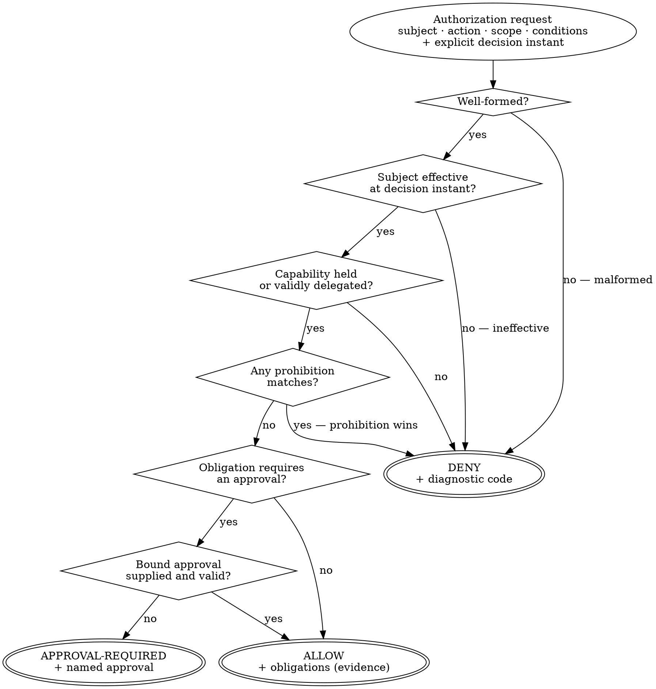

# Policy Semantics and Deterministic Evaluation

> **Opening scenario.** Northstar Services' Research & Insights division has finally written Atlas's charter down. The document is two pages of clear English: Atlas may search approved sources, summarize what it retrieves, and file summaries internally; it may not publish externally, purchase anything, or disclose confidential material. A partner engagement raises a concrete question — Atlas has produced a summary a partner has asked for. Is sharing it permitted? Three reviewers read the same two pages and give three answers. The first says allow: a summary is not confidential material, and nothing forbids sending it. The second says deny: the partner is external, and publishing externally is forbidden. The third says neither, that this obviously needs a human decision, though the document never says so. A fourth person then finds the deeper problem. The team's prototype checker, run against the charter twice in one afternoon, returned different results, because one rule mentioned "the current quarter" and the run straddled a quarter boundary. The charter is not wrong. It is not a policy, because it defines no decision domain, no default, no conflict rule, and no fixed instant of evaluation.

> **Learning objectives.**
> - Enumerate what a policy language must define — subjects, actions, conditions, and a decision domain — and explain why omitting any of the four makes a policy unevaluable.
> - Justify a three-valued decision domain of allow, deny, and approval-required, and distinguish approval-required from both deny and defer.
> - Apply default-deny and explain the conflict-handling rules that make a rule set total and order-independent.
> - Define evaluation determinism precisely, and identify the three mechanisms that most commonly destroy it: ambient state, wall-clock time, and mutable retained structures.
> - Explain closed schemas as semantic hygiene and state what a closed schema does and does not buy.
> - Design a policy for testability, and state which classes of property a runtime monitor can and cannot enforce.
> - Compare the evaluation semantics of XACML, Rego, and Cedar along dimensions that matter for governance.

> **Prerequisites.** Chapter 5 (identity, capability, scoped authority) and Chapter 6 (trust zones, membership, context origin and taint). Chapter 4's policy decision point (PDP) and policy enforcement point (PEP) separation is assumed. This chapter is about what the PDP computes; Chapter 10 is about who obeys it.

## 7.1 What a policy language must define

A <span class="ix" data-ix="policy">policy</span> is not a statement of values. It is a *decision procedure*: a total function from a described situation to a decision. Charters, principles, and standards are valuable and are none of them policies in this sense, because they cannot be evaluated. Making the difference precise requires four elements, and a language that omits any one of them produces documents that read like policy and cannot be applied.

<span class="ix" data-ix="policy!subjects">Subjects</span>. The policy must be able to name who is acting, in terms that connect to the identity model of Chapter 5 — a governance identity, its memberships, and the capabilities it holds. "Agents" is not a subject; `northstar.research/atlas`, acting under a membership in `research-internal`, is.

<span class="ix" data-ix="policy!actions">Actions</span>. The policy must name what is being attempted, at a granularity that matches the enforcement point's granularity. This is a frequent source of unevaluable policy: a rule about "sharing data" cannot be evaluated at a point that sees only "the tool `http.post` was called with these arguments." Either the rule descends to the enforcement point's vocabulary or the enforcement point rises to the policy's, and one of the two must happen deliberately. Chapter 22 treats this as the adapter's normalization problem.

<span class="ix" data-ix="policy!conditions">Conditions</span>. The policy must be able to constrain the situation: which zone, which taint, which time, which prior approval, which risk tier. Conditions are where the scoping of Section 5.5 becomes machine-readable, and a language whose conditions can only test the subject and the action can express role-based access control and very little else [@rbac-nist]. Attribute-based models exist precisely to widen this [@abac-nist].

A <span class="ix" data-ix="decision domain!closure">decision domain</span>. The policy must state what set of answers is possible, and the set must be closed and total: every well-formed request yields exactly one member of it. This is the element the opening scenario's charter lacks most conspicuously. Its three reviewers were not reading carelessly; they were each supplying a different missing decision domain.

To these four, governance adds a fifth element that pure access control usually treats as optional: <span class="ix" data-ix="obligation!in a decision">obligations</span>. A decision may carry requirements that attach to it — evidence that must be recorded, an approval that must be bound, a gate that must have passed. XACML made obligations a first-class part of a decision response for this reason [@xacml]. In a governed agentic system obligations are not decoration, because the assurance claim of Part III rests on them: a decision that permits an action while requiring evidence is a different decision from one that permits it silently.

> **Key idea.** A charter says what an organization wants. A policy says what a decision procedure returns. The gap between them is filled by exactly four things — naming the subject, naming the action, expressing the conditions, and closing the decision domain — and the work of policy authoring is mostly the work of closing that gap without losing what the charter meant.

## 7.2 Three decisions, not two

The natural decision domain is `{allow, deny}`, and it is not sufficient. The insufficiency is not theoretical; it appears in the opening scenario and in every real deployment within weeks.

Consider Atlas and the partner summary. Deny is wrong: the request is legitimate, and denying it means the organization cannot do business. Allow is wrong: an external disclosure with no human involvement is exactly what the governance program exists to prevent. What the situation calls for is a third outcome: the action is *conditionally permissible, pending a human decision that does not yet exist*. Collapsing that outcome into either neighbour destroys information. Collapsed into deny, the policy becomes an obstacle that teams route around. Collapsed into allow, the approval requirement survives only as a convention.

<span class="ix" data-ix="decision domain">Decision domain</span> for governed agentic systems should therefore be three-valued: **allow**, **deny**, and **approval-required**.

The third value has properties that distinguish it from both neighbours and from a fourth thing it is often confused with.

<span class="ix" data-ix="approval-required">Approval-required</span> is not deny. A deny is terminal for this request; the answer will be the same if the agent asks again with the same inputs. An approval-required result is a *suspension with a defined resolution path*: it names what approval would satisfy it, and a subsequent request accompanied by that approval may be allowed. This is why the decision must name the approval it wants rather than merely signalling that something is missing.

Approval-required is not "defer" or "ask the model to reconsider." It transfers the decision to a *human authority*, and the transfer is the point. Chapter 5 established that approval authority attaches to humans; the approval-required outcome is where that principle meets the evaluation loop.

Approval-required is not an allow with a warning. If the enforcement point treats the outcome as permission plus a notification, the outcome is an allow and the organization has a control that exists only in reports. The enforcement contract must be that the action does not proceed on this result.

There is a fourth value that formal access-control models include and that a governance decision domain should deliberately *not* expose: indeterminate. XACML defines both `Indeterminate`, for evaluation errors, and `NotApplicable`, for requests no rule addresses [@xacml]. Exposing either to an enforcement point invites the worst possible behavior, which is a PEP that receives "I don't know" and proceeds. Under default-deny, both cases resolve to deny before the decision leaves the PDP: an unaddressed request is denied because nothing permitted it, and an evaluation error is denied because a failure to decide is not a permission. What the two cases may legitimately differ in is the *diagnostic* attached to the denial, which matters enormously for authoring and not at all for enforcement.

Figure 7.1 shows the resulting evaluation flow.



**Figure 7.1 — Three-valued decision flow under default-deny.** Every path from the request terminates in exactly one of three outcomes, and every diamond that cannot be answered resolves downward toward denial rather than upward toward permission. The teaching purpose is the position of the prohibition test: it sits *after* the permission tests, so a prohibition cannot be defeated by adding a permission, and *before* the approval test, so no approval can rescue a prohibited action.

## 7.3 Default-deny and conflict handling

Two structural properties make a rule set behave like a function rather than like a discussion.

The first is <span class="ix" data-ix="default-deny">default-deny</span>: in the absence of a rule that permits the request, the decision is deny. This is fail-safe defaults, stated by Saltzer and Schroeder as a principle for protection mechanisms half a century ago [@saltzer-schroeder], and it is worth being clear about what it buys. Default-deny makes the decision function *total* without requiring the policy author to enumerate the infinite set of things nobody thought of. It also relocates the consequence of incompleteness: under default-allow, a forgotten rule is a silent hole discovered by an incident, while under default-deny it is a blocked action discovered by a developer within minutes. Default-deny converts an availability cost that surfaces immediately into a security guarantee that holds continuously, which is almost always the right trade in governance and is emphatically not free — Chapter 28 treats the friction this creates as a first-class design concern.

The second property is <span class="ix" data-ix="conflict handling">conflict handling</span>. Once more than one rule can apply, the language must define what happens when they disagree, and the choice among possible answers is a design decision with consequences.

*Prohibition overrides permission* — a deny beats any number of allows — is the appropriate default for governance. It makes the effect of adding a rule monotone in the safe direction: a new permission can never remove an existing prohibition, so composing policy from layers (Chapter 8) cannot silently weaken the result. Cedar takes this position explicitly: `forbid` policies always win over `permit` policies, with no combining algorithm to configure [@cedar].

*Order-dependent resolution* — first applicable wins — is the alternative, and a trap in governance, because it makes a rule set's meaning depend on the sequence of a text file. Two documents with identical rules in different orders decide differently, destroying the semantic-identity property Chapter 8 needs for composition and canonicalization. XACML supports a family of combining algorithms including first-applicable and both override directions [@xacml]; the flexibility is useful in the large federated deployments XACML targets and a liability where policies are edited by many teams.

There is a third case that is easy to miss: two rules of the *same* kind that conflict in a scalar field — one layer says an approval expires after 24 hours, another says 7 days. This is not a permit/deny conflict and no override rule addresses it. The safe treatment is to refuse to merge and report the conflict, because any automatic resolution silently picks a winner in a decision the two authors clearly disagreed about. Chapter 8 develops this as the monotonicity requirement of composition.

> **Misconception.** *"Default-deny means we must enumerate every allowed action, which is impossible for an agent."* It means the *authorized set* must be enumerated, not the reachable set — which is precisely the distinction Chapter 1 drew, and enumerating the authorized set is exactly the exercise of writing down what the agent is for. An agent whose authorized action set genuinely cannot be enumerated does not have a charter, and the appropriate response is not to relax the default but to notice that nobody has decided what the system is allowed to do.

## 7.4 Determinism of evaluation

<span class="ix" data-ix="evaluation determinism">Evaluation determinism</span> is the property that the same request, evaluated against the same policy, yields the same decision — always, everywhere, on any machine, at any later date. It sounds like a low bar. It is routinely violated, and every violation costs something specific: a non-deterministic PDP cannot be tested meaningfully, its decisions cannot be reproduced in an audit, and the evidence it produces cannot be verified against a re-evaluation. Determinism is not an elegance requirement; it is what makes the rest of Part III possible.

Three mechanisms destroy it, and each has a discipline that prevents it.

<span class="ix" data-ix="ambient state">Ambient state</span>. A rule that reads something not present in the request — a feature flag, an environment variable, a database row, a cached lookup, the contents of a directory — is a rule whose result depends on the world at evaluation time. The discipline is that *every input to a decision must be an explicit part of the request or of the versioned policy*. This is more demanding than it sounds, because it converts implicit dependencies into request fields, and a request that must carry the subject's memberships, the resource's classification, and the relevant approval is a larger object than a request that looks them up. That size is the honest cost of a reproducible decision. It also produces a valuable side effect: a decision whose inputs are all explicit can be *replayed*, and a replayed decision that disagrees with the recorded one is a detectable integrity failure.

<span class="ix" data-ix="decision instant">Wall-clock time</span>. Temporal conditions are unavoidable — validity intervals, expiries, approval staleness — and reading the current time inside a decision procedure makes the procedure non-deterministic by construction. The discipline is that time enters as *data*: the request carries an explicit decision instant, every temporal condition is evaluated against that instant, and the procedure never calls a clock. This is what makes the opening scenario's quarter-boundary problem impossible rather than rare. It has a second benefit for auditing: replaying a decision requires replaying its instant, and if the instant is a field, replay is exact.

An important corollary concerns the failure mode. If a required instant is missing or malformed, the system must fail rather than substitute the current time. Substituting "now" is the most tempting default in this entire chapter and it silently converts a deterministic evaluation into a non-deterministic one at exactly the moment when someone is least likely to notice.

<span class="ix" data-ix="mutable retained state">Mutable retained structures</span>. A decision procedure that keeps mutable state between evaluations — a cache, an accumulator, a lazily populated index, or simply a reference to a caller's dictionary that the caller later modifies — can return different answers for identical inputs depending on evaluation history. The discipline is that whatever the evaluator retains is deeply immutable and detached from the caller's objects. "Detached" is the part usually forgotten: copying a reference into an evaluator does not protect the evaluator from a caller that mutates the underlying object afterwards, and the resulting defect is order-dependent, intermittent, and extremely hard to reproduce.

Figure 7.2 assembles the discipline.

<figure class="nx-fig" id="fig-7-2">
  <div class="fig-body">
    <div class="layers">
      <div class="layer authority" data-note="versioned, reviewed, content-addressed">Policy artifact — the only source of rules</div>
      <div class="layer" data-note="subject · action · scope · conditions · explicit decision instant">Request — every input explicit, nothing implied</div>
      <div class="layer" data-note="deeply immutable, detached from caller objects, no clock, no I/O">Evaluator — pure function of (policy, request)</div>
      <div class="layer" data-note="allow | deny | approval-required, plus a diagnostic and obligations">Decision — one closed outcome, reproducible on replay</div>
      <div class="layer untrusted" data-note="feature flags · environment · databases · caches · wall clock">Excluded by construction: ambient inputs</div>
    </div>
  </div>
  <figcaption><b>Figure 7.2 — The determinism discipline as a layer stack.</b> Reading downward: rules come only from a versioned artifact, every situational input arrives in the request, the evaluator holds nothing mutable and calls no clock, and the outcome is one of a closed set. The dashed bottom band lists what must be kept out. The teaching purpose is that determinism is not achieved by care during authoring; it is achieved by removing the channels through which non-determinism can enter.</figcaption>
</figure>

> **Nornyx in practice.** As implemented at the snapshot, the runtime authorization engine states this discipline as an explicit boundary and enforces it structurally. Its module documentation records that the engine "reads no wall-clock time": a load-time validation instant governs document validation, and an evaluation context's `decision_at` governs *all* temporal action semantics — identity, membership, delegation, handoff, approval, and revocation validity (`nornyx/agentic/authz.py`). The loaded authorizer is described as deeply immutable, with its retained document, composition, lock, and derived indexes recursively frozen and detached from the caller's inputs, and is documented as synchronous, deterministic, and reusable. The command-line checker takes the same position on time: an `--as-of` value that is malformed or lacks a timezone fails closed with the diagnostic `AS_OF_INVALID` and a reserved exit code rather than falling back to the live clock. Generated artifacts follow the same rule from the other direction: they contain no timestamps, are written with normalized line endings and sorted paths, and are compared by content hash, so that regeneration either reproduces the same bytes or reports drift.

> **Assurance boundary.** Determinism of the decision procedure is a real and checkable property, and it is a property of the *procedure*, not of the system. A deterministic PDP guarantees that identical inputs produce identical decisions; it guarantees nothing about whether the enforcement point asked, whether the request faithfully described the action, or whether the action that followed matched the one described. Those are separate claims, resting on coverage (Chapter 14) and evidence (Chapter 11), and a deterministic evaluator with an incomplete enforcement surface produces reproducible answers about a subset of reality.

## 7.5 Semantic hygiene and testability

### Closed schemas

A policy language has a second surface that must be specified as carefully as its evaluation semantics: the shape of the documents it accepts. A <span class="ix" data-ix="closed schema">closed schema</span> is one that rejects fields it does not know, rather than ignoring them.

The argument for closing is about the failure mode of the alternative. Under an open schema, a misspelled field name — `never_shared` instead of `never_share`, `expiresAt` instead of `expires_at` — is not an error. It is a field the evaluator ignores, so the author's intent silently does not apply and the document passes validation while meaning something other than what it says. That is the most dangerous class of governance defect: a policy that looks correct in review and is inert in effect. Closing the schema converts every such typo into a validation failure at authoring time.

Closing also constrains what can be *expressed*, and this is a feature rather than a limitation in a governance artifact. If a schema cannot represent an endpoint, a credential, a shell command, or a field that grants approval, then no document written in that language can contain one — not by policy, not by review, but by construction. Chapter 6's never-share categories are enforced partly by this mechanism: a declaration that cannot express a credential cannot leak one.

Three honest qualifications. First, closing the top level of a document is not the same as closing every block inside it, and a language that closes only the outer envelope still admits typos in the interior; the strength of the guarantee tracks exactly how deep the closure goes. Second, closed schemas make extension a versioned event, which is the point but also a cost: every new field is a schema revision, and a language that changes often will feel obstructive. Third, a closed schema constrains syntax, not meaning. It cannot prevent a well-formed policy from being a bad policy, and treating schema validity as policy correctness is a category error that Chapter 15's testing discipline exists to correct.

> **Nornyx in practice.** As implemented at the snapshot, all three Nornyx document schemas set `additionalProperties: false` at the top level, so an unknown top-level block fails JSON-schema validation, while the interiors of individual blocks remain open; the Python checker is deliberately more lenient than the schema on this point, reporting an unknown top-level block as a warning rather than an error (`nornyx/checker.py`). The declarations governing agentic networks are closed all the way down: identity, capability, trust-zone, membership, delegation, and handoff records each reject unknown fields, and a separate generation-time scan refuses to emit an artifact containing endpoint-, credential-, command-, host-, or address-shaped keys, or an address-shaped value. The result is that a governance declaration in this language cannot carry an endpoint or a credential even if an author tries.

### Testing a decision procedure, and what a monitor can enforce

A policy that cannot be tested is a policy nobody can safely change. Testability is not an afterthought to policy design; it is a constraint on the language, and the properties this chapter has already required are exactly the ones that make it achievable. A decision procedure that is total, deterministic, and free of ambient inputs *is* a testable function: a test is a request plus an expected decision.

Four classes of test follow, and a governance suite needs all four. <span class="ix" data-ix="policy testing">Allow tests</span> assert that intended work proceeds; teams write these first and value them most, because they catch the over-restriction that makes governance unusable. **Deny tests** assert that the prohibited action is refused *with the expected diagnostic* — asserting the reason, not merely the refusal, because a rule that denies for an accidental reason stops denying when the accident is fixed. **Approval-required tests** assert that the third outcome appears where it should; this class is most often missing, and it is the one that catches a control quietly collapsing into allow. **Failure tests** assert what happens when the machinery itself misbehaves: a missing policy artifact, an unresolvable subject, a malformed instant. Chapter 15 develops this into a full conformance discipline, and Chapter 14 adds the fifth class, bypass tests, which live outside the decision procedure entirely.

One limit deserves stating plainly, because it bounds what any of this can claim. Schneider's analysis of enforceable security policies establishes that execution monitors — mechanisms that observe execution and halt it on a bad step — can enforce exactly the class of <span class="ix" data-ix="safety property">safety properties</span>, those whose violation is witnessed by some finite prefix of an execution [@schneider-enforceable]. Properties that are not of this form cannot be enforced by a monitor at all. Two consequences matter for governance.

First, most of what governance policies say is genuinely a safety property, and this is good news: "no external publication without an approval" is violated by a finite prefix ending in an unapproved publication, so a monitor can enforce it. Second, some things organizations write in policies are not. Information-flow properties of the noninterference family — "no confidential material ever influences an external output" — are not safety properties in general, because the violation may not be witnessed by any single step. A monitor can enforce a conservative approximation, such as the taint and never-share rules of Chapter 6, which refuses a superset of the bad executions and therefore also refuses some good ones. That gap between what the charter says and what a monitor can enforce is real, permanent, and better stated than papered over.

## 7.6 Atlas's charter as an evaluable policy

We can now write the opening scenario's charter as a policy. Listing 7.1 states it in neutral pseudo-policy, using only the vocabulary this chapter has developed.

```text
policy AtlasCharter
  default: deny

  allow  subject=northstar.research/atlas
         action=search
         when scope in approved_sources
         obligation: record evidence(search_query, sources)

  allow  subject=northstar.research/atlas
         action=summarize
         when scope = retrieved_documents
         obligation: record evidence(input_digest, output_digest)

  allow  subject=northstar.research/atlas
         action=file
         when scope = internal_store
          and taint(content) != untrusted_external
         obligation: record evidence(artifact_digest)

  deny   subject=northstar.research/atlas
         action=publish_external
         reason: "external publication is outside the charter"

  deny   subject=*
         action=*
         when categories intersects {credentials, secrets, tokens}
         reason: "never-share categories"

  approval_required
         subject=northstar.research/atlas
         action=share
         when target_zone.classification = external
         approval: partner_disclosure_approval
         reason: "external disclosure requires a named human decision"
```

**Listing 7.1 — Atlas's charter as neutral pseudo-policy.** Illustrative — not drawn from the repository, and not the syntax of any shipping tool. Read it against Section 7.1: each rule names a subject, an action, and conditions, and terminates in one of three decisions; the `default: deny` line closes the domain. The last rule is the one that resolves the opening scenario's three-way disagreement — the partner share is neither allowed nor denied, it is suspended pending a named approval.

Two features of Listing 7.1 are worth noticing. The prohibition on never-share categories has `subject=*`, because it is a constitutional constraint that does not vary by actor; making it subject-specific would invite an exception per agent. And every allow carries an obligation, because a permitted action that leaves no evidence is a decision the organization cannot later demonstrate it made — the theme of Part III.

> **Case study — Atlas.** Listing 7.1 is Thread A's first policy, and it settles the opening scenario: the partner share is `approval_required`, naming `partner_disclosure_approval`, so none of the three reviewers was right and the document now says so. Two of the charter's clauses did not survive translation intact. "May not disclose confidential material" became a taint condition on filing rather than a rule about confidentiality, because the decision procedure can test provenance and cannot test whether a summary is confidential. And "may not purchase anything" produced no rule at all: Atlas holds no purchasing capability, so under default-deny the prohibition is already the answer. Chapter 9 turns `partner_disclosure_approval` into a bound record; Chapter 10 enforces the `publish_external` denial.

Listing 7.2 previews how a fragment of this looks in a real contract language, so that Part IV arrives with the shape already familiar.

```yaml
policies:
  - name: AtlasCharter
    rules:
      - deny secrets_to_llm
      - deny destructive_actions
      - require evidence_if_harness_completed
      - require human_approval_before_external_share
```

**Listing 7.2 — The same intent expressed as Nornyx policy rules.** Patterned on the real rule vocabulary of `examples/governed_delivery_control_plane.nyx` and `nornyx/examples/org_policies.nyx`; the first and third rules are verbatim canonical rules, and the second and fourth adapt the same form to Atlas. Compare it with Listing 7.1: the structure is far more compact, and the compression is not free.

The honest accounting of that compression matters, and this is a good place to make it, because the gap between Listing 7.1 and Listing 7.2 is a gap the reader will otherwise discover in Part IV and mistrust.

> **Nornyx in practice.** As implemented at the snapshot, the `.nyx` policy block recognizes exactly two rule verbs. Rule strings beginning `deny` or `require` are sorted into those two buckets, and any rule string matching neither prefix is bucketed into `require` rather than rejected (`nornyx/policy_runtime.py`). Only deny rules are matched against planned steps, and the matching is token-based over a fixed set of risk categories rather than a general condition language: a rule containing the token `production` blocks steps whose text mentions production, deployment, or release; `secret` blocks steps mentioning secrets, tokens, or credentials; `destructive` blocks deletion-like verbs; `connector` blocks connector-kind steps; and `self_modification` blocks matching step text. Require rules are never executed: each is recorded as a pending evidence obligation in the decision report, and the security model documents this directly — the policy runtime "is a read-only decision manifest, not an execution engine." Capability handling is where the default-deny posture of Section 7.3 actually lives in this layer: tool, connector, and model steps are denied unless a matching capability is declared, declared capabilities require approval unless explicitly marked otherwise, and every report embeds `default_capability_mode: deny_unless_declared` alongside a safety block recording that no tool, connector, model, or agent was executed. The richer three-valued decision domain of Section 7.2 appears in a different component — the runtime authorization engine, whose decision effect is one of allow, deny, or approval-required. Readers should keep the two layers distinct: design-time rule atoms are coarse and token-based, and the fine-grained conditional evaluation happens against declared identities, capabilities, and zones.

## 7.7 Comparing evaluation semantics

Three policy languages are worth understanding before designing a fourth, and the comparison is most useful along the dimensions this chapter has established rather than along feature lists. Table 7.1 sets them out.

| Dimension | XACML 3.0 | Rego (Open Policy Agent) | Cedar |
|---|---|---|---|
| Decision domain | Permit, Deny, Indeterminate, NotApplicable, plus obligations and advice | Author-defined: a policy evaluates to arbitrary JSON, so the domain is a convention of the calling system | Allow or Deny, computed from `permit` and `forbid` policies |
| Default | Determined by the combining algorithm in force | Undefined unless the author writes a `default` rule | Deny: a request with no matching `permit` is denied |
| Conflict handling | Configurable combining algorithms: deny-overrides, permit-overrides, first-applicable, and others | Author's responsibility; the language does not impose a resolution | `forbid` always overrides `permit`; not configurable |
| Request model | Attribute categories for subject, resource, action, environment | Unconstrained input document | Fixed quadruple: principal, action, resource, context |
| Analyzability | Limited in practice; expressive attribute functions resist automated reasoning | Turing-incomplete but very expressive; general analysis is hard | An explicit design goal, supported by automated reasoning over the fixed structure |
| Typical position | Enterprise federated authorization, standardized interoperation | General-purpose policy across infrastructure, admission control, and APIs | Application authorization with a deliberately small, analyzable core |

**Table 7.1 — Evaluation semantics of three policy languages.** Sources: [@xacml; @opa; @cedar]. The table's teaching purpose is the trade-off running across the middle rows: expressiveness and analyzability pull in opposite directions, and each language resolves the tension differently and defensibly. A governance language for agentic systems needs enough expressiveness to reach zones, taint, and delegation, and enough analyzability that "what changed in this policy?" has an answer a reviewer can trust.

Two observations generalize. Languages that fix the request structure — Cedar's principal/action/resource/context, XACML's attribute categories — pay a cost in flexibility and buy a benefit in reasoning: a fixed structure is what makes it possible to answer questions *about* a policy rather than only questions *for* it. And a language that leaves the decision domain to the caller, as Rego does by design, is not thereby unsuitable; it means the domain is defined by the surrounding system's conventions, which a governance deployment must supply explicitly rather than inherit. Chapter 26 returns to all three when a governance contract is projected onto an external policy engine acting as an independent enforcement point.

> **Design checkpoint.** For your own policy layer, answer in writing: What is the decision domain, exactly, and is it closed? What happens to a request no rule addresses, and is that behavior the default or a rule someone wrote? When two rules disagree, which wins, and does the answer depend on file order? Which inputs to a decision are not in the request? Where does the evaluator read a clock? And for each rule, what test would fail if the rule were deleted — if you cannot name one, the rule is not currently doing anything you can verify.

## Summary

A policy is a decision procedure, and becoming one requires naming subjects, actions, and conditions, and closing a decision domain; charters that do none of this cannot be evaluated, which is why three careful readers can reach three answers. The domain should be three-valued, because approval-required is a genuinely different outcome from both allow and deny and collapsing it destroys either the control or the workflow. Default-deny makes the procedure total, and prohibition-overrides-permission makes it composable without silent weakening, while order-dependent resolution makes a policy's meaning depend on the sequence of a text file. Determinism — the property that identical inputs always yield identical decisions — is destroyed by ambient state, wall-clock reads, and mutable retained structures, and each has a specific discipline: explicit inputs, an explicit decision instant that fails rather than defaults, and deeply immutable detached evaluator state. Closed schemas convert misspellings into validation errors and make whole categories of dangerous content inexpressible. And the limit of the whole apparatus is that a runtime monitor enforces safety properties; information-flow claims can only be conservatively approximated, which is a gap to state rather than to hide.

- Four elements make a policy evaluable: subjects, actions, conditions, and a closed decision domain; obligations are the fifth element governance adds.
- Approval-required names its approval and does not permit the action; an implementation that treats it as a warning has no control.
- Indeterminate and not-applicable resolve to deny before leaving the PDP; they may differ in diagnostic, never in effect.
- Determinism is achieved by removing channels for non-determinism, not by careful authoring.
- A closed schema makes dangerous content inexpressible; it says nothing about whether the policy is any good.
- Monitors enforce safety properties; noninterference-style claims require conservative approximation, and the approximation refuses some legitimate work.

## Review questions

1. Take a policy statement from your own organization written in prose. Identify which of the four elements of Section 7.1 it supplies and which it leaves implicit. Rewrite it so that all four are explicit.
2. Explain why approval-required cannot be modeled as a deny plus an out-of-band process. What information is lost, and what failure does the loss produce?
3. Under default-deny with prohibition-overrides-permission, show that adding a rule can never turn a denied request into an allowed one *unless* the added rule is a permission and no prohibition matched. Why does that property matter for layered policy?
4. A team's PDP reads the subject's group memberships from a directory service during evaluation. Name three distinct problems this creates, drawing on determinism, testability, and audit reproducibility.
5. Give an example of a governance requirement that is a safety property and one that is not. For the second, describe the conservative approximation a monitor could enforce, and state precisely what legitimate behavior the approximation would block.
6. Why should an evaluator fail on a missing or malformed decision instant rather than substituting the current time? Describe the incident the substitution would produce and why it would be hard to diagnose.

## Exercises

1. **Close a charter.** Take the two-page Atlas charter described in the opening scenario and write the decision table it implies: one row per (subject, action, condition) triple, with the resulting decision and, for allows, the obligations. Mark every row where you had to invent a decision the charter did not state; those rows are the charter's real ambiguities and each one is a conversation someone owes the business.
2. **Break determinism, then fix it.** Write three small policy rules that are non-deterministic, one for each mechanism in Section 7.4. For each, state the observable symptom a team would report, then rewrite the rule deterministically and identify the new field the request must carry.
3. **Test a rule set.** For the policy in Listing 7.1, write the four classes of test from Section 7.5: at least two allow tests, two deny tests asserting the expected reason, one approval-required test, and two failure tests. Then delete one rule from the policy and confirm that at least one test fails. Any rule whose deletion breaks no test is either redundant or untested.

## Further reading

- [@cedar] — a purpose-built authorization language designed around analyzability; read it for the argument that a smaller language buys reasoning power.
- [@opa] — the documentation for Rego and the surrounding decision model; the clearest example of a general-purpose policy language whose decision domain is deliberately left to the caller.
- [@xacml] — the standard that fixed much of this vocabulary, including obligations and combining algorithms; useful for seeing which design choices have been tried at scale.
- [@schneider-enforceable] — the formal boundary on what execution monitors can enforce; the source of Section 7.5's limit and a necessary corrective to overclaiming.
- [@saltzer-schroeder] — for fail-safe defaults, the principle behind default-deny and behind resolving indeterminate outcomes downward.
