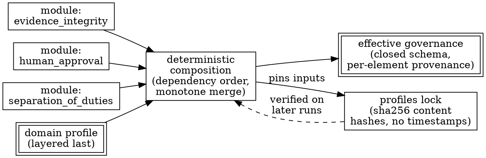

# Policy Composition, Provenance, and Inheritance

> **Opening scenario.** Northstar Services' Risk & Audit division publishes an organization-wide charter policy: no secrets may reach a language model, production changes require human approval, and every code change requires test evidence. Eighteen months later, an internal review finds fourteen copies of that policy scattered across repositories in Treasury and Engineering Platform. Eleven copies match the original. Two have gained extra rules. One — in a payments repository — has quietly lost the line `deny secrets_to_llm`. Nobody can say when the line disappeared, who removed it, or whether the removal was ever discussed. The policy was never formally weakened; it simply drifted, one convenient edit at a time. This chapter is about making that failure structurally difficult: composing policy from layers instead of copies, making every effective rule traceable to its source, and making weakening either impossible or loudly visible.

> **Learning objectives.**
> - Explain why organizations need layered policy and what each layer legitimately owns.
> - Distinguish the composition operations *merge*, *override*, and *narrow*, and state precedence rules for each.
> - Describe the silent-weakening problem and design composition so that widening is either impossible or explicitly visible.
> - Define provenance for composed policy and explain what an auditor can and cannot recover from it.
> - Distinguish semantic from incidental difference between policy documents, and explain why canonicalization must itself be versioned.
> - State why deterministic composition is a prerequisite for locking and drift detection.

> **Prerequisites.** Chapter 5 (identity, capability, and authority), Chapter 7 (policy semantics and deterministic evaluation). Chapter 7's decision domains and default-deny posture are assumed; this chapter asks where the rules being evaluated *come from*.

## 8.1 Why organizations layer policy

A single team writing a single policy file does not need composition. An organization does, because policy authority is genuinely distributed. The risk function owns constraints that must hold everywhere. A business unit owns constraints specific to its regulatory exposure. An application team owns constraints about its own data and dependencies. An agent's operators own constraints about that agent's capabilities. And a single mission — one engagement, one migration, one incident — may carry restrictions that exist for a week and then expire.

This produces a natural <span class="ix" data-ix="policy hierarchy">policy hierarchy</span> of at least five layers: organization, business unit, application, agent, and mission. Figure 8.1 shows Northstar's version of it. Each layer has a legitimate owner, a legitimate scope, and a legitimate rate of change. Org policy changes rarely and under heavy review; mission policy may be written on a Tuesday and expire on Friday. Forcing all five layers into one document either centralizes authorship in a bottleneck team that cannot know every application's context, or decentralizes it into the copy-paste sprawl of the opening scenario.

<figure class="nx-fig" id="fig-8-1">
  <div class="fig-body">
    <div class="hier">
      <ul>
        <li>Org charter policy — Risk &amp; Audit (e.g., <code>deny secrets_to_llm</code>, human approval for production)
          <ul>
            <li>Business-unit policy — Treasury (payment-specific denials, EU exposure rules)
              <ul>
                <li>Application policy — <code>payments-api</code> (protected paths, schema-change gates)
                  <ul>
                    <li>Agent policy — Forge (branch-only writes, no merge authority)
                      <ul>
                        <li>Mission restrictions — one engagement (extra denials, expiry date)</li>
                      </ul>
                    </li>
                  </ul>
                </li>
              </ul>
            </li>
          </ul>
        </li>
      </ul>
    </div>
  </div>
  <figcaption><b>Figure 8.1 — Northstar's five-layer policy hierarchy.</b> Each layer has a distinct owner and change cadence. The teaching point is directional: constraints accumulate downward, and a lower layer may add to or narrow what it inherits but must never silently subtract from it.</figcaption>
</figure>

Copying policy text down the hierarchy is the obvious implementation and the wrong one. Copies satisfy the reader at the moment of copying and then begin to diverge, because nothing binds them to their source. The alternative is <span class="ix" data-ix="policy composition">composition</span>: each layer is authored once, in one place, and the *effective* policy for any given agent is computed from the stack of layers that apply to it. Composition turns "is this repository's policy still correct?" from an archaeology question into a computation.

> **Case study — Charter.** This chapter introduces Thread E, "Charter": Northstar's attempt to run exactly the hierarchy in Figure 8.1 across the whole enterprise. The org charter lives in the `northstar-governance` repository under Risk & Audit's control. Every division question in this chapter — who may narrow what, how a weakening becomes visible, what an auditor can reconstruct — is a Charter question. The thread returns in Chapter 32, where the full five-level inheritance engine is worked out as an architectural design, and in Chapter 37.

## 8.2 Composition operations: merge, override, narrow

Composition needs a small, precisely defined vocabulary of operations. Informally, three cover almost everything:

**Merge** combines contributions that do not conflict. Two layers each add deny rules; the effective policy contains the union. Two layers each require different evidence artifacts; the effective policy requires both. Merge is safe exactly when the merged elements are independent and when accumulating them cannot weaken any single one. Sets of prohibitions merge safely: adding a deny rule never cancels another deny rule. Scalar settings do not: if the org layer says an approval expires after 24 hours and an application layer says 30 days, "merging" them is really a conflict wearing a friendly name.

**Override** replaces an inherited element wholesale. Override is the most dangerous operation in any composition system, because it is how weakening happens: the lower layer's version wins, and the superior layer's intent disappears from the effective result. A well-designed system either forbids override of safety-relevant elements outright, or converts every override into a first-class, reviewable event (Section 8.3).

**Narrow** replaces an inherited element with a strictly more restrictive one. A budget of 100,000 tokens narrowed to 20,000; a capability scoped to a whole repository narrowed to one directory; an approval expiry of 24 hours narrowed to 4. Narrowing is the one form of "override" that a layered safety model can permit freely, because the superior layer's guarantee still holds — every behavior allowed by the narrowed policy was allowed by the original.

<span class="ix" data-ix="precedence!in policy composition">Precedence</span> rules answer the remaining question: when two layers touch the same element and the operation is not a clean merge, whose version wins? Two conventions dominate. *Superior-wins* precedence gives the higher layer the last word on conflicts, which protects org guarantees but means a lower layer cannot even narrow without explicit support for the narrow operation. *Inferior-wins* precedence (common in configuration systems, where the most specific setting overrides the general one) is exactly backwards for safety properties: it makes every application file a potential silent override of the org charter. The defensible design for governance is asymmetric: inferior layers win only on elements the superior layer marked as defaults, and on everything else conflicts are errors, not resolutions. A conflict that stops composition is annoying; a conflict resolved silently in favor of the wrong layer is a security incident with a delay timer.

| Operation | Effect on effective policy | Safety property | Sound default |
|---|---|---|---|
| Merge | Union of independent contributions | Monotone for prohibitions and requirements | Allow for sets; reject for scalars |
| Override | Lower layer replaces superior element | Can weaken silently | Forbid, or force through an explicit exception record |
| Narrow | Lower layer substitutes a strictly stronger element | Preserves every superior guarantee | Allow, verify the subset relation |

**Table 8.1 — The three composition operations.** The middle column states what each does to the effective policy; the right column states the default a safety-oriented composition engine should adopt. The table's teaching purpose is the asymmetry: merge and narrow can be liberal because they are monotone; override cannot.

Reference, rather than copying, is the mechanism that makes layering real in ordinary repositories. Listing 8.1 shows the pattern in Nornyx's bundled examples: the organization defines a policy once, and a service contract *references* it.

```yaml
# org_policies.nyx — the single canonical definition
policies:
  - name: SafeDeliveryPolicy
    rules:
      - deny secrets_to_llm
      - require tests_if_code_changed
      - deny nondeterministic_evaluation
      - require evidence_if_harness_completed
      - require human_approval_before_merge

# governed_service.nyx — references, never copies
policies:
  - name: SafeDeliveryPolicy
    ref: org_policies.nyx#SafeDeliveryPolicy
```

**Listing 8.1 — Canonical policy and a reference to it.** From `nornyx/examples/org_policies.nyx` and `nornyx/examples/governed_service.nyx` in the repository. The `ref` is resolved offline at load time into inline rules, so every downstream consumer sees an ordinary policy; both `ref` and `rules` on the same policy, a malformed reference, a remote source, or a missing target are all load errors rather than silent fallbacks.

> **Nornyx in practice.** As implemented at the snapshot, the `ref` mechanism (`nornyx/parser.py`) accepts only local `.nyx` contracts or workspace manifests as sources and rejects remote or device-backed paths before any filesystem access. Resolution is fail-closed: seven distinct error conditions stop the load rather than degrade it. Profile and module composition (`nornyx/governance/composition.py`) provides the richer layering: governance modules are ordered by declared dependency, the domain profile is layered last, declared conflicts between selected packs abort composition (`PACK_DECLARED_CONFLICT`), and the composed result is emitted under a closed schema, `nornyx.effective_governance.v2`.

## 8.3 The silent-weakening problem

The opening scenario's missing `deny secrets_to_llm` line is an instance of the general failure this chapter exists to prevent: <span class="ix" data-ix="silent weakening">silent weakening</span>. A control that was present becomes absent, or a bound that was tight becomes loose, without any event that a reviewer, an audit, or an alerting system would classify as "the control changed." Silent weakening is worse than an honest policy dispute, because the organization continues to *believe* the control exists. Every claim built on top of it — compliance statements, risk assessments, the mental model of the approver in Chapter 9 — inherits the falsehood.

Composition systems create their own weakening channels beyond hand-editing copies: an override that replaces a strict element with a lax one; a merge algorithm that resolves conflicts last-writer-wins; a lower layer that redefines a name the upper layer relied on; a default that reappears when a reference fails to resolve. The design rule that closes all of them is <span class="ix" data-ix="monotonicity!of policy composition">monotonicity</span>: composition may add constraints and may narrow inherited ones, but may never produce an effective policy that permits a behavior some layer above prohibited. Where monotonicity genuinely cannot hold — real operations sometimes need a waiver — the weakening must be converted from an edit into a *record*: an explicit exception with an owner, a scope, and an expiry, reviewed like the risk acceptance it is. Chapter 9 treats exception records in full; here the point is architectural. Widening must be either impossible (the composition engine refuses it) or loud (it exists only as a first-class artifact that review and tooling cannot miss).

There is a subtlety worth pausing on: monotonicity is a property of the *composition algebra*, not of good intentions. If the engine merges scalar fields by preference order, someone will eventually weaken an expiry by preference order. If deny lists are "merged" by replacement, someone will eventually replace one. The engine must make the weakening operation unrepresentable, the way Chapter 7's closed schemas make unknown decision domains unrepresentable.

> **Case study — Charter.** Treasury's platform team, under delivery pressure, edits its business-unit policy so that `SafeDeliveryPolicy` no longer lists `deny secrets_to_llm` — a model-assisted refactoring tool keeps stumbling over it. Under Northstar's Charter design the edit does not become a quiet local reality. The canonical policy lives in the `northstar-governance` workspace manifest; member repositories only reference or mirror it, and a workspace consistency check compares each member's named policy against the canonical rule set. Treasury's repository now reports drift on exactly that policy, in CI, on every run, until the rule is restored — or until Treasury does what it should have done first: file a bounded exception naming an accountable owner, a scope, compensating controls, and an expiry date, and get it approved by the authority that owns the control. The weakening is still possible; what is impossible is doing it *silently*.

> **Nornyx in practice.** As implemented at the snapshot, composition is monotone by construction: deny and require lists merge by ordered union with strict canonical-string checks, and a conflicting scalar field raises `PACK_MONOTONICITY_CONFLICT` instead of resolving by precedence (`nornyx/governance/composition.py`). The cross-repository check is `nornyx workspace-check`: a workspace manifest declares canonical policies once, and each member contract's policy is compared as a normalized rule *set* — every rule reduced to `deny <token>` or `require <token>` form — with statuses `pass`, `synced`, or `drift` (`nornyx/workspace.py`, report schema `nornyx.workspace_report.v0.1`). The optional `--write` mode repairs a drifted policy surgically, rewriting only the matched rule block; it does not invent policies or files, leaving genuinely new gaps to a human. The five-level inheritance engine of Figure 8.1, with per-layer conflict reporting, is not in the repository; Chapter 32 develops it as an architectural extension beyond the current repository, built on these implemented primitives.

## 8.4 Provenance: every effective rule traceable

Composition answers "what applies?" <span class="ix" data-ix="provenance!of composed policy">Provenance</span> answers "why?" — for every element of the effective policy, which source contributed it, at which layer, in which version. Without provenance, a composed policy is exactly as auditable as the fourteen drifted copies were: the reviewer sees the output and must reverse-engineer the inputs.

A provenance record should carry at least: the element's kind and identifier; the identifier and version of the source pack or document that contributed it; the layer at which that source sat; and enough about the source's own origin — author, tier of trust, revision, path — to find it again. With that in hand, three questions that dominate real audits become mechanical: *Which org-level rules are actually in effect for this agent?* (filter the provenance by layer), *Who introduced this restriction and when?* (follow the source revision), and *If we upgrade this module, which effective rules change?* (diff the contributions of that one source).

Provenance also disciplines trust. Sources do not all deserve the same standing: a built-in pack shipped with the tool, a pack committed in the project, a pack fetched from the organization's governance repository, and a pack loaded from an explicitly supplied path have different failure modes and different review histories. Recording the tier is cheap; the payoff is that policy about *policy sources* becomes expressible — for example, "organization-tier sources must be pinned by a committed lock."

```json
{
  "element_kind": "rule",
  "element_id": "deny_secrets_to_llm",
  "source_id": "nornyx.builtin.module.human_approval",
  "source_version": "1.0.0",
  "layer": "module",
  "author": "nornyx",
  "source_tier": "builtin",
  "source_revision": "…",
  "source_path": "…"
}
```

**Listing 8.2 — Shape of a per-element provenance record.** Illustrative values over the real field set: as implemented at the snapshot, every composed element carries `element_kind`, `element_id`, `source_id`, `source_version`, and `layer`, plus the contributing pack's own provenance (`author`, `source_tier`, `source_revision`, `source_path`) (`nornyx/governance/composition.py`, `nornyx/governance/models.py`).

> **Nornyx in practice.** As implemented at the snapshot, provenance is stamped during composition, not reconstructed afterwards: the `_provenance_record` step attaches the record in Listing 8.2 to each contributed element as it is merged. Source tiers are the four just discussed — `builtin`, `project`, `org`, `explicit_path` — and the tier rule above is real: composing any organization-tier pack without a committed profiles lock fails with `PACK_LOCK_REQUIRED` (`nornyx/governance/composition.py`). Discovery order for a project is local packs under `.nornyx/profiles/` and `.nornyx/modules/`, then built-ins.

## 8.5 Canonicalization and semantic identity

Everything so far assumed we can decide when two policies are "the same." That is less trivial than it sounds, and it matters twice: workspace checks must decide whether a member's policy still *equals* the canonical one, and locks (Section 8.6) must hash content in a way that survives harmless reformatting. The underlying distinction is between <span class="ix" data-ix="semantic difference">semantic difference</span> — the governance model changed — and <span class="ix" data-ix="incidental difference">incidental difference</span> — the bytes changed but the model did not. <span class="ix" data-ix="canonicalization">Canonicalization</span> is the function that erases incidental difference: it maps every document in a semantic equivalence class to one stable representation, and identity of canonical forms then *defines* <span class="ix" data-ix="semantic identity">semantic identity</span> for the system.

A worked example makes the boundary concrete. Listing 8.3 shows two policy declarations an engineer could plausibly write in two Northstar repositories.

```yaml
# Repository A
policies:
  - name: SafeDeliveryPolicy
    rules:
      - deny secrets_to_llm            # org charter, do not remove
      - require tests_if_code_changed

# Repository B
policies:
  - name: "SafeDeliveryPolicy"
    deny:
      - secrets_to_llm
    require:
      - tests_if_code_changed
```

**Listing 8.3 — Two documents, one policy.** Illustrative, but the equivalence is the real one computed by the repository's workspace normalization: shorthand `rules:` strings and explicit `deny:`/`require:` lists both reduce to the canonical set {`deny secrets_to_llm`, `require tests_if_code_changed`} (`nornyx/workspace.py`).

The two documents differ in comment text, quoting style, rule spelling (`deny secrets_to_llm` as one string versus a `deny:` list entry), and — had we reordered the rules — order. All of that is incidental *for this rule language*, because Chapter 7's rule atoms are an unordered set of independent deny/require tokens. After normalization, both documents yield the identical canonical set, so a consistency check correctly reports no drift. Change one token — `secrets_to_llm` to `secrets_to_external_llm` — and the canonical sets differ: a semantic change, correctly flagged.

The parenthetical above is the crucial caveat: what counts as incidental is a property of the *language semantics*, not of YAML. Discarding rule order is safe here because evaluation is order-independent. In a first-match-wins policy language — the style familiar from firewall rule sets, and expressible in engines like OPA or Cedar depending on how policies are structured [@opa; @cedar] — order is meaning, and a canonicalizer that sorts rules would erase a real distinction. This is the general failure pair every canonicalizer must be tested against. An **over-aggressive** canonicalizer erases semantic differences, so two genuinely different policies collapse into one identity and a real change ships undetected. An **under-aggressive** canonicalizer preserves incidental noise, so equivalent documents look different, drift gates cry wolf, and teams learn to ignore them. Both failures are quiet, which is what makes them dangerous.

A third hazard is subtler: the canonicalizer is itself a versioned component, and changing it is a compatibility event. Suppose version 2 of a canonicalizer starts applying Unicode compatibility normalization to identifiers where version 1 compared raw code points. Every stored digest computed under version 1 now potentially mismatches — mass false drift — and, going the other direction, two identifiers that were distinct under version 1 (say, an ASCII `admin` and a visually confusable non-ASCII spoof) may collapse into one identity under version 2, which is either a security fix or a semantic merge error depending on what the system believed before. Neither outcome is acceptable as a silent side effect of a library upgrade. The rule: pin the canonicalizer version alongside the digests it produced, treat a canonicalizer change like a schema migration, and re-baseline explicitly. The prior discussion of drift gates in Chapter 7 assumed stable identity; this is the machinery that keeps the assumption true.

> **Nornyx in practice.** As implemented at the snapshot, canonicalization is deliberately minimal and mechanical: for governed agentic content, canonical bytes are JSON serialized with sorted keys, compact separators, and no ASCII escaping, digested as `sha256:<hex>` (`nornyx/agentic_artifacts.py`) — erasing key order and whitespace, nothing else. Workspace policy comparison normalizes rules to `deny X`/`require X` sets as in Listing 8.3. Identifier confusability is handled as a separate, explicit check rather than by digest-time normalization: agentic-network validation applies NFKC case-folding to detect colliding identities and fails closed with `AN_NORMALIZATION_COLLISION` (`nornyx/governance/agentic_delegation.py`). Canonicalizer evolution is bound to declared format versions — the agentic-network lock pins `lock_format_version` and `generation_format_version` (both `"1.0"`), so a future change to canonical form is a visible format bump, not a silent re-hash.

> **Misconception.** *"If two policy files hash differently, the policy changed."* Only under a canonicalizer that erases exactly the incidental differences — and only for the canonicalizer version that produced the stored hash. Raw file hashes flag whitespace edits as policy changes; over-normalized hashes miss real ones; a canonicalizer upgrade can do both at once. A digest is meaningful only relative to a named canonical form.

## 8.6 Deterministic composition

The final requirement ties the chapter together: composition must be a <span class="ix" data-ix="deterministic composition">deterministic</span> function. Same layers, same versions, same selection — byte-identical effective policy, on any machine, at any time. Determinism is what lets an organization *commit* the resolved result, verify it in CI, and treat any difference as meaningful (the reproducible-builds discipline, applied to governance artifacts [@reproducible-builds]). Nondeterminism — iteration over unordered structures, timestamps in output, environment-dependent paths, "latest" version resolution at compose time — converts the drift gate of Section 8.3 into a random-number generator.

Determinism also enables <span class="ix" data-ix="lock!profiles lock">locking</span>. A lock records, for every resolved input, its identity, version, and a content digest, so that a later run can prove it composed *the same inputs* — content-addressing in the Merkle tradition, where a short digest commits to arbitrary content [@merkle]. The lock closes the remaining gap between "we reference the org policy" and "we know which org policy": a reference names a source; a lock pins its bytes. Figure 8.2 shows the whole pipeline as a directed acyclic graph.



**Figure 8.2 — Composition as a DAG with a lock closing the loop.** Modules and the profile are resolved and composed in dependency order into one effective-governance document; the lock pins each input's content hash so that every later composition either reproduces the same result or fails visibly. The teaching point is the dashed edge: the lock is not documentation, it is an input to verification.

Determinism imposes discipline on the engine itself: ordered unions instead of set iteration, sorted emission, explicit dependency ordering of layers (so "modules then profile" is a rule, not an accident of load order), and hard caps on composed size so that resolution cannot degrade unboundedly. It also forces honesty about failure: if an input cannot be resolved, the engine must choose between failing closed and degrading visibly — and must make that choice per input class, deliberately, because Section 8.3's monotonicity guarantee is only as strong as the weakest fallback.

> **Nornyx in practice.** As implemented at the snapshot, `nornyx profiles resolve --lock` writes `nornyx.profiles.lock` under the closed schema `nornyx.profiles_lock.v1`: one entry per resolved pack with `id`, `version`, `source_tier`, `content_hash` (`sha256:…`), and `path_hint`, and deliberately no time fields, so identical resolution inputs produce byte-identical locks (`schemas/profiles_lock_v1.schema.json`). When a lock is present, `nornyx check`, `nornyx governance`, and `profiles resolve` verify it and never rewrite it; mismatches (`PACK_LOCK_MISMATCH`, `PACK_LOCK_SET_MISMATCH`, `PACK_LOCK_DUPLICATE_ID`, `PACK_LOCK_INVALID`) exit with code 2, the same reserved exit class as parse failures. Composition caps are explicit — 2,000 composed rules, 64 block schemas, 64 structural checks — and the fallback asymmetry is deliberate: an unresolvable `project.profile` degrades to a `PACK_NOT_RESOLVED` warning for backward compatibility, while explicitly selected `project.modules` fail closed.

> **Assurance boundary.** Composition, provenance, and locks bind *content*, not authority or truth. A lock proves that today's inputs are byte-identical to the reviewed ones; it does not prove the reviewed ones were wise, and a writer with repository access can regenerate a self-consistent lock around weakened inputs. Detecting *unauthorized* regeneration is a repository control — branch protection, review, history — not a lock property. Likewise, provenance records who a pack *claims* to come from at the recorded tier; authenticating authors is the surrounding platform's job. Chapters 12 and 34 return to both limits.

> **Design checkpoint.** For your own policy stack, answer in writing: How many places can a given rule be edited? For each composition point, is weakening representable — and if so, what makes it loud? For every effective rule, can you name its source and version without reading source code? What exactly is hashed, under which canonicalizer version, and who is notified when the canonicalizer changes?

## Summary

Layered policy exists because policy authority is genuinely distributed across an organization; composition replaces divergent copies with a computed effective policy. The safe algebra is asymmetric: merges of independent prohibitions and requirements are monotone and may be liberal; narrowing preserves superior guarantees; override is the weakening channel and must be forbidden or forced through explicit, bounded exception records. Provenance makes every effective element traceable to a source, version, layer, and trust tier. Canonicalization defines semantic identity by erasing exactly the incidental differences — no more, no less — and is itself versioned, so changing it is a compatibility event. Deterministic composition plus content-addressed locks turn "the policy we reviewed is the policy in effect" from an assumption into a checkable claim.

- Five layers, five owners: org, business unit, application, agent, mission.
- Merge and narrow are monotone; override is where silent weakening lives.
- Widening must be impossible or loud — an exception record, never an edit.
- Provenance answers "why is this rule in effect?" mechanically.
- Semantic identity is defined by a versioned canonicalizer, relative to language semantics.
- Determinism plus locks make drift a computable property with a meaningful zero.

## Review questions

1. Northstar's Treasury unit wants a stricter approval expiry than the org default, and a looser token budget. Classify each request as merge, narrow, or override, and state what a monotone composition engine should do with each.
2. Explain why last-writer-wins conflict resolution is acceptable in many configuration systems but not for safety-relevant policy composition. What property does it violate?
3. A workspace check compares policies as normalized rule *sets*. For what class of policy languages would this canonicalization be over-aggressive, and what real change could it hide?
4. An auditor asks: "Prove that `deny secrets_to_llm` was in effect for the payments agent on March 3rd." List the artifacts from this chapter you would need, and what each contributes to the answer.
5. Your canonicalizer library upgrades and begins normalizing Unicode in identifiers. Describe one false-drift consequence and one identity-collapse consequence, and the migration procedure that avoids both.
6. Why does a timestamp inside a lock file undermine the lock's purpose?

## Exercises

1. Model Northstar's hierarchy for the `payments-api` application as five short policy documents (org, unit, app, agent, mission), using only deny/require rule atoms, one narrow, and one attempted override of an org rule. Specify precisely how your composition procedure detects and reports the override.
2. Write two semantically equivalent policy documents that differ in at least four incidental ways (order, quoting, comments, shorthand versus explicit rule lists), and a third that differs from them by exactly one semantic token. Define a canonicalization function (prose or pseudocode) under which the first two collapse to one identity and the third does not, and state one language-semantics change that would invalidate your function.
3. Using the repository at the book's snapshot, create a workspace manifest declaring one canonical policy and two member contracts, one drifted. Run `nornyx workspace-check`, record the per-member statuses, repair with `--write`, and verify the re-check passes. Then remove the policy from one member entirely and explain, from the observed behavior, why sync does not recreate it.

## Further reading

- [@opa] — Rego's composition of policies across packages illustrates a different precedence design and its consequences for conflict handling.
- [@cedar] — Cedar's analyzable semantics show how a policy language's design constrains what canonicalization may safely erase.
- [@reproducible-builds] — the definitions and practices behind byte-identical outputs, directly transferable to governance artifact generation.
- [@merkle] — the origin of content-addressed binding by digest, the primitive under every lock in this chapter.
- [@parnas-criteria] — the modularity criteria that justify decomposing policy by ownership and change cadence rather than by file convenience.
