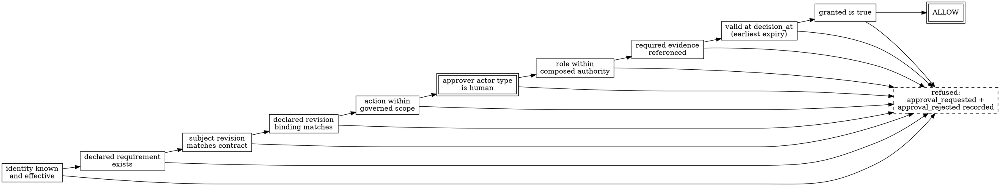

# Approvals, Exceptions, and Human Accountability

> **Opening scenario.** At 09:14 on a Tuesday, a senior engineer at Northstar Services opens the pull request that Forge — the Engineering Platform's development agent — has prepared against `northstar/payments-api`. She reads the diff, checks the test report, and clicks Approve. At 11:40 the agent, responding to review comments, rewrites the branch history and force-pushes; the head commit is no longer the one she read. At 14:02 the merge job runs, finds an approval record on the pull request, and merges. Nothing was malicious and nobody violated a written rule, yet the change that reached the protected branch was never approved by a human being — and the audit trail says otherwise, which is worse than no approval at all, because the organization now believes a control fired. This chapter is about the difference between an approval that is a *click* and an approval that is a *bound record*.

> **Learning objectives.**
> - State the bindings a durable approval record must carry, and explain what each one prevents.
> - Distinguish expiry, revocation, and invalidation precisely, and identify which applies to a given failure.
> - Explain, from three independent arguments, why a non-human identity can never be an accountable approver.
> - Apply maker–checker separation to workflows in which the "maker" is a probabilistic planner.
> - Specify what an approval interface must present for the approver's attestation to be truthful, and treat approval fatigue as an economic problem rather than a discipline problem.
> - Model exceptions and waivers as bounded first-class records rather than as edits that remove a rule.

> **Prerequisites.** Chapter 5 (identity, capability, and authority), Chapter 7 (decision domains, including the *approval-required* outcome), and Chapter 8 (composition, provenance, and the requirement that weakening be loud rather than silent). Chapter 7's third decision domain is the hinge: this chapter asks what has to be true before an *approval-required* decision may be converted into an allow.

## 9.1 From ceremony to record

Most organizations already have approvals: a green check mark in a code-review tool, a reply on a ticket, a signature in a change-management system. What they generally lack is an approval a machine can *evaluate* — an artifact answering, without human interpretation, whether this action, on this subject, at this moment, is covered by a decision a qualified human actually made.

That is the gap between a ceremony and a record. A <span class="ix" data-ix="approval!as ceremony">ceremony</span> is an event: something happened, someone attests that it happened, and the organization treats the memory as authority. Ceremonies work when the subject of approval is stable and the interval between approval and action is short — the conditions under which "I approved that" and "that is what will happen" mean the same thing. Neither holds in agentic delivery. The subject changes (branches are rewritten, plans re-planned, contracts regenerated), and the interval is elastic: an agent may act minutes or days after the human looked.

An <span class="ix" data-ix="approval!as bound record">approval record</span> is instead a data structure whose validity is *computed* at the moment of enforcement. It does not say "a human approved." It says: this human, holding this role, approved this action, on this exact revision of this subject, on the basis of this evidence, valid until this instant, subject to these invalidation conditions. Every clause is a binding, and every binding exists because some organization once lost an argument without it.

> **Key idea.** An approval is not a permission granted; it is a *conditional claim* whose conditions are re-checked at the point of enforcement. A condition that cannot be re-checked mechanically is not part of the approval — it is folklore around it.

## 9.2 The bindings of an approval

Eight bindings recur across serious approval designs. Each closes a distinct failure, and organizations tend to implement three or four and assume they have all eight.

**Action scope** is the set of actions the approval authorizes, named in the same vocabulary the enforcement point uses. Without it, an approval obtained for one action becomes a general-purpose token: a human approves a schema migration and the record is later presented to satisfy a production deployment gate. Scope must be enumerated, not inferred from context, because context is exactly what is lost between approval and use. **Eligible roles** state which roles may supply the approval — a <span class="ix" data-ix="role-based access control">role-based</span> constraint in the sense formalized by the NIST RBAC model [@rbac-nist], applied to the approving act rather than to the acting subject. A required-roles set (someone from this set *must* approve) differs from an eligible-roles set (anyone from this set *may*), and mature designs carry both: a floor of authority, and the pool from which further approvers may be drawn. **Denied actor types** are the categories that can never approve regardless of what any lower policy layer declares; Section 9.4 argues this at length, and structurally it is the one field a composition system must treat as non-negotiable.

**Required evidence** names the artifacts that must exist and be referenced before the approval is meaningful: test results, a security scan, a change description, a prior review record. Evidence requirements convert "did you look?" into "what did you look at?", and they are what makes an approval reconstructable later, when the approver's memory is gone. **Exact revision binding** identifies the precise subject state approved — a commit hash, a content digest, a package manifest hash. This is the binding the opening scenario lacked, and it must be *exact*: an approval bound to "the pull request" or "release 3.2" binds to a moving target, and moving targets are how the approved thing and the executed thing come apart. The remaining three — **expiry**, **invalidation conditions**, and **revocation** — are the subject of Section 9.3.

Listing 9.1 shows all eight in one declaration from the Nornyx repository, worth reading as a checklist rather than as syntax.

```yaml
approvals:
  - name: agentic_network_authority
    required_roles: [network_governance_owner]
    eligible_roles: [network_governance_owner, security_reviewer, architecture_reviewer]
    denied_actor_types: [ai_tool, execution_surface, autonomous_agent, model, connector, generated_output]
    required_evidence: [approval_record, agentic_network_contract_review]
    required_for: [approve_agentic_network_contract, external_share, handoff]
    timing: before_action
    accountable_authority: network_governance_owner
    revision_binding:
      kind: git
      revision: git:feedfacefeedfacefeedfacefeedfacefeedface
      exact: true
    invalidation_conditions: [revision_change, identity_change, capability_change, trust_zone_change, membership_change]
    expires_at: "2026-07-24T00:00:00Z"
```

**Listing 9.1 — An approval requirement carrying all eight bindings.** From `examples/agentic_network_support/support_network.nyx` (lines 104–118) in the repository. Note `timing: before_action`, which makes explicit whether the approval must precede the action or may follow it. An approval obtained after the fact is a different control — a review — and conflating the two is a common source of overstated assurance.

Two fields deserve comment. The <span class="ix" data-ix="accountable authority">accountable authority</span> names the role owning the *control*, as distinct from the individuals who exercise it: when an approval is questioned, this party answers for the policy under which it was granted. The invalidation conditions declare what the approver was implicitly relying on — that the revision, identities, capabilities, zones, and memberships would not change underneath the decision — and making those reliances explicit is what lets a machine detect that one broke.

## 9.3 Expiry, revocation, and invalidation

These three words are used interchangeably in practice and mean three different things. The distinction is not pedantry: they are triggered by different parties, detected by different mechanisms, and demand different responses, as Table 9.1 sets out.

<span class="ix" data-ix="expiry!of approvals">Expiry</span> is *time acting on the approval*. It was valid, a declared duration elapsed, and it is now inert. Expiry needs no actor and no notification — the enforcement point compares the decision instant against the expiry instant — and its purpose is to bound the staleness of a human judgment, encoding the belief that judgments decay because the system around them moves. *Example.* Northstar's engineering approval requirement carries a relative expiry of 24 hours; an approval issued at 08:00 Monday for a merge that runs at 09:00 Tuesday is refused. Nobody withdrew it and nothing changed; it aged out.

<span class="ix" data-ix="revocation!of approvals">Revocation</span> is *an authority acting on the approval*. Someone with standing decides that a still-valid approval should no longer authorize anything and says so durably. It is the mechanism of second thoughts and discovered error, and it requires an actor, a record, and — critically — a propagation path, because a revocation that never reaches the enforcement point is a decision that did not happen. *Example.* Two hours after approving a treasury adjustment, the approver learns the counterparty account was misidentified and files a revocation naming the approval record. The next enforcement attempt refuses, though the expiry window is still open.

<span class="ix" data-ix="invalidation!of approvals">Invalidation</span> is *the world acting on the approval*. No one withdrew it, no clock expired, but a declared condition fired: the subject is no longer the subject that was approved. Invalidation is what makes an approval meaningful across an interval, and it is the mechanism most often missing, because implementing it requires the system to know what the approval depended on. *Example.* The opening scenario. The approval named revision `9f3c1a7`, the branch was force-pushed, the head is now a different revision, and the declared condition `revision_change` fired. The approval is neither expired nor revoked; it is simply about something else.

| | Expiry | Revocation | Invalidation |
|---|---|---|---|
| Triggered by | Elapsed time | A deliberate act by an authority | A change in the approved subject or its context |
| Requires an actor | No | Yes | No |
| Detected by | Comparing decision instant to expiry | Presence of a revocation record | Re-checking the binding (revision, identity, scope) |
| Failure mode if absent | Indefinitely reusable judgments | No way to correct a discovered error | Approved and executed things diverge silently |
| Operational response | Re-approve | Investigate the withdrawn decision | Re-approve the new subject state |
| Northstar example | 24-hour approval used next morning | Withdrawn after a counterparty error | Force-push past revision `9f3c1a7` |

**Table 9.1 — Three ways an approval stops being usable.** The teaching purpose is diagnostic: when an approval fails at an enforcement point, the reason determines the fix. Treating an invalidation as an expiry ("just re-approve, it timed out") hides the fact that the subject changed — precisely the information the control existed to surface.

> **Case study — Forge.** Northstar's Engineering Platform designs Forge's merge gate around all three mechanisms explicitly. Forge may read `northstar/payments-api`, propose changes on branches, run tests, and open pull requests without approval; merge to a protected branch, production deployment, release publication, secrets access, and destructive changes each require an approval bound to named roles. The record a review produces carries the exact head revision — `9f3c1a7` for the change in the opening scenario — a 24-hour expiry, and `revision_change` among its invalidation conditions. When the branch is force-pushed at 11:40, nothing needs to notice the force-push as an event. At 14:02 the merge gate simply re-evaluates: the approval asserts `9f3c1a7`, the subject is now something else, and the merge is refused with a reason naming the mismatch rather than a generic "approval required." The reviewer is asked to approve the *new* revision, which is exactly the work the control existed to force. The thread returns in Chapter 15, Chapter 29, and Chapter 30.

## 9.4 Why an AI identity can never be an accountable approver

It is tempting, in a system where a language model reads diffs better than a tired human at 18:00, to let the model approve — perhaps only low-risk changes. Three arguments say no, and they are independent in the strong sense: defeating one leaves the other two standing.

**The accountability argument.** An approval is a transfer of responsibility. Before it, consequences attach to whoever performs the action; after it, they attach substantially to the approver, who accepted the risk on the organization's behalf. That transfer means something only if the recipient can *bear* it — if the organization can do something in response to a bad approval that changes future behavior. Humans can be retrained, reassigned, held to professional standards, dismissed, or in some domains sanctioned by a regulator. A model has no continuity of identity across versions, no stake, and no capacity to be held to anything. "The model approved it" is functionally identical to "nobody approved it," but it *reads* as though somebody did — and that is the harm. A non-human approval does not merely fail to add assurance; it manufactures the appearance of assurance where none exists.

**The legal-responsibility argument.** Governance frameworks and regulation are written around identifiable accountable persons and roles: management-system standards expect assigned responsibilities and authorities for AI systems [@iso-42001], risk frameworks organize around who governs, maps, measures, and manages [@nist-ai-rmf], and obligations on providers and deployers in regulated markets attach to legal persons rather than to software components [@eu-ai-act]. That is an interpretive observation about how such regimes are constructed, not a compliance claim. The engineering consequence is what matters: if an approval record must resolve to a party who can answer for the decision, a record resolving to a model is not an approval record but an unattributable assertion in the shape of one.

**The circularity argument.** This one is structural and holds even for an organization indifferent to accountability and law. A human approval gate exists to inject a judgment *from outside the system's own decision process*; its guarantee is conditional — "no action of this class proceeds without an independent judgment" — and independence is what makes it informative. If the acting system can also produce the approving judgment, the condition collapses: the system approves itself, and the gate returns no information, an assertion equivalent to "this action proceeded because it proceeded." <span class="ix" data-ix="separation of duty">Separation of duty</span> exists precisely to stop an entity from both initiating and certifying its own transformation of state [@clark-wilson].

None of this forbids machine *assistance*: a model may assemble the approval package, summarize the diff, and refuse to submit until preconditions hold. The line is between preparing a decision and being the decision. But an approver who reads only a model-generated summary has delegated the perception on which the attestation rests, so the interface must show the subject, not only a description of it.

> **Nornyx in practice.** In the repository at the book's snapshot, the refusal of non-human approval is not one check but a property re-asserted at five independent layers, so no single omission restores it. *Schema*: agent identities pin `authority` to the constant `non_human` and `can_approve` to `false` (`schemas/agent_identities_v1.schema.json`), so a contract declaring an approving agent does not parse. *Static validation*: the same invariant is re-checked in code (`AN_NON_HUMAN_APPROVAL_INVALID`), and approval evidence must be produced by a human whose role lies inside the composed authority (`AN_APPROVAL_HUMAN_REQUIRED`, `AN_APPROVAL_ROLE_INVALID`) (`nornyx/governance/agentic_network.py`). *Normalization and composition*: six actor categories — `ai_tool`, `execution_surface`, `autonomous_agent`, `model`, `connector`, `generated_output` — are declared intrinsically unable to hold approval authority, with the source comment "Packs and documents cannot redeclare them as human actors"; declaring one eligible is `APPROVAL_CORE_DENIED_ACTOR_ELIGIBLE`, and composition unions the core denials back in on every merge so no layer can subtract them (`nornyx/governance/approvals.py`). *Runtime engine*: an assertion whose claimed actor type is not `human`, or is in the requirement's denied set, is refused with the message "AI systems, tools, models, and execution surfaces cannot approve." (`nornyx/agentic/authz.py`). *Evidence and adapters*: a recorded grant naming a non-human approver is rejected (`AN_EVT_APPROVAL_NON_HUMAN`), and the framework adapters surface the same refusal at the enforcement hook. The property also sits outside the exception mechanism (Section 9.7) — Chapter 8's monotonicity rule applied to the one control no layer may narrow or widen.

> **Nornyx in practice.** One decision in that stack is easy to get wrong, and the repository records having got it wrong first. The human-approver rules on runtime evidence were originally applied to *all* approval outcomes, so an event recording the refusal of an AI-issued approval could not itself be valid evidence — the refused approver named a model. The rules were narrowed to grants only, and the reasoning survives in the source: on a granted approval the approver "names the party whose authority the action now rests on," while on a rejection it records "the *claimed* approver of an approval that was refused and confers nothing"; applying the grant rules to rejections "made the strongest governance outcome (refusing an AI-issued approval) the one that could not be evidenced" (`nornyx/agentic_evidence.py`). The lesson transfers to any evidence schema: constraints expressing *who may hold authority* must be scoped to the events where authority is conferred, or the schema forbids recording exactly the denials it exists to produce.

## 9.5 Maker–checker, the informed approver, and the economics of attention

<span class="ix" data-ix="maker-checker">Maker–checker</span> separation is the operational form of the circularity argument: the party proposing a change may not be the party certifying it. In conventional delivery this is easy — the author of a pull request is a different account from the reviewer. Agentic delivery complicates it twice over. The maker is not a person, so "the maker cannot approve" must be enforced against an identity that may not appear in the approval system at all; and, more subtly, the human who *directed* the agent is a maker even though they wrote no code. The engineer who instructed Forge to fix the failing migration originated the change, and an approval from that engineer is a self-approval wearing a delegation costume.

A workable rule set therefore has three clauses: the agent identity can never approve (Section 9.4); the human who initiated the agent's task cannot approve its output; and for high-consequence classes the approver must be independent of the evidence producer, so the party attesting to the change is not also the party attesting to the tests that justify it. The third clause is the least implemented and the most load-bearing in incidents, because careless evidence plus a co-located approver is a single point of failure dressed as two controls.

An approval must also be *informed* to be truthful. When an approver signs, they claim to have considered this action, on this subject, and judged the risk acceptable. If the interface did not show them what the claim asserts they considered, the claim is false, and no amount of cryptographic binding around a false claim improves it. Table 9.2 states the minimum an <span class="ix" data-ix="informed approver">approval interface</span> must present.

| The interface must present | The question it answers | Failure if absent |
|---|---|---|
| The action, in the enforcement point's own vocabulary | "What exactly am I authorizing?" | Approver authorizes a description, gate consumes an action; the two drift |
| The exact subject and its revision identifier | "Approving *what*, precisely?" | The opening scenario: approval outlives the subject |
| The diff since any prior approval of this subject | "What is new since someone last looked?" | Re-approval becomes a formality; changes ride along |
| The full set of actions this approval unlocks | "What else does my click permit?" | Blast radius is discovered after the fact |
| The required evidence and its current status | "On what basis am I deciding?" | Attestation rests on assumed, not verified, evidence |
| The validity window and what happens at its end | "How long does this last?" | Approvals are reused outside their intended interval |
| The maker, and the accountable authority | "Who else stands behind this?" | Maker–checker violations become invisible |
| What is explicitly *not* being attested | "What am I not vouching for?" | Approvals silently accumulate implied guarantees |

**Table 9.2 — Requirements for an informed approval interface.** Illustrative synthesis, not drawn from the repository. Its teaching purpose is to relocate approval quality from the approver's diligence to the interface's design: most "the approver should have caught it" findings are findings that the approver was never shown it. The last row repays attention, because approvals accrete implied meaning — a merge approval becomes a security sign-off, then a licensing check, then an architectural review — until one click carries five guarantees, four of which nobody agreed to provide.

<span class="ix" data-ix="approval fatigue">Approval fatigue</span>, finally, is not a character flaw but an arithmetic result. An approver has a roughly fixed daily budget of careful attention. If the number of items times the per-item cost of careful review exceeds that budget, the approver does not work harder — they *reduce the per-item cost*, the only free variable. Reduction proceeds by heuristic: approve anything from a trusted colleague, anything whose test suite is green, anything resembling last week's change. The gate keeps firing, records keep accumulating, and the control becomes a latency tax producing evidence of a review that did not occur. Agentic systems make this acute, raising the number of gate-eligible actions by an order of magnitude while leaving the number of approvers unchanged.

Four design responses follow, and none is "remind people to be careful." *Gate on consequence, not on category*: approval for all repository writes generates hundreds of low-consequence requests that train the approver to click, where a rule scoped to protected branches, security-sensitive paths, and continuous-integration workflow definitions generates a handful that deserve reading. *Convert recurring approvals into bounded standing decisions*: if the same approval is granted twenty times a month for the same class of action, the organization has made one decision twenty times, and the honest form is a narrowed policy or a bounded exception with an owner and an expiry (Section 9.7). *Make refusal cheap*: if declining costs an argument, a meeting, and a reputation for being difficult, the observed approval rate is not measuring risk. *Instrument the gate as a control rather than a workflow step*: a gate with an approval rate indistinguishable from 1.0 and a median dwell of seconds is producing records, not judgments. Alert-driven operations work has the same shape — a paging system that fires constantly stops being read — and the mitigations belong to the same family [@sre-book].

## 9.6 The approval decision path

Figure 9.1 shows the sequence for a governed action requiring approval. The structural point is that the record travels *to* the decision rather than the decision consulting a memory: an approval is an input to evaluation, like any other.

<figure class="nx-fig" id="fig-9-1">
  <div class="fig-body">
    <div class="seq">
      <div class="seq-cols" data-cols="Agent|Enforcement point|Decision engine|Approver (human)"></div>
      <div class="msg" data-from="1" data-to="2" data-kind="call">requests governed action (merge)</div>
      <div class="msg" data-from="2" data-to="3" data-kind="call">evaluate(action, subject revision, no approval)</div>
      <div class="msg" data-from="3" data-to="2" data-kind="return">approval-required (not a denial)</div>
      <div class="msg" data-from="2" data-to="4" data-kind="call">approval request: action, exact revision, evidence, scope</div>
      <div class="msg" data-from="4" data-to="2" data-kind="return">approval record: role, actor type, revision, evidence refs, expiry</div>
      <div class="msg" data-from="2" data-to="3" data-kind="call">evaluate(action, subject revision, approval record)</div>
      <div class="msg" data-from="3" data-to="2" data-kind="deny">refused: record binds revision 9f3c1a7, subject moved</div>
      <div class="msg" data-from="2" data-to="1" data-kind="deny">action not performed; refusal recorded as evidence</div>
    </div>
  </div>
  <figcaption><b>Figure 9.1 — The approval decision path, including the stale-approval outcome.</b> The teaching purpose is the second evaluation: an approval does not convert a pending decision into an allow merely by existing, so a record that no longer binds produces a refusal at the moment of enforcement rather than at the moment of collection. Note also that <em>approval-required</em> is a third outcome distinct from deny — the action is not forbidden, it is incomplete.</figcaption>
</figure>

The order in which bindings are checked is itself a design decision with observable consequences. Checking the subject binding first means a stale approval can never be rescued by a strong role or complete evidence; checking the grant flag last means a record that says "approved" but fails a binding is refused *for the binding reason*, a far more useful diagnostic than "not approved." Figure 9.2 shows a real check order.



**Figure 9.2 — Ten checks in a fixed order, each with a distinct refusal.** Two teaching points. Ordering encodes priority: cheap, fundamental bindings (is this even about the right subject?) precede contingent ones. And every refusal path emits evidence — a refusal is an outcome to record, not an error to swallow.

> **Nornyx in practice.** Figure 9.2 is the order implemented at the snapshot in `Authorizer._approval` (`nornyx/agentic/authz.py`), each step with its own diagnostic: identity declared and effective at `decision_at` (`PARTY_INEFFECTIVE`), reference naming a declared requirement (`REQUEST_MALFORMED`), assertion `subject_revision` equal to the contract's subject revision and then, independently, to any declared `revision_binding.revision` (`APPROVAL_REVISION_MISMATCH`), action within the governed scope (`APPROVAL_ACTION_MISMATCH`), claimed actor type `human` and absent from the denied set (`APPROVAL_NON_HUMAN`), role within the union of eligible and required roles (`APPROVAL_ROLE_INVALID`), all required evidence referenced (`APPROVAL_EVIDENCE_MISSING`), validity at `decision_at` computed as the *earliest* of the assertion's expiry, the requirement's absolute expiry, and issuance plus the relative maximum age, with future-issued approvals failing closed (`APPROVAL_STALE`), and only then `granted` true (`APPROVAL_NOT_GRANTED`). Two properties transfer to any design. The engine reads no wall-clock time — every temporal judgment uses the caller-supplied `decision_at` — so identical inputs produce identical decisions. And refusal is never silent: each carries both an `approval_requested` and an `approval_rejected` event intent, so the attempt is recoverable from evidence.

> **Assurance boundary.** The engine above "authenticates no approver" — the phrase is from the module's own boundary statement. It verifies that a supplied approval record satisfies every declared binding; it cannot verify that the human named in the record is the human who decided. That is the surrounding platform's job: the identity provider that authenticated the reviewer, the review system that recorded the click, the repository controls that prevent fabrication. The honest guarantee is therefore narrow and still useful — *no approval that fails these bindings will pass* — and it is not *the person named approved*. Reporting the second sentence to an auditor on the strength of the first overstates assurance; Chapters 13 and 36 return to the distinction.

## 9.7 Exceptions as bounded records

Every organization eventually needs to do something its policy forbids: the migration must ship tonight, the vendor library needs a permission the standard profile denies, the incident requires a human to touch production. The question is never whether exceptions occur, but whether they occur as *records* or as *edits*.

The edit path is what Chapter 8 called silent weakening: someone removes the rule, or adds a condition excluding this case, and the policy now permits the behavior permanently and invisibly. The record path keeps the rule intact and adds a bounded, reviewable artifact saying: this control, for this scope, for this reason, is not being enforced, until this date, under this owner, with these compensating controls, evidenced by this. The rule never changes, so the exception is visible by construction — something that must be listed, aged, renewed, and closed.

A serious <span class="ix" data-ix="exception!governed record">exception record</span> therefore carries a fixed field set: the control excepted; the reason; the scope (which systems, agents, actions — never "everywhere"); a risk tier; the requester; the <span class="ix" data-ix="accountable owner">accountable owner</span> carrying residual risk; an approving authority distinct from the requester; compensating controls; supporting evidence; a start and an expiry; a renewal policy; closure evidence; and a lifecycle status. Expiry is what distinguishes an exception from a policy change: an exception that never expires *is* a policy change, one that avoided review. Listing 9.2 shows the set filled in for a Northstar incident.

```json
{
  "id": "EXC-PAY-014",
  "control": "require_human_approval_before_merge",
  "reason": "Incident remediation window for payment settlement outage INC-2291",
  "scope": ["repo:northstar/payments-api", "branch:hotfix/settlement"],
  "risk_tier": "high",
  "requester": "user:m.okonjo",
  "accountable_owner": "user:s.laurent",
  "approving_authority": "user:r.ferreira",
  "compensating_controls": ["control:paired_operator", "control:post_hoc_review_24h"],
  "evidence": ["incident_record_INC-2291", "change_summary"],
  "starts_at": "2026-03-03T18:00:00Z",
  "expires_at": "2026-03-04T06:00:00Z",
  "renewal_policy": "prohibited",
  "closure_evidence": ["post_hoc_review_INC-2291"],
  "status": "closed"
}
```

**Listing 9.2 — A bounded exception record.** Illustrative values over the real required field set of `schemas/governance_exception_v1.schema.json` (`nornyx.governance_exceptions.v1`). Every field shown is required by that schema; `renewal_policy` admits only `prohibited` or `manual_reapproval`, and `status` only `requested`, `approved`, `active`, `expired`, `closed`, or `rejected`.

Three lifecycle rules turn this from a form into a control. *Self-approval is refused*: requester and approving authority must be different parties, or the exception is the requester giving themselves permission. *Expiry is enforced against a supplied validation time*, so an exception still marked active past its expiry is an error rather than a tolerated state. And *closure requires evidence*: an exception reaching its end must be accompanied by an artifact showing what happened — the control was restored, or the risk was accepted permanently through a reviewed policy change. Without the closure rule, exceptions do not end; they fade, and the register becomes a list of items nobody can state the status of.

> **Nornyx in practice.** All three rules are implemented at the snapshot in `nornyx/governance/structural.py`: a requester equal to the approving authority raises `EXCEPTION_SELF_APPROVAL`; every authority field must resolve to a human actor (`EXCEPTION_NON_HUMAN_AUTHORITY`); an approved or active exception whose expiry has passed relative to the supplied validation time raises `EXCEPTION_EXPIRED`, and validating without an explicit time is itself an error (`GOVERNANCE_TIME_REQUIRED`); a closed or expired exception without available closure evidence raises `EXCEPTION_CLOSURE_EVIDENCE_MISSING`. A small set of controls is excluded from the mechanism entirely — including `ai_approver_denial`, `no_automatic_approval`, and `pack_integrity` — and targeting one raises `EXCEPTION_CORE_CONTROL_FORBIDDEN`. That exclusion list is worth copying: an exception mechanism that can except the rules governing exceptions is not a mechanism, it is a loophole with paperwork.

> **Misconception.** *"An exception register is bureaucracy; the engineering fix is better policy."* Better policy reduces exceptions; it never reaches zero, because policy is written in advance and operations happen in particular. The choice is between exceptions that are counted, owned, and dated, and exceptions that took the form of a quiet edit six months ago and are now indistinguishable from the intended design.

> **Design checkpoint.** For one approval gate in your own system, write down: which of the eight bindings in Section 9.2 the record carries; what happens to a valid approval when the subject changes; what the approver was shown when they clicked; the gate's approval rate and median dwell time last month; and who can revoke, by what mechanism, in what time.

## Summary

An approval is worth building only if it is a record whose conditions are re-checked where the action happens. Eight bindings make that possible: action scope, eligible and required roles, denied actor types, required evidence, exact revision binding, expiry, invalidation conditions, and revocation. Expiry, revocation, and invalidation are three distinct mechanisms — time, an authority, and the world — and conflating them hides the information the control exists to surface. Non-human identities cannot be accountable approvers for three independent reasons: they cannot bear transferred responsibility, obligations attach to legal persons, and a system that approves itself yields a gate returning no information. Maker–checker separation must extend past the agent to the human who directed it, an approval is truthful only if the interface presented what the attestation claims was considered, and approval fatigue is arithmetic rather than a discipline problem. Exceptions belong in bounded, owned, expiring, evidenced records — never in the deletion of a rule.

- An approval is a conditional claim re-evaluated at enforcement, not a permission granted once.
- Exact revision binding keeps the approved thing and the executed thing the same thing.
- Expiry needs no actor; revocation needs an authority; invalidation needs only that the subject changed.
- "The model approved it" is indistinguishable in substance from "nobody approved it," and worse in appearance.
- An exception without an expiry is a policy change that skipped review.

## Review questions

1. A release approval is granted at 16:00 with a 24-hour expiry, bound to a release manifest digest, with `manifest_change` among its invalidation conditions. At 20:00 the manifest is rebuilt with a patched dependency; at 09:00 the next day the deployment runs. Name every mechanism from Table 9.1 that refuses this deployment, and state which produces the most useful diagnostic and why.
2. Explain why the circularity argument against AI approvers holds even in an organization with no legal exposure and no interest in accountability.
3. Forge opens a pull request after an engineer instructs it to fix a failing migration, and that engineer approves the merge. No rule literally forbids it. State the maker–checker principle violated and write the rule that would catch it.
4. An approval gate reports a 99.8% approval rate and a median dwell time of six seconds. Give two structurally different explanations consistent with the data, and one measurement that would distinguish them.
5. Why is the grant flag checked *last* in Figure 9.2 rather than first as a cheap short-circuit? What is lost by checking it first?
6. An exception record is filed against the control "AI systems may not approve," with a named owner, a 30-day expiry, and compensating controls. Explain why a well-designed system refuses it outright rather than routing it for approval.

## Exercises

1. Take an approval that exists in your organization today — a code-review approval, a change ticket, a deployment sign-off. Write it out as a record with all eight bindings from Section 9.2, marking `UNBOUND` where a binding is absent. For each `UNBOUND` field, describe one concrete scenario in which the missing binding lets the approved thing and the executed thing diverge.
2. Design the approval interface for Forge's merge gate. Produce a field list satisfying every row of Table 9.2, write the negative-scope statement in fewer than fifty words, then identify the two rows most expensive to implement in your environment and propose a partial substitute for each, stating what assurance is lost.
3. Model an approval fatigue budget: an approver with four hours of daily reviewing capacity, careful review costing eight minutes per item, and a gate producing *N* requests per day. Compute the largest sustainable *N*, then reclassify a set of gated actions so the gate falls below it, recording for each action you remove what compensating control replaces it and what residual risk you accepted.

## Further reading

- [@clark-wilson] — the origin of the separation-of-duty and well-formed-transaction reasoning maker–checker rests on.
- [@rbac-nist] — the role model that eligible-role and required-role sets specialize for the approving act.
- [@iso-42001] — how a management-system standard assigns responsibilities and authorities, the counterpart to an accountable-authority field.
- [@sre-book] — alert and toil budgets, whose arithmetic is that of approval fatigue.
- [@saltzer-schroeder] — separation of privilege as a design principle: why one party should not hold a whole decision.
