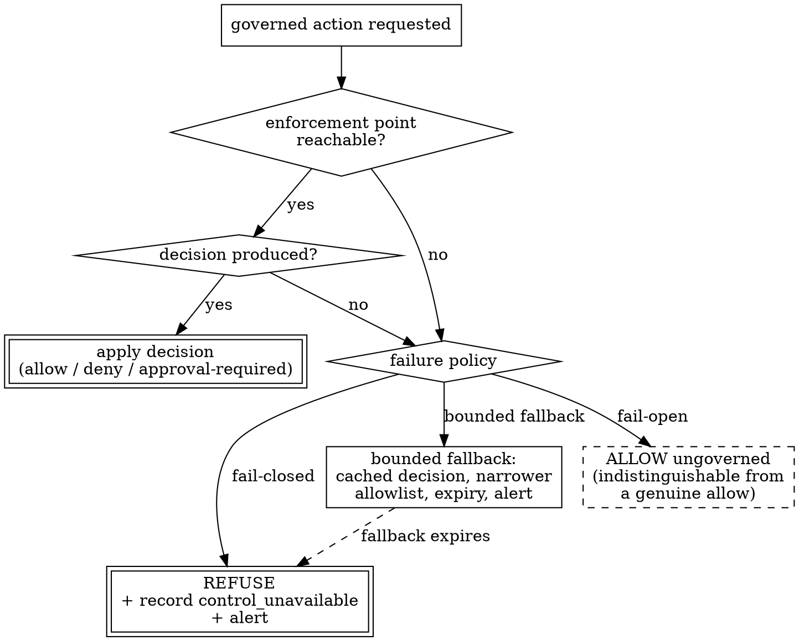

# Enforcement Models and Fail-Closed Design

> **Opening scenario.** Northstar Services' Research & Insights division has written its first governance contract for Atlas, the controlled research assistant. The policy is unambiguous: Atlas may search an approved source list, summarize what it retrieves, and file summaries internally; it may not publish externally. Two weeks later an analyst asks Atlas to "put the competitor briefing on the team blog so everyone can see it." The platform lead is asked a question she has not thought about carefully: *which piece of software will refuse?* The policy document will not refuse; it is a file. The model will not reliably refuse; it is a sampler reading instructions. Something in the execution path has to be positioned so that the action cannot occur without passing through it — and that something has to behave sensibly when it is itself broken, slow, or missing. This chapter is about where that component goes, what each placement can and cannot promise, and what it must do when it fails.

> **Learning objectives.**
> - Explain the separation of policy decision from policy enforcement, and why the separation is architectural rather than cosmetic.
> - Describe six enforcement models and place each relative to the agent process.
> - Compare enforcement models along five dimensions: mandatory versus bypassable, evidence quality, latency and operational cost, blast radius, and identity requirements.
> - Analyze the failure behavior of an enforcement point itself and argue concretely from the consequences of fail-open and fail-closed choices.
> - Design fail-closed defaults with bounded, accountable fallbacks rather than unbounded exceptions.
> - State why control over signaling does not imply control over what the signaling authorized.

> **Prerequisites.** Chapter 3 (what governance can guarantee; the first sketch of fail-open versus fail-closed), Chapter 4 (the vocabulary of policy decision point, policy enforcement point, and cooperative versus independent enforcement), Chapter 7 (deterministic decision semantics), and Chapter 9 (approvals as bound records, which this chapter treats as one decision outcome among several).

## 10.1 The decision is not the enforcement

The single most useful structural idea in access control is that deciding and enforcing are different jobs, performed by different components, with different trust requirements. A <span class="ix" data-ix="policy decision point">policy decision point</span> (PDP) evaluates a request against policy and returns a decision. A <span class="ix" data-ix="policy enforcement point">policy enforcement point</span> (PEP) sits in the path of the action, asks the PDP, and makes the outcome real by allowing or blocking. Two supporting roles complete the picture: a <span class="ix" data-ix="policy information point">policy information point</span> supplies attributes the PDP needs, and a <span class="ix" data-ix="policy administration point">policy administration point</span> is where policy is authored and published. The decomposition is standardized in the XACML architecture [@xacml] and appears, in the same shape, in the IETF's authorization framework, where the entity that makes the decision is deliberately distinguished from the entity that applies it [@rfc2904].

Chapter 4 introduced these names. What matters here is the consequence that follows from taking the separation seriously: *a decision has no force of its own*. A PDP that returns "deny" to a caller who is free to ignore it has produced an opinion. The strength of a governance system is therefore never a property of its policy language or its decision engine; it is a property of the enforcement point that consumes the decision — where it sits, what it can see, and whether the action can happen without it. This is why two organizations running identical policy can have radically different assurance.

The separation earns its keep for the ordinary reasons modular decomposition does: the decision logic changes on a policy cadence while the enforcement code changes on an integration cadence, and hiding each behind an interface lets them move independently [@parnas-criteria]. It also concentrates the security-critical reasoning in one auditable place instead of scattering conditionals through the call sites. But the separation introduces its own hazards, and they are the subject of this chapter: a decision can be requested and then discarded; a PEP can be bypassed; the channel between them can fail; and the PDP itself can be unavailable at the moment a decision is needed.

Figure 10.1 shows the canonical flow and, in the same picture, the path that defeats it.

<figure class="nx-fig" id="fig-10-1">
  <div class="fig-body">
    <div class="flow-col">
      <div class="flow"><div class="node">Agent action request</div><div class="arr">→</div><div class="node">PEP ✋</div><div class="arr">→</div><div class="node">PDP (evaluate)</div><div class="arr">→</div><div class="node">Decision + evidence</div><div class="arr">→</div><div class="node">Effect: allow / deny / approval-required</div></div>
      <div class="flow"><div class="node">Agent action request</div><div class="arr dashed">⇢</div><div class="node">Uncovered path (direct call, unwrapped tool, raw client)</div><div class="arr dashed">⇢</div><div class="node">Real-world effect</div></div>
    </div>
  </div>
  <figcaption><b>Figure 10.1 — Decision, enforcement, and the path that defeats both.</b> The upper row is the governed flow: the enforcement point intercepts, consults the decision point, and applies the outcome. The lower dashed row is the same action reaching the same effect without traversing the enforcement point. The teaching purpose is that everything a governance system claims depends on the lower row being empty — which is an architectural property, not a policy one.</figcaption>
</figure>

> **Key idea.** Policy strength is bounded by enforcement placement. Ask of every control: *is there any path from intent to effect that does not traverse the enforcement point?* If yes, the control is advisory for that path, no matter how the policy is written.

## 10.2 Six places to put an enforcement point

Enforcement points can be positioned at six broadly different distances from the agent's reasoning loop. They are not mutually exclusive; mature deployments layer several. What distinguishes them is what they can see and what they can force.

**<span class="ix" data-ix="enforcement model!in-process wrapper">In-process cooperative wrapper</span>.** The agent's tool objects are wrapped so that each governed call passes through a function that evaluates the request, records the decision, and only then executes. The PEP lives inside the same process as the planner, and it works because the integration code chooses to route through it. This model sees the richest semantics — the declared capability, the identity, the mission, the arguments in their typed form — and produces the best-structured evidence. It cannot stop code that does not call it.

**Library or runtime interception.** A step further out: the PEP hooks a shared library, an HTTP (HyperText Transfer Protocol) client, a database driver, or a language runtime's import or syscall surface, so that any code performing that operation is intercepted regardless of whether it knows about governance. Coverage improves substantially; semantics degrade, because at that layer the request is a socket connection or a file descriptor rather than "summarize an approved source."

**<span class="ix" data-ix="enforcement model!egress proxy">Gateway or egress proxy</span>.** All outbound traffic from the agent's environment is routed through a network element that authorizes each request. Envoy's external authorization pattern is the canonical shape: the proxy calls out to an authorization service and forwards or rejects accordingly [@envoy]. If the network is configured so that no other egress exists, this becomes *mandatory* for network-visible actions — a meaningful step up in assurance — at the cost of seeing only what appears on the wire.

**<span class="ix" data-ix="enforcement model!sandbox">Sandbox or isolated execution environment</span>.** The agent runs inside a container, virtual machine, or restricted interpreter whose kernel or hypervisor denies operations outside a declared set: no filesystem outside a directory, no network except through a proxy, no process spawning. Here the enforcement is implemented by a component the agent genuinely cannot bypass from inside, which is the strongest general property available. The vocabulary, however, is the operating system's, so a sandbox can forbid "write outside /work" but not "share customer data with a partner."

**<span class="ix" data-ix="enforcement model!IAM boundary">Identity and access management (IAM) boundary</span>.** The downstream service enforces, because the credential the agent presents simply does not carry the permission. This is the oldest and most widely deployed model in enterprise practice, and it is genuinely mandatory: the payment API refuses the call regardless of what the agent intended. Its limitation is granularity and timing. Credentials are provisioned per process or per service account, ahead of time, so they express "this component may call this endpoint," not "this action, on this subject, at this moment, given this approval."

**<span class="ix" data-ix="enforcement model!service mesh">Service mesh</span>.** Enforcement is delegated to sidecars or node proxies that mediate service-to-service traffic, authenticate peers with mutual transport-layer security, and apply authorization policy per connection or per request [@istio]. A mesh gives uniform, platform-operated enforcement without changing application code, and it fits the broader zero-trust posture in which every request is authenticated and authorized regardless of network location [@nist-zta; @beyondcorp]. It governs traffic between meshed workloads; it does not govern what a workload does inside itself.

Figure 10.2 places these six relative to the agent process.

<figure class="nx-fig" id="fig-10-2">
  <div class="fig-body">
    <div class="layers">
      <div class="layer" data-note="richest semantics, cooperative">In-process wrapper — governed tool objects, evaluate/record/execute</div>
      <div class="layer" data-note="broader coverage, coarser vocabulary">Library / runtime interception — HTTP client, driver, syscall surface</div>
      <div class="layer authority" data-note="mandatory for network-visible actions">Gateway / egress proxy — external authorization on every outbound request</div>
      <div class="layer authority" data-note="mandatory from inside, OS vocabulary">Sandbox — container, VM, or restricted interpreter</div>
      <div class="layer authority" data-note="mandatory, coarse, provisioned ahead of time">IAM boundary — the credential does not carry the permission</div>
      <div class="layer authority" data-note="platform-operated, per-connection">Service mesh — sidecar authorization between workloads</div>
    </div>
  </div>
  <figcaption><b>Figure 10.2 — Six enforcement placements, ordered from richest semantics to strongest compulsion.</b> Double-bordered rows are enforcement points the agent process cannot decline to use. The teaching purpose is the trade-off running down the figure: the further the enforcement point sits from the planner, the harder it is to bypass and the less it understands about what it is permitting.</figcaption>
</figure>

## 10.3 The dimensions that decide between them

Five dimensions separate these models in practice, and Table 10.1 applies all five across the six placements. They are worth working through explicitly, because teams routinely optimize one and discover the others in an incident.

**Mandatory versus bypassable.** The first question is whether the agent's code path *can* avoid the enforcement point. <span class="ix" data-ix="cooperative enforcement">Cooperative enforcement</span> depends on the caller routing through the PEP; <span class="ix" data-ix="independent enforcement">independent (mandatory) enforcement</span> is imposed by a component outside the agent's control. This distinction is binary, it is the single largest determinant of assurance, and it is not a matter of degree: a wrapper that covers nine of ten tools is bypassable, and the honest statement is "this control holds for the wrapped surfaces" rather than "this control holds."

**Evidence quality.** What the enforcement point can record is bounded by what it can see. An in-process wrapper can record the identity, capability, mission, occurrence, and declared subject revision, producing evidence that reconstructs a governance decision. A proxy records a request line and headers; a sandbox records a system call; an IAM boundary usually records only that a credential was used or refused. Chapter 11 takes this up as its own subject, but the architectural consequence belongs here: the models with the strongest compulsion tend to produce the weakest semantic evidence, which is why real designs pair them.

**Latency and operational cost.** An in-process check is a function call. A sidecar or proxy authorization adds a network hop per request and introduces a service that must be scaled, deployed, monitored, and upgraded alongside the workload. A sandbox adds startup and image management. These costs are not merely economic: they determine the *pressure* on the control. Any enforcement point that materially slows a hot path will eventually be given a fast path, and the fast path will not be governed.

**<span class="ix" data-ix="blast radius">Blast radius</span>.** When the enforcement component misbehaves, how much stops? An in-process wrapper failing affects one agent. A shared authorization service failing can halt every workload in a cluster. This is the dimension that pushes teams toward fail-open configurations, and Section 10.4 argues that the correct response is to reduce blast radius by design rather than to weaken the failure behavior.

**Identity requirements.** Every model needs to know *who* is acting, and they differ in what they can obtain. A wrapper knows the declared agent identity because the integration told it. A mesh can cryptographically authenticate the workload with mutual transport-layer security, but a workload is not an agent: one process may host several logical agents, and the mesh cannot distinguish them. An IAM boundary knows a service principal. Nothing in this list authenticates the *human* on whose behalf an agent acts unless that identity is deliberately propagated, which is the gap Chapter 9's approval discussion also ran into.

| Model | Mandatory? | Evidence semantics | Cost | Blast radius | Identity it can establish |
|---|---|---|---|---|---|
| In-process wrapper | No — cooperative | Highest: capability, mission, subject revision | Very low | One agent process | Declared agent identity (asserted) |
| Library / runtime interception | Partly — same-process code can still avoid it | Medium: operation and arguments, little intent | Low | One process or host | Process identity |
| Gateway / egress proxy | Yes, if no other egress exists | Request-level: destination, method, payload metadata | Medium | All traffic through the proxy | Network/workload identity |
| Sandbox | Yes, from inside | Low: system calls, resource access | Medium | One workload | Workload identity |
| IAM boundary | Yes | Low: credential use and refusal | Low (already deployed) | All consumers of the credential | Service principal |
| Service mesh | Yes for meshed traffic | Connection- or request-level | Medium to high | Cluster-wide if the control plane fails | Cryptographic workload identity |

**Table 10.1 — Enforcement models across five dimensions.** The teaching purpose is that no row dominates: the models with the best semantics are bypassable, and the mandatory ones cannot express the concepts the policy is written in. Real architectures compose rows — a cooperative wrapper for semantic decisions and evidence, an egress proxy or IAM boundary to make the important refusals unavoidable.

> **Case study — Atlas.** Return to the opening scenario. The analyst's request — publish the competitor briefing to a public blog — is presented to Atlas, and the planner produces a step that calls a publishing tool. In Northstar's current pilot, that tool is a governed one: it is wrapped, so the call reaches an enforcement point, which resolves Atlas's identity in the `northstar.research` namespace, finds that `publish_external` is not among its declared capabilities (`research.search_approved`, `research.summarize`, `research.file_internal`), and refuses. The action does not run, and a denial is recorded with the identity, the requested capability, and the mission it belonged to. This is the correct outcome, and the platform lead is entitled to say the control worked. What she is not entitled to say is that Atlas cannot publish externally. The refusal covers the wrapped publishing tool. It says nothing about the general-purpose HTTP client sitting in the same process, which no wrapper intercepts. Making the stronger statement requires an enforcement point Atlas cannot decline — the egress proxy or the sandbox rows of Table 10.1 — and that is a network and platform decision, not a policy edit. Atlas returns in Chapters 11 and 20 for the evidence side of this denial, and in Chapter 36 for the audit reconstruction.

> **Misconception.** *"We use a policy engine, so enforcement is handled."* A policy engine is a decision component. Deploying one improves the quality, consistency, and testability of decisions [@opa; @cedar], and changes nothing about whether an action can occur without asking. The two questions — *are our decisions correct?* and *can the action happen anyway?* — are independent, and only the second is answered by architecture.

## 10.4 When the enforcement point itself fails

Every enforcement point eventually fails to produce an answer. The decision service times out; the contract file is missing; the lock does not verify; a dependency throws; a configuration reload leaves the policy set empty. At that moment the enforcement point must do one of two things, and the choice is the most consequential single decision in the design.

<span class="ix" data-ix="fail-open">Fail-open</span> means the action proceeds when the control cannot decide. <span class="ix" data-ix="fail-closed">Fail-closed</span> means the action is refused. Framed abstractly the choice sounds like a preference; framed concretely it is not, because the two options have asymmetric worst cases and asymmetric *timing*.

Consider the fail-open case at Northstar. The authorization service backing the Forge merge gate becomes unreachable during a deployment. Merges continue, unauthorized, for forty minutes. Nothing appears to be wrong: no user is blocked, no alert distinguishes "allowed because permitted" from "allowed because we could not tell," and the evidence stream records allows with no indication that the decision was vacuous. Two weeks later an incident review asks which changes reached production without approval during that window, and the answer is not recoverable from the evidence, because a fail-open allow and a genuine allow look identical. Worse, the failure is *silent by construction*: fail-open converts an outage of the control into an absence of the control, and absence of a control is exactly the condition controls exist to make visible. This is why fail-open is attractive — it never causes a visible incident — and why that attractiveness is the problem.

Now the fail-closed case. The same outage occurs; merges stop. Engineers are blocked within minutes, the on-call is paged, and the outage is fixed. The cost is real and immediate: work halts, and if the enforcement point guards something latency-critical, customer-visible failures follow. The benefit is that the system's state remains describable. Nothing happened that the organization cannot account for, and the incident is an availability incident rather than an unbounded, unmeasurable governance gap.

The general principle behind the asymmetry is that an enforcement mechanism can only enforce properties it can observe [@schneider-enforceable]; when it cannot observe, it has no basis for permitting, and permitting anyway is not a degraded form of enforcement but its absence. The design default follows from Saltzer and Schroeder's fail-safe defaults: base access decisions on permission rather than exclusion, so that the failure of the mechanism denies rather than grants [@saltzer-schroeder].

Figure 10.3 lays out the branch points.



**Figure 10.3 — The failure branch that most designs leave implicit.** The teaching purpose is the dashed node: a fail-open allow is not merely risky, it is *unlabelled*, so it cannot be distinguished later from a decision that was actually made. The bounded-fallback path exists precisely so that degradation is time-limited and visible rather than permanent and silent.

Three refinements make the choice tractable in real systems.

*Not all actions deserve the same failure behavior.* Failure policy should follow consequence, exactly as gating does. A read of an approved public source may reasonably proceed when the decision service is down; a production deployment may not. Grading failure behavior by action class converts an all-or-nothing argument into an engineering allocation.

*Failure must be observable as failure.* Whatever the choice, the event must be recorded as "the control could not decide," never as an ordinary outcome. If a fail-open path exists, every action taken on it must be tagged, counted, alerted, and reconciled afterwards. An untagged fail-open is the one configuration with no defensible use.

*Availability of the control is a service-level objective.* If a control is fail-closed, its availability becomes the availability of everything it guards, which means it must be engineered — replicated, cached, load-shed — like any other dependency in the critical path [@sre-book]. Teams that skip this step end up arguing for fail-open on availability grounds, having never attempted the engineering that would make the argument unnecessary.

## 10.5 Fail-closed defaults with bounded fallbacks

"Fail closed" as an unqualified rule is easy to write and hard to operate; the productive form is a fail-closed default plus a small number of explicitly designed, bounded fallbacks. A <span class="ix" data-ix="bounded fallback">bounded fallback</span> is a degraded mode with four properties: it is *narrower* than normal operation, it is *time-limited*, it is *visible*, and it is *owned*.

Narrower means the fallback permits a strict subset of what the healthy control would permit — typically a small static allowlist of low-consequence actions, never "whatever was requested." Time-limited means the fallback carries an expiry after which it stops permitting anything; a cached decision, for example, is usable for minutes, not indefinitely, and Chapter 9's argument about approval staleness applies unchanged to cached authorizations. Visible means every action taken under the fallback is recorded as such and surfaced in monitoring, so the organization can answer "what did we do while degraded?" without forensics. Owned means a named accountable party is responsible for the residual risk while the fallback is active — the same accountability structure as the exception records of Chapter 9, and for the same reason: a weakening that nobody owns is a weakening nobody will end.

Listing 10.1 shows the four properties written down as configuration rather than left to operational judgment during an outage.

```yaml
default: fail_closed
fallbacks:
  - action_class: read_approved_source     # low consequence
    mode: bounded_allowlist
    permits: [research.search_approved, research.summarize]
    max_duration: PT15M                    # narrower, and time-limited
    evidence_label: control_unavailable    # visible in the event stream
    alert: page_platform_oncall
    accountable_owner: role:research_platform_lead
  - action_class: merge_protected_branch   # high consequence
    mode: fail_closed                      # no fallback exists
```

**Listing 10.1 — A bounded fallback declared, not improvised.** Illustrative — not drawn from the repository. Failure behavior for one enforcement point, graded by action class; the point is that each of the four properties is a field: `permits` narrows, `max_duration` bounds, `evidence_label` makes the degraded path distinguishable in evidence, and `accountable_owner` names who carries the residual risk while it is active.

Cached decisions deserve a specific warning. A cache turns a fail-closed control into a partially fail-open one for the duration of the cache lifetime, because a revocation issued during an outage will not be seen. That may be an acceptable trade for read-heavy, low-consequence operations; it is rarely acceptable for anything Chapter 9 would have gated. State the cache lifetime explicitly, treat it as the maximum window during which a revoked authority still functions, and size it accordingly.

> **Nornyx in practice.** Both halves of the fail-closed discipline appear in the repository at the book's snapshot, at two different layers. At *load* time, `load_authorizer` refuses to produce an authorizer at all unless the contract validates, composes, resolves a governance profile, and verifies against its lock; each failure maps deterministically into one of four codes — `CONTRACT_INVALID`, `PROFILE_MISSING`, `LOCK_INVALID`, `LOCK_STALE` — rather than yielding a partially initialized object (`nornyx/agentic/authz.py`). The design statement there is that a governance layer which cannot establish what it is enforcing must not start, because a running-but-unconfigured enforcement point is exactly the silent fail-open of Section 10.4. At *call* time, the adapter enforcement boundary in Listing 10.2 guarantees ordering: the decision is evaluated and its intents recorded before the wrapped callable runs; the callable runs exactly once and only on ALLOW; and an unexpected error from either the evaluation or the recording propagates before the action is reached. The package's compatibility policy classifies a change to that evaluate-record-execute ordering as a breaking change, which is the appropriate weight for a property everything else depends on.

```python
def enforce(
    authorizer: Authorizer,
    request: AuthorizationRequest,
    *,
    context: EvaluationContext,
    recorder: EvidenceRecorder,
    mission_id: str,
    action: Callable[[], T],
    on_decision: Callable[[Decision], None] | None = None,
) -> T:
    ...
    decision = authorizer.evaluate(request, context=context)
    recorder.record_decision(decision, mission_id=mission_id)
    if on_decision is not None:
        on_decision(decision)
    if not decision.allowed:
        raise AdapterDenied(decision)
    return action()
```

**Listing 10.2 — One enforcement boundary, three steps in a fixed order.** From `adapters/nornyx-agentic-adapters/src/nornyx_agentic_adapters/enforcement.py` in the repository (docstring elided). The module docstring states the guarantee directly: this is "the one place a wrapped adapter action is ever invoked," and "any unexpected internal error propagates … before `action` is reached, so it also fails closed." Note that `on_decision` is an observation hook that runs after recording and before any branch, on refusals as well as allows — it cannot change the outcome.

> **Assurance boundary.** The enforcement point in Listing 10.2 is cooperative, and the repository says so without hedging: "Bypassing the adapter — calling the underlying action directly instead of through the governed tool — bypasses enforcement entirely," a statement backed by a test that exercises exactly that bypass. The honest structure of the claim is therefore conditional and surface-scoped, which is why the adapter ships a machine-readable coverage inventory naming each surface as wrapped, unsupported, or unwrapped — for the CrewAI adapter, exactly one surface of six is wrapped, and the asynchronous tool path is declared unsupported and fails closed rather than executing ungoverned. Naming uncovered surfaces is not an admission of weakness; it is the only way a claim about coverage can be checked. Chapter 14 develops coverage and bypass as first-class subjects, and Chapter 13 attaches assurance tiers to exactly this distinction.

## 10.6 Control plane and media plane

The book's telecom analogy returns here in its second sanctioned use, because the industry that separated decisions from flows most rigorously learned this chapter's lesson decades ago.

In the IP Multimedia Subsystem (IMS) architecture underlying carrier voice over LTE, session signaling and media transport travel different paths [@3gpp-ims]. Signaling — who is calling whom, which codecs are negotiated, what quality of service is authorized, whether the subscriber is entitled to the service — is handled by call session control functions in the <span class="ix" data-ix="control plane">control plane</span>. The actual voice packets travel the <span class="ix" data-ix="media plane">media plane</span>, a separate path that may or may not pass through an operator-controlled media element [@gsma-volte]. The architecture is deliberate: signaling is low-volume and decision-rich, media is high-volume and decision-poor, and forcing them through one component would be both expensive and wrong.

The operational lesson operators learned is precise and directly transferable: **controlling signaling does not control media**. An operator can authorize or refuse a session in the control plane with complete authority, and still have no influence over packets that reach their destination without traversing an operator-controlled media element. When operators genuinely need media-plane control — for interception obligations, for transcoding, for policy enforcement on bearers — they deploy elements in the media path and force traffic through them. Nobody in that industry would claim that a correct decision in the control plane constitutes control over the media flow. It is understood as a property of *topology*.

Governance of agentic systems has the same shape. The contract, the decision engine, and the approval records are a control plane: they decide, and they decide well. The tool call that moves money, writes a file, or posts to a blog is the media plane. If that action path can reach its effect without traversing an enforcement element, then the control plane's decision is, in the operators' sense, unenforced — regardless of how rigorous the policy was. Section 10.2's models are, in this framing, simply choices about where to put the media-plane element.

The analogy stops in three places, and stating them matters more than the resemblance. First, telecom signaling is a deterministic, standardized protocol with a bounded state machine; an agent's action selection is generated at inference time and is neither bounded nor specified in advance, so there is no equivalent of a well-known signaling grammar to police. Second, media in telephony is a narrow, well-typed flow — negotiated codecs over a known transport — whereas an agent's "media" is arbitrary computation: file writes, subprocess invocations, requests to unenumerated endpoints. There is no single bearer to place an element in front of, which is why agent enforcement requires several models composed rather than one. Third, an operator controls both the network and, through standards and equipment certification, the endpoints; an enterprise deploying an agent controls neither the model nor, usually, the tools it integrates. The analogy illuminates topology. It does not transfer authority.

> **Design checkpoint.** For one governed action in your system, write down: the enforcement point that stands in its path; every other path that reaches the same effect; what happens to that action when the enforcement point cannot decide, and how that event is labelled in evidence; the maximum time a revoked authority continues to function through caching; and the availability objective you have set for the control itself.

## Summary

Deciding and enforcing are separate jobs, and the assurance a governance system provides is determined by the enforcement point rather than the decision engine. Six placements — in-process wrapper, library or runtime interception, gateway or egress proxy, sandbox, identity and access management boundary, and service mesh — trade semantic richness against compulsion along a consistent gradient: the closer the enforcement point sits to the planner, the more it understands and the more easily it is bypassed. Five dimensions make the trade explicit: mandatory versus bypassable, evidence quality, latency and operational cost, blast radius, and the identity the model can establish. The failure behavior of the enforcement point is the most consequential single choice in the design, because fail-open converts an outage of a control into a silent absence of that control, indistinguishable afterwards from correct operation. The workable design is a fail-closed default with narrow, time-limited, visible, owned fallbacks, and with the control's own availability engineered as a first-class objective. The telecom separation of control plane from media plane names the underlying truth: a decision binds an action only if the action's path traverses an element that applies it.

- A decision without an enforcement point in the action path is an opinion.
- Cooperative enforcement is a conditional claim scoped to covered surfaces; say so.
- Mandatory enforcement buys compulsion and loses semantics; compose models rather than choosing one.
- Fail-open is attractive because its failures are invisible, which is precisely the objection to it.
- Bounded fallbacks are narrower, time-limited, visible, and owned — otherwise they are fail-open with extra steps.
- Controlling signaling does not control media; enforcement is a topology property.

## Review questions

1. A team reports that its agent platform "enforces policy through OPA." List the questions from this chapter you would ask before accepting that the platform enforces anything, and state which of them a policy language cannot answer.
2. Rank the six models in Section 10.2 by the strength of the claim each supports for the statement "Atlas cannot publish externally," and justify the ranking using the mandatory-versus-bypassable dimension.
3. An authorization sidecar fails open during a thirty-minute control-plane outage. Describe precisely what an investigator can and cannot reconstruct afterwards, and name the one change to the fail-open path that would make the window reconstructable.
4. Your enforcement point caches decisions for fifteen minutes to survive brief outages. State the security property this weakens, express the weakening as a time bound, and name one action class for which the trade is unacceptable.
5. A gateway PEP and an in-process wrapper both refuse the same action. Compare the evidence each produces and explain why an audit might need both records rather than either alone.
6. Explain the limit of the control-plane/media-plane analogy that most directly affects an agent platform, and describe an enforcement gap it predicts.

## Exercises

1. Take one agent in your environment and produce a path inventory for a single high-consequence effect (for example, "data leaves the organization"). Enumerate every code path that reaches that effect, mark each as covered or uncovered by an existing enforcement point, and for each uncovered path name the model from Table 10.1 that would cover it and what it would cost to deploy.
2. Design the failure behavior for three action classes of differing consequence in one system. For each, specify the failure policy (fail-closed, or a bounded fallback with its narrowing rule, expiry, visibility mechanism, and owner), the evidence label emitted on the degraded path, and the alert that fires. Then write the one-paragraph justification you would give an auditor for the least strict of the three.
3. Implement a small cooperative wrapper around two functions, one governed and one not, with a decision function that raises on a simulated outage. Demonstrate by test that the governed call fails closed on the outage, that the ungoverned call is unaffected, and that a direct call to the underlying governed function bypasses enforcement entirely. Write down the exact claim your wrapper supports, in one sentence, with its scope condition attached.

## Further reading

- [@xacml] — the reference decomposition of decision, enforcement, information, and administration points.
- [@rfc2904] — the same separation from the authentication, authorization, and accounting (AAA) tradition, with the sequences by which decisions reach enforcers.
- [@envoy] — the external authorization pattern that makes a proxy into a policy enforcement point.
- [@nist-zta] — why per-request authorization at enforcement points, rather than network position, is the modern baseline.
- [@schneider-enforceable] — the formal question of which policies a runtime mechanism can enforce at all, and why observability bounds enforcement.
