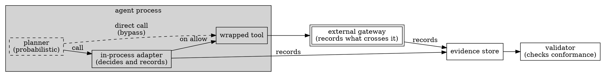

# Runtime Evidence as an Engineering Artifact

> **Opening scenario.** Six weeks after Northstar Services deploys its research assistant, Atlas, a compliance reviewer asks a narrow question: *on 14 March, did Atlas attempt to publish a client briefing to an external site, and what stopped it?* The platform team is confident the answer is yes-and-a-denial, because they remember the incident. Retrieving proof turns out to be harder. The application log has the string `tool call rejected` with a request identifier and no policy context. The distributed trace shows a span that ended in an error, sampled at ten percent and retained for seven days — and 14 March was nine days ago. The security information system has an alert that fired, was acknowledged, and carries no link to the agent's identity or to the policy version in force. Three systems recorded *something*. None recorded what the reviewer needs: which subject, under which policy revision, requested which capability, what was decided, by what, and against what declared authority. This chapter is about designing that missing artifact deliberately instead of hoping it falls out of the logging stack.

> **Learning objectives.**
> - Distinguish evidence from logs and telemetry by purpose, audience, binding, retention, and admissibility.
> - Identify the evidence producer in an architecture and state what trust is being placed in it.
> - Write an evidence contract: what is recorded, what each record binds to, and how conformance is validated.
> - Apply the supplied-versus-observed distinction and state which claims each supports.
> - Assemble an evidence package and explain why the validator version belongs inside it.
> - Reason about the tension between complete evidence and data minimization.
> - Describe how external tool output is imported without the governance layer executing those tools.

> **Prerequisites.** Chapter 3 (what governance can and cannot guarantee; the eight questions), Chapter 9 (approval as a bound record), Chapter 10 (enforcement models and fail-closed design). Chapter 8's treatment of canonicalization and semantic identity is assumed; where this chapter says "digest," it means a digest over a canonical form in that sense. Chapter 12 develops the integrity machinery this chapter uses informally.

## 11.1 Three artifacts that look alike

Every organization running an agentic system already produces streams of records about it, and almost none of those streams are evidence. The confusion is understandable — logs, telemetry, and evidence are all "things the system writes down" — but they are designed against different requirements, and treating one as a substitute for another is how the opening scenario happens.

A <span class="ix" data-ix="log">log</span> is a developer-facing narrative of what a program did, written to support debugging. Its audience is whoever is holding the pager; its format is whatever the engineer who wrote the line found convenient. Log lines are free-form by design, because constraining them would defeat their purpose. They bind to nothing in particular: a line naming an agent does not thereby establish which agent identity was in effect, and a line saying "denied" does not establish what denied it or under which rule. Retention is set by storage cost, and rotation is silent.

<span class="ix" data-ix="telemetry">Telemetry</span> — metrics, traces, spans — is an operational instrument [@otel; @sre-book]. Its purpose is to characterize system behavior in aggregate: latency distributions, error rates, saturation. Crucially, telemetry is usually *sampled*, because collecting every span from a high-volume service is prohibitively expensive, and sampling is exactly the right trade-off when you want the shape of a distribution. It is exactly the wrong trade-off when you want to know whether one specific action occurred. A sampled record of a governance decision is not a partial answer; it is an absent answer that looks like data.

<span class="ix" data-ix="evidence">Evidence</span>, in the sense this book uses the word, is a record produced deliberately to support a later claim about a governed action. Its purpose is *reconstruction*: enabling someone who was not present to determine what was decided, on what basis, and under whose authority. Its audience is an auditor, a reviewer, an incident responder, or a regulator — people who will not have access to the running system and will not accept "trust me." That audience requirement drives every other property. Evidence must be *bound*: each record identifies the subject it concerns, the policy revision in force, and the decision made, in fields whose meaning is fixed by a schema rather than by convention. It must be *complete for its declared scope*: sampling is forbidden, and a missing record must be detectable rather than indistinguishable from a quiet period. It must be *retained on a schedule set by obligation*, not by disk pressure. And it must be <span class="ix" data-ix="admissibility!of evidence">admissible</span> in the weak but essential sense that its structure supports the claims built on it — that a reviewer can state what the record proves without overstating it.

| Dimension | Logs | Telemetry | Evidence |
|---|---|---|---|
| Purpose | Diagnose failures | Characterize behavior in aggregate | Support a later claim about a governed action |
| Audience | Engineers on call | Operations, capacity planning | Auditors, reviewers, incident responders, regulators |
| Binding | Free text; binds to nothing structurally | Binds to service and span identifiers | Binds to subject, policy revision, decision, and authority by schema |
| Completeness | Best effort; lines may be dropped | Sampled by design | Complete for a declared scope; gaps must be detectable |
| Retention | Set by storage cost; silent rotation | Set by cost and query horizon | Set by obligation; deletion is a governed event |
| Admissibility | None claimed | None claimed | The record's structure fixes what may and may not be claimed from it |

**Table 11.1 — Logs, telemetry, and evidence compared.** The teaching purpose is that these are not three quality levels of one artifact but three different artifacts. A well-run system needs all three, and cannot satisfy the evidence requirement by improving the logs, because the differences are in binding and completeness rather than verbosity.

> **Key idea.** The question that separates evidence from every other record is: *what claim is this record supposed to support, and to whom?* If you cannot answer it, you are writing a log. Evidence is designed backwards from the claim, and a claim nobody has stated produces evidence nobody can use.

None of this makes logs and telemetry second-class. They answer questions evidence cannot: why a request was slow, which dependency degraded, whether a deployment regressed. The discipline is to stop asking them to answer questions they were never designed for, and to add a third stream whose obligations are explicit.

## 11.2 The producer and the trust placed in it

Evidence does not appear. Something writes it. That something is the <span class="ix" data-ix="evidence producer">evidence producer</span>, and identifying it precisely is the most clarifying move available in evidence architecture, because every claim built on the evidence inherits whatever trust is placed in the producer.

Producers come in recognizable kinds. A *framework adapter* running inside the agent's own process is the most common: it observes the call it wraps, records the decision, and emits a record. A *synthetic harness* produces records in a test or demonstration setting, where the surrounding behavior is fabricated on purpose. An *external runtime* — a gateway, a sandbox, a service-mesh sidecar — produces records from outside the agent's process. These differ in the one respect that dominates all others: whether the producer is in a position to be wrong, or to lie, about the thing it is recording.

Figure 11.1 contrasts the two positions. An in-process adapter records decisions it made itself; if it is bypassed it records nothing, and the stream is *silently* incomplete, because the missing record looks exactly like a period in which nothing happened. If the agent's process is compromised, the adapter's output is whatever the attacker wants. An external gateway avoids both problems for traffic that must pass through it, and acquires a different one: it can only record what crosses its boundary, so anything the agent does locally is invisible to it.



**Figure 11.1 — Producers and their blind spots.** The dashed bypass edge is the teaching point: a call that avoids the adapter produces no adapter evidence at all, so the in-process record set is complete only for the surfaces the adapter wraps. The gateway sees the tool's outbound traffic but never a decision the adapter made. Neither producer is "the" evidence source; each has a stated coverage, and Chapter 14 turns that coverage into an inventory.

Because trust in the producer propagates into every downstream claim, an evidence architecture should name the producer *in the evidence itself*. A record saying "produced by an in-process cooperative adapter, version 0.2.0" invites the correct amount of skepticism. A record with no producer field invites whatever skepticism the reader happens to have.

> **Nornyx in practice.** As implemented at the snapshot, the runtime-events schema requires a `producer` object on the envelope and on every event, whose `type` comes from a closed three-value enumeration: `framework_adapter`, `synthetic_harness`, or `external_runtime` (`schemas/agentic_runtime_events_v1.schema.json`). That field is the reader's warning label: a stream declaring `synthetic_harness` is a demonstration, and one declaring `external_runtime` is asserting — not proving — that some other system produced it. The validation layer authenticates none of them. Its report embeds the sentence "Nornyx does not observe, operate, or monitor the runtime" (`nornyx/agentic_evidence.py`), and the repository's tier decision record states plainly that "the event producer is self-declared" (`docs/decisions/ADR-0040-governance-assurance-tiers.md`).

## 11.3 Evidence contracts

If evidence is designed backwards from a claim, the design artifact is an <span class="ix" data-ix="evidence contract">evidence contract</span>: a written, versioned statement of what must be recorded, what each record is bound to, and how a record set is validated. It has three parts, each answering one of the eight questions from Chapter 3.

**What must be recorded.** The contract fixes a <span class="ix" data-ix="closed event set">closed set of event types</span>. Closure matters more than coverage. An open set — "record anything interesting" — makes absence uninterpretable, because a missing record could always be an event type nobody thought to define. A closed set makes "was this recorded?" answerable, and makes adding an event type a reviewed schema change rather than a deployment detail. The set should be small enough to enumerate in a paragraph and specific enough that each type has required fields. A `capability_denied` type that does not require a capability reference is decoration.

**What each record is bound to.** <span class="ix" data-ix="evidence binding">Binding</span> is the property that separates evidence from a note. A record must carry enough identity to attach to a specific governed subject and a specific version of the rules: the identity of the system being governed, the revision of the governed subject the record concerns, and a digest of the policy artifacts in force at the moment of the decision. Without the revision, evidence from before a policy change is indistinguishable from evidence after it. Without the digest, a reviewer can determine only that *some* policy was in force.

**How records are validated.** The contract names a validation procedure and what a passing result means. Validation checks conformance: schema shape, required fields per type, references that resolve to declared entities, ordering constraints, and binding equality. Crucially, it takes the policy artifacts as an *input*, so that the records are checked against the exact revision they claim, as in Listing 11.1.

```bash
nornyx agentic-network evidence-validate CONTRACT \
  --events events.json \
  --lock nornyx.agentic_network.lock \
  --as-of 2026-07-17T00:00:00Z --strict
```

**Listing 11.1 — Validating a supplied evidence stream against a specific contract revision.** From `docs/agentic-network/06_RUNTIME_EVIDENCE.md` in the repository. Every argument is a binding: the contract fixes the declarations, the lock fixes the artifacts and the evidence schema version, and the evaluation instant fixes which memberships and approvals were effective. Validation reads local files only — there is no listener, collector, or daemon involved.

The validator's output should state its own limits, because the natural reading of "validation passed" is "the system behaved correctly," and that reading is wrong.

The Atlas denial makes this concrete. Table 11.2 writes the evidence contract for exactly one governed action.

| Contract element | Specification for the Atlas external-publication denial |
|---|---|
| Events required | `capability_requested` for the publication capability, then `capability_denied` carrying the decision |
| Subject binding | Identity `atlas` in namespace `northstar.research`; the exact contract revision in force, as an immutable content-addressed identifier |
| Policy binding | Digest of the governing contract and of the lock that pins its generated artifacts |
| Decision fields | The capability reference; a decision value of `deny`; the source and target trust zones (`research-internal` to `public-web`) |
| Ordering constraints | The denial's sequence number follows the request's; timestamps do not decrease; no tool invocation appears for the denied capability |
| Validation | Conformance of the supplied stream against the exact contract revision — schema, required fields, resolvable references, ordering, binding equality |
| What a pass establishes | The supplied records are internally consistent and bound to the reviewed policy revision |
| What a pass does not establish | That the denial occurred; that no other publication path existed; that no records were omitted |

**Table 11.2 — An evidence contract for one governed action.** The last two rows are the ones organizations skip, and they are the reason the table exists. The negative row is not modesty; it is what keeps the claim register of Chapter 39 from filling with statements the evidence cannot carry.

> **Case study — Atlas.** Northstar re-runs the 14 March incident with an evidence contract in place. The stream that comes back contains four records for the mission: Atlas is invoked; it requests `research.summarize`, which is allowed; it requests the external publication capability, which is denied. Each record names `atlas` as the actor and carries the same contract digest, the same immutable subject revision, and a sequence number. The reviewer's question is now answerable as it was not in the opening scenario: on this stream, under contract revision `git:9f3c1a7…`, the publication capability was requested and denied, and the capability was never held by this identity in the first place. The reviewer's *second* question is the one this chapter has been preparing for — how do we know the stream is the whole story? — and it is not answerable from the evidence. The honest response is a statement about the producer's coverage, not a stronger reading of the records. Thread A returns in Chapter 20, where the validation pipeline is examined in detail, and in Chapter 36, where the partner-share approval is reconstructed for an audit.

## 11.4 Supplied versus observed evidence

We now reach the distinction this book treats as its central honesty requirement.

<span class="ix" data-ix="observed evidence">Observed evidence</span> is produced by a component that independently witnessed the fact it records and that the subject of the record could not control. A network appliance recording a connection it terminated has observed something; a hypervisor recording a system call has observed something. Observation costs something structural: the observer must sit somewhere the observed cannot reach.

<span class="ix" data-ix="supplied evidence">Supplied evidence</span> is produced by a component under the control of, or trusted on the word of, the thing being governed. An in-process adapter supplies evidence. A framework callback supplies evidence. An external runtime that hands you a JSON file supplies evidence — the file may be honest, but nothing in the file makes it so. Supplied evidence can be validated for *conformance*: does it parse, satisfy the schema, resolve its references, hold its ordering, bind to the right revision? It cannot be validated for *truth*, because there is nothing to compare it against except itself.

The failure this distinction prevents is common. A validator reports `pass`. Someone writes in a control narrative: "policy enforcement is verified by automated evidence validation." The sentence is false in a way that is hard to see, because every individual word is defensible. What was verified is that the supplied records conform; whether they describe reality depends entirely on the producer — which is why Section 11.2 insisted on naming it.

Two failure modes exist and neither is detectable from inside the record set. **Omission**: the producer never emitted a record for an action that occurred, and a conforming stream with a missing event is still a conforming stream. **Fabrication**: the producer emitted a record for an action that did not occur, and a fabricated event that satisfies the schema, resolves its references, and sits in sequence order validates cleanly. This is not a defect in the validator; it is the definitional limit of validating supplied input, and no additional checking inside the stream moves it.

> **Assurance boundary.** Validation of supplied evidence supports claims of the form "the records provided are conformant, complete relative to the declared surfaces, and bound to policy revision R." It does not support claims of the form "agent A did not do X," "all of agent A's actions are recorded here," or "the runtime enforced the policy." Moving from the first form to the second requires a producer the subject cannot influence — the subject of Chapter 13's Tier 3 — and, in practice, an authenticated producer identity and protected capture path that the governance layer neither provides nor verifies.

> **Misconception.** *"We can close the gap by signing the evidence."* A signature establishes that a particular key signed particular bytes. If the signing key lives in the same process as the producer, a compromised producer signs its fabrications, and an omitted event is not signed at all because it does not exist. Signatures raise the cost of tampering *after* production and support non-repudiation between parties [@sigstore; @in-toto]; they do nothing about honesty *at* production. What closes the gap is independence of the observer, not cryptography applied to a dependent one.

> **Nornyx in practice.** As implemented at the snapshot, the supplied/observed boundary is stated in the tool's own output rather than left to documentation. Every validation report embeds three limitation sentences verbatim: "Validated evidence proves conformance of supplied records only." / "Hash validity proves content binding, not event truth." / "Nornyx does not observe, operate, or monitor the runtime." (`nornyx/agentic_evidence.py`). The report also carries a `safety` block asserting that validation itself called no models, executed no tools, used no external connectors, used no network, and executed no producers. The residual-risk list in the repository's security-boundary documentation is equally direct: "Evidence is supplied, not observed: omission and fabrication are outside Nornyx's proof surface" (`docs/agentic-network/08_SECURITY_BOUNDARIES.md`).

Note that the distinction is a property of the *pipeline*, not of the record: the same JSON object is supplied evidence when an in-process adapter writes it and observed evidence when an out-of-band appliance does. An architecture that normalizes records into a common store must therefore preserve producer identity through the normalization rather than flattening it away.

## 11.5 Evidence packages

A single record set is rarely the whole story. Decisions reference documents; documents have versions; validators have versions; artifacts are large and belong beside the records rather than inside them. The unit that survives handoff to an auditor is not a file but an <span class="ix" data-ix="evidence package">evidence package</span>: a bounded, self-describing bundle with four kinds of content.

**Records.** The event stream itself, conforming to a named schema at a named version, with its binding fields intact.

**Referenced artifacts.** The things records point at: a test report, a scan output, an approval document, a rendered policy. These live as files beside the records, because embedding a two-megabyte report inside an event is bad engineering and dropping it entirely breaks reconstruction.

**Hashes.** Each referenced artifact is named by path *and* by digest, so the package can detect substitution after the fact. Chapter 12 works through exactly what that binding establishes; the operational rule here is that a reference without a digest is a reference to whatever is at that path today.

**A <span class="ix" data-ix="validator version">validator version</span>.** This element is the one most often forgotten, and its absence is quietly corrosive. A validation result is a statement made *by a specific program*. If the package records only "status: pass," a reviewer three years later cannot tell whether the checks that passed included the ordering rules, the replay detection, or the approval-actor constraints, because those were added at different times. Recording the validator identity and version — and, where artifacts are generated, the generation format version — converts "it passed" into "it passed *this* set of checks," the only form that survives.

A fifth element is not content but text: the stated proof boundary — what may *not* be claimed from the package — carried inside the report rather than in a separate document that travels badly. A package lacking the validator version and the stated limits will be over-read by every reader who did not build it, which by the time a package matters is every reader.

Packages also need a containment rule. If a record may reference an artifact by arbitrary path, the package is no longer a bounded object: it points at things outside itself, which may move, may be symbolic links elsewhere on the filesystem, and may not exist on the auditor's machine. The defensible rule is that referenced artifacts must resolve inside the package directory, and that escapes are errors rather than warnings.

> **Nornyx in practice.** As implemented at the snapshot, per-event artifact references take the form `evidence_artifact: {path, sha256}`; the path resolves relative to the events file's own directory and must stay inside it, with escapes, symbolic links, and missing files failing closed (`AN_EVT_ARTIFACT_MISSING`) and content mismatches failing closed (`AN_EVT_ARTIFACT_HASH_MISMATCH`) (`nornyx/agentic_evidence.py`). Validation reports are deterministic and carry the schema identifier and version validated against, the four binding digests, event and mission counts, sorted diagnostics, and the limitation sentences quoted in Section 11.4. Assembling these into an auditor-facing bundle is a documented pipeline step rather than a command: the reference continuous-integration script performs "audit-package assembly" as one of its fourteen steps (`scripts/agentic_network_ci.py`). Chapter 36 treats packaging as a design problem in its own right.

Figure 11.2 places the package in the lifecycle it belongs to, which is the frame the rest of Part III assumes.

<figure class="nx-fig" id="fig-11-2">
  <div class="fig-body">
    <div class="flow">
      <div class="node">Authoring<br><small>contract written, reviewed, approved</small></div>
      <div class="arr">→</div>
      <div class="node">Generation<br><small>deterministic artifacts + lock; digests fixed</small></div>
      <div class="arr">→</div>
      <div class="node">Runtime<br><small>producer emits bound records</small></div>
      <div class="arr">→</div>
      <div class="node">Validation<br><small>conformance checked; limits stated</small></div>
      <div class="arr">→</div>
      <div class="node">Audit<br><small>package reconstructed and read</small></div>
    </div>
  </div>
  <figcaption><b>Figure 11.2 — The evidence lifecycle.</b> Evidence is not created at runtime; it is designed at authoring time and merely emitted at runtime. The digests that runtime records carry are fixed during generation, which is why the arrow from generation to runtime is the load-bearing one: if generation is not deterministic, every downstream binding becomes ambiguous. The teaching purpose is to place retention, privacy, and import (Sections 11.6 and 11.7) as concerns of the last two stages rather than as afterthoughts.</figcaption>
</figure>

## 11.6 Retention, privacy, and the minimization tension

Two obligations pull in opposite directions, and pretending otherwise produces designs that satisfy neither.

The first is reconstruction: an evidence set is useful in proportion to how much decision context it preserves. The reviewer who wants to know why Atlas was denied benefits from knowing what Atlas was asked to publish, which document it retrieved, and what the summary said.

The second is <span class="ix" data-ix="data minimization">data minimization</span>. Every regime governing personal or confidential data requires that data be collected for a stated purpose, kept no longer than necessary, and not accumulated because it might one day be useful [@iso-27001; @eu-ai-act]. An evidence store that faithfully preserves every prompt, retrieved document, and tool argument is a comprehensive audit trail and also a high-value secondary copy of the organization's most sensitive data, held for years, in a system built by the governance team rather than the data platform team.

Four techniques resolve most of the tension, and they compose.

**Record the decision, not the payload.** Governance decisions are about capabilities, subjects, zones, and authority, and most can be fully reconstructed without content. "Identity `atlas` requested capability `publish_external` and was denied because the capability is not held" is complete evidence for the control claim and contains no customer data at all.

**Bind payloads by digest instead of value.** Where content genuinely matters to the claim, record a digest of it. The digest supports "the artifact reviewed then is the artifact here now" without the evidence store holding the artifact, converting a data-retention problem into a much smaller integrity problem. It has a real cost — a digest of content you no longer possess proves nothing about what the content *was*, only that two copies match — so it works when the content is retained elsewhere under its own controls, and fails when the digest is the only survivor.

**Redact at production, not at query.** Redaction applied when evidence is read is a permission problem; redaction applied when evidence is written is a structural one. If a producer never writes a raw secret, no misconfigured query can reveal it.

**Set retention by obligation class.** Records supporting a regulatory obligation may need years; records supporting an operational review may need weeks. A uniform retention period is either wasteful at one end or destructive at the other, and the destructive end is the opening scenario.

> **Nornyx in practice.** Two implemented behaviors illustrate the redact-at-production rule. The deterministic package scanner rewrites every secret-pattern match to the literal `REDACTED_SECRET_LIKE_VALUE`, truncates excerpts, hardcodes `raw_value_stored: false` on secret findings, and asserts `safety_boundary.raw_secret_values_stored: false` at the top level of its report (`nornyx/package_scanner.py`); the documentation states the invariant directly — "Raw secret values are not stored in reports." Separately, the runtime-event schema offers `input_digest` and `output_digest` fields rather than input and output values — the bind-by-digest technique in its narrowest form — while being explicit that these digests are not semantically verified against any actual payload (`docs/decisions/ADR-0040-governance-assurance-tiers.md`). Retention itself is outside the governance layer: nothing in the toolchain stores, expires, or manages evidence over time.

> **Design checkpoint.** For each record type, write down: which claim it supports; the minimum field set supporting that claim; which fields could carry personal or confidential data, and whether a digest would do instead; how long it is kept and under which obligation; and what event is emitted when it is deleted. If deletion of evidence is not itself a governed event, the retention policy is a suggestion.

## 11.7 Importing evidence from external tools

Governance layers are asked, reasonably, to take account of what other tools already know: a dependency scanner's inventory, a secret-scan report, an evaluation harness result. All are evidence about the governed system, produced by tools the organization already runs.

There are two ways to consume them, and the difference is architecturally decisive. The governance layer can *execute* the external tool, or it can <span class="ix" data-ix="evidence import">import</span> the tool's output. Execution is attractive because it looks like automation. It is also how a policy-evaluation component acquires the ability to run arbitrary subprocesses, reach the network, and consume credentials — which is to say, how the component that is supposed to be the trustworthy part of the system acquires the attack surface of a build server. Import keeps the governance layer inert: it parses a file, normalizes findings into its own record shape, and marks them as coming from outside.

The import path has a discipline of its own. Imported records must be *labelled* as imported, so a reader can distinguish a finding the governance layer derived itself from one it accepted on another tool's word. They should carry the source tool and, where available, its version, because a finding from version 8 of a scanner and one from version 12 are not interchangeable. And the import must be honest about what it did *not* do: importing a software bill of materials (SBOM) does not mean the dependency tree was resolved during this run.

> **Nornyx in practice.** As implemented at the snapshot, the external-evidence surface is deliberately narrow: exactly two importers exist, `syft` for software bills of materials and `gitleaks` for secret scans (`nornyx/cli.py`; `ADAPTER_PARSERS` in `nornyx/package_scanner.py`), and any other tool name exits with `UNSUPPORTED_EVIDENCE_TOOL`. The import path never runs the tool. When an adapter is declared but no report path is supplied, the recorded status is `unavailable` with the detail "external tools are not executed automatically; provide report_path to import evidence"; if the tool's binary happens to be on the executing machine's path, the detail appends "command is available but not executed by Nornyx" (`nornyx/package_scanner.py`). Every normalized record carries a `source` of `built_in_scanner` or `external_adapter` and a `status` of `observed` or `imported`, so provenance survives normalization — the Section 11.4 requirement, implemented as two fields. Gitleaks findings arrive with the raw match replaced by `REDACTED_SECRET_LIKE_VALUE`, and a required adapter whose report is absent produces an error diagnostic and an overall failing status rather than a silent skip.

The narrowness is a design lesson rather than a limitation. Two importers is a small number and a *complete* one for the claims the layer makes; adding a third is a reviewed decision with a parser to maintain. A component that accepts arbitrary external formats has, in effect, an open schema — with all the interpretability problems Section 11.3 gave for open event sets.

## Summary

Evidence is a third kind of record, distinct from logs and telemetry not by quality but by design intent: it exists to support a stated claim to an audience that will not have access to the running system. That intent forces binding to subject and policy revision, completeness over a declared scope, obligation-driven retention, and explicit limits on what may be claimed. Every claim inherits the trust placed in the producer, so producers must be named in the evidence itself. The central honesty distinction is between supplied evidence, validated only for conformance, and observed evidence, which requires an observer the subject cannot influence; omission and fabrication survive validation intact, and signatures do not close that gap.

- Logs diagnose, telemetry characterizes, evidence supports claims; sampling is correct for the second and fatal for the third.
- Name the producer in the record: trust in it propagates into every downstream claim.
- An evidence contract states what is recorded, what it binds to, how it is validated, and what a pass does *not* establish.
- Supplied evidence validates for conformance, never for truth; omission and fabrication survive validation intact.
- A package without a validator version records that something passed, not what passed.
- Record decisions, bind payloads by digest, redact at production, set retention by obligation class.
- Import external evidence; do not execute external tools from the governance layer.

## Review questions

1. A team proposes to satisfy its evidence requirement by raising its log level to `DEBUG` and extending log retention to one year. Using Table 11.1, identify the two dimensions on which this proposal still fails, and explain why neither is fixed by more verbosity.
2. Distinguish supplied from observed evidence. For an in-process framework adapter, name the two failure modes that a conforming, fully validated stream cannot rule out, and explain why each is invisible from inside the stream.
3. An evidence package contains records, three referenced artifacts with digests, and a validation report stating `status: pass`. The validator version is not recorded. Describe a specific way a reader two years later could be misled, and the one field that prevents it.
4. Counsel requires that customer content never be duplicated into secondary stores; your auditor requires evidence that the summary Atlas filed was the summary reviewed. Design a record shape satisfying both, and state when your design stops working.
5. Why does executing an external scanner from inside the governance layer weaken that layer's own trustworthiness, even when the scanner is trusted? Frame your answer in terms of the component's required privileges.

## Exercises

1. Write an evidence contract, in the form of Table 11.2, for Northstar's Forge agent opening a pull request against `northstar/payments-api`. Specify the required event types, the binding fields, the ordering constraints, the validation procedure, and — in two separate rows — what a passing validation establishes and what it does not. Then identify the producer for each event type and state its coverage boundary.
2. Using the repository at the book's snapshot, run `nornyx package evidence import` with an unsupported tool name and record the exact diagnostic code. Then declare an external evidence adapter in a contract without supplying a report path, run a package scan, and read the adapter execution report. Explain, from the observed `status` and `detail` values, precisely what the report is asserting about whether the external tool ran.

## Further reading

- [@otel] — the specification behind most production telemetry, useful for seeing exactly which design choices (sampling, span semantics) make telemetry unsuitable as evidence.
- [@in-toto] — a framework for binding steps of a pipeline to attestations, and the clearest treatment of what an attestation does and does not establish about the actor that produced it.
- [@slsa] — supply-chain assurance levels, whose progression from "documented" to "hardened, independently verified" parallels the tier reasoning of Chapter 13.
- [@nist-ai-rmf] — the measurement and governance functions that generate the organizational demand for evidence in the first place.
