# Nornyx in Context

> **Opening scenario.** Northstar Services' Engineering Platform team has been asked to recommend a governance toolchain. The brief from Risk & Audit is short and awkward: *"Tell us what we would be able to prove, and what we would still be guessing at."* The team has three candidate approaches on the whiteboard — a policy engine wired into an application gateway, a home-grown YAML schema with a validation script, and an open-source contract language called Nornyx. A senior engineer asks the question that will occupy the rest of this book's fourth part: "Before we compare features, what *category of thing* is each of these? Because if one of them is a runtime and one of them is a compiler, we are not comparing them at all — we are comparing where in our system the determinism lives." The team spends the afternoon not evaluating features but drawing a boundary diagram, and leaves with a one-page entry in what will become Northstar's claim register.

> **Learning objectives.**
> - State what Nornyx is — an executable-specification and control-plane language with a toolchain — and what category of system it therefore belongs to.
> - Read and use the three status badges this book applies to every Nornyx capability statement from this chapter onward.
> - Enumerate the independent version axes a Nornyx deployment must track, and explain why a `.nyx` document still declares `nornyx: "0.1"` under a language surface named 1.0.
> - Recite Nornyx's declared non-goals from its own repository text and explain why each is a boundary rather than a gap.
> - Explain what a *snapshot pin* is and why a book, an audit, or a claim register must have one.
> - Read a project's release history as evidence about its assurance culture, using Nornyx's own no-go audit as the worked case.

> **Prerequisites.** Parts I–III. In particular: the deterministic governance boundary (Chapter 1), the assertion layers and the eight assurance questions (Chapter 3), the vocabulary map and comparison landscape (Chapter 4), composition and provenance (Chapter 8), evidence as an engineering artifact (Chapter 11), and the three-tier assurance model (Chapter 13). No Nornyx knowledge is assumed; this is the first chapter in which it appears.

## 16.1 What kind of system is this?

Parts I through III developed a discipline without a product. We now need a concrete implementation to reason about, and this book uses <span class="ix" data-ix="Nornyx">Nornyx</span>: an open-source (MIT-licensed) language and toolchain that describes itself as "a generalized agentic contract/control-plane language for governed AI software delivery." It is a Python package supporting Python 3.10 through 3.13, with three runtime dependencies — PyYAML, jsonschema, and referencing — and no service to deploy.

The first and most consequential fact about Nornyx is a categorical one, and the opening scenario's engineer asked exactly the right question. Nornyx is not a runtime. Its own README states the boundary plainly: "Nornyx is an **executable specification layer**, not a runtime. It does **not** implement autonomous system modification, production deployment, destructive tool use, credential handling, or arbitrary command execution." The architecture documentation puts the processing path in one line: a `.nyx` contract passes through a safe parser, a hard-coded checker, optional profile and module composition with closed rules, and a deterministic generator. Nothing in that chain executes an agent, calls a model, opens a socket, or grants an approval.

That makes Nornyx a member of a category we have already met in Chapter 4 under a general name: it is a <span class="ix" data-ix="design-time governance">design-time governance component</span> that produces artifacts other components consume. Using this book's vocabulary, an <span class="ix" data-ix="executable specification">executable specification</span> is a document that is simultaneously the human-readable statement of intent *and* a machine-checkable input to tooling — so that reading it and enforcing it cannot drift apart the way an instruction file and a permission model drift apart. A <span class="ix" data-ix="control plane!language">control-plane language</span> is one whose subject matter is decisions about actions rather than the actions themselves: who may act, on what, under which conditions, with what evidence, under whose accountability. Nornyx is both at once, which is why its central artifact is called a <span class="ix" data-ix="contract (.nyx)">contract</span> rather than a configuration file.

The practical consequence is that Nornyx occupies the design-time layer of the assurance model from Chapter 13 by construction, and reaches into the cooperative-runtime layer only through a separately declared integration surface that Chapters 19 and 22–25 examine. It cannot occupy the independent-enforcement layer at all, because nothing in it sits on the path of a real action. This is not a defect to be apologized for; it is the boundary that makes its claims checkable. A tool that promises less can be believed more precisely.

> **Key idea.** From this chapter onward, every capability statement about Nornyx carries one of three inline <span class="ix" data-ix="status badge">badges</span>. **[implemented]** means the behavior exists as code with tests in the repository at this book's pinned snapshot; you can run it. **[guidance]** means the repository documents it as a target architecture, a workflow, or a boundary, but no code enforces it; you must supply the discipline. **[extension]** means it is this book's own architectural design, not present in the repository at all; you would have to build it. The badges are not decoration. They are the difference between "the checker rejects this" and "we intend to reject this," and confusing the two is precisely the failure mode that Chapter 3's assurance layers exist to prevent. Where a sentence mixes categories, the badge attaches to the specific clause it qualifies.

## 16.2 System context

```dot
// fig=16-1 title="Nornyx system context"
digraph G {
  rankdir=LR;
  node [shape=box];
  author [label="Policy author\n(engineer)", shape=box, style=rounded];
  approver [label="Approver\n(named human role)", shape=box, style=rounded, peripheries=2];
  auditor [label="Auditor /\nrisk reviewer", shape=box, style=rounded];
  nornyx [label="NORNYX\nparser · checker · composer\n· generator · validator", peripheries=2];
  contract [label=".nyx contract\n(source of truth)"];
  packs [label="profiles + modules\n(governance packs)"];
  artifacts [label="generated artifacts\nAGENTS.md · policy.yaml\n· manifests · locks"];
  evidence [label="supplied evidence\n(event streams,\nreports, records)"];
  ci [label="CI system\n(gates on exit codes)"];
  framework [label="Agent framework\n(CrewAI, LangGraph, …)", style=dashed];
  model [label="Model provider", style=dashed];
  deploy [label="Deployment /\nproduction systems", style=dashed];
  author -> contract [label="authors"];
  contract -> nornyx;
  packs -> nornyx;
  nornyx -> artifacts [label="generates"];
  nornyx -> ci [label="exit 0/1/2"];
  evidence -> nornyx [label="validated against\nthe locked revision"];
  artifacts -> framework [label="read as\nconfiguration", style=dashed];
  framework -> evidence [label="produces", style=dashed];
  framework -> model [style=dashed];
  framework -> deploy [style=dashed];
  approver -> contract [label="approves a\nbound revision"];
  nornyx -> auditor [label="reports,\nprovenance, digests"];
}
```

Figure 16.1 places Nornyx among the systems it touches, in the style of a <span class="ix" data-ix="system-context diagram">C4 system-context diagram</span> — one box for the system in focus, surrounded by the people and systems it interacts with, and nothing about internal structure [@c4model]. Two features of the diagram carry most of its teaching weight. First, every element Nornyx *reads* is a local file, and every element it *writes* is a local file; there are no network edges. Second, the components that actually perform work — the agent framework, the model provider, the deployment system — sit outside the boundary and are connected by dashed edges, because Nornyx neither invokes nor observes them.



**Figure 16.1 — Nornyx system context.** The double-bordered box is the system in focus; rounded boxes are humans, and the approver is drawn as authoritative because approval authority is human-only. Dashed elements and edges are outside Nornyx's coverage: it never calls the framework, the model, or the deployment system, and it never observes them. The teaching purpose is to fix the boundary before any feature is discussed — everything Nornyx can claim lies inside the solid edges, and every dashed edge is a place where Chapter 3's assurance questions must be answered by something else.

The <span class="ix" data-ix="ecosystem positioning">ecosystem</span> question follows immediately, and Northstar's team asked it first: if Nornyx is not a runtime, what is it *instead of*? The honest answer, taken from the repository, is "nothing" — Nornyx "does not replace Codex, Claude Code, Cursor, Copilot, CI/CD, or human review." Figure 16.2 arranges the neighbouring categories by the question each one answers, which is a more useful comparison axis than feature lists.

<figure class="nx-fig" id="fig-16-2">
  <div class="fig-body">
    <div class="tiers">
      <div class="tier" data-name="Declare (design time)">
        <ul>
          <li>Nornyx contracts and generated artifacts</li>
          <li>Schema/lint tooling for policy documents</li>
          <li>Answers: <em>what is the rule, and where is it written once?</em></li>
        </ul>
      </div>
      <div class="tier" data-name="Decide (evaluation)">
        <ul>
          <li>General policy engines (OPA/Rego, Cedar)</li>
          <li>Nornyx's in-process authorization surface (Chapter 19)</li>
          <li>Answers: <em>is this specific request permitted?</em></li>
        </ul>
      </div>
      <div class="tier" data-name="Enforce (action path)">
        <ul>
          <li>API gateways, service meshes, sandboxes, IAM boundaries</li>
          <li>Framework adapters (cooperative only)</li>
          <li>Answers: <em>what physically stops the action?</em></li>
        </ul>
      </div>
      <div class="tier" data-name="Observe and prove">
        <ul>
          <li>Telemetry and tracing platforms</li>
          <li>Nornyx evidence validation against a locked revision</li>
          <li>Answers: <em>what happened, and can it be reconstructed?</em></li>
        </ul>
      </div>
    </div>
  </div>
  <figcaption><b>Figure 16.2 — Ecosystem positioning by question answered.</b> Nornyx contributes to the first, second, and fourth columns and contributes nothing to the third except declarations that other components may consume. The teaching purpose is to prevent the most common evaluation error: comparing a declaration layer against an enforcement layer on the dimension of "does it block things," which the declaration layer will always lose and which tells you nothing about whether you need it.</figcaption>
</figure>

The comparison in Figure 16.2 is deliberately neutral. A general policy engine such as Rego or Cedar can express richer decision logic than a Nornyx contract, and both are designed for embedding at decision points [@opa; @cedar]. A gateway or mesh can stop a request in a way no cooperative component can [@istio; @envoy]. What Nornyx supplies that none of them supplies is a single reviewable document that *ties the columns together*: the same file that names an agent's capabilities also names the evidence its work must produce and the human approval its risky actions require, and a change to any of those is one diff in one place. Whether that consolidation is worth adopting is an organizational judgement Chapter 37 returns to.

## 16.3 Version axes, and one instructive subtlety

Nornyx does not have "a version." It has several <span class="ix" data-ix="version axis">independent version axes</span>, deliberately decoupled, and a deployment that tracks only the package number will eventually make a false claim. The versioning documentation states the governing rule directly: "The **package (distribution) version** is independent of the **language/schema version**. A package release can ship without changing the contract language, and vice versa." Table 16.1 lists the axes that matter to a reader of this book at the pinned snapshot.

| Axis | Value at the snapshot | Bumped when | Where it lives |
|---|---|---|---|
| Package (distribution) | `1.11.0` | any release of the Python package | `pyproject.toml`, `nornyx/__init__.py`, `manifest.json` |
| Language / schema | `1.0` | the `.nyx` language or its schema targets change | `manifest.json` `language_version`; `nornyx schema --version` |
| Agentic integration SPI | `1.2` | the in-process authorization interface changes | `nornyx.agentic.SPI_VERSION` |
| Runtime-events schema | `1.1` (1.0 retained) | the validated evidence event schema changes | `RUNTIME_EVENTS_SCHEMA_VERSION` |
| Network lock format | `1.0` | the lock byte format changes | `LOCK_FORMAT_VERSION` |
| Generation format | `1.0` | the generated-artifact layout changes | `GENERATION_FORMAT_VERSION` |

**Table 16.1 — The independent version axes.** Values verified against `docs/VERSIONING.md` and the corresponding source constants at the book's snapshot. The teaching purpose is that a governance claim is only meaningful relative to a *tuple* of versions: "validated under Nornyx 1.11.0" is not a claim, because it says nothing about which language surface the contract was written against or which evidence schema the events conformed to.

Two of these axes deserve comment. Schema identifiers are permanent by policy — "A breaking change to a schema mints a new `_v2` id; it never rewrites `_v1` in place. Locks and evidence bind to exact ids" **[implemented]** as a documented rule enforced through the schema files themselves. And the runtime-events minor version is selected *by the lock*, not by the tool: a stream declaring 1.1 against a lock that pinned 1.0 is a mismatch rather than an upgrade, which is Chapter 8's canonicalizer-versioning discipline applied to evidence.

The instructive subtlety is the language axis. The stable language surface is named 1.0, yet every `.nyx` document in the repository — including the flagship example — still opens with `nornyx: "0.1"`. Readers meeting this for the first time usually assume they are looking at an oversight. They are not. The v1.0 schema states the reasoning in its own metadata: "The .nyx document versions remain 0.1 and 0.2 for compatibility while this schema names the stable generalized agentic contract-language surface." The `nornyx` key is a <span class="ix" data-ix="document format marker">document format marker</span>, telling the parser which shape to expect; the 1.0 designation is a *stability claim* about the surface as a whole — which blocks exist, which schemas are closed, what will not be removed without a deprecation window. Bumping the document marker to `"1.0"` would have invalidated every existing contract in exchange for nothing, so the project declined to charge its users for a label. The checker's behavior confirms the design rather than merely tolerating it, as Listing 16.1 shows.

```text
$ nornyx check atlas_v10.nyx
{
  "level": "warning",
  "code": "UNKNOWN_VERSION",
  "message": "Expected nornyx: '0.1' or '0.2', got '1.0'",
  "path": "nornyx",
  "hint": "Use `nornyx: \"0.1\"` for the scaffold or `nornyx: \"0.2\"` for graph contracts."
}
Nornyx check passed
```

**Listing 16.1 — The document marker is not the language version.** Real output, produced by running `nornyx check` (package 1.11.0) on a copy of this book's Atlas contract with its version marker changed to `"1.0"`. The diagnostic `UNKNOWN_VERSION` is a *warning*, and the run still exits zero: an unrecognized marker is a compatibility signal, not a semantic error. The generally applicable lesson is that a version string is only as informative as the question it answers, and a tool with several axes must be read one axis at a time.

## 16.4 Declared non-goals

A governance tool's <span class="ix" data-ix="non-goal">non-goals</span> are more load-bearing than its features, because they are where a reader's assumptions get corrected before those assumptions become claims in a risk assessment. Nornyx states its non-goals in several places; the consolidated positioning document lists them as a flat set. Nornyx is not: "a full autonomous runtime; a general-purpose programming language; a LangGraph, CrewAI, or LangChain replacement; a production execution engine; a live MCP/A2A connector runtime; automatic approval or self-modification; regulated/enterprise GOAL-100 promotion." Its repository metadata adds the operational boundaries: no arbitrary shell execution by default, no live model calls in the v0.1 scaffold, no production deployment, no credential storage, no autonomous self-modification.

Four of these deserve unpacking, because each one closes a door that readers coming from adjacent tools expect to be open.

*Not a runtime.* Nothing in Nornyx executes the thing being governed. Commands whose names contain "runtime," "harness," or "connector" produce plans and reports, and the architecture documentation says so explicitly: those names exist "for historical reasons, but they do not turn Nornyx into an autonomous execution engine." When Chapter 17 runs `nornyx policy-check`, the resulting report embeds a safety block asserting that no tools were executed, no connectors were enabled, no models were called, and no agents were run.

*No live protocol runtime.* The contract language can declare <span class="ix" data-ix="Model Context Protocol">Model Context Protocol</span> (MCP) and <span class="ix" data-ix="Agent2Agent protocol">Agent2Agent</span> (A2A) targets, but the schema for those declarations pins `execution_mode` to the constant `contract_only` and `live_connector_execution` to the constant `false` **[implemented]**, so a contract that tries to describe an active connection is not merely discouraged — it is unrepresentable. Chapter 27 develops what this buys and what it leaves undone.

*No credential handling.* Nornyx never stores, reads, or transmits <span class="ix" data-ix="credential handling!as non-goal">credentials</span>, and the agentic-network generator scans its own output for credential-shaped keys and values, failing closed rather than emitting them. This is a non-goal that doubles as a security property, and Chapter 18 shows the mechanism.

*Provisional brand.* The README carries an unusual sentence for a software project: "The name *Nornyx* is a provisional working brand (no formal legal clearance claimed)." The project's own risk register records the corresponding item — name legal conflict, medium severity, with formal trademark clearance required before public launch. It is worth pausing on the disclosure norm rather than the trademark: a project that publishes its own unresolved risks in the same document as its capabilities is applying to itself the discipline it asks of its users, and Section 16.6 shows that this is not an isolated gesture.

> **Misconception.** *"A tool that cannot block anything cannot improve security."* This confuses the decision layer with the enforcement layer, which Chapter 10 separated for exactly this reason. A declaration layer improves security in three measurable ways even with no enforcement power: it makes the intended authorized set explicit and reviewable (closing the gap Chapter 1 opened), it makes divergence between the intent and the deployed artifacts computable rather than archaeological (Chapter 8's drift), and it gives an auditor a fixed object to reconstruct against (Chapter 36). None of those is enforcement. All of them are prerequisites for enforcement claims that survive scrutiny — a mandatory gateway configured from an unreviewable, undated, uncommitted rule set is not stronger than a cooperative one, it is merely less inspectable.

## 16.5 The snapshot discipline

Every claim in Part IV and Part V of this book is pinned to one revision: `70d2b40ad79293209b43bdaa375f20badf63bdd7`, distribution version 1.11.0, the state of the repository at the time of writing. Where this book quotes a file, it names the path; where it quotes a command transcript, that transcript was produced by running the command against that revision.

<span class="ix" data-ix="snapshot pin">Snapshot pinning</span> is not a bibliographic nicety. A textbook that says "the checker rejects X" without a revision is making a claim about a moving target, and a reader who finds different behavior next quarter has no way to tell whether the book was wrong or the software changed. The same reasoning applies far beyond publishing. An audit report, a control assessment, a claim register, and a vendor questionnaire response all describe a system at an instant, and all of them decay. The discipline this book models — pin the revision, cite the path, quote the observed output — is the same discipline Chapter 36 asks auditors to demand.

One consequence of pinning is that this book deliberately includes material that was unreleased at the snapshot. A legacy compatibility shim sat merged in the repository under an "Unreleased" changelog heading, packaged in neither distribution; Chapter 19 discusses it as a compatibility case study and labels it exactly that way. Pinning makes such states describable instead of embarrassing.

## 16.6 Reading a release history as assurance evidence

Chapter 13 introduced assurance tiers as properties of *claims*. There is a coarser and more human signal available before any tier analysis begins: how a project behaves when it discovers it was wrong. Nornyx's changelog covers roughly two months of dense releases, and the shape of that arc is worth teaching as a general pattern.

The first release, 1.0.0, was a GitHub source release only. The 1.1.x series is a long tail of unglamorous corrections — a YAML parsing bug in which `- on: test_failure` was read as a boolean key rather than a string, schemas that were not bundled into the wheel, an artifact-drift gate that compared only one generated file, and a policy-sync mode that silently no-opped on the exact indentation the tool's own scaffolder emitted. Two of those, in the project's own account, were found by adversarially testing the tool against itself across two repositories and by running a cold-start trial as a new user would. The 1.2.0 release credits an external contributor. Substantive capability arrives from 1.3.0 onward: shared policy references, a governed-package profile, and at 1.5.0 the declarative governance runtime with composition, locks, and approval normalization.

Then comes the passage that makes this a teaching example rather than a changelog summary. Before the governance program could be released, an <span class="ix" data-ix="independent audit">independent audit</span> of the release candidate returned **NO-GO**, with twenty-two findings recorded as AUD-001 through AUD-022. The changelog does not soften this. It records the audited commit identifier, states that "earlier compatibility, security, closure, and release-candidate claims are superseded while remediation is in progress," and notes that no merge or release action was authorized. Release 1.6.0 is the remediation, staged and itemized against the finding identifiers: path and lock security invariants, human-only approval authority, separation-of-duties hardening, fail-closed exception lifecycle, and a compatibility corpus. During the remediation an *adjacent* bypass was discovered — evidence records could satisfy a requirement even when their dependency chains had not passed — and it was closed too, and disclosed.

Two further releases were needed before anything reached the public index. The 1.6.0 and 1.6.1 GitHub releases were never published to the Python Package Index because the release workflow itself was defective, and the changelog states that the first publication to the index occurred at 1.6.2. Figure 16.3 draws the arc.

<figure class="nx-fig" id="fig-16-3">
  <div class="fig-body">
    <div class="flow">
      <div class="node">1.0.0<br/>source release</div>
      <div class="arr">→</div>
      <div class="node">1.1.x<br/>self-found defects</div>
      <div class="arr">→</div>
      <div class="node">1.3.0–1.5.x<br/>capability</div>
      <div class="arr">→</div>
      <div class="node">RC audit<br/>NO-GO, AUD-001…022</div>
      <div class="arr deny">⛔</div>
      <div class="node">1.6.0<br/>remediation</div>
      <div class="arr">→</div>
      <div class="node">1.6.2<br/>first index publication</div>
    </div>
  </div>
  <figcaption><b>Figure 16.3 — The release arc through the no-go audit.</b> The blocked arrow marks the point where an independent review stopped a release that the project itself believed was ready. The teaching purpose is evaluative: a history containing a documented no-go, itemized findings, a remediation release, and a disclosed adjacent bypass is stronger evidence about a project's assurance culture than a history containing none of those, because the second history is more likely to mean the reviews were not adversarial than to mean the code was flawless.</figcaption>
</figure>

The general lesson generalizes past this repository, and Chapters 34 and 37 rely on it when assessing vendors. Ask any governance supplier three questions: *Has an independent reviewer ever told you no?* *Can you show us the findings?* *What did you find while fixing them that you were not looking for?* A supplier with no answer to the first has either never been reviewed adversarially or does not publish the results, and either answer changes what you may reasonably believe about the rest of their claims. Note carefully what this section does *not* assert: none of it makes Nornyx correct. It makes the project's own statements more credible as statements, which is a different and smaller thing — precisely the distinction Chapter 3 drew between an assertion and the evidence supporting it.

> **Assurance boundary.** Everything in this chapter concerns claims Nornyx makes about itself, verified by reading its repository and running its commands. That is design-time evidence about a design-time tool. It says nothing about whether a *deployment* of Nornyx at Northstar would be correct, complete, or unbypassed. Applying the eight questions to the whole toolchain at once yields a short answer: what is guaranteed is that declared contracts satisfy declared checks and that generated artifacts match their sources; the enforcing component is a local process invoked by CI; the evidence is exit codes, deterministic artifacts, digests, and reports; the required assumption is that the repository and its history are themselves controlled; the bypass is trivially to not run it, or to run it and merge anyway; on failure it exits nonzero and blocks nothing by itself; the claims it supports are Tier 1 with a documented path to Tier 2; and what remains unproven is everything about runtime behavior. Part V and Chapters 34 and 38 take those answers apart in detail.

> **Case study — Gateway.** Thread D is Northstar's framework-integration comparison: Engineering Platform governing the same logical workflow — a support-refund tool call — across an ungoverned path, a cooperatively wrapped path, a deliberate bypass, and an external enforcement point. That comparison belongs to Chapters 22 through 25. What the team does *this* afternoon is smaller and comes first. Having drawn Figure 16.1 on a whiteboard, they write the first entry in Northstar's <span class="ix" data-ix="claim register">claim register</span>: a table with one row per intended assurance claim, and columns for the claim, the enforcing component, the evidence, the tier, and the residual risk. The first row reads: *Claim — "the refund workflow's governance contract in the repository is the one the pipeline validated." Component — the Nornyx checker and drift gate, invoked in continuous integration. Evidence — exit codes and per-artifact digests. Tier — 1. Residual risk — nothing prevents an operator from merging past a red gate; nothing here constrains what the agent does at run time.* The register is one row long and already more honest than the three-page vendor comparison it replaced. Chapters 22–25 add the rows about coverage, and Chapter 39 composes the register across all five threads.

## 16.7 Reading the rest of Part IV

The remaining chapters of this part work inward from the boundary drawn in Figure 16.1. Chapter 17 teaches the contract language block by block from real examples and builds Northstar's Atlas contract as a checkable artifact. Chapter 18 covers domain profiles, governance modules, composition, and the two lock structures — the profiles lock and the agentic-network lock — that turn "the policy we reviewed" into a computable property. Chapter 19 examines the in-process authorization interface, the only surface through which Nornyx participates in a running system, and the split-brain hazard that arises when two components interpret one contract. Chapter 20 covers evidence: the closed event schema, occurrence and attempt identity, envelope binding, and the proof boundary. Chapter 21 covers generated artifacts, determinism mechanisms, diagnostic codes as a stable interface, and the drift gates that make regeneration a test.

Throughout, the badges of Section 16.1 do real work, and the reader is entitled to be suspicious when one is missing.

## Summary

Nornyx is an MIT-licensed executable-specification and control-plane language with a local, offline toolchain: it parses, checks, composes, generates, locks, and validates, and it does not execute, observe, deploy, or approve. That categorical fact — not any feature — determines which assurance claims it can support, placing it at design time by construction with a declared reach into cooperative runtime. It carries several independent version axes, and the one that surprises readers most is instructive: contracts still declare `nornyx: "0.1"` because that marker names a document format, while the 1.0 designation names the stability of the surface as a whole. Its non-goals are declared in its own repository and function as boundaries rather than omissions, down to an unusually candid note that its own name is a provisional brand. Every claim in this book is pinned to revision `70d2b40`, because an unpinned claim about software is a claim about nothing in particular. And the project's release history — culminating in an independent no-go audit with twenty-two findings, an itemized remediation release, a disclosed adjacent bypass found during that work, and a first package-index publication that arrived two releases later than intended — is offered as a worked example of how to read assurance culture from a changelog.

- Category before features: a declaration layer and an enforcement layer are not comparable on the dimension of blocking.
- **[implemented]** / **[guidance]** / **[extension]** now qualify every Nornyx statement in this book.
- Version tuples, not version numbers: package, language, integration interface, event schema, lock format, generation format.
- Non-goals are load-bearing; several are enforced structurally as schema constants rather than by convention.
- Pin the revision, cite the path, quote the observed output — for books, audits, and claim registers alike.
- A documented no-go is evidence *for* a project, not against it.

## Review questions

1. Nornyx is described as an executable-specification and control-plane language. Using Chapter 13's tier model, state the highest assurance tier a claim resting solely on Nornyx artifacts can reach, and identify the specific property that prevents the next tier.
2. A colleague reads a `.nyx` file, sees `nornyx: "0.1"`, and concludes the project is pre-release. Correct the conclusion in three sentences, naming what the marker actually denotes and what the 1.0 designation denotes.
3. Give one example each of a statement that would carry **[implemented]**, one that would carry **[guidance]**, and one that would carry **[extension]**. Then explain what specifically goes wrong if the second is presented as the first in a control assessment.
4. Two of Nornyx's non-goals are enforced structurally (as schema constants) rather than by documentation. Identify one, and explain why structural enforcement of a non-goal is a stronger statement than documenting it.
5. Why does an audit report without a revision identifier have the same defect as a textbook without a snapshot pin? Describe a concrete failure that this defect produces during a re-assessment twelve months later.
6. The chapter argues that a documented no-go audit strengthens confidence in a project. State the counter-argument as strongly as you can, then state what additional information would let you decide between the two readings.

## Exercises

1. **Draw the boundary.** For a governance or policy tool your organization already uses, produce a system-context diagram in the style of Figure 16.1. Use solid edges only for interactions the tool actually performs and dashed edges for systems it merely describes or configures. Then write one sentence per dashed edge stating which component, if any, answers Chapter 3's "which component enforces it?" question for that edge. Diagrams with no dashed edges are almost certainly wrong; find the missing ones.
2. **Version tuple.** Install the pinned Nornyx release and run `nornyx --version`, `nornyx schema --version 1.0`, and `python -c "import nornyx.agentic as a; print(a.SPI_VERSION)"`. Record the full tuple of axes from Table 16.1 that you can observe from the installed package alone, and note which axes you could *not* observe without reading a contract or a lock file. Write the two-sentence version statement you would put at the top of an assurance claim.
3. **Read a changelog as evidence.** Take any dependency your team relies on for a security or compliance property. Read its last twelve months of release notes and answer: was there ever an externally reported defect in the security-relevant behavior? Was it disclosed with a finding identifier or buried in a "fixes" line? Was anything adjacent discovered during the fix, and disclosed? Write the three-sentence assessment you would give a risk officer, distinguishing carefully between confidence in the code and confidence in the project's statements about the code.

## Further reading

- [@c4model] — the diagramming conventions behind Figure 16.1; the system-context level is the right altitude for boundary arguments and resists the pull toward internal detail.
- [@nornyx-repo] — the repository at the pinned revision; read `README.md`, `docs/VERSIONING.md`, and `docs/48_NORNYX_POSITIONING.md` in that order for the primary statements this chapter quotes.
- [@opa; @cedar] — the two policy languages most often compared with a contract layer; reading either clarifies which of Figure 16.2's columns each system actually occupies.
- [@nist-ssdf] — the secure-development practices against which a project's release and remediation behavior can be assessed; useful for turning Section 16.6's informal reading into a structured question set.
- [@slsa] — supply-chain levels; the vocabulary for asking what a release process itself guarantees, which Section 16.6's publication-failure episode makes concrete.
