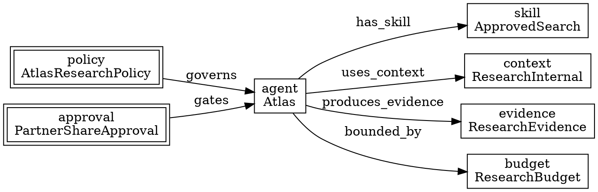

# The Nornyx Policy Model

> **Opening scenario.** Northstar's Research & Insights division has finally been told what its research assistant may do. The charter fits on an index card: Atlas may search an approved source allowlist, retrieve and summarize documents, and file summaries to an internal store; it may not publish externally, purchase anything, disclose confidential data, or invoke undeclared tools. Everyone in the room agrees with the card. Nobody can say where it lives. The retrieval allowlist is a Python constant, the "no external publishing" rule is a bullet in an instruction file, the approval requirement for partner sharing is an email thread, and the evidence expectation exists only because the auditor asked for it last quarter. This chapter turns that index card into one document that a program can read, a reviewer can diff, and a pipeline can fail on — and, just as importantly, teaches exactly how much the program does and does not do with it once the document exists.

> **Learning objectives.**
> - Name the top-level blocks of a `.nyx` contract and explain why the top level is closed while block interiors are open.
> - Declare a context with inclusion, exclusion, authority patterns, and per-channel taint, and state what the resulting trust metadata is and is not used for.
> - Describe the two policy rule verbs precisely: how deny rules are matched at planning time, and why require rules become recorded obligations rather than executed checks.
> - Wire agents, skills, harnesses, flows, and gates into a contract whose references all resolve.
> - Use `ref` to reference a canonical policy instead of copying it, and predict the failure mode for each malformed reference.
> - Read Nornyx diagnostics: severity, upper-snake code, path, and hint — including typed graph relation errors and auditability warnings.
> - Build and check a real contract end to end, and interpret a real denial and a real evidence obligation from the tool's own output.

> **Prerequisites.** Chapter 16 (what Nornyx is, and the status badges). Chapter 5 (identity, capability, authority), Chapter 6 (trust zones, context origin and taint), Chapter 7 (policy semantics, decision domains, closed schemas), Chapter 9 (approvals as bound records). This chapter assumes those concepts and shows one language's realization of them; it does not re-derive them.

## 17.1 The anatomy of a contract

A <span class="ix" data-ix="contract (.nyx)!structure">`.nyx` contract</span> is a YAML-compatible document. The choice was deliberate and is documented as such: version 0.1 "uses a YAML-compatible syntax to keep early effort focused on control-plane semantics instead of parser complexity." A dedicated parser is a stated future possibility, not a shipped one. For a reader, this means no new syntax to learn and one important hazard to remember — YAML's ambiguities are inherited along with its familiarity, a point Section 17.6 returns to with a concrete example.

The document has fifteen recognized top-level blocks **[implemented]**: `nornyx`, `project`, `constitution`, `intents`, `contexts`, `skills`, `policies`, `agents`, `harnesses`, `traces`, `evals`, `evidence`, `approvals`, `budgets`, and `goals`. Only the first two are required. Ten of them are lists of named entries; `constitution` and `evidence` are mappings; `goals` is a list keyed by `id`. A further eleven <span class="ix" data-ix="extension block">deferred extension blocks</span> — among them `graph`, `contracts`, `capabilities`, `guardrails`, `adapters`, `connectors`, and `experimental` — are tolerated by the checker but, in the language specification's words, "do not define stable v0.1 runtime behavior."

The top level is <span class="ix" data-ix="closed schema">closed</span>. All three document schemas set `additionalProperties: false` at the top level, so an unknown top-level block fails JSON-schema validation, while individual blocks remain open inside so that profiles and extensions can add fields. This is Chapter 7's closed-schema argument in its narrowest useful form: the set of *kinds of thing a contract talks about* is fixed and reviewable, while the vocabulary inside each kind can grow. The Python checker is deliberately more forgiving than the schema — an unrecognized top-level key produces the warning `UNKNOWN_TOP_LEVEL_BLOCK` rather than an error — which is a compatibility affordance, and one worth noticing rather than assuming.

Figure 17.1 groups the blocks by the question each answers, because reading a contract top to bottom is much easier once the grouping is visible.

<figure class="nx-fig" id="fig-17-1">
  <div class="fig-body">
    <div class="layers">
      <div class="layer" data-note="project · constitution · intents">Why: purpose, standing principles, and the goal the work serves</div>
      <div class="layer" data-note="contexts">What may be read: inclusion, exclusion, authority ranking, per-channel taint</div>
      <div class="layer" data-note="agents · skills">Who acts: named actors and the bounded abilities they hold</div>
      <div class="layer authority" data-note="policies">What is forbidden or required: deny and require rule atoms</div>
      <div class="layer" data-note="harnesses · evals">How work proceeds: ordered flow steps, repair loops, and gates</div>
      <div class="layer authority" data-note="approvals · budgets">Who must consent, and within what limits</div>
      <div class="layer" data-note="evidence · traces">What must be produced afterward</div>
    </div>
  </div>
  <figcaption><b>Figure 17.1 — The blocks of a contract, grouped by question.</b> Double-bordered bands mark the blocks that carry normative force — the ones a reviewer must read even when short of time. The teaching purpose is orientation: a contract is not a flat configuration file but an ordered argument from purpose, through actors and constraints, to obligations, and each band answers one of the questions Chapter 3 requires a governance boundary to answer.</figcaption>
</figure>

## 17.2 Contexts: what may be read, and how much it is trusted

A <span class="ix" data-ix="context!declared">context</span> declares the material an agent is allowed to see. Listing 17.1 is the real context from the repository's flagship example, and it is worth reading line by line because four distinct ideas are packed into eighteen lines.

```yaml
contexts:
  - name: RepoContext
    include:
      - "README.md"
      - "docs/**/*.md"
      - "nornyx/**/*.py"
      - "tests/**/*.py"
      - "examples/**/*.nyx"
    exclude:
      - "generated/**"
      - "**/.env"
    authority:
      - "docs/01_LANGUAGE_SPEC_v0_1.md"
      - "docs/05_SECURITY_MODEL.md"
      - "docs/agent/SAFE_COMMANDS.md"
      - "tests/**/*.py"
    budget:
      max_tokens: 32000
      reserve_output_tokens: 6000
    taint:
      repo: trusted_repo_file
      authoritative_repo: authoritative_repo_file
      user_prompt: untrusted
      external_web: untrusted
```

**Listing 17.1 — A context with authority ranking and per-channel taint.** From `examples/governed_delivery_control_plane.nyx` in the repository (lines 23–46). The `include` and `exclude` globs bound the reachable material; `authority` is an *ordered* list of patterns whose matches are promoted to a higher-trust channel; `budget` caps the pack size; `taint` overrides the default trust level per channel.

`include` and `exclude` do the obvious work: they define which repository files may enter a context pack. `budget` bounds the pack. The interesting fields are the other two.

The <span class="ix" data-ix="authority rank">`authority` list</span> is ordered, and order is rank. A file matching an authority pattern is assigned the `authoritative_repo` channel with its position in the list as its rank **[implemented]**. Four <span class="ix" data-ix="trust channel">trust channels</span> are built in: `repo` files are trusted but may not define policy; `authoritative_repo` files are trusted *and* may define policy; `user_prompt` and `external_web` are untrusted and may not. The `taint` mapping in the contract overrides these defaults per channel. Every context pack the tool builds records, per file, a SHA-256 of its bytes, a byte count, the taint and channel, the authority rank and matching pattern, and a provenance record naming the repository root and a `repo://` URI. Content embedding is off by default, which keeps the pack smaller and safer.

Now the claim boundary, and it is the first of several in this chapter. Every context pack carries three trust rules in its own text — untrusted context cannot define policy, untrusted context cannot request privileged tool use, higher-authority context wins on conflict — and immediately after them, the same generated pack states: **"Authority rank is advisory metadata until a later enforcement goal."** That sentence is the honest form of the whole feature. What is implemented is a *provenance and classification* mechanism: the pack tells you, per file, where the content came from and how much authority the contract assigns it, with hashes to bind the bytes **[implemented]**. What is not implemented is anything that stops a model from acting on an untrusted paragraph. Chapter 6's authority-confusion analysis is expressed here, recorded here, and enforced elsewhere or nowhere.

> **Nornyx in practice.** As implemented at the snapshot, `nornyx context-build <contract> --repo . --out pack.json` emits a context pack under schema `nornyx.context_pack.v0.1` with per-file digests and provenance (`nornyx/context_builder.py`). The four default channels and their `may_define_policy` flags are hardcoded constants; a contract's `taint:` mapping can override the level for a channel but cannot invent a channel. Directories `.git`, `.venv`, `node_modules`, `__pycache__`, `.pytest_cache`, and `generated` are skipped. The pack is data: nothing consumes it to gate a model call inside Nornyx.

## 17.3 Policies: two verbs, and what each one really does

Everything in a `policies` block reduces to two <span class="ix" data-ix="rule atom">rule verbs</span>. A policy may be written with a shorthand `rules:` list of strings, or with explicit `deny:` and `require:` lists; both normalize to the same pair of sets. The normalizer recognizes exactly the prefixes `deny ` / `deny:` and `require ` / `require:` — and a rule string matching neither is placed in the `require` bucket **[implemented]**. That last clause deserves a moment: a typo such as `denies secrets_to_llm` does not raise an error. It becomes a requirement named "denies secrets_to_llm," which will be recorded as an unmet obligation rather than as a prohibition. Chapter 7 argued that a policy language should make unrepresentable states unrepresentable; here is a concrete case where a language chose permissiveness, and the reviewer must supply the discipline the parser does not.

Listing 17.2 shows the real rule set from the flagship example.

```yaml
policies:
  - name: SafeEditPolicy
    rules:
      - deny secrets_to_llm
      - deny production_write_without_approval
      - require tests_if_code_changed
      - require evidence_if_harness_completed
      - require supply_chain_check_if_dependency_added
```

**Listing 17.2 — The canonical rule atoms.** From `examples/governed_delivery_control_plane.nyx` (lines 62–69). Each rule is a free-form token after its verb; the vocabulary is a convention among authors, not a checked enumeration.

Now the semantics, stated exactly. <span class="ix" data-ix="deny rule">Deny rules</span> are matched at planning time by a function that looks for risk-category keywords **in the rule text** and corresponding keywords **in the flow step's text** **[implemented]**. A rule containing `production` blocks steps whose text mentions production, prod, deploy, or release. A rule containing `secret` blocks steps mentioning secret, token, or credential. A rule containing `destructive` blocks delete, destroy, drop, wipe, reset, or remove. A rule containing `connector` blocks connector-kind steps. A rule containing `self_modification` or `self-modification` blocks steps whose text says the same. That is the whole matching model: five risk categories, substring-based, applied to agent steps.

Require rules are not evaluated at all. Each one is emitted into the decision report as a <span class="ix" data-ix="pending evidence obligation">pending evidence obligation</span> — literally `{"rule": …, "status": "pending_evidence"}` — attached to every agent step governed by that policy **[implemented]**. The security model documents the reason plainly: the policy runtime "is a **read-only decision manifest, not an execution engine**," and it "records decisions but does not execute agents, tools, connectors, models, repairs, arbitrary commands, or approvals."

> **Key idea.** Two verbs, two very different epistemic statuses. A deny rule produces a *decision* — coarse, keyword-driven, computed locally, and visible in a report. A require rule produces an *obligation* — a named thing that something outside Nornyx must satisfy and that something outside Nornyx must check. Reading a contract's `require` lines as if they were enforced checks is the single most likely misreading of this language, and it is the misreading a control assessment must not make. The honest sentence is: "the contract declares that test evidence is required when code changes, and the toolchain records that obligation against every governed step; whether it was met is established by the evidence pipeline of Chapter 20, not by the policy evaluator."

Two further mechanisms sit alongside the verbs. First, <span class="ix" data-ix="capability!deny-by-default">capability semantics</span>: tool, connector, and model steps are deny-by-default unless a matching declaration exists in the extension `capabilities` block (diagnostic `CAPABILITY_NOT_DECLARED`), declared capabilities default to `approval_required: true` (`CAPABILITY_APPROVAL_REQUIRED`), and connector or model steps additionally require a guardrail declaring one of `no_secrets`, `no_pii`, `schema_valid`, or `output_schema` (`GUARDRAIL_REQUIRED_FOR_EXTERNAL_USE`) **[implemented]**. Every report embeds `"default_capability_mode": "deny_unless_declared"`, which is Chapter 7's default-deny posture stated in the output rather than assumed. Second, the deny matcher runs only against steps of kind `agent`; tool, eval, and evidence steps take the capability path instead. That asymmetry is easy to trip over and worth verifying in your own contract rather than assuming.

## 17.4 Agents, skills, harnesses, and gates

The remaining structural blocks are comparatively simple, and their value lies almost entirely in *reference integrity* — the checker's insistence that every name used is a name declared.

An `agents` entry has a `name`, a free-text `role`, a list of `skills`, and one `policy`. A `skills` entry names a purpose and its declared inputs and outputs. Neither block grants anything at run time; they are declarations that other tools and humans read, and that the checker cross-validates.

A <span class="ix" data-ix="harness">`harnesses` entry</span> is the closest the language comes to a procedure. It names one `context`, an ordered `flow` of steps, an optional `repair` loop, and a `gate` list. Each flow step names a participant by kind — `agent`, `tool`, `eval`, or `evidence` — and an `action`. Listing 17.3 shows the real harness from the flagship example, including its repair loop.

```yaml
harnesses:
  - name: DevHarness
    context: RepoContext
    flow:
      - agent: Architect
        action: plan
      - agent: Builder
        action: implement
      - tool: tests
        action: run
      - eval: RegressionEval
        action: run
      - evidence: DevEvidence
        action: pack
    repair:
      - on: test_failure
        agent: Builder
        action: repair
        max_attempts: 3
    gate:
      - require: tests.pass
      - require: security.pass
      - require: human_approval_before_merge
```

**Listing 17.3 — A harness with a bounded repair loop and gates.** Abridged from `examples/governed_delivery_control_plane.nyx` (lines 89–116). The `max_attempts: 3` is Chapter 7's bounded-loop requirement expressed declaratively; the <span class="ix" data-ix="gate">`gate`</span> list names conditions that must hold, and — like `require` rules — the gate is a declaration recorded for downstream consumers, not a check the tool performs.

The `on: test_failure` line is the concrete YAML hazard promised earlier. In YAML 1.1, `on` is an implicit boolean, so a naive loader parses that key as `True` and the repair condition disappears. Nornyx's loader restricts implicit booleans to `true` and `false` only, so `on`, `off`, `yes`, and `no` remain strings **[implemented]** — a fix shipped in release 1.0.1 with a named regression test. The same loader rejects duplicate mapping keys at every nesting level, which closes a quieter version of the same failure: a second `policies:` key silently overwriting the first.

The `evidence`, `approvals`, and `budgets` blocks close the contract. `evidence` is a mapping whose `required` list names artifacts; `approvals` entries name what an approval is `required_for`; `budgets` cap tokens, cost, and runtime. In the flagship example, `HumanMergeApproval` is required for `production_deploy`, `policy_change`, and `self_modification`. Chapter 9 established what a *bound* approval record must carry — role, actor type, revision, expiry, invalidation — and this base-language form carries none of that: it names a requirement, not a record. The governance modules of Chapter 18 are what turn `approvals` entries into normalized, revision-bound, expiring records with intrinsic non-human denial. Until a module is selected, an `approvals` block is a declaration of intent **[implemented]** with the semantics of a note to the reader.

## 17.5 Referencing a policy instead of copying it

Chapter 8 argued that copying policy text down an organizational hierarchy is the obvious implementation and the wrong one. The language's answer is <span class="ix" data-ix="ref mechanism">`ref`</span> **[implemented]**, shipped in release 1.3.0. A policy may name a canonical definition rather than restate its rules:

```yaml
# org_policies.nyx — the single canonical definition
policies:
  - name: NorthstarBaseline
    rules:
      - deny secrets_to_llm
      - deny production_write_without_approval
      - require tests_if_code_changed
      - require human_approval_before_merge

# atlas.nyx — references, never copies
policies:
  - name: NorthstarBaseline
    ref: org_policies.nyx#NorthstarBaseline
```

**Listing 17.4 — Canonical policy and a reference to it.** Patterned on the bundled pair `nornyx/examples/org_policies.nyx` and `nornyx/examples/governed_service.nyx`; the version shown here is Northstar's, verified by running `nornyx check` and `nornyx generate` on it as described below. The reference form is `<path>#<PolicyName>`, and the path may be a local `.nyx` contract or a workspace manifest.

Resolution happens at load time and offline: the referenced rules are compiled into inline `rules` and the `ref` key is dropped, "so every downstream consumer — checker, generator, drift gate — sees a normal policy." Running `nornyx generate` on the referencing contract confirms it; the emitted `policy.yaml` contains the four inlined baseline rules alongside the contract's own policy, with no trace of the reference.

Resolution is fail-closed, and the failure modes are worth memorizing because they are all *errors*, not fallbacks: declaring both `ref` and `rules` on one policy; a malformed reference; a remote or device-backed source path; a missing source file; an unparseable or non-mapping source; and a named policy absent from the source. Two real transcripts make the behavior concrete:

```text
$ nornyx check atlas_ref_remote.nyx
{
  "level": "error",
  "code": "PARSE_ERROR",
  "message": "policy 'NorthstarBaseline': remote or device-backed ref sources are not allowed"
}
exit=2

$ nornyx check atlas_ref_missing.nyx
{
  "level": "error",
  "code": "PARSE_ERROR",
  "message": "policy 'NorthstarBaseline': policy 'NorthstarCharter' not found in org_policies.nyx"
}
exit=2
```

**Listing 17.5 — Fail-closed reference resolution.** Real output from Nornyx 1.11.0 against copies of Northstar's Atlas contract with, respectively, an `https://` reference source and a reference to a policy name that does not exist in the target. Both are exit code 2 — the class reserved for parse and load failures — so neither can be mistaken for a policy diagnostic, and neither degrades to an empty rule set. The remote rejection is lexical and happens before any filesystem access, which is why a network-shaped reference cannot even be attempted.

## 17.6 What the checker actually checks

The <span class="ix" data-ix="checker">checker</span> returns <span class="ix" data-ix="diagnostic code">diagnostics</span> with four fields: a level (`error` or `warning`), a code, a path into the document, and an optional hint. Codes are **upper-snake strings**, not numbers; there is no `NYX###` scheme. `nornyx check` exits 0 when clean, 1 when any error is present, and 2 on a parse failure or a malformed `--as-of` timestamp.

What is validated **[implemented]** falls into five groups. *Structure*: the required `nornyx` and `project` blocks, a project name, and the correct list-or-mapping shape of every block. *Named entries*: every list entry must be a mapping carrying a non-empty `name`, producing codes generated from the block name — `MISSING_POLICY_NAME`, `MISSING_HARNESS_NAME`, and so on. *Reference integrity*: agent to skill, agent to policy, harness to context, and harness flow steps to agents and evals. *<span class="ix" data-ix="graph relation!typing">Graph typing</span>*: when a `graph` block is present, node identifiers must be unique, edge endpoints must be declared nodes, `ref` targets must exist in the matching named block, and each edge's relation must be one of twenty-three recognized relations whose permitted source and target kinds are declared in a table. *<span class="ix" data-ix="auditability warning">Auditability</span>*: when a `contracts` block names an approval or budget that is not represented as a graph node, the checker warns rather than errors.

Listing 17.6 shows the diagnostic stream from a contract with three deliberate defects.

```text
$ nornyx check atlas_broken.nyx
{
  "level": "error",
  "code": "UNKNOWN_POLICY_REFERENCE",
  "message": "Agent Atlas references unknown policy 'AtlasRetrievalPolicy'",
  "path": "agents.Atlas.policy"
}
{
  "level": "error",
  "code": "UNKNOWN_EVAL_REFERENCE",
  "message": "Harness ResearchHarness references unknown eval 'SourceAllowlistEval'"
}
{
  "level": "warning",
  "code": "UNKNOWN_TOP_LEVEL_BLOCK",
  "message": "Unknown top-level block: monitoring",
  "path": "monitoring",
  "hint": "Keep experimental blocks under `experimental:` until the spec stabilizes."
}
exit=1
```

**Listing 17.6 — Three defects, three severities of consequence.** Real output from Nornyx 1.11.0 on a copy of Northstar's Atlas contract with the agent's policy renamed, the harness's eval renamed, and an invented `monitoring:` block appended. The two dangling references are errors because they make the document self-inconsistent; the unknown block is a warning because forward compatibility matters more than strictness at the top level. The run exits 1 — a CI gate on this contract fails, and the report tells the author precisely which two names to fix.

The typed graph relations deserve their own demonstration, because they are the mechanism by which a contract's identity and capability structure becomes checkable rather than merely drawn. Figure 17.2 is Atlas's relation graph, and every edge in it is an edge the checker validates.



**Figure 17.2 — Atlas's identity and capability relations, as the checker types them.** Double borders mark the normative endpoints — the policy that governs and the approval that gates. Each labelled edge is one of twenty-three relations whose permitted source and target kinds are fixed: `governs` runs from a policy to an agent, harness, adapter, connector, or goal; `has_skill` runs only from an agent to a skill; `gated_by` and `gates` are the two directions of the approval relation. The teaching purpose is that a relation type is a *type*, so drawing the wrong arrow is a compile-time defect rather than a documentation defect.

Verifying that claim takes one edit. Changing the `has_skill` edge to `governs` — an arrow that reads plausibly in English — produces:

```text
{
  "level": "error",
  "code": "INVALID_GRAPH_RELATION_PAIR",
  "message": "Relation 'governs' does not match 'agent' -> 'skill'",
  "path": "graph.edges[1].relation",
  "hint": "Use a relation whose source and target kinds match the declared graph nodes."
}
```

whereas inventing a relation named `supervises` produces only `UNKNOWN_GRAPH_RELATION` as a warning, and the check passes. That asymmetry is a design choice with a rationale — an unknown relation may belong to a profile or adapter contract, whereas a known relation used with the wrong kinds is a definite mistake — and it is exactly the kind of detail a reviewer must know before treating a green check as a strong signal.

## 17.7 Worked example: Atlas as a checkable contract

We can now build the index card from the opening scenario into a real document. The full contract runs to about a hundred lines; Listing 17.7 shows the parts that carry the governance, and the whole file was verified by running the tool.

```yaml
nornyx: "0.1"
project:
  name: AtlasResearchAssistant
  description: "Northstar Research & Insights controlled research assistant."

contexts:
  - name: ResearchInternal
    include: ["sources/approved/**/*.md", "briefs/**/*.md"]
    exclude: ["**/.env", "customer_data/**"]
    authority: ["policy/RESEARCH_CHARTER.md"]
    taint:
      repo: trusted_repo_file
      authoritative_repo: authoritative_repo_file
      user_prompt: untrusted
      external_web: untrusted

policies:
  - name: AtlasResearchPolicy
    rules:
      - deny secrets_to_llm
      - deny production_write_without_approval
      - deny destructive_store_operations
      - require approved_source_for_retrieval
      - require evidence_if_brief_filed
      - require human_approval_before_external_share

agents:
  - name: Atlas
    role: "Retrieve and summarize approved sources; file briefs internally."
    skills: [ApprovedSearch, Summarize, FileInternal]
    policy: AtlasResearchPolicy

harnesses:
  - name: ResearchHarness
    context: ResearchInternal
    flow:
      - agent: Atlas
        action: search
      - agent: Atlas
        action: summarize
      - eval: SourceAllowlistEval
        action: run
      - agent: Atlas
        action: file_internal
      - evidence: ResearchEvidence
        action: pack
    gate:
      - require: sources.approved
      - require: evidence.packed
      - require: human_approval_before_external_share

evidence:
  required: [retrieved_sources.json, brief.md, source_allowlist_report.json, approval_log.json]

approvals:
  - name: PartnerShareApproval
    required_for: [external_share, policy_change]

budgets:
  - name: ResearchBudget
    max_tokens: 60000
    max_cost_usd: 8
    max_runtime_minutes: 20
```

**Listing 17.7 — Northstar's Atlas contract (governance-bearing blocks).** Written for this book and verified against Nornyx 1.11.0: `nornyx check` reports "Nornyx check passed" with exit code 0. The full file additionally declares a `constitution`, an `intents` entry, three `skills` entries, and the `SourceAllowlistEval` referenced by the harness. Compare it with the index card: the allowlist is a context; "no external publishing" is a deny rule plus an approval; the evidence expectation is a block; the partner-share approval is a named requirement rather than an email thread.

Two runs make the semantics of Section 17.3 concrete. First, the intended flow. Running `nornyx policy-check atlas.nyx --harness ResearchHarness` produces a report under schema `nornyx.policy_report.v0.1` whose summary reads `{"allowed": 0, "planned": 5, "blocked": 0, "requires_human_approval": 0, "pending_evidence": 9}`. Every step is *planned*, never *allowed*, and the report carries a safety block asserting `tools_executed: false`, `connectors_enabled: false`, `models_called: false`, `agents_executed: false`, `arbitrary_commands_allowed: false`. The nine pending-evidence entries are the three require rules replicated across the three Atlas steps — the obligation is per step, not per contract.

Second, the denial. The case-study bible's signature scene is Atlas being asked to post a summary externally. Adding a sixth flow step, `agent: Atlas` with `action: publish_release_brief`, produces:

```text
{
  "index": 5,
  "kind": "agent",
  "ref": "Atlas",
  "action": "publish_release_brief",
  "status": "blocked",
  "code": "POLICY_DENY_MATCHED",
  "policy": "AtlasResearchPolicy",
  "denied_by": ["production_write_without_approval"],
  "reason": "Agent step matches a deny policy rule."
}
```

**Listing 17.8 — A real denial, and an honest reading of it.** Real output from `nornyx policy-check` on the Atlas contract with a publishing step added; the run's summary changes to `"blocked": 1`. The denial fired because the rule token contains `production` and the step text contains `release` — a *risk-category* match, not a match on the rule's full name. Nothing in the toolchain understands "publishing a brief"; it recognizes a step that smells like a production-class action under a policy that forbids production-class actions without approval.

That last sentence is the chapter's most important lesson, so it is worth stating as a general principle rather than a Nornyx fact. When a governance tool returns a decision, ask what the decision was actually computed *from*. Here the answer is: from five hardcoded keyword families applied to concatenated step text. That is a real, deterministic, reviewable computation, and it is far weaker than the natural-language reading of `deny production_write_without_approval` suggests. Both readings can be true of the same green report, and only one of them is a claim you may put in front of an auditor.

> **Assurance boundary.** Applying the eight questions to Listing 17.8: *what is guaranteed* — that a declared flow step whose text matches a declared deny category is reported as blocked in a local planning manifest; *which component enforces it* — none, in the sense of prevention; the report is advisory output consumed by CI or a human; *what evidence proves it* — the report file, deterministic given the contract; *what assumptions are required* — that the actual agent's actions correspond to the declared flow steps, which nothing verifies; *how it can be bypassed* — by taking an action the flow never declared, which is the normal case for a probabilistic planner; *what happens on failure* — the tool exits nonzero or writes a report, and blocks nothing itself; *which tier* — Tier 1; *what remains unproven* — everything about what the agent actually did. Chapters 19, 20, and 22–25 are where a subset of these answers improves.

> **Case study — Atlas.** Atlas's charter is now one file, and three things changed the moment it became one. The retrieval allowlist stopped being a Python constant and became a context whose patterns a reviewer can diff. The partner-share requirement stopped being an email thread and became `PartnerShareApproval`, `required_for: [external_share, policy_change]` — still only a declaration at this layer, but a declaration with a name that other artifacts can reference and that Chapter 18's governance modules can promote into a revision-bound, expiring record. And the evidence expectation stopped being something the auditor remembered to ask for and became four named artifacts that the harness's final step must pack. What has *not* changed is the enforcement position: nothing here prevents Atlas from doing anything. Chapter 20 records what it did; Chapter 36 reconstructs the partner-share decision from that record.

## Summary

A `.nyx` contract is a YAML-compatible document with a closed set of fifteen top-level blocks and open interiors, organized as an argument from purpose through actors and constraints to obligations. Contexts bound what may be read and attach ordered authority ranking and per-channel taint, producing hashed provenance metadata that the tool itself describes as advisory until a later enforcement goal. Policies reduce to two verbs with sharply different meanings: deny rules are evaluated at planning time by a coarse, five-category keyword matcher over agent flow steps, while require rules are never evaluated at all and instead become named pending-evidence obligations recorded against every governed step. Agents, skills, harnesses, gates, evidence, approvals, and budgets are declarations whose principal enforced property is reference integrity. The `ref` mechanism replaces copying with a fail-closed, offline, local-only reference. The checker reports upper-snake diagnostics with paths and hints, errors on dangling references and mistyped graph relations, and warns on unknown blocks, unknown relations, and unrepresented approvals and budgets. Northstar's Atlas contract, built and run in this chapter, demonstrates all of it — including a real denial whose true basis is narrower than its name suggests.

- Fifteen top-level blocks; closed at the top, open inside; unknown blocks warn rather than fail.
- Contexts declare origin and trust; the trust metadata is provenance, not prevention.
- `deny` decides coarsely; `require` obliges and defers. Do not read the second as the first.
- Unrecognized rule prefixes silently become requirements — review, do not trust the parser here.
- Graph relations are typed: the wrong arrow is an error, an unknown arrow is a warning.
- `ref` fails closed on every malformed form, including remote paths rejected before filesystem access.

## Review questions

1. A contract declares `policies: [{name: P, rules: ["deny secrets_to_llm", "block external_publish"]}]`. State precisely what the normalizer produces, and what the policy evaluator will do with each of the two entries.
2. Explain why `deny production_write_without_approval` blocked a step whose action was `publish_release_brief`. Then construct a step name that a security reviewer would consider dangerous but that this rule would *not* block, and say what that tells you about coverage.
3. Contrast the checker's treatment of an unknown top-level block, an unknown graph relation, and a graph relation used with the wrong endpoint kinds. Give the severity of each and a one-sentence justification for the difference.
4. The context pack states that "authority rank is advisory metadata until a later enforcement goal." Rewrite the claim "our contract prevents untrusted web content from defining policy" into a form that is true at this layer, and name the component that would have to exist for the original claim to become true.
5. A team writes `ref: ../governance/policies.nyx#Baseline` and the file does not exist. Predict the exit code and the diagnostic class, and explain why this design is preferable to resolving the reference to an empty rule set.
6. Why is per-step replication of pending-evidence obligations (nine entries for three rules across three steps) more useful to an auditor than a single contract-level list? Give one case where it is also misleading.

## Exercises

1. **Build a contract for Forge.** Using Listing 17.7 as a model and the Forge charter from Chapter 1 (read the repository, propose changes on branches, run tests, open pull requests; approvals required for merges, deployments, releases, secrets, destructive changes, and edits under `auth/` or `crypto/`), write a `.nyx` contract that passes `nornyx check` with exit 0. Then add a flow step you expect to be denied, run `nornyx policy-check`, and record whether your expectation was correct. If the denial did not fire, diagnose why using Section 17.3's matching rules and state what a stronger enforcement layer would have to inspect instead.
2. **Break it deliberately.** Take your Forge contract and introduce, one at a time: a dangling policy reference, a duplicate `policies:` key, a `- on: merge_failure` repair condition, a graph edge with mismatched endpoint kinds, and an unknown top-level block. For each, record the exact code, level, path, and exit code, and classify the failure as caught-as-error, caught-as-warning, or not caught. Present the results as a table and write two sentences on what the not-caught row means for review practice.
3. **Reference instead of copy.** Create an `org_policies.nyx` holding a Northstar baseline policy and two contracts that reference it. Verify with `nornyx generate` that the rules are inlined into each `policy.yaml`. Then edit the canonical file and regenerate both, confirming that neither referencing contract changed. Finally, point one reference at a nonexistent policy name and record the failure. Write one paragraph relating what you observed to Chapter 8's argument that composition turns an archaeology question into a computation.

## Further reading

- [@nornyx-repo] — read `examples/governed_delivery_control_plane.nyx` alongside `docs/01_LANGUAGE_SPEC_v0_1.md` and `docs/05_SECURITY_MODEL.md`; the three together are the primary sources for this chapter.
- [@opa] — Rego's expression language shows what a richer rule vocabulary buys and costs; the contrast with five keyword families is instructive in both directions.
- [@cedar] — a policy language designed for analyzability; useful for imagining what a checkable, non-keyword rule atom would look like in a contract language.
- [@greshake-injection] — the empirical basis for taking context taint seriously, and therefore for reading Section 17.2's "advisory metadata" caveat as a real gap rather than a formality.
- [@schneider-enforceable] — the theory of which security policies are enforceable by execution monitoring; the right lens for the deny-versus-require asymmetry in Section 17.3.
