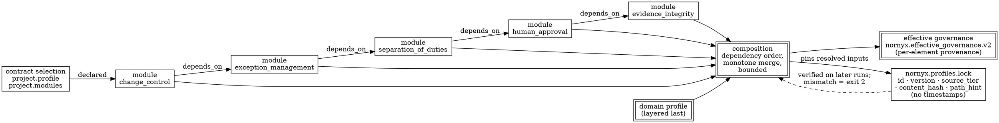

# Profiles, Modules, Locks, and Digests

> **Opening scenario.** Northstar's Risk & Audit division has published its charter policy, and the Charter programme is six weeks into rolling it out. The current mechanism is a wiki page and good intentions. Two things go wrong in the same sprint. A Treasury repository's contract quietly loses a required-evidence line during a refactor, and nobody notices because the repository's own checks stay green. And when the platform team tries to demonstrate that a reviewed contract is the one in effect, they find they cannot: the contract has been edited eleven times since review, the generated artifacts were regenerated by three different people, and no artifact in the repository records which version of the organizational rules was applied. The charter is not weak. It is unbound — there is nothing that ties today's files to yesterday's review. This chapter is about the two mechanisms that close that gap: composing governance from versioned packs with per-element provenance, and binding the result with locks whose digests make "unchanged" a computable property.

> **Learning objectives.**
> - Distinguish a domain profile from a governance module, and state what each contributes to a composed governance model.
> - Trace composition as it is implemented: dependency ordering, monotone merge, provenance stamping, and the closed effective-governance output.
> - Explain what the profiles lock binds, why it contains no timestamps, and which commands verify it with which exit codes.
> - Describe exactly what the agentic-network lock binds — nine classes of content — and read the `AN_LOCK_*` diagnostic family.
> - State precisely what a lock does *not* prove, and name the control that must cover the remainder.
> - Reproduce a generate–lock–tamper–verify cycle and interpret each diagnostic it produces.

> **Prerequisites.** Chapter 17 (the contract language and the checker). Chapter 8 (composition operations, silent weakening, provenance, canonicalization, deterministic composition) is the conceptual foundation and is assumed throughout; this chapter shows one implementation of it. Chapter 12 (integrity, content addressing, locks as binding structures) supplies the digest vocabulary. Chapter 16 supplies the status badges.

## 18.1 Profiles and modules

A `.nyx` contract written from scratch, as in Chapter 17, expresses one team's governance. Organizations need reusable governance that many contracts share, and Nornyx supplies two kinds of reusable pack **[implemented]**.

A <span class="ix" data-ix="domain profile">domain profile</span> is a starting posture for a class of work. Thirteen ship as built-ins: `minimal`, `standard`, `ai_coding`, `regulated`, `legacy_upgrade`, `nornyx_language`, `agentic_repo_harness`, `telecom_ops`, `business_ops`, `ai_governance`, `finance_ops`, `architecture_governance`, and `agentic_network`. A profile carries starter fragments — the skeleton `nornyx init` renders into a checkable document — along with validation rules, compatibility metadata, provenance, an integrity hash, and, notably, a declared list of `non_goals`. The projection guarantee is explicit: profiles never add mandatory core concepts, and they always declare non-goals blocking "live agent runtime," "automatic approvals," and "production deployment."

A <span class="ix" data-ix="governance module">governance module</span> is a single control concern packaged for reuse. Seven ship as built-ins: `evidence_integrity`, `human_approval`, `separation_of_duties`, `exception_management`, `change_control`, `architecture_conformance`, and `agentic_network_governance`. (The first six are the foundational set frozen under an architecture decision record; the seventh was added later under the agentic-network track.) A module declares dependencies on other modules, conflicts, required top-level blocks, JSON-schema identifiers for those blocks, structural check identifiers, policies, evidence requirements, approval requirements, evaluations, rules, non-goals, provenance, and a content hash. Listing 18.1 is the whole of one of them, and it is short enough to read completely.

```yaml
schema: nornyx.governance_module.v1
kind: module
id: nornyx.builtin.module.evidence_integrity
name: evidence_integrity
version: 1.0.0
compatible_core: ">=0.2 <=1.0"
dependencies: []
required_blocks:
  - governance_evidence
block_schemas:
  - block: governance_evidence
    schema_id: https://nornyx.dev/schemas/governance_evidence_v1.schema.json
structural_checks:
  - evidence_integrity.v1
policies:
  - id: evidence_integrity_policy
    description: Evidence must be local, revision-bound, fresh, and content-hashed.
    deny: [evidence substitution, unbound evidence, stale evidence]
    require: [local artifact hash verification, explicit validation time]
rules:
  - id: EVI-001
    description: A governance evidence set must contain at least one record.
    require:
      - path: governance_evidence.records
        min_count: 1
    severity: error
non_goals:
  - proving that evidence claims are true
  - executing evidence producers or external tools
  - network retrieval of artifacts
integrity:
  algorithm: sha256
  content_hash: sha256:460d9ca1ad53f634a2f7a344d7a8f3809546c49c78ee564e6b5bc466b8bb9ef8
```

**Listing 18.1 — A governance module in full.** Abridged from `nornyx/profiles_data/module_evidence_integrity.yaml` in the repository; the omitted fields are `conflicts`, `evidence_requirements`, `evaluations`, `approval_requirements`, `provenance`, and a `safety` block asserting the pack is data-only, local-only, and cannot grant approval or weaken core safety. Three features generalize beyond Nornyx: the module names its own *non-goals* alongside its rules; its rules address structured paths (`governance_evidence.records`) rather than free text, which is what makes them checkable; and it carries a content hash of itself, which is what makes it lockable.

Selecting a module is not free, and that is the point. A module's <span class="ix" data-ix="required block">`required_blocks`</span> become obligations on any contract that selects it. Adding `evidence_integrity` to a contract means the contract must now carry a `governance_evidence` block conforming to a closed schema, with at least one record, each record naming a producer, an artifact path, a SHA-256 content hash, a subject revision, a tool and version, generation and expiry timestamps, a status, and its dependencies. This is the mechanism by which reusable governance becomes binding rather than decorative: you cannot select the module and skip the work.

> **Nornyx in practice.** As implemented at the snapshot, `nornyx profiles list --json` and `nornyx modules list --json` enumerate the built-in packs with identities, versions, dependency lists, source tiers, and content hashes. Project-local packs are discovered first, under `.nornyx/profiles/` and `.nornyx/modules/` relative to the contract, then built-ins. A contract selects them in its `project` block: `profile: regulated` and a `modules:` list. An unresolvable `project.profile` degrades to a `PACK_NOT_RESOLVED` warning for backward compatibility, but an explicitly selected module that cannot be resolved is fail-closed.

## 18.2 Composition as implemented

Chapter 8 developed composition abstractly: merge, override, narrow, precedence, monotonicity, provenance, determinism. The implementation makes a small number of concrete choices, each of which corresponds to one of those abstractions.

*<span class="ix" data-ix="dependency ordering">Ordering is by dependency</span>, not by declaration.* Modules are topologically ordered by their declared dependencies and composed first; the domain profile is layered last. Verifying this takes one experiment. Northstar's Charter contract selects exactly one module — `change_control` — and composing it yields five, in this order: `evidence_integrity`, `human_approval`, `separation_of_duties`, `exception_management`, `change_control`. That is the transitive closure of the dependency chain `change_control → exception_management → separation_of_duties → human_approval → evidence_integrity`, emitted in dependency order. Selecting one control concern pulled in four more, because the repository's authors decided that change control without separation of duties, or approval without evidence integrity, is not a control at all.

*<span class="ix" data-ix="monotonicity!in composition">Merge is monotone</span>; conflicts are errors.* Fields merge by ordered union. Deny and require lists union with strict canonical-string checks. A conflicting scalar field does not resolve by precedence — it raises `PACK_MONOTONICITY_CONFLICT`. Declared conflicts between selected packs abort composition with `PACK_DECLARED_CONFLICT`. This is Chapter 8's Table 8.1 realized: liberal where the operation is monotone, hard-failing where it is not.

*Bounds are explicit.* Composition caps at 2,000 rules, 64 block schemas, and 64 structural checks, with a per-pack cap of 200 rules and duplicate in-pack identifiers fatal. Bounded resolution is what makes composition a terminating, predictable computation rather than a place where a hostile or careless pack can degrade the toolchain.

*Every element carries <span class="ix" data-ix="provenance!per element">provenance</span>.* Each composed element is stamped, as it is merged, with its kind, its identifier, the contributing pack's identity and version, the layer (`module` or `profile`), and the pack's own provenance record: author, source tier, source revision, source path. <span class="ix" data-ix="source tier">Source tiers</span> are `builtin`, `project`, `org`, and `explicit_path`, and the tier is policy-relevant — composing any organization-tier pack without a committed profiles lock fails with `PACK_LOCK_REQUIRED`.

*The output is a closed <span class="ix" data-ix="effective governance">effective-governance</span> document.* The composed result is emitted under the schema `nornyx.effective_governance.v2` with fifteen required keys: `schema`, `profile`, `modules`, `required_blocks`, `block_schemas`, `structural_checks`, `policies`, `evidence_requirements`, `approval_requirements`, `evaluations`, `rules`, `non_goals`, `starter_fragments`, `provenance`, and `diagnostics`. Figure 18.1 shows the whole pipeline.



**Figure 18.1 — Composition and the lock that closes the loop.** A single declared module drags in its transitive dependencies, which are composed in dependency order before the profile is layered last. The dashed edge is the teaching point: the lock is not a record of what happened, it is an input to the next run's verification, and its absence is the difference between "we composed some governance" and "we composed the reviewed governance."

## 18.3 The profiles lock

The <span class="ix" data-ix="lock!profiles">profiles lock</span> is deliberately minimal. Listing 18.2 shows a real one, produced from Northstar's Charter contract.

```json
{
  "schema": "nornyx.profiles_lock.v1",
  "resolved": [
    {
      "id": "nornyx.builtin.minimal",
      "version": "1.0.0",
      "source_tier": "builtin",
      "content_hash": "sha256:2b08dbec6eac447f1c23da001be914668072fd9c53ffa85165154d1743c52008",
      "path_hint": "nornyx/profiles_data/minimal.yaml"
    },
    {
      "id": "nornyx.builtin.module.change_control",
      "version": "1.0.0",
      "source_tier": "builtin",
      "content_hash": "sha256:2af7bc5bff3da1111da4cb35a53aa792cd20a9fcc550e351398d138b05e454b4",
      "path_hint": "nornyx/profiles_data/module_change_control.yaml"
    }
  ]
}
```

**Listing 18.2 — A profiles lock (two of six entries).** Real output written to `/tmp` during the preparation of this chapter by composing `examples/governance_foundations.nyx` and writing the lock through the public governance API; the full file contains six entries — one profile and five modules — sorted by identifier. The schema is `schemas/profiles_lock_v1.schema.json`, whose own comment states the design rule: "Time fields are absent so identical resolution inputs produce byte-identical locks."

Five properties of that file matter. It is **closed** — `additionalProperties: false` at both levels, so nothing extra can be smuggled in. It is **timestamp-free**, which is what makes byte-identical reproduction possible and is the single most commonly violated rule in home-grown lock formats. It records the **source tier** alongside the hash, so the lock itself distinguishes a built-in pack from an organizational one. It records a **path hint** rather than a path used for resolution, because resolution is by identity and the path is a diagnostic aid. And it is **bounded**: 512 KiB, strict UTF-8 JSON, duplicate keys rejected at every nesting level.

<span class="ix" data-ix="lock verification">Verification behavior</span> is worth stating precisely, because it differs by command. When a lock is present, `nornyx check`, `nornyx governance ...`, and `nornyx profiles resolve` all verify it, and none of them ever rewrites it. The mismatch codes are `PACK_LOCK_MISMATCH` (a content hash differs), `PACK_LOCK_SET_MISMATCH` (the resolved set differs), `PACK_LOCK_DUPLICATE_ID`, and `PACK_LOCK_INVALID`. The governance-surface exit-code contract reserves code 2 for "governance lock path, encoding, JSON, schema, set, hash, or semantic validation failure."

Listing 18.3 shows what tampering actually produces.

```text
$ nornyx governance resolve charter.nyx
PACK_LOCK_MISMATCH: nornyx.builtin.module.human_approval content_hash mismatch:
  lock='sha256:0000000000000000000000000000000000000000000000000000000000000000',
  resolved='sha256:8bc640928cba203cbdd2dba2d4f0eb3e4fabb5377f4c9d6821bd7624b7d34e46'.
exit=2

$ nornyx check charter.nyx
{ "level": "warning", "code": "UNKNOWN_TOP_LEVEL_BLOCK", "path": "governance_evidence", ... }
{ "level": "warning", "code": "UNKNOWN_TOP_LEVEL_BLOCK", "path": "changes", ... }
{ "level": "warning", "code": "UNKNOWN_TOP_LEVEL_BLOCK", "path": "separation_of_duties", ... }
{ "level": "warning", "code": "UNKNOWN_TOP_LEVEL_BLOCK", "path": "exceptions", ... }
{ "level": "error", "code": "PACK_LOCK_MISMATCH", "message": "…", "source_id": "…human_approval" }
exit=1
```

**Listing 18.3 — One tampered hash, two exit codes.** Real output from Nornyx 1.11.0 after replacing one module's `content_hash` with zeros in a lock file under `/tmp`. Both runs detect the tampering. `nornyx governance resolve` returns the reserved lock-failure exit code 2; `nornyx check` folds the lock diagnostic into its general error stream and returns 1. The four warnings in the second run are a second-order effect worth understanding: `check` normally suppresses `UNKNOWN_TOP_LEVEL_BLOCK` for blocks that a selected module contributes, but because composition aborted on the lock failure it no longer knows which blocks those are. A pipeline that gates on "exit code equals 2" would miss the tampering when it runs `check`; a pipeline that gates on "exit code is nonzero" catches both. This is a real and easily missed distinction, and it is the kind of thing an assurance review is for.

> **Design checkpoint.** Before adopting any lock mechanism, answer four questions in writing. Which commands verify the lock, and which merely read it? What exit code does each return on mismatch, and does your pipeline distinguish them? Can any command *rewrite* the lock as a side effect of an ordinary run — and if so, how would you notice? And what is the review procedure when a lock diff appears in a pull request, given that a legitimate upgrade and a hostile regeneration produce diffs of the same shape?

## 18.4 The agentic-network lock

The profiles lock binds the governance packs a contract composed. The <span class="ix" data-ix="lock!agentic-network">agentic-network lock</span> is a much larger binding structure and the flagship of the design: it binds the contract, the composition, the generated artifacts, and the evidence schema into a single content-addressed statement. Its schema is `nornyx.agentic_network_lock.v1`; both `lock_format_version` and `generation_format_version` are pinned to the constant `"1.0"`.

The lock binds nine classes of content **[implemented]**:

1. `source_contract_digest` — a SHA-256 over the canonical governed-content view of the parsed contract, stable under formatting and keyed-record reordering and changed by any semantic edit;
2. `network_id` and `subject_revision` — where the revision must be an immutable content-addressed identifier (a full Git object identifier or a SHA-256 digest), not a branch name; a mutable revision fails the build with `AN_LOCK_REVISION_MUTABLE`;
3. `profile` and `modules` — pack identity, name, version, and content hash for each;
4. `block_schemas` and `structural_checks` — the composed schema identifiers and check identifiers;
5. `runtime_events_schema` — the identifier and minor version of the evidence event schema;
6. `protocol_declarations` — per declared protocol target, its identifier, protocol, version label, and `execution_mode`;
7. `records` — a sorted list of per-record digests for every agent identity, capability, trust zone, membership, network gate, protocol target, delegation, handoff, relation, and revocation;
8. `approval_requirements` and `evidence_requirements` — the sorted requirement references from the composition;
9. `artifacts` — a `{path, sha256}` entry for every generated artifact, with paths constrained to basenames so no directory separator can appear.

Figure 18.2 shows what that means structurally: the lock is a fan-in, and every input reaches it.

<figure class="nx-fig" id="fig-18-2">
  <div class="fig-body">
    <div class="flow-col">
      <div class="flow"><div class="node">.nyx contract</div><div class="arr">→</div><div class="node">canonical governed-content view</div><div class="arr">→</div><div class="node">source_contract_digest</div></div>
      <div class="flow"><div class="node">profile + modules</div><div class="arr">→</div><div class="node">pack content hashes</div><div class="arr">→</div><div class="node">profile / modules entries</div></div>
      <div class="flow"><div class="node">declared records</div><div class="arr">→</div><div class="node">per-record canonical digests</div><div class="arr">→</div><div class="node">records map (10 collections)</div></div>
      <div class="flow"><div class="node">10 generated artifacts</div><div class="arr">→</div><div class="node">file SHA-256</div><div class="arr">→</div><div class="node">artifacts list</div></div>
      <div class="flow"><div class="node">evidence schema version</div><div class="arr">→</div><div class="node">selected by the lock</div><div class="arr">→</div><div class="node">runtime_events_schema</div></div>
    </div>
  </div>
  <figcaption><b>Figure 18.2 — What the agentic-network lock binds.</b> Five independent input classes converge on one closed document, each reduced to a digest by a canonicalization step. The teaching purpose is to make the *scope* of a lock explicit before reasoning about its guarantees: anything on the left of this figure is bound, and — critically — anything not on the figure is not. Runtime behavior, producer identity, and the wisdom of the contract are all absent.</figcaption>
</figure>

Lock verification compares field by field with a dedicated diagnostic per field, which is what makes a failure diagnosable rather than merely red. The family includes `AN_LOCK_NETWORK_MISMATCH`, `AN_LOCK_REVISION_MISMATCH`, `AN_LOCK_REVISION_MUTABLE`, `AN_LOCK_SOURCE_STALE`, `AN_LOCK_PROFILE_MISMATCH`, `AN_LOCK_MODULE_MISMATCH`, `AN_LOCK_SCHEMA_MISMATCH`, `AN_LOCK_CHECKS_MISMATCH`, `AN_LOCK_PROTOCOL_MISMATCH`, `AN_LOCK_APPROVAL_MISMATCH`, `AN_LOCK_EVIDENCE_MISMATCH`, `AN_LOCK_RECORD_MISMATCH`, `AN_LOCK_FORMAT_MISMATCH`, `AN_LOCK_ARTIFACT_MISMATCH`, `AN_LOCK_ARTIFACT_MISSING`, `AN_LOCK_ARTIFACT_UNEXPECTED`, and `AN_LOCK_MALFORMED`.

## 18.5 Determinism mechanics

None of Section 18.4 works unless generation is deterministic, so the mechanisms deserve to be named individually. Four carry the weight.

*<span class="ix" data-ix="determinism!newline normalization">Line-feed newlines</span> are forced on every write*, so output is byte-identical across platforms. This sounds trivial until a Windows contributor's checkout produces a full-file diff on every artifact and the team disables the drift gate.

*Keys are sorted and separators are compact.* <span class="ix" data-ix="canonicalization!agentic artifacts">Canonical bytes</span> for agentic content are JSON serialized with sorted keys, compact separators, and no ASCII escaping, digested as `sha256:<hex>`; rendered artifacts are sorted, two-space-indented JSON with a trailing newline. Keyed record collections are sorted before digesting, which is what makes the contract digest stable under reordering.

*<span class="ix" data-ix="timestamp-free artifact">No timestamps</span> appear in generated artifacts or locks.* This is stated in the profiles-lock schema and realized in the agentic artifacts, and it is the property that makes "regenerate and compare" a usable test.

*<span class="ix" data-ix="validation instant">`--as-of` affects only the validation instant</span>.* This one repays a careful demonstration, because it is the mechanism most likely to be misunderstood. The flag supplies the timestamp against which freshness, validity intervals, and expiry are evaluated; it never enters an artifact. Two runs of `nornyx agentic-network generate` on the bundled support example — one at `--as-of 2026-07-17T00:00:00Z`, one at `--as-of 2026-07-20T09:31:44Z` — produce byte-identical directories under `diff -r`. But a run at `--as-of 2026-08-03T00:00:00Z` produces this instead:

```text
$ nornyx agentic-network generate support_network.nyx --out gen2 --as-of 2026-08-03T00:00:00Z
AN_APPROVAL_EXPIRED: Approval evidence is expired or stale.
EVIDENCE_STALE: Evidence is stale or has an invalid freshness interval.
EVIDENCE_STALE: Evidence is stale or has an invalid freshness interval.
EVIDENCE_STALE: Evidence is stale or has an invalid freshness interval.
EVIDENCE_STALE: Evidence is stale or has an invalid freshness interval.
APPROVAL_EXPIRED: Approval has expired.
exit=1
```

**Listing 18.4 — The validation instant is not a build input.** Real output from Nornyx 1.11.0 against a copy of `examples/agentic_network_support/support_network.nyx` under `/tmp`. The example's approval and evidence records expire on 2026-07-24; evaluated three days earlier they are valid and generation succeeds, evaluated ten days later they are not and generation refuses. The artifacts are identical in the two successful cases because they contain no time. The general principle: separate the *instant a claim is evaluated at* from the *content the claim is about*, and never let the first leak into the second. Chapter 20 relies on the same separation for evidence, and a malformed or timezone-naive `--as-of` fails closed with `AS_OF_INVALID` and exit code 2 rather than silently falling back to the system clock.

## 18.6 Worked example: generate, lock, tamper, verify

Everything above can be exercised in about five minutes against a bundled example. The transcripts below were produced in a scratch directory under `/tmp` holding a copy of `examples/agentic_network_support/`.

Generation emits exactly ten files — nine declarations plus a generation manifest:

```text
$ nornyx agentic-network generate support_network.nyx --out gen --as-of 2026-07-17T00:00:00Z
{
  "status": "pass",
  "out": "gen",
  "artifact_count": 10,
  "artifacts": ["a2a_declaration.json", "agentic_generation_manifest.json",
    "capability_matrix.json", "delegation_policy_bundle.json", "handoff_manifest.json",
    "identity_manifest.json", "mcp_capability_declaration.json", "network_manifest.json",
    "runtime_evidence_contract.json", "trust_zone_map.json"]
}

$ nornyx agentic-network lock support_network.nyx --artifacts gen --as-of 2026-07-17T00:00:00Z
{"status": "pass", "lock_path": "nornyx.agentic_network.lock",
 "lock_digest": "sha256:fe71adc9e8641330f5c08e7871feab33842db31efd292aca2186e4baefce7a30",
 "artifact_count": 10}

$ nornyx agentic-network lock-check support_network.nyx --artifacts gen --as-of 2026-07-17T00:00:00Z
{"schema": "nornyx.agentic_network_lock_check.v1", "status": "pass",
 "lock_digest": "sha256:fe71adc9e8641330f5c08e7871feab33842db31efd292aca2186e4baefce7a30",
 "diagnostics": []}
```

**Listing 18.5 — The clean cycle.** Real transcripts, abridged only by reflowing long lines. The lock is written only if verification of the freshly built payload against the on-disk artifacts passes, so a `lock` that succeeds has already proved its own consistency.

Now three tampering experiments, each isolating a different binding.

**Tamper one: edit a generated artifact.** Removing three categories from the `never_share` list inside `gen/trust_zone_map.json` — the sort of "cleanup" a well-meaning script might perform — yields exactly one diagnostic:

```text
{"level": "error", "code": "AN_LOCK_ARTIFACT_MISMATCH",
 "message": "On-disk artifact 'trust_zone_map.json' does not match the locked hash.",
 "path": "artifacts.trust_zone_map.json"}
exit=1
```

**Tamper two: edit the contract, leave artifacts and lock alone.** Changing one delegation's `purpose` string — a semantic edit with no security significance whatever — produces twelve diagnostics:

```text
AN_LOCK_ARTIFACT_MISMATCH  × 10   (one per generated artifact; "Locked artifact hash
                                   for 'X' does not match the regenerated artifact.")
AN_LOCK_RECORD_MISMATCH           ("Locked delegations digests do not match the
                                   current contract records.", path records.delegations)
AN_LOCK_SOURCE_STALE              ("Lock field 'source_contract_digest' does not match
                                   the current contract state.")
exit=1
```

**Listing 18.6 — Two tampers, two very different diagnostic shapes.** Real output from Nornyx 1.11.0. The first case touches one file and reports one mismatch; the second touches the source and cascades. The cascade is not noise — every generated artifact embeds the contract digest, so a source edit invalidates all ten, and the three diagnostic families together let a reviewer localize the change: `SOURCE_STALE` says the contract moved, `RECORD_MISMATCH` says *which collection* moved, and the artifact mismatches say the outputs were not regenerated. A single "lock invalid" boolean would have carried none of that.

**Tamper three, and the important one: regenerate everything.** Leave the edited contract in place, regenerate the artifacts, and rebuild the lock:

```text
$ nornyx agentic-network generate support_network.nyx --out gen --as-of 2026-07-17T00:00:00Z
$ nornyx agentic-network lock support_network.nyx --artifacts gen --as-of 2026-07-17T00:00:00Z
{"status": "pass", "lock_path": "nornyx.agentic_network.lock",
 "lock_digest": "sha256:95a5aa795fe40623a2dd126abaab98110d161db680ae7f62e3f6c0cf4bdafa90",
 "artifact_count": 10}
$ nornyx agentic-network lock-check support_network.nyx --artifacts gen --as-of 2026-07-17T00:00:00Z
{"schema": "nornyx.agentic_network_lock_check.v1", "status": "pass", "diagnostics": []}
```

**Listing 18.7 — A consistent lock over changed content.** Real output. Everything verifies. The only externally visible trace of the edit is that the lock digest changed from `sha256:fe71adc…` to `sha256:95a5aa7…` — a one-line diff in a JSON file, in a pull request, which a reviewer must notice and interrogate. This is the entire content of the next section, demonstrated rather than asserted.

## 18.7 What a lock does not prove

The repository is unusually direct about this, and the sentence is worth quoting exactly: "The lock contains no secrets and attests contract/artifact binding only. It never attests that runtime behavior complied, who produced the bytes, or that the content is true. A hostile local writer can regenerate a consistent lock — detecting unauthorized regeneration is a repository control (git history and human review), not a lock property." The lock schema's own description repeats it: "The lock proves reviewed-content binding only; it never attests runtime behavior, producer identity, or truth, and it grants no approval."

Listing 18.7 is that paragraph made executable. Three distinct properties are conflated in casual usage, and separating them is the chapter's central analytical move.

<span class="ix" data-ix="integrity">**Integrity**</span> is what a lock provides: these bytes are the bytes that were digested. It is a mathematical property of the digest function, and it holds unconditionally.

<span class="ix" data-ix="authenticity">**Authenticity**</span> — that a particular party produced these bytes — requires a signature over the digest and a key whose custody is itself controlled. Nornyx makes no such claim; the agentic-network security boundaries state flatly that "structural signature references are not cryptographic verification; no signature verification is claimed." Sigstore-style transparency and in-toto attestation are the standard mechanisms for closing this gap, and both are outside the tool [@sigstore; @in-toto].

<span class="ix" data-ix="authorization">**Authorization**</span> — that this change was *permitted* — is not a cryptographic property at all. It is a process property, and it lives in branch protection, required reviews, and the immutable commit history that makes a lock-digest change visible to a human who is obliged to look at it.

Table 18.1 assigns each to its control.

| Question | Answered by | Not answered by | Failure if you rely on the wrong one |
|---|---|---|---|
| Are these the reviewed bytes? | The lock's digests | — | — |
| Who produced these bytes? | Signing plus key custody, or platform-attested identity | The lock | An attacker with write access regenerates a valid lock (Listing 18.7) |
| Was this change permitted? | Branch protection, required review, commit history | The lock, signatures | A legitimate signer makes an unreviewed change |
| Did the system behave this way at run time? | Evidence validation, and ultimately independent enforcement | The lock, signatures, review | Design-time artifacts cited as runtime assurance |

**Table 18.1 — Four questions, four different controls.** The teaching purpose is to break the habit of treating "the lock verifies" as a summary answer. Each row's rightmost column is a real audit finding pattern; the second row is the one that Listing 18.7 demonstrates in eight commands.

> **Assurance boundary.** Applying the eight questions to the agentic-network lock: *what is guaranteed* — that the contract, composed packs, declared records, evidence-schema version, and generated artifacts are byte-consistent with a single recorded state; *which component enforces it* — `lock-check`, invoked by a pipeline; *what evidence proves it* — the lock file, deterministic and timestamp-free, plus the digests of the artifacts it names; *what assumptions are required* — that the repository containing both is under change control, and that the pipeline actually runs the check on the same revision it merges; *how it can be bypassed* — regenerate the lock (Listing 18.7), or skip the check; *what happens on failure* — nonzero exit and a per-field diagnostic, blocking nothing by itself; *which tier* — Tier 1, and it is a precondition for the Tier 2 evidence claims of Chapter 20 rather than a substitute for them; *what remains unproven* — producer identity, authorization of the change, and every fact about run time.

> **Case study — Charter.** Northstar's Charter programme now has an answer to both failures in the opening scenario. Composition replaces the wiki page: Risk & Audit publishes the organizational controls as governance packs, and a business-unit contract selects them by name rather than restating them — so the Treasury contract that "lost a required-evidence line" can no longer do so quietly, because the requirement is contributed by a module whose selection is a one-line, reviewable fact and whose `required_blocks` make the corresponding block mandatory. The profiles lock replaces good intentions: `nornyx.profiles.lock` is committed, every subsequent run verifies it, and the organization-tier rule means an organizational pack composed without a committed lock fails with `PACK_LOCK_REQUIRED` rather than resolving to whatever happens to be on disk. What Charter must still supply itself is everything in Table 18.1's lower rows. Northstar's answer is procedural and is written into the programme's own controls: any pull request that changes `nornyx.profiles.lock` or a network lock digest requires review by the control owner, not the submitting team, and the review question is not "does it verify" — it always verifies — but "which pack changed, and who approved that change." The full five-level inheritance engine that Chapter 8 sketched remains an architectural extension beyond the current repository; Chapter 32 develops it on top of exactly these primitives.

> **Misconception.** *"We commit the lock, so our governance artifacts are tamper-proof."* A lock makes tampering *visible in a diff*, which is a different and much weaker property than making it impossible. Listing 18.7 shows the full attack in three commands, and it requires nothing but the write access that anyone able to edit the contract already has. The lock's real contribution is to convert an invisible change (a policy quietly edited, artifacts quietly regenerated, nobody the wiser) into a visible one (a digest line changes in a reviewed file). Everything after that is a human process problem, and pretending otherwise is how a Tier 1 artifact ends up cited in a Tier 3 claim.

## Summary

Domain profiles supply a starting posture for a class of work and governance modules supply single control concerns, each packaged with its own schemas, rules, non-goals, provenance, and content hash. Selecting a module is binding rather than decorative: its required blocks become obligations, and its dependencies come with it — one declared module in Northstar's Charter contract composed into five, in dependency order, with the domain profile layered last. Composition is monotone, bounded, provenance-stamped per element, and emitted under a closed effective-governance schema; scalar conflicts and declared pack conflicts abort rather than resolve. The profiles lock records identity, version, source tier, content hash, and a path hint per resolved pack, contains no time fields so that identical inputs yield identical bytes, and is verified but never rewritten by the commands that read it. The agentic-network lock binds far more: the contract digest, the immutable subject revision, the pack set, the composed schemas and checks, the evidence-schema version, the protocol declarations, a digest per declared record across ten collections, the approval and evidence requirement references, and the SHA-256 of every generated artifact — with a distinct `AN_LOCK_*` diagnostic per field so failures localize. Determinism rests on forced line-feed newlines, sorted keys, absent timestamps, and a strict separation between the validation instant supplied by `--as-of` and the artifact content, which carries no time at all. And a lock proves integrity only: a writer with repository access can regenerate a fully consistent lock over changed content, so producer authenticity and change authorization must come from signing, branch protection, and human review of the digest diff.

- Modules bring dependencies; selecting one control concern may impose four more.
- Composition fails on conflict rather than resolving by precedence — Chapter 8's monotonicity, implemented.
- Timestamp-free, closed, bounded: the three properties that make a lock reproducible and reviewable.
- The `AN_LOCK_*` family localizes failures; a single boolean would not.
- `--as-of` moves the evaluation instant, never the bytes.
- Integrity, authenticity, and authorization are three controls, and a lock is only the first.

## Review questions

1. A contract selects only `architecture_conformance`. Using the dependency relations in this chapter, list every module that will be composed and give the order. What does the size of that list tell you about the cost of selecting a control concern?
2. Explain why a lock file containing a `generated_at` timestamp would defeat its own purpose. Then give one legitimate use for a timestamp *outside* the lock that recovers what was lost.
3. `nornyx governance resolve` exits 2 on a lock mismatch while `nornyx check` exits 1 on the same mismatch. Describe a continuous-integration configuration that would fail to detect tampering, and state the one-line fix.
4. A reviewer sees a pull request that changes only the `lock_digest` line of a committed network lock and nothing else. Is this suspicious? Explain what else must be in the pull request for the change to be legitimate, and what question the reviewer must ask that the tooling cannot answer.
5. Editing one delegation's `purpose` string invalidated all ten generated artifacts. Explain the mechanism, and say whether you consider the cascade a design strength or a usability defect. Defend your answer with reference to what a reviewer needs to see.
6. Using Table 18.1, classify each of these claims as supported, partly supported, or unsupported by a verified agentic-network lock: (a) "the deployed policy is the reviewed policy"; (b) "the policy was changed by an authorized person"; (c) "the agent did not share credentials externally"; (d) "the artifacts our framework reads were generated from this contract."

## Exercises

1. **Run the cycle.** Copy `examples/agentic_network_support/` to a scratch directory. Generate, lock, and lock-check with a fixed `--as-of`. Then perform each of the three tampers in Section 18.6 in turn, restoring between them, and record the complete diagnostic set for each. Finally, regenerate and re-lock over the tampered contract and record the new lock digest. Write a half-page note to a reviewer explaining what they would have had to notice in each case, and what tooling could have helped.
2. **Prove determinism, then break it.** Generate the same contract twice into different directories and confirm with `diff -r` that the outputs are byte-identical. Then generate once more with a different valid `--as-of` and confirm the outputs are still identical. Finally, find an `--as-of` value at which generation *fails*, and explain, from the contract's own expiry fields, exactly why. Write two sentences distinguishing what changed between the successful and failing runs.
3. **Compose and lock a Charter stack.** Starting from `examples/governance_foundations.nyx`, add a second module to the contract's `project.modules` list and observe what new required blocks and diagnostics appear. Produce a profiles lock for the resulting composition, commit it, and then tamper with one content hash and record the behavior of `nornyx check`, `nornyx governance resolve`, and `nornyx governance matrix`. Explain which of the three you would gate on in CI, and why.

## Further reading

- [@merkle] — the origin of content-addressed binding; the primitive under every digest in this chapter.
- [@reproducible-builds] — the definitions and practices behind byte-identical output, transferred here from binaries to governance artifacts.
- [@in-toto] — supply-chain attestation with signed link metadata; the standard answer to Table 18.1's second row, which locks alone cannot reach.
- [@sigstore] — keyless signing and transparency logs; read alongside in-toto to see what "who produced these bytes" costs to answer properly.
- [@slsa] — the levels vocabulary for build and provenance guarantees; useful for placing "we verify a committed lock in CI" on a recognized scale rather than an ad-hoc one.
- [@nist-scrm] — supply-chain risk practices at the organizational level, where Section 18.7's process controls actually live.
