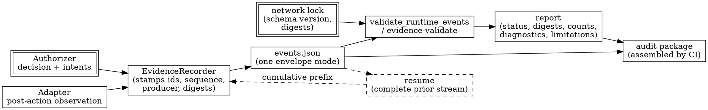

# Evidence Architecture

> **Opening scenario.** A governed support workflow at Northstar Services issues a refund adjustment through a graph node that the framework retries on failure. Two engineers open the same event stream and disagree about what it says. One sees three `tool_invoked` records for the same capability and reads them as a bug — a duplicate emission that should be deduplicated before anyone draws conclusions. The other reads them as the honest record of two failed attempts and one success. Neither can settle the argument from the file, because the records say *what* happened and *when* a producer stamped it, but never *which execution slot* it belonged to. Six weeks later Risk & Audit asks the only question that matters: was the customer refunded once, or three times? The evidence cannot answer, and the team falls back to reading application logs — the exact regression Chapter 11 set out to prevent. The defect is not in the runtime and not in the producer's honesty. It is in the schema: the record format had no place to say "this is attempt two of occurrence one of operation `node.refund`."

> **Learning objectives.**
> - Explain why a runtime-event schema must carry execution identity, and what a stream cannot prove without it.
> - Distinguish one schema identifier from its envelope modes, and state why a legacy stream is never silently upgraded.
> - Describe the binding fields every event carries and the specific mismatch each one detects.
> - Explain replay detection by content fingerprint, including which fields are excluded and why the exclusion set depends on the mode.
> - State the attempt rules — contiguity, ordering, one outcome, no retry after success — and justify each from the identity model.
> - Explain resume semantics and why cumulative evidence rather than differential chunks is the safer contract.
> - Read a validation report and state precisely which claims it supports and which it does not.

> **Prerequisites.** Chapter 11 (evidence as a designed artifact; supplied versus observed), Chapter 12 (integrity, ordering, replay, and the mission/operation/occurrence/attempt hierarchy in general form), Chapter 13 (assurance tiers), Chapter 18 (the agentic-network lock and its digests), Chapter 19 (the authorization interface, decision intents, and the evidence recorder's construction). This chapter is the implemented instance of Chapter 12's identity hierarchy; the general theory is assumed, not repeated.

## 20.1 Execution identity is a schema decision

Chapter 12 introduced the four-level identity hierarchy that any serious runtime-evidence design converges on: a <span class="ix" data-ix="mission">mission</span> is the complete governed run; an <span class="ix" data-ix="operation">operation</span> is the stable governed surface being exercised; an <span class="ix" data-ix="occurrence">occurrence</span> is one scheduled execution of that surface — one loop visit, one parallel branch; and an <span class="ix" data-ix="attempt">attempt</span> is one retry inside an occurrence. The Nornyx documentation states the same hierarchy in one sentence, and adds the two rules that make it useful: "Authorization allowances and transition state are attempt-scoped. A successful occurrence cannot be retried; intentional repeated work uses a new occurrence" (`docs/agentic-network/06_RUNTIME_EVIDENCE.md`). **[implemented]**

The opening scenario shows what happens when that identity lives only in the reader's head. Without it, a validator faces an undecidable question every time it sees two similar records. Treat them as duplicates and it will reject honest retries. Treat them as distinct and it will accept a producer that re-emits one authorization three times to manufacture a history of work it never did. Neither policy is defensible, and no amount of validator cleverness rescues a format that cannot express the distinction.

Making <span class="ix" data-ix="execution identity">execution identity</span> a *required field in a mode of the schema* rather than a convention has three consequences worth naming. It moves the question from "did the producer follow our convention?" to "does this document validate?" It lets the validator define replay precisely, because two records occupying the same execution slot with the same content are a replay while the same work in a new slot is not. And it forces an honest admission: the producer still asserts the slot. A cooperative producer can claim a new occurrence for work it never performed, and the repository says so directly in its residual-risk list — "A cooperative producer can falsely claim a new occurrence; occurrence validation proves structural consistency, not independent execution truth" (`docs/agentic-network/08_SECURITY_BOUNDARIES.md`).

> **Key idea.** Execution identity does not make a producer honest. It makes a *dishonest* producer's story internally checkable, so that fabrication has to be consistent as well as plausible — and it makes an honest producer's retries legible to a validator that would otherwise have to guess.

## 20.2 One schema identifier, three envelope modes

The <span class="ix" data-ix="runtime-events schema">runtime-events format</span> has a single schema identifier, `nornyx.agentic_runtime_events.v1`, and three <span class="ix" data-ix="envelope mode">envelope modes</span> underneath it. The top level of the schema document is a choice among exactly three definitions, summarized in Table 20.1. **[implemented]**

| Mode | `schema_version` | `occurrence_mode` | Per-event `occurrence` |
|---|---|---|---|
| 1.0 | `"1.0"` | must be absent | **forbidden** |
| 1.1 legacy | `"1.1"` | `"legacy"` | **forbidden** |
| 1.1 explicit | `"1.1"` | `"explicit"` | **required on every event** |

**Table 20.1 — The three envelopes of one schema.** From `schemas/agentic_runtime_events_v1.schema.json`. The asymmetry is the teaching point: `occurrence` is not optional anywhere. It is required in explicit mode and rejected in both others, so a stream cannot be half-migrated, and a reader never has to ask whether a missing `occurrence` means "no retries happened" or "this producer does not emit them."

That the schema *identifier* stays constant while the envelope changes is a deliberate separation. The identifier says which family of documents this is — which the lock pins and which the validator dispatches on. The version and mode say which contract inside that family the producer is honouring. Keeping the identifier stable means a lock built before the 1.1 work still names the schema the validator knows; adding a mode rather than a second identifier means the migration is expressible per stream rather than per installation.

Two rules make the arrangement safe. First, the envelope's `schema` and `schema_version` must equal the values recorded in the network lock's `runtime_events_schema` block, or validation fails with `AN_EVT_SCHEMA_LOCK_MISMATCH`. The lock is therefore the arbiter of which contract a given network's evidence is written against; new locks default to 1.1, and historical 1.0 locks are reconstructed and verified against their own declared version rather than being read as if they were 1.1. Second, and following from the first, "a legacy stream is never silently upgraded." A producer cannot start emitting `occurrence_mode: explicit` against a 1.0 lock, and a validator will not infer occurrence identity that the producer did not assert.

The recorder enforces the same asymmetry from the writing side. Its ordinary constructor takes the schema version from the authorizer's lock and, for a 1.1 lock, produces legacy mode; explicit mode requires the separate `EvidenceRecorder.for_occurrences(...)` constructor, which raises if the lock is not bound to 1.1. **[implemented]** Choosing explicit occurrence semantics is thus an affirmative act at the point where the stream is created, not a property that a downstream consumer can retrofit.

## 20.3 The closed vocabulary and what every event binds

The <span class="ix" data-ix="event type!closed enumeration">event-type enumeration</span> is closed at eighteen values, and it is worth listing them in full because the shape of the list is itself an argument.

`agent_invoked`, `capability_requested`, `capability_allowed`, `capability_denied`, `delegation_requested`, `delegation_accepted`, `delegation_rejected`, `handoff_initiated`, `handoff_completed`, `trust_zone_crossed`, `data_shared`, `approval_requested`, `approval_granted`, `approval_rejected`, `tool_invoked`, `policy_violation`, `identity_revoked`, `runtime_failed`. "Anything else requires a reviewed schema revision" (`docs/agentic-network/06_RUNTIME_EVIDENCE.md`). **[implemented]**

Every entry names a governance event, not an application event. There is no `http_request`, no `model_called`, no `span_started`. That is the boundary Chapter 11 drew between evidence and telemetry, expressed as a vocabulary: a closed set of eighteen governance facts is auditable in a way that an open set of arbitrary spans is not, and the closure is what lets the validator require specific fields per type. Ten of the eighteen are the decision-phase intents an authorizer may emit; the other eight are post-action observations only a caller can emit, the split established in Chapter 19.

Per-type field requirements follow from the vocabulary. A `capability_allowed` event must carry `capability_ref` and `policy_decision`, and the decision value must actually say `allow` — a record claiming an allowance while carrying `deny` fails with `AN_EVT_DECISION_CONTRADICTION`, not merely a warning. A `data_shared` event must carry `share_categories` and `target_ref`. An `approval_granted` event must carry `approval_ref` and `approver`. Missing required fields produce `AN_EVT_FIELD_REQUIRED`. **[implemented]**

<span class="ix" data-ix="envelope binding">Binding</span> is the property that makes a stream belong to a contract rather than float free of one. Every event — not just the envelope — carries four values: `network_id`, `contract_digest`, `network_lock_digest`, and `subject_revision`. Each is compared against the expected value, and each mismatch has its own diagnostic: `AN_EVT_NETWORK_MISMATCH`, `AN_EVT_CONTRACT_MISMATCH`, `AN_EVT_LOCK_MISMATCH`, `AN_EVT_REVISION_MISMATCH`. A fifth condition sits underneath them: the supplied lock is itself re-verified against the contract during validation, so evidence presented against a lock that no longer matches its contract fails with `AN_EVT_LOCK_STALE` even when every event binds perfectly to that stale lock.

Repeating four binding fields on every event rather than once on the envelope looks redundant, and the redundancy is the point. Events are frequently extracted, filtered, and forwarded — one mission's records copied into an incident ticket, a single denial pasted into a review. An event that travels alone still names the network, contract digest, lock digest, and revision it was decided under, so the extract remains checkable. Chapter 36's audit reconstruction depends on exactly this property.

Approvals get one narrowly scoped extra rule. On `approval_granted` — and only there — the approver's `actor_type` must be `human` (`AN_EVT_APPROVAL_NON_HUMAN`) and the role must fall inside the composed module authority (`AN_EVT_APPROVAL_ROLE_INVALID`). The rules deliberately do not apply to `approval_rejected`, because the approver named on a *refused* approval is the claimed approver of something that was denied, and it confers nothing. Requiring a refusal's claimed approver to be a valid human would make it impossible to record the very attempt an audit most wants to see: a non-human trying to approve and being turned away. **[implemented]**

## 20.4 Ordering, and the fingerprint that catches replay

<span class="ix" data-ix="ordering!local sequence consistency">Ordering</span> is validated per mission, and the guarantees are modest and precisely stated. Within one mission the validator proves "local sequence consistency of the supplied stream": sequence numbers unique and contiguous from one (`AN_EVT_SEQUENCE_GAP`, `AN_EVT_DUPLICATE_SEQUENCE`), event identifiers unique (`AN_EVT_DUPLICATE_ID`), timestamps non-decreasing along that sequence (`AN_EVT_ORDER_INVALID`), any `depends_on` reference present at a lower sequence (`AN_EVT_DEPENDENCY_MISSING`), and four paired transitions — a tool invocation requires a prior allowance (`AN_EVT_TOOL_WITHOUT_ALLOWANCE`), an acceptance requires a request, a completion requires an initiation, a grant requires a request. **[implemented]**

What it does not prove is stated with equal precision: "It does **not** solve distributed causality, cannot prove events across systems happened in the claimed order, and never claims complete causal truth." Ordering here is Lamport's local, not global, notion [@lamport-clocks]: the validator checks that one producer's account of one mission is internally consistent. Two producers' streams cannot be interleaved into a proven global order, and the format does not pretend otherwise — resume, in Section 20.6, explicitly refuses multi-producer merging for this reason.

<span class="ix" data-ix="replay detection">Replay detection</span> is where the mode distinction earns its keep. The validator computes a content fingerprint for each event: a SHA-256 digest over the event with its *transport* fields removed. In the legacy modes the transport set is `{event_id, sequence}`. In explicit mode `timestamp` joins them, and the code says why: explicit "operation/occurrence/attempt identity supplies the semantic execution slot. A producer cannot evade exact replay detection merely by restamping a duplicate with a new timestamp" (`nornyx/agentic_evidence.py`). A repeated fingerprint is `AN_EVT_REPLAY`.

That single design choice is the whole argument for occurrence identity, compressed. In legacy mode the timestamp is load-bearing: it is the only thing distinguishing a legitimate retry from a duplicate, so it must stay in the fingerprint, and a producer that restamps a copy escapes detection. In explicit mode the attempt number carries that distinction, so the timestamp becomes transport and restamping stops working. The documentation states the resulting rule in one line: "Identical semantic evidence inside one attempt is replay; identical work in a new occurrence or retry attempt is not."

## 20.5 Attempts: the rules and a worked stream

Four rules govern <span class="ix" data-ix="attempt!validation rules">attempts</span> inside an occurrence, and each follows from the identity model rather than from convenience. **[implemented]**

**One operation per occurrence.** An occurrence identifier may not move between logical operations within a mission (`AN_EVT_OCCURRENCE_OPERATION_MISMATCH`). An occurrence is one visit to one surface; reusing its identifier elsewhere destroys the slot's meaning.

**Attempts do not decrease.** Along mission sequence order, an occurrence's attempt numbers must not go backwards (`AN_EVT_ATTEMPT_ORDER_INVALID`).

**Attempts are <span class="ix" data-ix="contiguity requirement">contiguous</span> from one.** The attempt set for an occurrence must be exactly 1..n (`AN_EVT_ATTEMPT_GAP`). This is the rule that makes omission visible: a producer that records attempts 1 and 3 has told us attempt 2 exists and is missing. Contiguity converts a silent gap into a diagnostic.

**A successful occurrence cannot be retried.** Once an attempt reaches a success terminal — `agent_invoked`, `tool_invoked`, `handoff_completed`, `trust_zone_crossed`, `data_shared`, or `identity_revoked` — no higher attempt may appear for that occurrence (`AN_EVT_ATTEMPT_AFTER_SUCCESS`). A companion rule forbids one attempt recording two terminal outcomes, or both a success and a failure (`AN_EVT_ATTEMPT_OUTCOME_CONTRADICTION`). The failure terminals are `capability_denied`, `delegation_rejected`, `approval_rejected`, `policy_violation`, and `runtime_failed`.

The fourth rule is the one that surprises people, and it is worth defending. If a retry after success were permitted, the format would lose the ability to say how many times a governed action *actually took effect*, which is the opening scenario's unanswerable question. Under the rule, deliberate repetition is still entirely expressible — it just has to be honest about being repetition, by opening a new occurrence.

Figure 20.1 shows the resulting shape of one operation's history.

<figure class="nx-fig" id="fig-20-1">
  <div class="fig-body">
    <div class="seq">
      <div class="seq-cols" data-cols="Graph node|Adapter (enforcement point)|Authorizer|Recorder|Tool"></div>
      <div class="msg" data-from="1" data-to="2" data-kind="call">visit 1 (task.1), framework attempt 1</div>
      <div class="msg" data-from="2" data-to="3" data-kind="call">evaluate — occurrence (node.escalate, task.1, 1)</div>
      <div class="msg" data-from="3" data-to="2" data-kind="return">allow</div>
      <div class="msg" data-from="2" data-to="4" data-kind="call">capability_requested, capability_allowed</div>
      <div class="msg" data-from="2" data-to="5" data-kind="call">action</div>
      <div class="msg" data-from="5" data-to="2" data-kind="deny">raises</div>
      <div class="msg" data-from="2" data-to="4" data-kind="call">runtime_failed (attempt 1 — failure terminal)</div>
      <div class="msg" data-from="1" data-to="2" data-kind="call">framework retry — same task.1, attempt 2</div>
      <div class="msg" data-from="2" data-to="4" data-kind="call">capability_allowed, then tool_invoked (success terminal)</div>
      <div class="msg" data-from="1" data-to="2" data-kind="call">visit 2 — new occurrence task.2, attempt 1</div>
      <div class="msg" data-from="2" data-to="4" data-kind="call">capability_allowed, then tool_invoked</div>
    </div>
  </div>
  <figcaption><b>Figure 20.1 — One operation, two occurrences, three attempts.</b> The operation identifier <code>node.escalate</code> is stable across everything shown. <code>task.1</code> is one scheduled visit that needed two attempts; <code>task.2</code> is a second visit. The teaching purpose is to show where each identifier changes and where it does not: a retry advances only the attempt, a new visit advances only the occurrence, and nothing may advance the attempt of an occurrence that already reached a success terminal.</figcaption>
</figure>

Listing 20.1 records exactly that history through the recorder, against the bundled support network.

```python
recorder = EvidenceRecorder.for_occurrences(
    authorizer, context, producer_id="support-harness",
    producer_type="synthetic_harness")

request = CapabilityRequest("identity.escalation_agent", "escalate_high_value_refund")

occ = RuntimeOccurrence("node.escalate", "task.1", 1)          # visit 1, attempt 1
recorder.record_occurrence_decision(
    authorizer.evaluate(request, context=context), mission_id=MISSION, occurrence=occ)
recorder.record_occurrence_observation(
    "runtime_failed", mission_id=MISSION, occurrence=occ, actor_ref=request.identity_ref)

occ = RuntimeOccurrence("node.escalate", "task.1", 2)          # visit 1, attempt 2
recorder.record_occurrence_decision(
    authorizer.evaluate(request, context=context), mission_id=MISSION, occurrence=occ)
recorder.record_occurrence_observation(
    "tool_invoked", mission_id=MISSION, occurrence=occ,
    actor_ref=request.identity_ref, capability_ref=request.capability_ref)

occ = RuntimeOccurrence("node.escalate", "task.2", 1)          # visit 2, attempt 1
recorder.record_occurrence_decision(
    authorizer.evaluate(request, context=context), mission_id=MISSION, occurrence=occ)
recorder.record_occurrence_observation(
    "tool_invoked", mission_id=MISSION, occurrence=occ,
    actor_ref=request.identity_ref, capability_ref=request.capability_ref)
```

**Listing 20.1 — Recording two occurrences and a retry.** Run against `examples/agentic_network_support/support_network.nyx` with a lock built by `nornyx agentic-network lock`; `MISSION` is `"GOAL-SUPPORT-001"`. Note that the decision is evaluated afresh for every attempt: allowances are attempt-scoped, so a recorder never carries one attempt's authorization into the next.

The resulting stream validates, and its shape, in Listing 20.2, is the whole lesson.

```text
status        : pass
event_count   : 9
mission_count : 1
counts_by_type: {"capability_allowed": 3, "capability_requested": 3,
                 "runtime_failed": 1, "tool_invoked": 2}
diagnostics   : []

envelope: {"schema": "nornyx.agentic_runtime_events.v1", "schema_version": "1.1",
           "occurrence_mode": "explicit", "network_id": "network.governed_support",
           "producer": {"type": "synthetic_harness", "id": "support-harness",
                        "version": "1.0"}}

 1  capability_requested   task.1 attempt 1
 2  capability_allowed     task.1 attempt 1
 3  runtime_failed         task.1 attempt 1
 4  capability_requested   task.1 attempt 2
 5  capability_allowed     task.1 attempt 2
 6  tool_invoked           task.1 attempt 2
 7  capability_requested   task.2 attempt 1
 8  capability_allowed     task.2 attempt 1
 9  tool_invoked           task.2 attempt 1
```

**Listing 20.2 — The observed stream and its validation report.** Two `tool_invoked` records appear, and they are now unambiguous: one per occurrence, each in a distinct execution slot, with the failed first attempt of `task.1` recorded rather than erased. The opening scenario's question — once, or three times? — is answerable directly: the capability took effect twice.

Now the two rejections. In Listing 20.3 the same stream is tampered with in the two ways a dishonest or buggy producer would most plausibly try.

```text
--- replayed attempt (restamped): fail ---
  AN_EVT_REPLAY  Event content replays an earlier event.
--- attempt after success: fail ---
  AN_EVT_ATTEMPT_AFTER_SUCCESS  A successfully completed occurrence cannot be retried;
                                repeated work requires a new occurrence id.
```

**Listing 20.3 — Two rejections, with their real diagnostics.** The first case re-emits one `capability_allowed` event verbatim under a fresh `event_id`, a fresh `sequence`, *and* a fresh timestamp — everything a producer could change while keeping the substance. Because explicit mode excludes the timestamp from the fingerprint, the duplicate is still caught. The second case appends attempt 3 to `task.1`, whose attempt 2 already reached `tool_invoked`. Both are produced by `validate_runtime_events` against the unmodified contract, composition, and lock.

> **Assurance boundary.** Neither rejection proves anything about the runtime. They prove that the *supplied document* is not internally consistent with the model it claims to follow. A producer that never emits the failed attempt at all produces a shorter, perfectly valid stream, and validation has nothing to say about the omission — the contiguity rule catches gaps *between* recorded attempts, not attempts that were never recorded. This is the supplied-versus-observed boundary of Chapter 11 in its sharpest form, and it is why Chapter 13 places all of this at Tier 2.

## 20.6 Resume: cumulative, not differential

Long-running governed work does not finish in one process. A graph checkpoints and resumes hours later; a batch job restarts. The evidence format has to say what happens to the stream across that boundary, and the choice made here is unusually opinionated.

<span class="ix" data-ix="resume!cumulative evidence">`EvidenceRecorder.resume(...)`</span> takes a *complete* prior stream and returns a recorder whose future output includes it. Five preconditions are checked before any continuation is possible. **[implemented]** The prior stream must validate completely against the exact same contract, composition, and lock. Its producer object must match the resuming recorder's exactly. Its schema version must match the authorizer's lock. Its occurrence mode must match — a 1.0 stream may declare no mode, a 1.1 stream must declare a valid one, and the resumed recorder adopts it rather than choosing its own. And the resuming context's `decision_at` must not precede any timestamp already in the stream, which forbids time regression across the resume boundary. Per-mission sequence counters are then restored from the prefix, so numbering continues rather than restarting.

The word doing the most work is *cumulative*. The repository states the alternative and rejects it: "Differential chunks and multi-producer merging are not supported" (`docs/agentic-network/06_RUNTIME_EVIDENCE.md`). A differential design — each session emits only its own new events, and a consumer concatenates them — is more efficient and considerably less safe. Concatenation is performed by whoever holds the pieces, which moves ordering, deduplication, and completeness from the validator into an unspecified assembly step. Under the cumulative contract, every stream a producer emits is a self-contained document that stands or falls on its own, and the validator that reads the final one has validated the whole history.

The resume path also supports the one piece of state a framework adapter genuinely cannot reconstruct. `max_recorded_attempt(...)` returns the highest attempt already recorded for a given mission, operation, and occurrence. The LangGraph adapter of Chapter 24 uses it precisely because the framework resets its own attempt counter to one after a checkpoint resume; offsetting by the validated cumulative prefix keeps the Nornyx attempt sequence contiguous rather than colliding. That is the contiguity rule of Section 20.5 being *served* by the interface rather than merely enforced against it.

Figure 20.2 places the whole lifecycle in one view.



**Figure 20.2 — The evidence lifecycle from decision to audit package.** Solid edges are the ordinary path; the dashed edges are resume, which re-enters the recorder carrying a fully validated prefix rather than a fragment. The teaching point is where the lock enters: it is an *input to validation*, not a property of the stream, so the same events file can pass against the lock it was written for and fail against a later one.

> **Case study — Atlas.** Northstar's Risk & Audit division asks for an evidence package covering one Atlas decision: the request, in March, to publish a client briefing externally. Research & Insights assembles four items. The contract at the exact revision the decision was made under. The agentic-network lock, which binds that contract's digest, the record digests, and the runtime-events schema version. The events file — one mission, in explicit mode, ending in a `capability_denied` for the external publication capability. And the validation report, which carries `status: pass`, the four binding digests, the event and mission counts, the counts by type, an empty diagnostics list, and a `safety` block asserting that validation itself called no models, executed no tools, used no connectors, and used no network. The auditor's first question is not about the events; it is "what does `pass` mean here?" The answer is printed in the package, because the report embeds it — see Section 20.7. Thread A concludes in Chapter 36, where this package is walked through as a reconstruction exercise and the gap between "the denial is recorded" and "no publication occurred" is closed by argument about coverage rather than by the evidence itself.

## 20.7 Artifacts, the command, and the sentence in every report

Two mechanisms extend a stream beyond its own fields. A per-event <span class="ix" data-ix="evidence artifact">`evidence_artifact`</span> object carries a `path` and a `sha256`, binding an external file — a test report, a scan output, a rendered diff — to the event that references it. The path is resolved relative to the *events file's own directory* and must stay inside it; escapes, symbolic links, and missing targets fail with `AN_EVT_ARTIFACT_MISSING`, and a content mismatch fails with `AN_EVT_ARTIFACT_HASH_MISMATCH`. **[implemented]** <span class="ix" data-ix="path containment">Containment</span> is a validation-time property, not merely a convention: a stream cannot reach outside its own directory to hash something, which means an evidence package is a self-contained directory that can be moved, archived, and re-validated elsewhere. Separately, `input_digest` and `output_digest` fields let an event bind a payload by digest without carrying it — the minimization technique of Chapter 11, and equally the reason those digests prove binding rather than content.

The command that runs validation is deliberately small:

```bash
nornyx agentic-network evidence-validate CONTRACT --events EVENTS.json \
    [--lock LOCK] [--as-of TS] [--out REPORT] [--strict] [--json]
```

`--events` is required; `--lock` defaults to `nornyx.agentic_network.lock`; `--as-of` supplies the instant at which the *contract* is validated before the stream is examined. `--out` writes a deterministic, sorted-key report. **[implemented]**

The <span class="ix" data-ix="strict mode">`--strict`</span> flag deserves a paragraph of its own, because its behavior surprises people who expect a validator to fail loudly by default. Without it, a failing stream still prints its status and diagnostic count and still exits zero. With it, a status other than `pass` exits nonzero. The observed difference on one tampered stream is exactly that: `{"status": "fail", "diagnostic_count": 1}` with exit code 0, and the identical output with exit code 1 under `--strict`.

The design is defensible once you see the two use cases. Analytical use — validating an archived stream to see *what* is wrong with it, comparing several streams, feeding reports into a dashboard — wants the report, not a nonzero exit that aborts a pipeline step. Gating use wants the opposite. Rather than guess, the command makes the caller state which one it is. The cost is real and worth naming: a continuous-integration job that forgets `--strict` runs a validation step that can never fail it. This is a fail-open default in the tool's *exit code*, mitigated only by explicitness, and the reference pipeline compensates by passing `--strict` on both of its evidence-validation steps. Chapter 29 treats the general rule: a gate whose failure mode is "exit 0" is not a gate, and the burden is on the pipeline author.

Finally, the sentence this whole chapter has been building toward. Every report — the one written by `--out`, the one returned by the Python function, the one printed in summary — embeds three limitation statements verbatim, from `LIMITATIONS` in `nornyx/agentic_evidence.py`:

> "Validated evidence proves conformance of supplied records only."
> "Hash validity proves content binding, not event truth."
> "Nornyx does not observe, operate, or monitor the runtime."

**[implemented]** The engineering decision worth studying is not the wording but the *placement*. These sentences are not in a README that an auditor may never open, or in a footnote of a marketing page. They are fields of the artifact, travelling with every <span class="ix" data-ix="validation report">validation report</span> into every evidence package, unremovable without editing the report. The documentation states the same <span class="ix" data-ix="proof boundary">proof boundary</span> at greater length — "A runtime can omit or fabricate events; validation proves conformance of what was supplied against the exact contract revision, nothing more" — but the embedded version is the one that arrives with the evidence.

> **Misconception.** *"A passing validation report is proof the agent behaved."* It establishes four narrower things: the supplied records conform to the schema and mode, they bind to this exact contract, lock, network, and revision, their internal ordering and occurrence structure are consistent, and every referenced artifact hashes as claimed. Omission is invisible, fabrication is structurally checkable but not detectable, the producer is self-declared, and no signature is verified — the repository claims none. The distance from that list to "the agent behaved" is the distance from Tier 2 to Tier 3, and it is bridged by an independent observer, not by a better report.

## Summary

An evidence format is a set of decisions about what can be said, and the most consequential one here is that execution identity is expressible. One schema identifier carries three envelopes — 1.0, 1.1 legacy, and 1.1 explicit — with occurrence identity required in the third and forbidden in the other two, so a stream is never half-migrated and never silently upgraded; the lock decides which contract a network's evidence is written against. Eighteen closed event types name governance facts rather than application activity, and every event repeats four binding fields so that an extracted record remains checkable. Ordering is proven locally per mission and claims nothing about distributed causality. Replay is caught by a content fingerprint whose transport-field exclusions widen in explicit mode, so restamping a duplicate no longer evades detection. Attempts must be contiguous from one, may not decrease, may record only one outcome, and may never follow a success — which is what makes "how many times did this take effect?" answerable. Resume carries a complete validated prefix rather than a differential chunk, refusing multi-producer merges and time regression. And every report embeds three sentences stating exactly what a pass does and does not prove.

- Execution identity in the schema turns an undecidable reading into a validated one.
- Three envelopes, one identifier; the lock arbitrates, and no stream is upgraded silently.
- Four binding fields per event make an extracted record self-describing.
- Explicit mode moves `timestamp` into the transport set, closing the restamp evasion.
- Contiguity makes an omitted attempt visible; nothing makes an omitted stream visible.
- The proof boundary ships inside the artifact, not alongside it.

## Review questions

1. Why is `occurrence` forbidden in 1.1 legacy mode rather than merely optional? Give a concrete misreading that optionality would permit.
2. Explain why the replay fingerprint excludes `timestamp` in explicit mode but must include it in legacy mode. What producer behavior does each choice permit or prevent?
3. A producer records attempts 1 and 3 for one occurrence. Which diagnostic fires, and what exactly has the stream told a reviewer? Contrast with a producer that records only attempt 1 of a three-attempt occurrence.
4. Every event repeats `network_id`, `contract_digest`, `network_lock_digest`, and `subject_revision`, which the envelope already carries. Give the auditing argument for the redundancy and one cost it imposes.
5. The human-approver rules apply to `approval_granted` but not to `approval_rejected`. State the reasoning, and describe an audit-relevant event that the narrower scope makes recordable.
6. `evidence-validate` exits zero on a failing stream unless `--strict` is passed. Argue both sides, then state what a pipeline author must do and why the burden sits there.

## Exercises

1. Reproduce Listing 20.1 against the bundled support network. Then produce three variants that each fail with exactly one diagnostic: an attempt gap, an occurrence identifier reused across two operations, and a `capability_allowed` event whose `policy_decision` says `deny`. Record the diagnostic code and message for each.
2. Take a validated stream and split it into two differential chunks, each containing half the events. Attempt to resume from the second chunk alone and record what happens. Then write a short design note arguing either for or against adding differential resume, addressing ordering, deduplication, and who would be responsible for completeness.
3. Assemble a minimal evidence package for one mission: the contract, the lock, the events file, one referenced `evidence_artifact` file, and the report written with `--out`. Move the whole directory elsewhere on disk and re-validate. Then move the artifact file one directory up, adjust the path, and re-validate; explain the resulting diagnostic in terms of containment.

## Further reading

- [@lamport-clocks] — the local-versus-global ordering distinction that the per-mission ordering rules deliberately stay inside.
- [@merkle] — content-addressed binding, the primitive behind the per-event digests and the artifact hashes.
- [@in-toto] — supply-chain attestation as a contrasting design where the producer's identity is cryptographically bound, showing what this format leaves to the surrounding platform.
- [@otel] — the telemetry model this vocabulary deliberately is not, useful for seeing why an open span vocabulary and a closed event vocabulary serve different purposes.
- [@nornyx-repo] — the schema (`schemas/agentic_runtime_events_v1.schema.json`), the validator (`nornyx/agentic_evidence.py`), and the evidence documentation (`docs/agentic-network/06_RUNTIME_EVIDENCE.md`).
