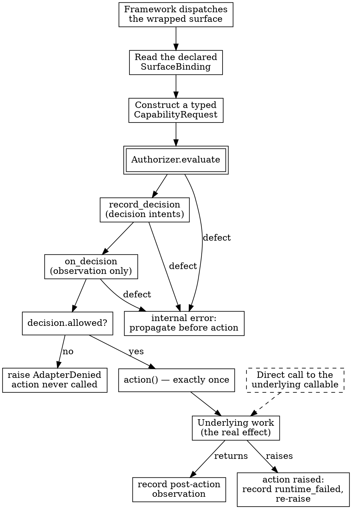

# Designing an Adapter Boundary

> **Opening scenario.** Northstar Services' Engineering Platform team has agreed on what to govern — the support-refund tool call from Chapter 14's comparison — and now has to decide *where the enforcement point attaches*. Two engineers open two frameworks side by side and discover that the question has no common answer. In one, the unit of work is an object with a method the framework calls; interception means subclassing and overriding. In the other, the unit of work is a plain function registered into a graph; interception means wrapping the function before registration. The identity of the caller is a role string in the first and a node key in the second. One framework retries a failing tool internally three times; the other retries a node under a policy the graph author configures. One passes arguments the planner wrote as free text; the other passes a typed state object. Someone proposes writing "an adapter for each framework," which everyone agrees with and nobody can specify. The uncomfortable question comes from the team's newest member: *"If the two adapters are free to differ in whatever way each framework requires, what exactly is the same about them — and what stops the second one from quietly meaning something weaker than the first?"* The afternoon is spent not writing code but building a matrix.

> **Learning objectives.**
> - Explain why heterogeneous framework execution surfaces require a stable, framework-neutral request model, and what a governance layer must refuse to accept as request input.
> - Assign each responsibility in a governed call to the adapter, the governance core, or the runtime, and name the failure mode produced by each misassignment.
> - Define a surface binding and distinguish the three failure kinds an adapter can produce: configuration error, identity-resolution error, and policy denial.
> - State the protected execution sequence as a set of ordering obligations, and identify which obligations the shared enforcement routine discharges and which it delegates to the caller.
> - Explain why exactly-once execution is a property local to one wrapped call and not a distributed transaction guarantee.
> - Justify dependency injection of the authorizer, context, and recorder as a defence against the split-brain hazard of Chapter 19, and version pinning as a governance decision rather than a packaging preference.

> **Prerequisites.** Chapter 10 (policy decision point and policy enforcement point separation; cooperative versus independent enforcement), Chapter 11 (evidence and its producers), Chapter 13 (assurance tiers), Chapter 14 (coverage inventories, the three coverage states, and bypass), Chapter 16 (the status badges used from here on), and Chapter 19 (the authorization interface, the assured construction path, and the split-brain hazard). This chapter builds directly on all six and re-teaches none of them.

## 22.1 One request model against many execution surfaces

An agent framework optimizes for expressive ways of *reaching* work: an object whose method is dispatched by an executor, a callable registered under a name, a callback fired on a lifecycle event, a message consumed from an internal bus. Each is an <span class="ix" data-ix="execution surface">execution surface</span> — a named, reachable point at which the framework transfers control into code that does something consequential. Frameworks differ in which surfaces they expose, what metadata accompanies a transfer, whether synchronous and asynchronous variants exist, how failures propagate, and whether the framework itself retries.

A governance layer's job is the opposite. It must answer one question — *may this identity exercise this capability, under these conditions, right now?* — in a way that is stable across every framework, version, and surface, because the answer has to be reviewable by people who have never heard of the framework. The instant a decision function takes a framework object as an argument, its semantics become a property of that framework, and the contract stops being the authoritative statement of what is allowed.

The resolution is to put a translation layer between them and be extremely precise about what that layer may do. We will call it an <span class="ix" data-ix="framework adapter">adapter</span>: a component whose only responsibilities are to be present on a framework execution surface, to map that surface onto declared governance concepts using its own static configuration, and to invoke a governance decision it does not itself make.

The precision matters more than the pattern. The pattern is ordinary software engineering, and its rationale is Parnas's: hide the thing most likely to change behind a module boundary so that changes to it do not ripple outward [@parnas-criteria]. What is *not* ordinary is the constraint on translation. A normal adapter may be creative about mapping one interface onto another. A governance adapter may not, because a creative mapping is indistinguishable from a policy change made by someone not authorized to make one.

The Nornyx authorization interface states the corresponding rule on its own side of the boundary: the engine "authorizes *declared Nornyx concepts only*. It never parses raw shell commands, file paths, URLs, or tool arguments" **[implemented]**. Read as an interface contract rather than an implementation note, that is a demand on every adapter that will ever exist: whatever the framework hands you, what you hand the decision function must be a request over declared concepts obtained from somewhere other than the framework's caller-controlled payload.

> **Key idea.** An adapter converts *reachability* into *a request*. The framework decides what is reachable; the contract decides what is authorized; the adapter's whole function is to make sure that every reachable path in the declared coverage produces a request in the vocabulary of the contract, without inventing any part of that request. An adapter that derives any element of the request from data the planner controls has handed the planner the ability to choose its own permissions, which is Chapter 6's authority confusion arriving through the front door.

## 22.2 The three-way ownership split

Once translation is confined, the responsibilities in a single governed call divide cleanly into three. The division is worth stating as an ownership rule, because most defective integrations are a case of one owner taking on another's job.

The **adapter owns mapping and interception**. It owns being on the path: the wrapped method actually gets called by the framework's own dispatch. It owns the declarative mapping from a named surface to a governance identity and capability, and the translation of framework-public metadata — an agent's role string, a node key, a task identifier — into request and evidence fields. It owns failing closed when its own configuration is incomplete.

The **core owns governance semantics and the decision**: what a capability means, when a delegation is valid, whether a zone crossing needs approval, which decision code applies, and what event intents a decision carries. The adapter consumes a `Decision` and never constructs, modifies, caches, or second-guesses one.

The **runtime owns execution**. The framework schedules, retries, and parallelizes; the underlying business callable does the work and produces the effect. Neither the adapter nor the core executes anything — the adapter calls a callable the integrator supplied, and the core never sees it.

**Evidence records the bounded interaction** and nothing wider: what was requested, what was decided, and — separately, afterwards — what the adapter observed. It does not say that the work was correct, that the actor was authenticated, or that the record is true. Chapter 20 develops the resulting proof boundary; here it is enough that evidence is the *fourth* participant, not a property of one of the other three.

Figure 22.1 draws the split with the boundary lines that matter.

<figure class="nx-fig" id="fig-22-1">
  <div class="fig-body">
    <div class="zones">
      <div class="zone" data-name="Runtime (framework + business code)">
        <div class="node">Executor / scheduler</div>
        <div class="node">Retry and loop policy</div>
        <div class="node">Underlying work callable</div>
      </div>
      <div class="zone" data-name="Adapter (mapping + interception)">
        <div class="node">Wrapped surface ✋</div>
        <div class="node">SurfaceBinding (static)</div>
        <div class="node">Identity resolution</div>
        <div class="node">Coverage inventory</div>
      </div>
      <div class="zone" data-name="Governance core (semantics + decision)">
        <div class="node authority">Authorizer.evaluate</div>
        <div class="node authority">Decision (effect, code, basis, intents)</div>
        <div class="node">EvidenceRecorder</div>
      </div>
      <div class="zone untrusted" data-name="Out of coverage">
        <div class="node untrusted">Direct call to the work callable</div>
        <div class="node untrusted">Unwrapped surfaces</div>
      </div>
    </div>
  </div>
  <figcaption><b>Figure 22.1 — The adapter boundary and its three owners.</b> Double-bordered elements are authoritative: only the core produces a decision, and only the core defines what a decision means. The adapter is the sole element that touches both the framework and the core, which is why it is the only place framework-specific code belongs. The dashed band is not a gap in the design but a declared region: paths that reach the work callable without traversing the adapter, named in the coverage inventory rather than assumed away. The teaching purpose is to make ownership legible at a glance, so that a proposed change can be tested by asking which band it belongs in.</figcaption>
</figure>

Table 22.1 states the same split as a set of misassignment failures, which is the form in which it is actually useful during a design review.

| Responsibility | Correct owner | Failure mode if the adapter takes it | Failure mode if the core takes it |
|---|---|---|---|
| Deciding allow/deny | Core | Policy semantics fork per framework; two adapters silently mean different things | — |
| Being on the execution path | Adapter | — | The core would have to import framework code, coupling policy releases to framework releases |
| Naming which identity is acting | Adapter (resolution), Core (validity) | Adapter guesses an identity from available attributes and defaults instead of failing | Core would need framework-specific key formats in its own vocabulary |
| Choosing which capability a call exercises | Adapter, from static configuration | Capability read from tool arguments: the planner selects its own permissions | — |
| Interpreting the contract | Core, once | Two interpretations of one document (Chapter 19's split-brain hazard) | — |
| Executing the work | Runtime | Adapter becomes an execution engine and inherits every non-goal the toolchain declared | — |
| Asserting that an event is true | Nobody | Evidence is presented as runtime proof; Tier 2 is written as Tier 3 | Same |

**Table 22.1 — Ownership, and what each misassignment costs.** The rightmost two columns are the reason the split is worth stating explicitly: each row's failure is plausible, locally reasonable, and produces a system that still works while making a claim that no longer holds. The last row has no correct owner at all, which is the point Chapter 13's tier model exists to keep visible.

## 22.3 Surface binding and request normalization

The adapter's mapping is a data structure, not a code path. Listing 22.1 is the whole of it in the supported Nornyx adapter package **[implemented]**.

```python
@dataclass(frozen=True)
class SurfaceBinding:
    """A closed, adapter-declared mapping from one framework surface to a
    Nornyx identity and capability."""

    surface: str
    identity_ref: str
    capability_ref: str


def validate_binding(binding: SurfaceBinding) -> None:
    """Fail closed if any required field of ``binding`` is missing or blank."""
    for field_name in ("surface", "identity_ref", "capability_ref"):
        value = getattr(binding, field_name)
        if not isinstance(value, str) or not value.strip():
            raise AdapterConfigurationError(
                f"SurfaceBinding.{field_name} must be a non-empty string; got {value!r}."
            )
```

**Listing 22.1 — The declarative binding.** Verbatim from `adapters/nornyx-agentic-adapters/src/nornyx_agentic_adapters/binding.py:19-36`. Three fields, frozen, with validation that checks presence and nothing else. The module docstring at lines 1-9 states the constraint that gives the structure its meaning: framework-specific submodules build these "from their own static configuration (never from raw framework arguments — commands, paths, URLs, tool payloads)."

Three design decisions are compressed into those seventeen lines.

First, the binding is **closed**. There is no attribute bag, no conditional logic, no expression language. A binding cannot say "this capability, unless the argument starts with `read`." Anything that varies per call is outside the binding by construction, which means anything the planner can influence is outside it by construction. This is <span class="ix" data-ix="request normalization">request normalization</span> by exclusion rather than by sanitization: rather than filtering hostile inputs out of the request, the design admits no inputs at all.

Second, validation is **deliberately narrow**, and the docstring says so: it "only checks that required declarative fields are present, non-blank strings; it cannot know whether they name anything the loaded contract actually declares — only the `Authorizer` determines that at evaluation time." Resisting the urge to validate more is the harder choice. An adapter that checked whether `capability_ref` names a declared capability would need to read the contract, and Section 22.5 explains why that convenience would undo the architecture.

Third, the design produces **three distinct failure kinds**, and a reader who conflates them will mis-handle all three:

- A <span class="ix" data-ix="configuration error">configuration error</span> (`AdapterConfigurationError`) means the adapter's own declaration is malformed or incomplete — a blank field, a schema object of the wrong type, an unrecognized framework version. It is raised at construction time where possible, before any call is governed, and it is a deployment defect.
- An <span class="ix" data-ix="identity resolution!failure">identity-resolution failure</span> (`IdentityResolutionError`, raised by the core with code `IDENTITY_UNKNOWN` or `IDENTITY_AMBIGUOUS`) means the framework presented a key that maps to no declared identity, or to more than one. The interface's own comment is emphatic that this is "not a policy decision" — there is no subject to evaluate, so there is nothing for policy to say.
- A <span class="ix" data-ix="policy denial">policy denial</span> is a `Decision` whose effect is `DENY` or `APPROVAL_REQUIRED`. It is the *normal* operation of a working system, it carries a code and a basis, and it produces evidence.

Only the third belongs in a governance report as a denial. Counting resolution failures as denials inflates a control's apparent effectiveness with what are really integration bugs; counting denials as errors trains operators to route around them.

Mapping the framework's caller identity is the one place where translation is unavoidable, and the supported CrewAI adapter shows the discipline it requires **[implemented]**: `agent_identity_key(agent)` reads exactly one attribute — the agent's `role` string — and raises rather than falling back if it is absent or blank; `resolve_identity(authorizer, agent)` is documented as a "thin pass-through" that hands that key to the core and lets the resolution error propagate unchanged. No scan of other attributes, no case normalization, no default identity. Chapter 5's rule that resolution failure must fail closed is here as fifteen lines of code.

## 22.4 The protected execution sequence

We can now state the obligation that gives an adapter its value, as a sequence of ordering constraints on a single wrapped call:

1. **Evaluate exactly once.** One invocation of the surface produces one decision. Not zero (which would be an unenforced path), not two (which invites a time-of-check discrepancy between them), and never a decision retrieved from a cache keyed on anything.
2. **Record the decision's intents before the action runs.** The evidence of what was decided must exist before the effect it authorized, or a crash between the two produces a system that acted with no record of having been permitted to.
3. **Invoke the action exactly once, and only on allow.** Non-allow decisions — deny and approval-required alike — never reach the action.
4. **Record the outcome only after the action returns.** A success observation written before the work completes is a claim about the future.
5. **Record a runtime failure when the action raises**, so that the stream distinguishes "authorized and completed" from "authorized and failed."
6. **Fail closed on internal errors.** A defect in evaluation, in recording, or in any observation hook must prevent the action, not permit it.

Listing 22.2 is the shared routine that discharges the first three and part of the sixth **[implemented]**.

```python
def enforce(
    authorizer: Authorizer,
    request: AuthorizationRequest,
    *,
    context: EvaluationContext,
    recorder: EvidenceRecorder,
    mission_id: str,
    action: Callable[[], T],
    on_decision: Callable[[Decision], None] | None = None,
) -> T:
    """Evaluate ``request``, record its decision intents, then run ``action``.
    ...
    """
    decision = authorizer.evaluate(request, context=context)
    recorder.record_decision(decision, mission_id=mission_id)
    if on_decision is not None:
        on_decision(decision)
    if not decision.allowed:
        raise AdapterDenied(decision)
    return action()
```

**Listing 22.2 — The single enforcement boundary.** Verbatim from `adapters/nornyx-agentic-adapters/src/nornyx_agentic_adapters/enforcement.py:28-65`, with the docstring body elided. Six executable lines carry the ordering guarantee. The module docstring at lines 1-9 names it as the one place a wrapped action is ever invoked, and states the fail-closed consequence: an unexpected error from `authorizer.evaluate` or `recorder.record_decision` "propagates before `action` is reached."

Read the six lines as a proof sketch rather than as code. Evaluation precedes recording textually, so no decision can be recorded that was not made. Recording precedes the branch, so deny and allow produce identical evidence up to the moment they diverge — a denial is as well recorded as an approval, which is what makes denial counts trustworthy. The branch raises rather than returning a sentinel, so a caller cannot forget to check, and the error carries the core `Decision` unmodified so the caller can inspect code and basis without re-evaluating. And `action()` appears exactly once, on the final line, after every check.

The `on_decision` hook is the kind of extension point that usually erodes a guarantee. Here it does not, and the reason is placement: it runs *after* recording and *before* the branch, it is invoked on deny as well as allow, and an exception raised inside it propagates before the action is reached, so a buggy observer fails closed. The supported CrewAI adapter uses it for exactly one purpose — reading the authorizing delegation out of the decision's own public basis, so the post-action observation names the same possession ground the decision event did. The alternative would have been to read the delegation from the tool's arguments, which is precisely the caller-controlled input Section 22.3 excluded.

Figure 22.2 traces every path through the sequence, including the one that never enters it.



**Figure 22.2 — Decision path through a wrapped surface.** Every route from dispatch to effect passes through the double-bordered evaluation node except one: the dashed edge, which is the cooperative boundary of Chapter 14 drawn as a graph edge rather than as prose. The three `defect` edges converging on the internal-error node are the fail-closed obligation — a bug anywhere in the decision or recording path terminates before the effect. The teaching purpose is to make the sixth obligation visible: fail-closed is not one branch but a property of every edge that leaves the sequence early.

Two honest qualifications belong with this figure, and neither is decoration.

The first is that the sequence is **split across two owners**. `enforce` deliberately does not record the post-action observation; its docstring says why — "observation semantics are framework/surface-specific" — and leaves obligations four and five to the calling adapter. The consequence is that the two supported adapters discharge them differently, and the difference is verifiable in source. The LangGraph adapter wraps the action in `try/except` and records a `runtime_failed` occurrence observation when it raises (`langgraph.py:254-262`). The CrewAI adapter's governed `_run` does not: it calls `enforce`, and on return records `tool_invoked` (`crewai_adapter.py:243-262`). An action that raises therefore propagates out of the CrewAI path with *no* post-action observation of either kind. That is fail-closed in the sense that matters — nothing false is recorded, and no success is claimed — but a reader should not generalize "the adapters record runtime failures" from one adapter to the other. Chapter 25 treats this asymmetry as a conformance question.

The second qualification is about the word "exactly."

> **Misconception.** *"Exactly-once execution means the action happens once, period."* <span class="ix" data-ix="exactly-once locality">Exactly-once here is local to one call, in one process, over one callable reference.</span> It says: within a single invocation of the wrapped surface, `action` is called once if the decision allowed and zero times otherwise. It says nothing about how many times the framework invokes the wrapped surface — CrewAI's executor may retry a failing tool internally, and a LangGraph retry policy may re-run a node — and each such invocation is a fresh, independently evaluated, independently recorded pass through the sequence, which is the correct behavior and is exactly what the repository's occurrence semantics exist to represent. It also says nothing across process boundaries: there is no transaction, no coordinator, no idempotency key, and no compensation. If the action performs a non-idempotent remote write and the process dies between the write returning and the observation being recorded, the effect happened and the evidence stream is short one record. The guarantee is a statement about a wrapper, not about the world. Distributed exactly-once delivery is a different and much harder problem that no in-process wrapper solves.

The ordering itself is versioned rather than incidental. The package's compatibility document classifies changing "`enforce()`'s evaluate → record → execute ordering guarantee" as a *breaking* change, alongside removing a public type **[implemented]**. That classification is the mechanism by which a sequence stops being an implementation detail and becomes something a consumer may rely on: it cannot be altered without a major version and the review that a major version compels.

The obligations are held closed by tests rather than by intent. The enforcement suite asserts that allow invokes the action exactly once and returns its result, that deny and approval-required never invoke it while still recording the decision, that a raised error from `evaluate`, from `record_decision`, or from `on_decision` leaves the action uncalled, and that the hook cannot observe an unrecorded decision (`tests/test_enforcement.py:61-211`). Chapter 15's five-test obligation per surface is visible here as a file.

## 22.5 Injected dependencies: why an adapter must not read a contract

The supported adapters take the authorizer, the evaluation context, and the evidence recorder as explicit parameters, already constructed. They do no file input or output — an audit of the package source finds no `load_authorizer`, no `open(`, no `read_text`, and no `Path(` anywhere under `src/` — and they never load, re-read, re-compose, or re-verify a contract **[implemented]**.

For a component whose entire subject matter is a contract, that is a startling amount of abstinence, and the temptation to relax it is real. An adapter that loaded the contract itself would be easier to configure: one path argument instead of three live objects. It could validate bindings properly at construction. It could offer a helpful error when a capability reference was misspelled. Every one of those conveniences is a reason to reach for the file, and every one of them creates a second interpretation of the same document.

Chapter 19 named the resulting failure the <span class="ix" data-ix="split-brain hazard!in adapters">split-brain hazard</span>: whenever *n* components independently derive governance state from a shared source, the system holds *n* interpretations, and their agreement is a coincidence maintained by discipline rather than a property maintained by construction. Dependency injection removes the hazard at the root, not by synchronizing the interpretations but by ensuring there is only one. The application constructs an authorizer once, through the assured path that validates the contract and verifies the lock; every adapter in the process receives that object; there is no second parse to disagree with the first, no cache to go stale, and no window in which the wrapper is enforcing last week's policy because it read the file at a different moment.

Three further properties follow from the same decision, and they are worth naming because they are usually presented as unrelated virtues.

**The dependency direction is one-way and enforced.** The base adapter package imports no agent framework — framework code lives in extras-gated submodules — and the governance core never imports the adapter package. Both directions are asserted by tests rather than left to convention (`tests/test_import_boundary.py`) **[implemented]**. A core that imported an adapter would couple every policy release to a framework's release cadence; an adapter base that imported a framework would make the package uninstallable in environments that use a different one.

**The enforcement contract becomes testable in isolation.** Because the authorizer is consumed through an interface rather than constructed internally, the enforcement suite exercises ordering with small duck-typed doubles that return a fixed decision or raise on demand. This is not a shortcut around testing the real engine, which has its own extensive suite; it is the separation that lets a test about *ordering* fail only when ordering breaks. A test that had to build a real contract to check that a recorder error prevents an action would fail for a dozen unrelated reasons.

**The adapter cannot become a policy component by accident.** This is the deepest of the three. A component that holds a parsed contract will, over time, be asked to answer questions about it — is this capability declared, which identities exist, what does this gate require — and each answer is a small policy interpretation made outside the interpreter. A component that holds only an opaque authorizer can answer none of them, and the pressure to add such answers surfaces as an interface request that somebody has to justify.

> **Design checkpoint.** Five questions to ask of any framework adapter, yours or a vendor's, before it enters a governed deployment. (1) Does it read any governance artifact from disk or the network at any point in its lifecycle? If yes, how many interpretations does the deployment then hold? (2) Can any element of the authorization request be influenced by data the planner produced? (3) Where, exactly, is the action invoked — how many call sites, and is any of them reachable without evaluation? (4) What happens on an internal error in evaluation, recording, or an observation hook: does the action run? (5) Which surfaces does it declare, and where is that declaration in a form a machine can read? An adapter that cannot answer all five from its source in under an hour is not one whose coverage claim you can check.

## 22.6 Pinning and coverage as parts of the interface

Two declarations that look like packaging metadata are, in an adapter, governance decisions.

The first is the **interface major version**, asserted at package import. Importing the base package runs `check_spi_version(nornyx.agentic.SPI_VERSION)` against a constant `SUPPORTED_SPI_MAJOR = 1`, and a mismatched major raises `UnsupportedSPIVersionError` immediately **[implemented]**. The rationale in the helper's own docstring is a compatibility rule rather than a defensive reflex: "A new SPI minor version (a new optional request field, a new decision code) is compatible under ADR-0039's own minor-compatibility rule; a new major version is never assumed compatible." The failure is placed at import rather than at first evaluation deliberately — a process that cannot govern should not start, rather than discovering the fact on its first refund.

The second is the **framework pin**, enforced at module import. Listing 22.3 is the CrewAI check; the LangGraph submodule applies the same rule to its own version.

```python
_REQUIRED_CREWAI_VERSION = "1.15.4"

def _check_crewai_version(installed: str) -> None:
    """Fail closed unless ``installed`` is exactly the supported CrewAI version.

    A wider range is never assumed: this adapter names exactly one tested
    framework version and refuses any other, rather than silently running
    against an untested CrewAI.
    """
    if installed != _REQUIRED_CREWAI_VERSION:
        raise AdapterConfigurationError(
            f"Unsupported CrewAI version {installed!r}: this adapter (ADR-0039 "
            f"M2-B) is tested and supported only against "
            f"crewai=={_REQUIRED_CREWAI_VERSION}. Install the pinned version, "
            f"e.g. 'pip install nornyx-agentic-adapters[crewai]'."
        )

_check_crewai_version(_installed_crewai_version())
```

**Listing 22.3 — A version pin that executes.** Verbatim from `adapters/nornyx-agentic-adapters/src/nornyx_agentic_adapters/crewai_adapter.py:55,89-105`. The final line runs at module import. The companion helper `_installed_crewai_version` (lines 66-86) treats missing or malformed distribution metadata as an unsupported configuration rather than assuming compatibility, so the three reachable states are: framework absent (`MissingOptionalDependencyError`, naming the install command), framework present at any other version or unreadable (`AdapterConfigurationError`), and the pinned version (imports normally).

Why is this governance rather than packaging? Because <span class="ix" data-ix="coverage!and version pinning">coverage is a claim about a specific build</span>. "The synchronous tool path is wrapped" is a statement about which extension points exist in one framework release and which of them the adapter demonstrably occupies. A permissive range asserts the same statement about builds nobody has tested — including future builds that may add a dispatch path the adapter does not wrap, which is Chapter 14's framework-adapter drift arriving with no code change on the governed side. Enforcing the pin at import converts a silent coverage reduction into a loud startup failure.

The cost is real and should be stated rather than admired. An exact pin makes the adapter unusable with every other release of its framework, including patch releases that fix security defects; upgrading requires the adapter's maintainers to produce new test evidence first. The package accepts that friction explicitly, on the stated ground that the pins "name the only version of each framework this package has been tested against. A wider range is not claimed until new test evidence supports it." A team for whom that friction is unacceptable has a legitimate position — but the honest form of it is "we accept coverage claims against untested framework builds," not "we widened the range."

Coverage itself was developed in Chapter 14 as a general interface obligation, and this chapter adds only what is specific to building an adapter. The inventory is a module-level constant beside the adapter's code, versioned with it, carrying a mandatory reason string per surface, canonicalized at construction so a retained list cannot be mutated into a different declaration afterwards, and serialized deterministically by `as_dict()` so two builds with the same coverage produce the same bytes **[implemented]**. Its status as an interface element is asserted by tests and by the installed-wheel smoke check in continuous integration. One limitation belongs in the same breath: no pipeline in the repository writes the inventory out as a published, signed artifact, so a consumer obtains it by importing the module and reading a constant. That is a declaration, not an attestation — adequate for a reviewer with the package in hand, insufficient as evidence to a party who has only a report.

## 22.7 Design trade-offs, and what an adapter must refuse to do

Everything above constrains the adapter's semantics. Four dimensions remain genuinely open, and a design that does not consciously choose on each of them will choose by accident.

| Dimension | Choice | What it buys | What it costs |
|---|---|---|---|
| Wrapping granularity | Per-callable (one binding per tool or node) | The decision names a specific capability; evidence says *what* was exercised | More integration points; each one is a place a deployment can forget to wrap |
| | Per-agent or per-task | Fewer integration points; harder to forget | The decision degenerates to "may this agent run at all"; capability-level policy becomes unenforceable |
| Transparency to the framework | Use only public extension points | Survives framework upgrades within the pin; behavior stays comprehensible to framework users | Coverage limited to what the framework chose to expose |
| | Patch dispatch internals | Wider coverage, including surfaces with no public hook | Coverage depends on undocumented internals and can break silently on any release |
| Latency and placement | In-process evaluation, no network | One local evaluation plus event construction per invocation; no availability dependency on a policy service | Bounded by process lifetime; no shared decision state across processes |
| Failure semantics at the boundary | Raise on non-allow | The caller cannot forget to check; the action is unreachable by construction | An agent framework expects a tool *result*; an unhandled exception disrupts the executor |
| | Return a denial result | Fits framework expectations | A caller who ignores the result executes anyway; the guarantee moves into caller discipline |

**Table 22.2 — Four open dimensions, and the price of each choice.** The supported Nornyx adapters choose per-callable granularity, public extension points only, in-process evaluation, and raise-on-non-allow. The teaching purpose is that none of these is forced by the architecture of Section 22.2 — they are judgements, and a reviewer should be able to find them stated rather than inferred.

The transparency row explains a decision that otherwise looks like a gap. The CrewAI adapter declares agent invocation, task invocation, delegation, and handoff as unsupported, and the declared reason is not "we ran out of time" but that these have no verified, stable public hook distinct from tool-level interception, so wrapping them "would depend on undocumented CrewAI internals rather than a stable public hook" **[implemented]**. Choosing narrower coverage over internals-dependent coverage is choosing a claim that stays true across a framework patch release over a claim that covers more today and may quietly stop covering it tomorrow. Chapter 23 examines the resulting surface list in detail.

The failure-semantics row has a subtlety worth following to its end, because the resolution is not the one the table suggests. Raising is right for the enforcement boundary and wrong for the framework boundary, so a real integration does both: the wrapper raises, and the code that attaches the tool to the framework catches the denial at the outermost edge and converts it into a tool result the executor can handle. The repository's own A/B benchmark does exactly this and discloses it as a deliberate integration choice, with the reasoning that matters: "The business callable is unreachable either way — the side-effect ledger is what proves it, not the exception's shape." That sentence is the general rule. The invariant a governance layer must preserve is that the effect did not happen; how the denial is *reported* to the framework is an ergonomics decision, and confusing the two leads teams to believe that catching an exception has weakened enforcement, or — far worse — that raising one has established it.

Finally, the negative list. An adapter's refusals are as much a part of its specification as its capabilities, and five of them are non-negotiable.

1. **Refuse to decide.** No local allow/deny, no decision cached across invocations, and above all no degraded mode that permits when the authorizer is unavailable. A governance component with a fail-open path has, at that moment, the assurance value of no component at all.
2. **Refuse to widen.** Never map a surface to a capability the binding did not declare, and never derive any request field from framework arguments.
3. **Refuse to re-interpret.** No reading, composing, or verifying a contract; consume decisions from the single authorizer the process constructed.
4. **Refuse to attest.** Recording an event is construction and binding, not proof that the event is true; the recorder does not authenticate the adapter, and no producer label confers independent assurance.
5. **Refuse to imply coverage it does not have.** Silence about a surface is read as coverage of it. Every surface an adapter knows about belongs in its inventory, including the ones it declined to wrap and the ones it cannot.

> **Case study — Gateway.** Northstar's Engineering Platform ends the afternoon with the artefact the opening scenario demanded: a <span class="ix" data-ix="wrapper evaluation matrix">wrapper evaluation matrix</span> with one row per candidate interception point across both frameworks, and columns drawn from this chapter — *public hook or internal?*, *synchronous, asynchronous, or both?*, *what identity does the framework present, and is it stable?*, *what does the framework do when the wrapper raises?*, *does the framework retry, and does each retry re-enter the wrapper?*, and *if we do not wrap this, what reaches the effect?* Filling in the last column is what changes the meeting. Two rows the team had assumed were coverage gaps turn out to be surfaces where the framework raises rather than executing, which is uncovered-but-loud. One row they had not thought about at all — the underlying business callable, still importable by any code in the process — has no wrapper available on any dimension, and moves to the comparison as the declared bypass control of Chapter 14. The matrix does not decide the architecture. It converts "we will write an adapter for each framework" into a specific, reviewable list of what each adapter will and will not be on the path of, which is the only form in which the claim registered in Chapter 16 can later be checked. Chapters 23 and 24 fill the matrix in for each framework, and Chapter 25 turns it into a conformance obligation.

> **Assurance boundary.** Applying Chapter 3's questions to the adapter boundary as a design, before any framework is named. *What is guaranteed:* for a surface an adapter declares wrapped, every dispatch through that surface produces exactly one evaluation whose decision is recorded before any effect, and no effect on any outcome other than allow. *Which component enforces it:* the adapter, cooperatively, in the same process as the agent — it is on the path only where the integrator put it. *What evidence proves it:* a decision event pair and a post-action observation, bound to a contract revision and a lock digest. *What assumptions are required:* that the authorizer was constructed through the assured path, that the process holds exactly one of them, and that the framework is the pinned build. *How it can be bypassed:* by calling the underlying callable, by using an undeclared surface, or by not wrapping a surface at all. *What happens when the enforcing component fails:* evaluation, recording, and hook defects propagate before the action; a framework version outside the pin prevents import. *Which tier it supports:* Tier 2, cooperative, declared surfaces only. *What remains unproven:* that the wrapped surface is the only route to the effect, that the acting identity is who the framework says it is, and that any recorded event describes something that happened.

## Summary

An adapter exists because frameworks expose heterogeneous execution surfaces while governance needs one stable request model, and its value is entirely a function of how tightly its translation is constrained. Responsibilities divide three ways: the adapter owns mapping and interception, the governance core owns semantics and the decision, the runtime owns execution — with evidence recording the bounded interaction rather than vouching for it. The mapping is a closed declarative binding built from the adapter's own static configuration, never from caller-controlled arguments, and its narrow validation deliberately leaves contract questions to the single component that interprets the contract. The protected execution sequence is a set of ordering obligations: evaluate once, record before acting, act once and only on allow, record the outcome after the action returns, record failure when it raises, and fail closed on any internal error. The shared routine discharges the first three in six lines and delegates the observation obligations to each adapter, which is a real asymmetry between the two supported adapters and not a detail to gloss. Exactly-once is local to one call in one process and is not a distributed transaction guarantee. Injecting an already-constructed authorizer, context, and recorder is what keeps a deployment to one interpretation of its contract, and version pinning enforced at import — of the interface major version and of the framework itself — is what keeps a coverage claim attached to a build that was actually tested.

- Adapters convert reachability into a request; they must invent no part of that request.
- Three failure kinds — configuration error, identity-resolution failure, policy denial — mean three different things and must be counted separately.
- The evaluate → record → execute ordering is versioned interface, not implementation detail: changing it is classified breaking.
- Exactly-once is a property of a wrapper, not of the world; framework retries are new passes and remote effects are not compensated.
- No file input or output and no contract re-reading is what makes a second interpretation structurally impossible.
- Exact framework pins enforced at import trade usability for a claim that stays attached to tested code, and the trade should be stated.
- An adapter's refusals — to decide, to widen, to re-interpret, to attest, to imply coverage — are part of its specification.

## Review questions

1. A colleague proposes reading the capability reference from a field in the tool's input schema, so that one governed tool can serve several capabilities. Using Section 22.3, state the property this breaks and describe the concrete attack it enables in a system whose planner is exposed to untrusted retrieved content.
2. `enforce` discharges three of the six obligations in Section 22.4 and delegates two of the remaining three. Identify which, explain the stated reason for the delegation, and say what a reviewer must check per adapter as a result.
3. Explain precisely what "exactly once" does and does not guarantee for an action that issues a non-idempotent remote payment. Name two distinct scenarios in which the effect occurs but the evidence stream does not record its completion.
4. The adapter package performs no file input or output. Give two conveniences this costs the integrator, and explain why the architecture prefers those costs to the alternative.
5. An exact framework pin is enforced at import. Contrast the failure mode of a pinned adapter running against an unlisted framework version with the failure mode of a permissively ranged one, and state which failure an auditor would rather find.
6. Table 22.2 offers per-callable and per-agent wrapping granularity. For a workflow in which one agent uses eight tools of widely differing risk, argue for one choice and state precisely what the other would make unprovable.

## Exercises

1. **Fill in a wrapper evaluation matrix.** Choose an agent framework you can read. Enumerate every point at which it transfers control into user code, and for each record: public or internal, synchronous or asynchronous, what caller identity is available, whether the framework retries, and what reaches the effect if you do not wrap it. Then classify each row using Chapter 14's three coverage states. Compare your list with the framework's own documentation and note every surface the documentation does not mention.
2. **Break the ordering and watch a test fail.** In a scratch copy of a wrapper of your own, move the decision-recording call to *after* the action. Write the test that catches it — one that asserts the recorded decision exists at the moment the action begins, not merely that both eventually exist. Then write down, in two sentences, what claim your original ordering supported that the reordered version does not.
3. **Audit an adapter against the five refusals.** Take any framework integration that performs authorization — a governance adapter, a service-mesh filter, a middleware. For each of the five refusals in Section 22.7, find the code that establishes it or record that you could not. Where a refusal is not established, write the one-sentence claim qualification a deployment using it would need to add, in the form Chapter 14 developed.

## Further reading

- [@parnas-criteria] — the module-decomposition criterion behind Section 22.2; the argument that boundaries should hide what is most likely to change is precisely why framework code belongs in exactly one place.
- [@rfc2904] — the authorization framework that gives the decision/enforcement split its standard vocabulary; useful for placing an in-process adapter among push, pull, and agent sequences.
- [@schneider-enforceable] — establishes which policies a mechanism can enforce by observing execution; read as the formal statement of why an adapter's guarantee stops where its interception does.
- [@crewai-docs; @langgraph-docs] — the two frameworks whose surfaces Chapters 23 and 24 examine; skim each one's extension-point documentation before those chapters and note how much of the dispatch path it describes.
- [@nornyx-repo] — `adapters/nornyx-agentic-adapters/src/nornyx_agentic_adapters/` is under a thousand lines in total; reading `enforcement.py`, `binding.py`, and `coverage.py` end to end takes fifteen minutes and is the most efficient way to check every claim in this chapter.
