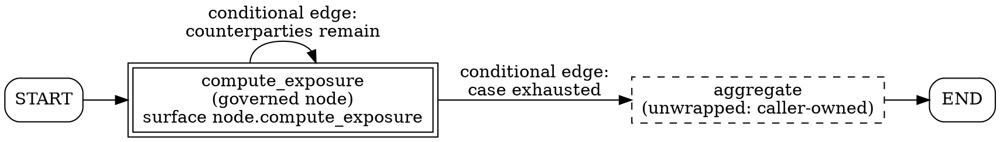

# LangGraph Integration

> **Opening scenario.** Northstar's Engineering Platform team has the Gateway comparison half-built. The CrewAI arm of Chapter 23 governs a single refund tool and produces a tidy three-event stream per call. The second arm is harder, and the difficulty is not the framework's application programming interface (API). Treasury's exposure analysis runs as a graph: a node that computes one counterparty's exposure, a conditional edge that sends control back to that node until the case is exhausted, a retry policy that re-runs it when the market-data read times out, and — because a treasury officer must confirm anything above a threshold — an interrupt that suspends the graph mid-run and resumes it from a checkpoint an hour later. When the team drops in the same style of wrapper they used for CrewAI, they get an evidence stream a reviewer cannot read. Nine records name the same identity and the same capability. Which are retries of one computation? Which are the loop's later visits? Which is the resumed continuation of a suspended run? The wrapper recorded *what* happened without recording *which execution each record belongs to*, and the framework features that make LangGraph useful are precisely the ones that make that omission fatal.

> **Learning objectives.**
> - Describe LangGraph's execution model at the level of detail a governance integration actually depends on: state graphs, nodes, edges, checkpointers, and per-task execution metadata.
> - Explain how the supported adapter derives occurrence identity from public framework execution information and attempt identity from the framework attempt counter combined with a validated recorder prefix.
> - Predict, for a retry, a loop visit, a parallel branch, an interrupt, and a checkpoint resume, what occurrence and attempt identifiers appear in the resulting evidence, and name the test that pins each behavior.
> - Explain why a graph interrupt is propagated as an incomplete attempt rather than a runtime failure, and what an evidence reviewer would misconclude if it were not.
> - Distinguish an *unsupported* surface from an *unwrapped* one, and state the different obligation each places on the integrator.
> - Read a cumulative resumed evidence stream and say what it does and does not establish.

> **Prerequisites.** Chapter 12 for the mission / operation / occurrence / attempt hierarchy, replay fingerprints, and ordering; Chapter 13 for the tier model; Chapter 14 for the three-state coverage taxonomy; Chapter 16 for the status badges and version axes; Chapter 19 for the authorization interface the adapter consumes; Chapter 20 for the runtime-events schema, explicit occurrence mode, and resume; Chapter 22 for the adapter boundary and the evaluate–record–execute sequence; Chapter 23 for the CrewAI arm of the same comparison. This chapter assumes no prior LangGraph knowledge.

## 24.1 What LangGraph is, in the terms this chapter needs

<span class="ix" data-ix="LangGraph">LangGraph</span> is a library for building stateful, multi-step applications as explicit graphs rather than as linear chains or free-running agent loops [@langgraph-docs]. Four of its concepts matter here, and the rest can be left aside without loss.

A <span class="ix" data-ix="state graph">state graph</span> is a directed graph whose vertices are **nodes** and whose edges determine what runs next. The graph carries a typed **state** object; each node receives the current state and returns an update to it, which the framework merges. Edges may be static or conditional, where a function of the current state chooses the next destination, and a conditional edge that names an already-visited node produces a loop. The application builds the graph, compiles it, and invokes it; the framework, not the application, decides how many times each node runs.

Three further features turn this from a control-flow convenience into a governance problem. LangGraph supports a per-node **retry policy**: if a node raises a matching exception, the framework re-runs the same node rather than failing the graph. It supports **parallel branches**: two edges leaving one vertex cause both destinations to be scheduled, so a node may be executing concurrently with its sibling. And it supports <span class="ix" data-ix="checkpointing">**checkpointing**</span>: a checkpointer persists graph state after each step, so a run can be suspended — most importantly by an `interrupt`, which pauses the graph to solicit human input — and resumed later in a different process from the saved state.

The last piece is the one an adapter builds on. When LangGraph executes a node it can pass that node a runtime object carrying public execution metadata about the task in progress: among other fields, a `task_id` identifying the scheduled unit of work and a one-based `node_attempt` counting how many times this task has been tried. That metadata is a public part of the framework's surface, which is what makes it usable as the basis of a governance claim rather than as a reverse-engineered internal.

> **Key idea.** The features that make a graph framework valuable — retry, loops, fan-out, suspend and resume — are exactly the features that make "the same identity used the same capability" an ambiguous sentence. A governance integration for such a framework is not primarily an interception problem. It is an *identity* problem, and Chapter 12 already built the identity model it needs.

## 24.2 The governed surface: one constructor, one status

The supported adapter's LangGraph surface is narrow and stated as such. Synchronous state-graph node invocation is wrapped through an explicit constructor, `make_governed_node`, which returns a callable the integrator registers with the graph builder in place of the raw node **[implemented]** (`adapters/nornyx-agentic-adapters/src/nornyx_agentic_adapters/langgraph.py:144-275`). There is no automatic interception: nothing is patched, no executor is subclassed, and a node the integrator does not wrap is simply an ordinary LangGraph node.

Two classes of check stand between a caller and a governed node, and the split between them is a design point worth naming. <span class="ix" data-ix="construction-time validation">Construction-time validation</span> runs once, when the governed node is built, and rejects configurations that could never produce valid evidence: a binding with a blank field, an action that is not callable, an action that is a coroutine function (with the message "M2-C supports synchronous LangGraph node actions only"), and a recorder that is not occurrence-aware. That last check is done by *probing* rather than by introspection — the constructor builds a throwaway occurrence identity, asks the recorder for the highest attempt recorded against it, and treats a `TypeError` or `ValueError` from either call as a configuration error (`langgraph.py:161-179`). A recorder created through the ordinary constructor rather than the explicit-occurrence factory fails here, before a single node runs (`tests/test_langgraph_adapter.py:102-117`).

<span class="ix" data-ix="invocation-time validation">Invocation-time validation</span> runs on every call and rejects execution metadata the adapter cannot honestly turn into identity: a missing runtime execution-information object, a `task_id` that is not a non-empty string, or a `node_attempt` that is not a positive integer (`langgraph.py:184-199`). All of these raise before the authorizer is consulted and long before the wrapped action could run; the test that pins this asserts both the diagnostic and that the action was never called (`tests/test_langgraph_adapter.py:120-125`). An adapter that cannot identify the execution it is about to authorize must refuse to authorize it, because an authorization it cannot attribute is an authorization it cannot evidence.

The chapter's other structural fact is that the LangGraph path does **not** route through the package's shared `enforce()` helper. `enforce()` records decisions through the mission-scoped `record_decision`, which has no place to put occurrence identity; the governed node instead performs the same evaluate–record–execute sequence inline against the occurrence-aware recorder methods (`langgraph.py:231-242`). The sequence and its guarantees are identical to Chapter 22's; only the recording call differs. Readers auditing the package should not expect to find the LangGraph adapter in `enforce()`'s call graph.

## 24.3 Deriving identity from public execution information

Chapter 12 defined the four-level hierarchy in the abstract: a <span class="ix" data-ix="mission">mission</span> is the complete governed run, an <span class="ix" data-ix="operation">operation</span> is the stable governed surface, an <span class="ix" data-ix="occurrence">occurrence</span> is one scheduled execution of that operation, and an <span class="ix" data-ix="attempt">attempt</span> is one try within an occurrence. The adapter's whole contribution is a mapping from LangGraph's public vocabulary onto those four levels, and the mapping is small enough to state in four lines.

The mission comes from the integrator, who passes one mission identifier when constructing the governed node and reuses it for the whole graph run and every resume. The operation is the binding's declared `surface` string — adapter-owned static configuration, never derived from node arguments or graph state. The occurrence is the framework's `task_id` verbatim. And the attempt is the framework's `node_attempt` offset by a base, computed as shown in Listing 24.1.

```python
        cache_key = (mission_id, binding.surface, task_id)
        with attempt_lock:
            if node_attempt == 1:
                base = recorder.max_recorded_attempt(
                    mission_id=mission_id,
                    operation_id=binding.surface,
                    occurrence_id=task_id,
                )
                attempt_bases[cache_key] = base
            else:
                base = attempt_bases.get(cache_key)
                if base is None:
                    highest = recorder.max_recorded_attempt(
                        mission_id=mission_id,
                        operation_id=binding.surface,
                        occurrence_id=task_id,
                    )
                    base = max(0, highest - (node_attempt - 1))
                    attempt_bases[cache_key] = base

        try:
            occurrence = RuntimeOccurrence(
                binding.surface, task_id, base + node_attempt
            )
        except (TypeError, ValueError) as exc:
            raise AdapterConfigurationError(...) from exc
```

**Listing 24.1 — Attempt identity from the framework counter plus a validated recorder prefix.** Verbatim from `adapters/nornyx-agentic-adapters/src/nornyx_agentic_adapters/langgraph.py:201-229`. The base is read from the recorder — not from the framework — because only the recorder knows what has already been recorded for this occurrence. The dictionary of bases is guarded by a `threading.Lock` (`langgraph.py:181-182`) so that two parallel branches computing bases concurrently cannot interleave; note that they key on distinct task identifiers anyway, so the lock protects the map rather than the arithmetic.

The reason a base is needed at all is the interaction between checkpoint resume and a one-based counter. When a run resumes from a checkpoint, LangGraph legitimately restarts `node_attempt` at one for the re-entered task, because from the framework's point of view this is a fresh execution segment. Taking that number literally would produce a second attempt 1 under an occurrence that already has one, which is exactly the record shape Chapter 12 classified as a replay. Offsetting by <span class="ix" data-ix="recorder prefix">the validated recorder prefix</span> — the highest attempt number already recorded for this mission, operation, and occurrence — makes the resumed attempt continue the sequence instead of colliding with it. The word "validated" is doing work: the prefix is read from a recorder whose stream has passed the schema, binding, and ordering checks of Chapter 20, not from an application-maintained counter that a bug could reset.

The `else` branch handles a narrower case: a re-entered node whose framework counter is already above one but for which this process holds no cached base. It reconstructs the base by subtracting the framework's own offset from the highest recorded attempt, floored at zero.

<figure class="nx-fig" id="fig-24-1">
  <div class="fig-body">
    <table class="fig-table">
      <tr><th>Nornyx identity level</th><th>Source</th><th>Owner</th><th>Varies across…</th></tr>
      <tr><td>Mission</td><td><code>mission_id</code> argument</td><td>Integrator</td><td>whole governed runs only</td></tr>
      <tr><td>Operation</td><td><code>SurfaceBinding.surface</code></td><td>Adapter configuration</td><td>governed surfaces</td></tr>
      <tr><td>Occurrence</td><td><code>Runtime.execution_info.task_id</code></td><td>LangGraph (public)</td><td>loop visits, parallel branches</td></tr>
      <tr><td>Attempt</td><td><code>node_attempt</code> + recorder prefix</td><td>LangGraph + recorder</td><td>retries, resumed segments</td></tr>
    </table>
  </div>
  <figcaption><b>Figure 24.1 — Where each level of occurrence identity comes from.</b> The teaching purpose is the "owner" column. Two levels are declared by the people integrating the system and are therefore reviewable in a diff; two are asserted by the framework at run time and are only as trustworthy as the framework and the cooperative producer reporting them. A reviewer asking how much of a stream's identity is a design decision and how much is a runtime observation reads the answer off this table.</figcaption>
</figure>

## 24.4 Five situations, five different answers

The value of the mapping is best seen by asking what changes in each of LangGraph's five interesting execution behaviors. Table 24.1 answers that, and every row is backed by a test that runs against the pinned framework version rather than a stub of it.

| Situation | Occurrence identifier | Attempt numbers | What the stream shows | Test |
|---|---|---|---|---|
| Native retry (node raises, retry policy re-runs it) | one, unchanged | 1, 2, 3 | one occurrence, three authorizations, two `runtime_failed` records, one success | `test_native_retry_maps_to_one_occurrence_and_three_attempts` |
| Loop visit (conditional edge returns to the node) | a new one per visit | 1 in each | distinct occurrences, each with its own authorization and success terminal | `test_native_loop_creates_distinct_occurrences` |
| Parallel branches (two nodes scheduled together) | distinct per branch | 1 in each | concurrent occurrences that never share identity | `test_native_parallel_branches_have_distinct_occurrences` |
| Interrupt (graph suspends for human input) | one, unchanged | 1, left incomplete | authorization records with no terminal event, and **no** `runtime_failed` | `test_interrupt_resume_offsets_reset_node_attempt` |
| Checkpoint resume (framework counter restarts at 1) | the same one | continues at 2 | one occurrence spanning both segments, contiguous attempts | same test |

**Table 24.1 — What each LangGraph behavior does to occurrence identity.** All tests are in `adapters/nornyx-agentic-adapters/tests/test_langgraph_adapter.py` (lines 171, 199, 229, and 262 respectively), and all construct real `StateGraph`, `RetryPolicy`, `InMemorySaver`, `interrupt`, and `Command` objects from `langgraph==1.2.2` (imports at lines 13-16). The teaching purpose is that these five rows are five *different* answers: a design that collapsed any two of them into the same identity shape would make the corresponding pair of situations indistinguishable in evidence, which is the defect the opening scenario describes.

Two rows deserve elaboration because they are the ones most likely to be got wrong by a hand-written wrapper.

The retry row is the reason attempt exists as a level at all. LangGraph's retry policy re-runs the node body; the adapter therefore re-runs the full evaluate–record–execute sequence, so each native attempt is separately authorized and separately recorded before user node code runs. This is not merely bookkeeping. Chapter 12's rule that authorization allowances are scoped to the attempt means an ALLOW granted for attempt 1 does not silently cover attempt 2: if the delegation authorizing the capability expires between the two, attempt 2 is denied on its own merits. A wrapper that authorized once and let the framework retry underneath it would produce the decision-reuse defect that Chapter 15's side-effect ledger was built to catch.

The loop row is the reason occurrence exists as a level. Each loop visit is a new scheduled task with a new task identifier, so the governed node's second visit records under a different occurrence with its attempt counter starting again at one. The test asserts this precisely: two success terminals, two distinct occurrence identifiers, and the attempt set equal to `{1}` (`tests/test_langgraph_adapter.py:213-221`). Without occurrence identity these two visits would fingerprint identically on every substantive field and the second would be rejected as a replay, which is the failure mode Chapter 12's Listing 12.1 illustrated. Occurrence identity is what makes deliberate repetition representable.

## 24.5 Interrupts are control flow, not failure

The single most consequential design decision in this adapter occupies eight lines of code. LangGraph signals suspension by raising an exception from a dedicated bubble-up hierarchy: `interrupt()` raises one, and so do parent-directed commands. Syntactically, an interrupt reaches the adapter's `except` clause the same way a genuine node crash does. Semantically they are opposites, and the adapter distinguishes them.

```python
        try:
            result = action(state)
        except GraphBubbleUp:
            # LangGraph bubble-up exceptions (including interrupts and parent
            # commands) are control flow, not execution failure. Drop the
            # in-process base so a resumed/re-entered node offsets from the
            # now-validated incomplete prefix when node_attempt restarts at 1.
            with attempt_lock:
                attempt_bases.pop(cache_key, None)
            raise
        except Exception:
            recorder.record_occurrence_observation(
                "runtime_failed",
                mission_id=mission_id,
                occurrence=occurrence,
                actor_ref=binding.identity_ref,
                capability_ref=binding.capability_ref,
            )
            raise
```

**Listing 24.2 — Two exception classes, two evidence outcomes.** Verbatim from `adapters/nornyx-agentic-adapters/src/nornyx_agentic_adapters/langgraph.py:244-262`. A bubble-up exception is re-raised with nothing recorded, leaving the attempt without a terminal event; any other exception records a `runtime_failed` observation and is then re-raised so the framework's retry policy can act on it. The cache eviction in the first branch is what allows the resumed segment to compute its base from the recorder rather than from a stale in-process value.

Why does the distinction matter to evidence rather than merely to tidiness? Recall from Chapter 12 that `runtime_failed` is a *failure terminal*: recording it closes the attempt with an outcome. Three consequences follow. First, the record would be false — nothing failed; a human was asked a question. Second, a reviewer counting failures against this operation would see a failure rate driven entirely by how often the workflow requests human input. Third, and most sharply, the terminal would interact badly with the attempt rules: an attempt that has recorded an outcome cannot record a contradictory one, so the resumed segment's success would either contradict the recorded failure or would have to be pushed into a fabricated new occurrence, breaking the link between the suspended work and its continuation.

What the adapter produces instead is an <span class="ix" data-ix="incomplete attempt">incomplete attempt</span>: authorization records with no terminal. That shape is valid — the validator requires contiguity and non-contradiction, not completeness — and it is *informative*, because an attempt with no outcome is exactly what a suspended execution is. The adapter's test asserts the negative directly, checking that no `runtime_failed` event appears in the stream after the interrupt, and then that the whole stream still validates (`tests/test_langgraph_adapter.py:274-283`).

Figure 24.2 traces the full suspend-and-resume path, because the interaction between the framework counter reset, the dropped cache entry, and the recorder prefix is easier to read as a sequence than as prose.

<figure class="nx-fig" id="fig-24-2">
  <div class="fig-body">
    <div class="seq">
      <div class="seq-cols" data-cols="Graph|Governed node|Authorizer|Recorder|Node action"></div>
      <div class="msg" data-from="1" data-to="2" data-kind="call">invoke task-9f3c1a7, node_attempt = 1</div>
      <div class="msg" data-from="2" data-to="4" data-kind="call">max_recorded_attempt(...) → 0, so attempt = 1</div>
      <div class="msg" data-from="2" data-to="3" data-kind="call">evaluate(CapabilityRequest)</div>
      <div class="msg" data-from="3" data-to="2" data-kind="return">ALLOW</div>
      <div class="msg" data-from="2" data-to="4" data-kind="call">record_occurrence_decision — requested, allowed @ attempt 1</div>
      <div class="msg" data-from="2" data-to="5" data-kind="call">action(state)</div>
      <div class="msg" data-from="5" data-to="2" data-kind="deny">GraphBubbleUp (interrupt: awaiting officer)</div>
      <div class="msg" data-from="2" data-to="1" data-kind="deny">re-raise — no record, cached base dropped</div>
      <div class="msg" data-from="1" data-to="2" data-kind="call">resume: same task-9f3c1a7, node_attempt reset to 1</div>
      <div class="msg" data-from="2" data-to="4" data-kind="call">max_recorded_attempt(...) → 1, so attempt = 2</div>
      <div class="msg" data-from="2" data-to="3" data-kind="call">evaluate(CapabilityRequest) — authorized again</div>
      <div class="msg" data-from="2" data-to="4" data-kind="call">record_occurrence_decision @ attempt 2</div>
      <div class="msg" data-from="2" data-to="5" data-kind="call">action(state) → result</div>
      <div class="msg" data-from="2" data-to="4" data-kind="call">record_occurrence_observation agent_invoked @ attempt 2</div>
    </div>
  </div>
  <figcaption><b>Figure 24.2 — Interrupt and resume across one occurrence.</b> The teaching purpose is the two calls to <code>max_recorded_attempt</code>: the same framework input — <code>node_attempt = 1</code> on task <code>task-9f3c1a7</code> — yields Nornyx attempt 1 the first time and attempt 2 the second, because the recorder's own validated prefix differs. Note also that the resumed segment is authorized again rather than inheriting the pre-interrupt decision, which is what makes an approval that expired during the suspension take effect.</figcaption>
</figure>

Resume across a *process* boundary needs one more step, and it is the integrator's, not the adapter's. Nothing in the adapter persists evidence. To continue a run in a new process the integrator persists the cumulative stream alongside the framework checkpoint and rebuilds the recorder with `EvidenceRecorder.resume(...)` before invoking the graph again **[implemented]**. That factory revalidates and deeply detaches the complete prior stream, requires the producer identity, schema version, and occurrence mode to match, refuses a resumed decision instant that precedes any prior event timestamp, and restores the per-mission sequence counters, so what the recorder then emits is <span class="ix" data-ix="cumulative evidence">cumulative evidence</span> — the whole run, not a fragment of it (`nornyx/agentic/authz.py:1305-1396`). Differential chunks and multi-producer merging are not supported, which is a boundary rather than an omission: a merged stream would need distributed causality, and Chapter 12 established that a single-producer ordering model does not supply it.

## 24.6 A worked graph: the Ledger analyst path

Thread C's Ledger workflow gives the smallest realistic graph that exercises a loop and a retry at once. Treasury's `analyst` computes exposure for each counterparty named in a payment-exception case. It holds `analyze.exposure` only by a bounded delegation from `planner`, and it reads from `treasury-data`. The graph has one governed node, `compute_exposure`, a conditional edge that returns to it while counterparties remain, and a retry policy for the transient read failures Treasury's data service produces under load. A second node, `aggregate`, is a pure function over already-fetched values that the team deliberately leaves ungoverned.



**Figure 24.3 — The Ledger analyst graph.** The double-bordered node is wrapped: every invocation is authorized and recorded before the node body runs. The dashed node is not wrapped, and the adapter's coverage inventory says so as a matter of declared policy rather than oversight — graph topology is caller-owned, so which nodes are governed is a decision visible only in the integrator's own code. The teaching purpose is that the picture, not the adapter, is where a reviewer learns the coverage of this particular deployment.

Listing 24.3 shows the integration. Everything outside the `make_governed_node` call is ordinary LangGraph.

```python
recorder = EvidenceRecorder.for_occurrences(
    authorizer, context, producer_id="ledger-analyst-graph"
)

governed_compute = make_governed_node(
    binding=SurfaceBinding(
        surface="node.compute_exposure",
        identity_ref="identity.ledger.analyst",
        capability_ref="analyze.exposure",
    ),
    authorizer=authorizer,
    context=context,
    recorder=recorder,
    mission_id="CASE-4471",
    action=compute_exposure,
)

builder = StateGraph(CaseState)
builder.add_node(
    "compute_exposure",
    governed_compute,
    retry_policy=RetryPolicy(max_attempts=3, retry_on=TimeoutError),
)
builder.add_node("aggregate", aggregate)
builder.add_edge(START, "compute_exposure")
builder.add_conditional_edges("compute_exposure", next_step)
builder.add_edge("aggregate", END)
graph = builder.compile()
```

**Listing 24.3 — Wrapping one node of the Ledger analyst graph.** Illustrative composition, not executed for this book: LangGraph is not installed in the authoring environment. Every call signature, argument name, and constructor used here is verified against the adapter source (`langgraph.py:144-152` for `make_governed_node`; `binding.py:19-27` for `SurfaceBinding`) and against the adapter's own tests, which build graphs in exactly this shape (`tests/test_langgraph_adapter.py:61-83, 199-212`). Identity and capability references follow Thread C's canonical names.

Now run the graph over a case with two counterparties, where the first computation times out once before succeeding. Listing 24.4 shows the events, abridged to the fields that carry the argument; each real event also binds the network identifier, contract digest, network lock digest, and subject revision, as Chapter 20 described.

```json
{"sequence": 1, "event_type": "capability_requested", "actor_ref": "identity.ledger.analyst",
 "capability_ref": "analyze.exposure",
 "occurrence": {"operation_id": "node.compute_exposure", "occurrence_id": "task-9f3c1a7", "attempt": 1}}
{"sequence": 2, "event_type": "capability_allowed", "policy_decision": "allow",
 "delegation_ref": "delegation.planner_to_analyst",
 "occurrence": {"operation_id": "node.compute_exposure", "occurrence_id": "task-9f3c1a7", "attempt": 1}}
{"sequence": 3, "event_type": "runtime_failed",
 "occurrence": {"operation_id": "node.compute_exposure", "occurrence_id": "task-9f3c1a7", "attempt": 1}}
{"sequence": 4, "event_type": "capability_requested",
 "occurrence": {"operation_id": "node.compute_exposure", "occurrence_id": "task-9f3c1a7", "attempt": 2}}
{"sequence": 5, "event_type": "capability_allowed", "policy_decision": "allow",
 "occurrence": {"operation_id": "node.compute_exposure", "occurrence_id": "task-9f3c1a7", "attempt": 2}}
{"sequence": 6, "event_type": "agent_invoked",
 "occurrence": {"operation_id": "node.compute_exposure", "occurrence_id": "task-9f3c1a7", "attempt": 2}}
{"sequence": 7, "event_type": "capability_requested",
 "occurrence": {"operation_id": "node.compute_exposure", "occurrence_id": "task-4b8e2d0", "attempt": 1}}
{"sequence": 8, "event_type": "capability_allowed", "policy_decision": "allow", "...": "same occurrence"}
{"sequence": 9, "event_type": "agent_invoked", "...": "same occurrence"}
```

**Listing 24.4 — The explicit-mode stream for one retry and one loop visit.** Illustrative and abridged, but every structural feature is verified: the two-intent decision shape (`capability_requested` then `capability_allowed`, with `delegation_ref` carried on the allowance when the capability is held by delegation) comes from the core evaluator (`nornyx/agentic/authz.py:942-961`); the `runtime_failed` and `agent_invoked` observations and their field sets come from the adapter (`langgraph.py:254-270`); and the occurrence and attempt patterns are those the retry and loop tests assert. The teaching purpose is that a reviewer can now answer the opening scenario's question by reading identity fields alone: sequences 1–6 are one intended computation tried twice, sequences 7–9 are a second, deliberate computation.

> **Case study — Gateway.** Northstar's Thread D comparison now has its second governed arm. The team records two rows in the claim register. The first: *Claim — "every invocation of `compute_exposure` in the Ledger analyst graph is authorized and recorded before the node body runs." Component — the governed node wrapper, in process. Evidence — the explicit-mode stream, validating. Tier — 2, cooperative, declared surfaces only. Residual risk — a node the team forgets to wrap is ungoverned and produces no record of being ungoverned.* The second row is the one the team argued about: *Claim — "the evidence distinguishes retries from repeated work." Component — the runtime-events explicit occurrence mode. Evidence — the validated stream and its occurrence identifiers. Residual risk — a cooperative producer can assert whatever occurrence identity it likes; validation proves structural consistency, not execution truth.* Chapter 25 adds the coverage row and completes the four-path decision table.

## 24.7 What is not covered, and the difference between two ways of not being covered

The adapter declares five surfaces in a machine-readable inventory, of which one is wrapped **[implemented]** (`langgraph.py:82-125`). Table 24.2 reproduces them with the distinction this section exists to teach.

| Surface | Status | Declared reason (abridged) | What the integrator must do |
|---|---|---|---|
| `sync_node_invocation` | wrapped | Authorized through public `Runtime.execution_info`, "including native retry, loop, parallel-branch, interrupt, and checkpoint-resume behavior" | Wrap each node they intend to govern |
| `async_node_invocation` | unsupported | "M2-C supplies no asynchronous node wrapper." | Do not use async nodes for governed work |
| `remote_or_distributed_execution` | unsupported | "No remote service or distributed executor is attested." | Do not distribute governed nodes |
| `subgraph_and_tool_node_internals` | unsupported | Subgraphs and prebuilt tool-node internals "are not implicitly intercepted; their callable surfaces require separate wrappers." | Wrap the callables inside, or accept them as ungoverned |
| `graph_topology` | **unwrapped** | "The caller owns StateGraph construction and must wrap each governed node explicitly." | Perform, review, and audit the wrapping |

**Table 24.2 — The LangGraph coverage inventory, with obligations.** Verbatim statuses and abridged reasons from `COVERAGE_INVENTORY` (`langgraph.py:82-125`); the last column is this book's reading of what each status transfers to the deployer. `graph_topology` is the only use of the `unwrapped` status anywhere in the repository.

Chapter 14 introduced the three-state taxonomy in the abstract. Here is the concrete difference, and it is worth being slow about because the two words look like synonyms and are not.

An <span class="ix" data-ix="unsupported surface">**unsupported**</span> surface is one the adapter's authors decided not to intercept. The decision is theirs, it is recorded with a reason, and it could in principle be revisited by a future release that adds an asynchronous wrapper. The obligation it places on the integrator is *avoidance*: route governed work away from this surface, and understand that work which reaches it is ungoverned. Nothing the integrator can write in their own code turns an unsupported surface into a governed one; only a new adapter release can.

An <span class="ix" data-ix="unwrapped surface">**unwrapped**</span> surface is one no adapter could intercept, because the decision it represents belongs to the caller. Graph topology is the clean case. The set of nodes in a state graph, and which of them are governed, is chosen by whoever writes the builder code. An adapter has no hook there and should not pretend otherwise: a library that silently wrapped every node would be making a policy decision it has no standing to make, and would fail loudly the moment a node's action was a coroutine. The obligation this status places on the integrator is *work*, and therefore *audit*: someone must wrap each governed node, and someone else must check that they did. In Figure 24.3, that obligation is discharged for `compute_exposure` and consciously waived for `aggregate`.

The practical test for telling them apart is to ask who could change the situation. If a new release of the adapter could close the gap, the surface is unsupported. If only a change in the integrator's own code could close it, the surface is unwrapped. Getting this wrong in either direction is costly: treating an unwrapped surface as unsupported produces a deployment that waits for a vendor to ship something the vendor cannot ship, and treating an unsupported surface as unwrapped produces an integrator who believes a wrapper they wrote is doing something it is not.

> **Misconception.** *"The LangGraph adapter governs LangGraph."* It governs the bodies of synchronous nodes the integrator explicitly wraps, in one pinned framework version, under one mission identity, and it records what it authorized. It does not observe edges, conditional routing, state mutations between nodes, subgraph internals, or anything a node body does after the authorization returns. A node that is authorized for `analyze.exposure` and then reads a table it should not have read has been authorized, recorded, and unconstrained: the decision was about a declared capability, not about the node's actual behavior. Chapter 22's normalization discipline — bindings built from static adapter configuration, never from framework arguments — is what keeps that boundary honest rather than accidentally broad.

> **Assurance boundary.** Run the eight questions from Chapter 3 against this integration. *What is guaranteed*: for each wrapped node invocation, a decision is evaluated and recorded before the node body runs, and the node body runs at most once per authorization. *Which component enforces it*: the governed-node callable, in the application's own process. *What evidence proves it*: an explicit-mode runtime-events stream that validates against the locked contract revision. *What assumptions are required*: that the integrator wrapped the nodes they meant to govern, that the framework's reported task identity and attempt counter are truthful, and that exactly the pinned framework version is installed. *How it can be bypassed*: register an unwrapped node, call the action directly, use an asynchronous node, or run the work outside the graph. *What happens when it fails*: construction and invocation validation both raise before evaluation, and evaluation or recording errors propagate before the action — fail-closed at every step. *Which tier*: 2, cooperative, declared surfaces only. *What remains unproven*: everything about whether the recorded events are true, and everything about node behavior after an ALLOW.

## Summary

LangGraph builds applications as state graphs whose nodes the framework, not the application, decides when to run, with retries, loops, parallel branches, and checkpointed suspension all under framework control. That is what makes an occurrence-blind evidence stream unreadable, and it is why the supported adapter's central contribution is an identity mapping rather than an interception trick. One constructor wraps one surface: synchronous node invocation. The mission comes from the integrator, the operation from the adapter's declarative binding, the occurrence from the framework's public task identifier, and the attempt from the framework's one-based counter offset by the highest attempt the validated recorder already holds for that occurrence. That offset is what makes checkpoint resume continue an occurrence instead of colliding with it. Interrupts are re-raised without a failure record, leaving a valid incomplete attempt, because recording a failure for a suspension would be false and would collide with the rule that an attempt has one outcome. Five framework behaviors produce five different identity shapes, each pinned by a test against the pinned framework version. And the inventory names four surfaces this adapter does not cover, one of which — graph topology — is not a gap the adapter could close but an obligation transferred to whoever builds the graph.

- Occurrence identity is derived from public framework metadata, never from internals.
- Each native retry is separately authorized; allowances are attempt-scoped.
- A loop visit is a new occurrence; a retry is a new attempt in the same one.
- Interrupt is control flow: no `runtime_failed`, an incomplete attempt, a resumable stream.
- Resume produces cumulative evidence; differential chunks and multi-producer merges are not supported.
- Unsupported means the adapter's authors declined; unwrapped means the caller owns the decision.

## Review questions

1. A governed node is invoked with `task_id = "t-1"` and `node_attempt = 1`, and the recorder already holds attempt 2 for that mission, operation, and occurrence. What Nornyx attempt number does the adapter produce, and what real-world situation does that combination of inputs describe?
2. Explain why the adapter re-authorizes a resumed segment rather than carrying forward the decision recorded before the interrupt. Give one concrete governance outcome that differs between the two designs.
3. A colleague proposes recording `runtime_failed` on interrupt "so the stream always has a terminal event per attempt." Give three distinct arguments against, one about truthfulness, one about metrics, and one about the attempt rules from Chapter 12.
4. Distinguish `async_node_invocation` (unsupported) from `graph_topology` (unwrapped) using the "who could change the situation" test. Then state what a deployment audit should look for in each case.
5. The adapter validates `task_id` and `node_attempt` on every invocation and refuses to proceed if either is malformed, rather than substituting a default. Argue for that choice in terms of what an evidence stream would otherwise contain.
6. The LangGraph path does not call the package's shared `enforce()` helper. What guarantee does it reimplement inline, and what would be lost if it used `enforce()` unchanged?

## Exercises

1. **Predict the stream.** Take the Ledger analyst graph of Figure 24.3 and change the run: three counterparties, the second of which times out twice before succeeding, and an interrupt for treasury-officer confirmation before the third. Write out the full list of occurrence identifiers and attempt numbers in order, mark which attempts have terminal events and which do not, and state how many separate authorization decisions the run requires. Then say which single field a reviewer would use to tell the retried computation from the third counterparty's computation.
2. **Audit an unwrapped surface.** For a graph-structured workflow in your own organization, write the coverage inventory you would ship if you were the adapter's author. Assign each surface one of wrapped, unsupported, or unwrapped, and write the one-sentence reason each entry would carry. Then write the review checklist an auditor would use for every entry you marked unwrapped — the checklist is the deliverable, because unwrapped status is only meaningful if someone checks the work it transfers.
3. **Break the offset.** Reason through what a hand-written wrapper would produce if it used `node_attempt` directly with no recorder prefix, for a run that is interrupted once and resumed. Write the resulting event list, identify the validation diagnostic the stream would earn from Chapter 12's rule set, and explain why that diagnostic is the *correct* outcome rather than an inconvenience to be suppressed.

## Further reading

- [@langgraph-docs] — the framework's own description of state graphs, retry policies, checkpointers, and interrupts; read the persistence and human-in-the-loop pages together, because their interaction is what this chapter's identity model exists to handle.
- [@nornyx-repo] — at the pinned revision, `adapters/nornyx-agentic-adapters/src/nornyx_agentic_adapters/langgraph.py` and its test module are short enough to read end to end, and the tests are the clearer specification.
- [@lamport-clocks] — why ordering within one producer's stream is a weaker claim than causality across producers, which is the reason resume is cumulative rather than merged.
- [@anthropic-agents] — a neutral survey of agent workflow patterns, useful for judging which of an application's control-flow choices actually need governed identity and which do not.
- [@schneider-enforceable] — the formal boundary of what an execution monitor can enforce; a good corrective to the intuition that wrapping more surfaces is always the answer.
