# Adapter Conformance and Coverage

> **Opening scenario.** A procurement reviewer at Northstar Services is reading the Engineering Platform team's Gateway assessment and asks a reasonable-sounding question: "You say the adapters are conformant. Can I see the conformance report?" The team can produce a conformance report. It is generated by the Nornyx toolchain, it is schema-validated, and it carries a block of flags asserting that no connector was enabled, no network was used, no credential was loaded, and no adapter was executed. It says nothing whatever about the CrewAI or LangGraph adapters of Chapters 23 and 24, because it is a report about *declarations inside a contract document*, not about Python code that intercepts framework calls. Two entirely different artifacts share one word. Handing the reviewer the wrong one would not be a lie — every statement in it is true — but it would be an overclaim of the most dangerous kind: an authentic document answering a question nobody asked. This chapter separates the two, and then builds the thing the reviewer actually wanted.

> **Learning objectives.**
> - Distinguish runtime adapter conformance (an engineering practice) from static adapter conformance (a generated report about contract declarations), and explain the overclaim each enables if confused.
> - State the test obligations a "wrapped" label carries, and identify the pipeline mechanisms that make them machine-checked rather than asserted.
> - Explain why exact framework pins that fail closed at import are a governance property, and describe the upgrade as a governance event with its own evidence.
> - Apply the coverage evolution policy: a surface stays unsupported until its tests exist.
> - Read a package's boundaries — alpha status, an independent version line, a bounded dependency range, unpackaged sibling trees — and say what a consumer may and may not conclude.
> - Compare four integration paths for one workflow on coverage, evidence, failure behavior, and supportable assurance tier.

> **Prerequisites.** Chapter 13 (tiers), Chapter 14 (coverage taxonomy and bypass), Chapter 15 (the five-test rule, failure injection, zero-skip gates), Chapter 16 (status badges, version axes, snapshot pinning), and Chapters 22 through 24 (the adapter boundary, the CrewAI surface, the LangGraph surface). This chapter deliberately does not re-teach the five-test rule; it asks what a repository must contain for that rule to be more than a good intention.

## 25.1 One word, two artifacts

The Nornyx repository uses the word <span class="ix" data-ix="conformance">conformance</span> for two things that have nothing in common except the word: <span class="ix" data-ix="conformance!runtime adapter">runtime adapter conformance</span>, an engineering practice, and <span class="ix" data-ix="conformance!static adapter">static adapter conformance</span>, a generated report. Table 25.1 puts them side by side, because the fastest way to prevent the opening scenario's error is to make the difference concrete before either is discussed in detail.

| | Runtime adapter conformance | Static adapter conformance |
|---|---|---|
| Subject | Python code that intercepts framework calls | `adapter` blocks declared inside a `.nyx` contract |
| Question answered | Does the wrapper behave as its coverage inventory declares? | Do these declarations name safe modes, resolvable references, and complete non-goals? |
| Artifact | A test suite plus continuous-integration jobs | A generated JavaScript Object Notation (JSON) report |
| Produced by | `pytest` runs against real pinned frameworks | `build_adapter_conformance_report(doc)` |
| Executes anything? | Yes — the frameworks and the wrapped actions | No, and the report asserts so in a schema-constrained block |
| Status in this book | **[implemented as practice]** | **[implemented]** |
| Evidence about the other | None | None |

**Table 25.1 — Two conformance concepts that share a word.** The static report's generator lives in `nornyx/connector_runtime.py:769-801` and its schema in `schemas/adapter_conformance_report.schema.json`; the runtime practice lives in `adapters/nornyx-agentic-adapters/tests/` and `.github/workflows/ci.yml`. No artifact in the repository links them: a search for any reference to `adapter_conformance` beneath `adapters/` returns nothing. The teaching purpose is the last row. Each artifact is honest about its own subject and silent about the other's, so citing either as evidence for the other is a category error rather than an exaggeration.

The two sit on opposite sides of the design-time/runtime line drawn in Chapter 16: a design-time check on a document, and a claim about code that executes inside a running application. An organization that assembles an evidence package (Chapter 36) with the static report filed under "our framework integration is verified" has produced a package that will survive a superficial review and collapse under a competent one.

## 25.2 What a "wrapped" label owes

Chapter 14 established that a coverage inventory is an interface, and Chapter 15 established that each claimed surface owes five tests — allow, deny, failure, bypass, evidence. Neither chapter answered the operational question: what must a repository *contain* for a `wrapped` label to be worth more than the sincerity of the person who typed it? The adapter package's answer has five layers, and each closes a gap the previous one leaves open. Figure 25.1 shows them as a flow from declaration to publishable claim.

<figure class="nx-fig" id="fig-25-1">
  <div class="fig-body">
    <div class="layers">
      <div class="layer authority" data-note="closed enum, mandatory reason string">1. Declaration — the surface is entered in a machine-readable coverage inventory</div>
      <div class="layer" data-note="allow · deny · failure · bypass · evidence">2. Claim tests — the five-test rule, per wrapped surface</div>
      <div class="layer" data-note="crewai==1.15.4, langgraph==1.2.2 installed by pip">3. Real framework — the tests run against the pinned framework, not a stub</div>
      <div class="layer" data-note="JUnit XML parsed; skipped &gt; 0 or tests == 0 fails the job">4. Zero-skip gate — the suite cannot silently not run</div>
      <div class="layer" data-note="fresh venv, sockets blocked, run from outside all source roots">5. Installed-wheel smoke — the artifact that ships is the artifact tested</div>
    </div>
  </div>
  <figcaption><b>Figure 25.1 — Five layers behind one <code>wrapped</code> label.</b> Each layer answers a failure the layer above cannot detect: a declaration with no tests, tests against a stub of the framework rather than the framework, a suite that skipped, and a pass that depended on an importable working tree. The teaching purpose is that a coverage claim is only as strong as its weakest layer, and that four of the five are pipeline properties rather than code properties — which means a code review alone can never establish them.</figcaption>
</figure>

Layers one and two were built in Parts III and V and need no repetition here. Layers three through five are what this chapter adds, and each is worth reading as a defense against a specific, common way of producing a green pipeline that means nothing.

**Real frameworks, not stubs.** The framework-specific jobs install the exact pinned distributions by name — `crewai==1.15.4` in one job, `langgraph==1.2.2` in another — and assert the installed version before running anything (`.github/workflows/ci.yml:117-246, 248-291`). The LangGraph tests then construct genuine `StateGraph`, `RetryPolicy`, `InMemorySaver`, `interrupt`, and `Command` objects, so the retry, loop, and interrupt behaviors of Chapter 24 are exercised by the framework's own scheduler rather than by the test author's model of it. The only deterministic substitutes anywhere in the framework jobs are the language model, replaced by a scripted offline implementation, and — in the wheel smoke only — the policy engine, replaced by trivial allow and deny stand-ins. Stubbing the model makes a test deterministic; stubbing the framework would make it circular.

**<span class="ix" data-ix="zero-skip gate">Zero-skip gates</span>.** Chapter 15 showed the mechanism on the CrewAI job. The LangGraph job applies it identically, running the two LangGraph test modules with a JUnit-format Extensible Markup Language (XML) report and then failing the build if the parsed skip count is nonzero *or* the test count is zero (`ci.yml:275-281`). This is necessary precisely because the test modules open with the skip-if-absent idiom, which is correct for the extras-free build matrix and catastrophic if it is the only thing standing between a missing framework and a green check.

**The artifact that ships.** The last layer is the one most often missing from otherwise careful projects. After the tests pass, the pipeline builds the adapter wheel, creates a fresh virtual environment, installs the core wheel built from the *same candidate commit* rather than from the package index, installs the adapter wheel, and runs an <span class="ix" data-ix="installed-wheel smoke test">installed-wheel smoke test</span> from outside every source directory (`ci.yml:282-291`; `adapters/nornyx-agentic-adapters/scripts/test_wheel_install.py`). Listing 25.1 shows what that probe checks.

```python
def _blocked(*_a, **_k):
    raise AssertionError("network access attempted during adapter runtime operation")

socket.socket.connect = _blocked
socket.create_connection = _blocked

import nornyx_agentic_adapters as naa
...
print(json.dumps({
    "status": "pass",
    "version": naa.__version__,
    "crewai_in_sys_modules": "crewai" in __import__("sys").modules,
    "langgraph_in_sys_modules": "langgraph" in __import__("sys").modules,
}))
```

**Listing 25.1 — The installed-wheel probe, abridged.** From `adapters/nornyx-agentic-adapters/scripts/test_wheel_install.py:38-75`, with the caller's checks at lines 136-154. Three assertions do distinct work. Network primitives are replaced before the package is imported, so any runtime network access raises rather than succeeding quietly; the script's own docstring is careful to scope this claim to *runtime use* rather than to installation, since resolving a dependency legitimately needs an index. The reported version must equal the version in the wheel's filename, which catches a stale build. And neither framework may appear in `sys.modules` after a base import, which enforces the extras boundary that lets the package be installed without pulling in either framework. Only after those pass does the script install `langgraph==1.2.2` and probe the LangGraph submodule's declared metadata and inventory.

Two smaller tests complete the picture and are worth naming because they encode boundaries rather than behaviors. `tests/test_import_boundary.py` asserts in fresh subprocesses that importing the adapter package touches neither framework, that importing core Nornyx never pulls in the adapter package, and — statically, by parsing the source — that no module-level framework import exists outside the extras-gated submodules. `tests/test_no_network.py` asserts that `enforce()` and the contract types perform no network input or output. Both are <span class="ix" data-ix="negative control">negative controls</span> in Chapter 14's sense: they fail when something is *added*, which is the only kind of test that survives an enthusiastic future contributor.

> **Design checkpoint.** Ask of any component you rely on for a governance property: which of Figure 25.1's five layers can you personally verify from the outside? Layer one is usually readable. Layer two requires the tests to be published. Layers three to five require the pipeline configuration to be published, and if it is not, the strongest available statement about the component is "its authors say it works," which is a statement about people rather than software.

## 25.3 Static conformance, and the value of an all-false block

The second artifact is narrower and, within its scope, unusually clean. A `.nyx` contract may declare `adapter` blocks — contract bridges to external ecosystems — and the schema for those declarations pins `execution_mode` to the constant `contract_only` and `live_connector_execution` to the constant `false`, and requires a `non_goals` list drawn from a closed enumeration **[implemented]** (`schemas/adapter_contract.schema.json:37-42, 99-112`). The generator then produces a report whose own schema is equally constrained; Listing 25.2 shows its shape.

```json
{
  "schema": "nornyx.adapter_conformance.v0.7",
  "mode": "static_adapter_connector_contract_conformance",
  "status": "requires_human_approval",
  "safety": {
    "connectors_enabled": false, "adapters_executed": false,
    "network_used": false, "commands_executed": false,
    "credentials_loaded": false, "default_execution_mode": "disabled",
    "adapter_contracts_executed": false,
    "live_connector_execution_allowed": false
  },
  "adapters": [{"name": "...", "execution_mode": "contract_only",
                "live_connector_execution": false, "execution": "not_executed",
                "decisions": [{"status": "ready",
                               "code": "ADAPTER_EXECUTION_MODE_CONTRACT_ONLY"}]}]
}
```

**Listing 25.2 — A conformance report and its safety block.** Shape drawn from `schemas/adapter_conformance_report.schema.json:6-54` and the generator `nornyx/connector_runtime.py:769-801`. Every field in the `safety` block is a JSON-Schema `const`, so a report claiming that anything *was* executed is not merely wrong, it is unrepresentable — and the repository has a test that reads the schema file and asserts those constants directly (`tests/test_v07_adapter_conformance.py:124-133`).

The design idea in that block generalizes well beyond this repository. A report's <span class="ix" data-ix="safety block">safety block</span> is a set of assertions about what the *report generator itself* did not do. Most tools describe their findings; few describe their own footprint. Making the footprint part of the schema, with constant values, converts "we promise this analysis is inert" from a sentence in a README into a property a validator can check on any report anyone hands you, including one you did not generate. When Chapter 36 assembles an audit package, that property is what lets an auditor accept a report from an untrusted source without first auditing the tool that made it.

What the report establishes is correspondingly narrow: that declared modes are safe, that referenced policies, evaluations, evidence, and connectors resolve, that connector protocols fall inside the supported set, and that the mandatory non-goals are complete — producing decision codes such as `ADAPTER_EXECUTION_MODE_CONTRACT_ONLY` and, on an unsafe contract, the mirrored `ADAPTER_EXECUTION_MODE_UNSAFE` with an overall status of `blocked` (`tests/test_v07_adapter_conformance.py:20-111`). It does not run anything, and it is not evidence about any Python adapter. Its overall status on the repository's own example is `requires_human_approval`, which is itself a small piece of honesty: a clean static check is a precondition for review, not a substitute for it.

## 25.4 Framework-adapter drift, and pins that fail closed

Chapter 2 introduced a drift taxonomy, of which <span class="ix" data-ix="drift!framework-adapter">framework-adapter drift</span> is the variety this chapter must confront. A governance adapter's claim rests on a framework's dispatch behavior: which method the executor calls, what metadata it passes, when it retries. None of that is under the adapter author's control, and a framework minor release can change any of it without breaking a single type signature. The result is a governance layer that still imports, still runs, still records events, and no longer intercepts what it says it intercepts. Nothing fails. The claim quietly becomes false.

The adapter package's answer is uncomfortable on first contact: the framework extras declare <span class="ix" data-ix="exact version pin">exact equality pins</span>, `crewai==1.15.4` and `langgraph==1.2.2` (`adapters/nornyx-agentic-adapters/pyproject.toml:26-28`), and the pins are enforced at import time rather than merely declared, as Listing 25.3 shows.

```python
def _check_langgraph_version(installed: str) -> None:
    if installed != _REQUIRED_LANGGRAPH_VERSION:
        raise AdapterConfigurationError(
            f"Unsupported LangGraph version {installed!r}: this M2-C adapter is "
            f"tested only with langgraph=={_REQUIRED_LANGGRAPH_VERSION}."
        )


_check_langgraph_version(_installed_langgraph_version())
```

**Listing 25.3 — An exact pin enforced at module import.** Verbatim from `adapters/nornyx-agentic-adapters/src/nornyx_agentic_adapters/langgraph.py:61-69`; the module-level call on the last line is what makes the check unavoidable. Three cases are distinguished and each gets a precise diagnostic: the distribution is absent, and `require_extra` raises `MissingOptionalDependencyError` naming the install command (`_compat.py:37-54`); the distribution is present at some other version, or its metadata is missing or malformed, and `AdapterConfigurationError` names both the installed and the required version; or the version matches and the module imports. The package's service-provider-interface (SPI) major version is checked the same way, at package import, raising `UnsupportedSPIVersionError` on a major it was not built for (`__init__.py:34`; `_compat.py:16-34`).

The reaction this provokes in practice is that an exact pin is an operational inconvenience, and so it is. It is also the only mechanism available to a cooperative in-process component for converting silent claim decay into a loud, early, attributable failure. The compatibility documentation states the reasoning without hedging: the pins "name the *exact, only tested version* of each framework, not a range… A wider range is not claimed until new test evidence justifies it — widening a pin without new tests would be a compatibility regression risk, not a convenience" (`docs/COMPATIBILITY.md:38-43`).

Read that as a claim-management rule rather than a dependency-management one. The `wrapped` label is not an abstract statement about CrewAI or LangGraph; it is a statement about *the versions whose dispatch behavior the test suite has actually exercised*. Extending it to an untested version would be the tier inflation Chapter 13 warned against, arriving through a dependency specifier rather than through prose. Figure 25.2 contrasts the two paths a framework release can take from here.

```dot
// fig=25-2 title="A framework release becomes a governance event"
digraph G {
  rankdir=LR;
  node [shape=box];
  release [label="Framework publishes\na new version"];
  install [label="Environment resolves\nthe new version", style=dashed];
  fail [label="Adapter import fails closed\nAdapterConfigurationError", peripheries=2];
  drift [label="Adapter keeps running,\nno longer intercepts", style=dashed];
  work [label="Re-run the suite against\nthe new version"];
  evidence [label="New test evidence:\nzero skips, wheel smoke"];
  widen [label="Widen the pin;\nrelease a new adapter version"];
  claim [label="Coverage claim now\ncovers the new version", peripheries=2];
  release -> install;
  install -> fail [label="with exact pin"];
  install -> drift [label="with a range pin", style=dashed];
  fail -> work;
  work -> evidence;
  evidence -> widen;
  widen -> claim;
}
```



**Figure 25.2 — The upgrade path as a governance event.** The dashed path is what a permissive range pin buys: the system keeps working and the claim stops being true, with no signal anywhere. The solid path costs an outage at import and returns a decision point with a name, an owner, and an artifact. The teaching purpose is that fail-closed pinning does not prevent upgrades; it prices them, and the price is a test run whose output is the evidence for the widened claim.

The <span class="ix" data-ix="upgrade as governance event">upgrade</span> therefore has a shape. Someone must install the new framework version, run the adapter suite against it under the zero-skip gate, confirm the installed-wheel smoke, widen the pin in `pyproject.toml` and the compatibility matrix, and cut an adapter release. The compatibility document classifies "widening a framework's tested version range **with new evidence**" as a minor-compatible change and narrowing a supported range as breaking (`docs/COMPATIBILITY.md:63-72`) — note which direction is which, and that the qualifier is not decorative. The release itself is bound: publishing requires a tag matching `adapters-vX.Y.Z` whose version equals the package's declared version at the tagged commit, and a mismatch fails closed rather than publishing (`.github/workflows/adapters-release.yml:1-19, 61-85`). The whole sequence is what turns a dependency bump into an auditable event.

## 25.5 Coverage evolution: unsupported until the tests exist

The same discipline governs coverage growth, and it can be stated as one rule: <span class="ix" data-ix="coverage evolution policy">a surface stays `unsupported` until its tests exist</span>. The inventory entry is not a roadmap item, an aspiration, or a note of what the next milestone will address. It is a present-tense statement of what the shipped code does, and the only thing that may change it is test evidence.

Table 25.2 assembles the full declared coverage of the distribution — both frameworks, eleven surfaces — with the two columns that make the taxonomy operational.

| Framework | Surface | Status | Who can change it | Consumer's obligation |
|---|---|---|---|---|
| CrewAI | `tool_invocation` | wrapped | — | verify the five tests exist for it |
| CrewAI | `async_tool_invocation` | unsupported | adapter authors | keep governed work off the async path |
| CrewAI | `agent_invocation` | unsupported | framework, then adapter authors | treat agent-level actions as ungoverned |
| CrewAI | `task_invocation` | unsupported | framework, then adapter authors | as above |
| CrewAI | `delegation` | unsupported | framework, then adapter authors | model delegation risk outside the adapter |
| CrewAI | `handoff` | unsupported | framework, then adapter authors | as above |
| LangGraph | `sync_node_invocation` | wrapped | — | verify the five tests exist for it |
| LangGraph | `async_node_invocation` | unsupported | adapter authors | keep governed nodes synchronous |
| LangGraph | `remote_or_distributed_execution` | unsupported | adapter authors | do not distribute governed nodes |
| LangGraph | `subgraph_and_tool_node_internals` | unsupported | adapter authors | wrap inner callables, or accept them ungoverned |
| LangGraph | `graph_topology` | **unwrapped** | **the integrator** | wrap each governed node; audit that it was done |

**Table 25.2 — The distribution's complete coverage taxonomy.** Statuses verbatim from `crewai_adapter.py:118-183` and `langgraph.py:82-125`; the last two columns are this book's operational reading. Two wrapped surfaces out of eleven. The "who can change it" column is the practical discriminator of Chapter 24: for `unsupported` entries the answer is always some combination of framework maintainers and adapter authors, and for the single `unwrapped` entry it is the integrator. The teaching purpose is the ratio and the asymmetry together — a reader who assumed "the adapters govern these frameworks" would be wrong nine times out of eleven, and the one entry that no adapter release can ever fix is the one that transfers work.

Note what is absent as well as present. The inventory contains no `planned`, `partial`, or `experimental` status; the enumeration has exactly three members (`coverage.py:18-21`). A `partial` status would be unfalsifiable — partial in which respect, verified how? — and would let a claim be made without a test to break. Chapter 14's argument that publishing gaps is security information depends on the gaps being stated in checkable terms.

One further honesty is worth recording. The inventory is a Python object with a deterministic, sorted, JSON-serializable representation (`coverage.py:61-73`), but no repository pipeline publishes it as a signed or locked artifact: it is asserted in unit tests, probed in the installed-wheel smoke, and emitted verbatim into the CrewAI governance benchmark's output alongside the adapter's metadata (`examples/crewai_governance_benchmark/variant_governed.py:523-533`). A consumer who wants the inventory as a first-class artifact of their own deployment must currently serialize and store it themselves.

> **Misconception.** *"Once the adapter supports asynchronous nodes, our existing deployment becomes governed on that path."* It becomes *governable*. A new adapter release that wraps an async surface changes the inventory and changes what a correctly integrated deployment can claim; it does not reach into your graph and wrap anything. Every coverage improvement in a cooperative component is an offer of new obligations, and until the integration work is done and reviewed, the deployment's coverage is unchanged. This is the same asymmetry as the `unwrapped` status, arriving through the front door.

## 25.6 Packaging boundaries and what a consumer may conclude

Package metadata is evidence, and reading it precisely is a skill this section exercises on one small distribution; Figure 25.3 draws the boundary the metadata describes.

The adapters ship as `nornyx-agentic-adapters`, version 0.2.0, classified `Development Status :: 3 - Alpha`, supporting Python 3.10 through 3.13, depending on a <span class="ix" data-ix="bounded dependency range">bounded dependency range</span> of `nornyx>=1.10,<2` with the two framework extras as optional (`adapters/nornyx-agentic-adapters/pyproject.toml:6-7, 15, 19-22, 24, 26-28`). It carries its own SemVer line, independent of the core package's, and its own changelog and release workflow. Four conclusions follow, and four tempting ones do not.

A consumer *may* conclude that the interface is expected to change: the alpha classifier and the leading zero both say so, and the compatibility document's own table shows the 0.1.x line supporting a different core range and no LangGraph at all. They *may* conclude that the package's version tells them nothing about the core language or schema, because Chapter 16's version-axis rule applies here as much as anywhere: this is a distinct axis. They *may* conclude that the tested compatibility surface is exactly one core range and one version of each framework. And they *may* conclude that publication is controlled, since the release workflow uses trusted publishing over OpenID Connect with no stored token and refuses to publish on a tag/version mismatch.

A consumer may *not* conclude that alpha means untested — the pipeline layers of Section 25.2 are the counter-evidence, and conflating maturity of interface with rigor of verification is a common misreading in both directions. They may not conclude that `nornyx>=1.10,<2` describes what has been tested; a bounded range is a compatibility *intent*, and the tested combinations are the matrix in the compatibility document. They may not conclude that alpha status weakens the enforcement claims, because those claims are already bounded to Tier 2 over declared surfaces. And they may not conclude that the version number carries any information about coverage: 0.2.0 wraps two surfaces out of eleven, and only Table 25.2 says so.

<figure class="nx-fig" id="fig-25-3">
  <div class="fig-body">
    <div class="zones">
      <div class="zone" data-name="nornyx-agentic-adapters 0.2.0 (published distribution)">
        <div class="node">public contract: metadata, binding, inventory, enforce</div>
        <div class="node">crewai_adapter — 1 wrapped surface</div>
        <div class="node">langgraph — 1 wrapped surface</div>
      </div>
      <div class="zone untrusted" data-name="integrations/nornyx_reference_adapters (unpackaged, deprecated)">
        <div class="node">GovernanceKernel — M2-D compatibility facade</div>
        <div class="node">reference CrewAI and LangGraph guards</div>
      </div>
    </div>
  </div>
  <figcaption><b>Figure 25.3 — What is inside the distribution boundary, and what is not.</b> The dashed zone ships in neither wheel: it is repository-only code, deprecated, emitting a warning on construction, and requiring a newer core version than the distribution itself demands. Its own compatibility note is unambiguous — it "does not widen the CrewAI or LangGraph coverage declared here." The teaching purpose is that a repository is not a product: code you can read in a source tree may be outside every boundary a consumer's claim can rest on.</figcaption>
</figure>

The <span class="ix" data-ix="legacy reference adapter">legacy reference adapters</span> and the unpackaged compatibility shim of Chapter 19 illustrate the point sharply. Both are real, tested code — the shim carries a thirty-two-test corpus — and both are outside the distribution. The shim requires Nornyx 1.11.0 while the published adapter distribution keeps its `nornyx>=1.10,<2` floor, a divergence the compatibility document records explicitly so that nobody reads the shim's requirement as a change to the package's (`docs/COMPATIBILITY.md:8-16`). And when the shim's work changed the adapter package's README, and therefore its wheel metadata, the repository's own changelog classified the diff and noted that "any later adapter publication requires separate authorization" (`CHANGELOG.md:38-44`). Coverage does not widen by proximity. Neither tree adds a surface to Table 25.2.

> **Assurance boundary.** The eight questions, applied to the sentence "our framework integration is conformant." *Guaranteed*: for the two wrapped surfaces, behavior matching the declared inventory on the pinned framework versions, established by test suites that cannot silently skip and that run against the shipped artifact. *Enforcing component*: none — conformance is a property of the test pipeline, not of a runtime control. *Evidence*: pipeline logs, JUnit reports, the wheel smoke output, and the inventory itself. *Assumptions*: that the pipeline configuration in the repository is the one that ran, and that the deployment installs the pinned versions. *Bypass*: install a different framework version outside the extras, or use any of the nine non-wrapped surfaces. *On failure*: an import raises, or a job fails; nothing degrades quietly. *Tier*: the practice supports Tier 2 claims and cannot by itself support Tier 3. *Unproven*: everything about a deployment, since none of this evidence is about your graph, your crew, or your wrapping discipline.

## 25.7 Four paths to one refund

Thread D's whole purpose is a comparison, and it can now be completed. Northstar's support-refund workflow is one logical action: an agent, in the course of handling a customer conversation, issues a refund. Table 25.3 sets four ways of running it against the dimensions that matter.

| | 1. Framework-native, ungoverned | 2. Wrapped cooperative | 3. Bypass under the wrapper | 4. External enforcement |
|---|---|---|---|---|
| What sits on the action path | nothing | the governed tool or node, in process | nothing — the call goes around it | a mandatory gateway or sandbox policy enforcement point (PEP) |
| Coverage | none | the declared wrapped surface only | none, by construction | every call that must traverse the enforcement point |
| Decision recorded | no | yes, before the action | no | yes, at the enforcement point |
| Evidence produced | application logs, if any | validating runtime-events stream bound to the locked revision | none — and no record that none exists | enforcement-point records, independent of the agent process |
| Behavior on component failure | not applicable | fail-closed: the action does not run | not applicable | depends on the enforcement point's own failure mode |
| Who must do integration work | nobody | the integrator, per surface | nobody | the platform team, once per path |
| Assurance tier supported | none | 2, cooperative, declared surfaces only | none | 3, if the point is genuinely unbypassable |
| Status in this book | — | **[implemented]** | **[implemented]** as a tested control | **[guidance]** / **[extension]**, Chapter 26 |

**Table 25.3 — Four paths for one refund.** Columns 2 and 3 are both established by the repository: the wrapped path by the adapter suites of Chapters 23 and 24, and the bypass path by an explicit test asserting that calling the underlying action directly skips enforcement entirely (`tests/test_crewai_adapter.py:506`), plus benchmark scenario S15, which deliberately runs an unwrapped tool in *both* arms and is scored as a control rather than a win (`examples/crewai_governance_benchmark/README.md:99-103`). Column 4 is not implemented anywhere in this repository and is developed in Chapter 26. The teaching purpose is the "who must do integration work" row: it explains why column 2's coverage erodes over time in a way column 4's does not, since column 2 requires a correct decision at every new surface and column 4 requires one correct decision about topology.

> **Case study — Gateway.** The Engineering Platform team closes its assessment with the third and final claim-register row, the coverage row: *Claim — "the refund tool and the analyst node are the only governed surfaces in this workflow, and the adapters' inventories name every surface that is not." Component — the coverage inventories, plus the team's own review of which tools and nodes were wrapped. Evidence — the inventories serialized into the assessment, the adapter test suites, and a wrapping checklist signed off in review. Tier — 2. Residual risk — the inventory is a statement about the adapter, not about our graph; nothing mechanically detects a new unwrapped node.* The reviewer from the opening scenario reads the three rows and asks the question the exercise was designed to provoke: what would it take to get column 4? The answer is Chapter 26, and it is not a Nornyx feature.

## Summary

Two artifacts in this repository are called conformance and neither is evidence about the other. Static adapter conformance is a generated report about contract-level declarations, notable chiefly for a schema-constrained safety block whose every flag is a constant `false` — a design that turns "this analysis executed nothing" into a checkable property of any report rather than a promise by its author. Runtime adapter conformance is not a report at all but an engineering practice, and a `wrapped` label is worth exactly as much as the five layers behind it: a declaration in a closed inventory, the five-test rule per surface, tests against the real pinned framework, a machine-checked gate that the suite did not silently skip, and a fresh-environment smoke of the installed wheel with network primitives blocked. Framework-adapter drift is the failure mode this practice exists to catch, and exact pins enforced at import are the mechanism: they convert silent claim decay into a loud, attributable failure and price the upgrade at one test run whose output becomes the evidence for the widened claim. Coverage grows only behind tests, which is why the status enumeration has three members and no `planned`. And packaging boundaries are evidence in their own right: an alpha classifier, an independent version line, a bounded dependency range, and two unpackaged sibling trees that add no surface to a coverage table of eleven, of which two are wrapped.

- Never cite a static contract-conformance report as evidence about framework-interception code.
- Four of the five layers behind a `wrapped` label are pipeline properties; code review cannot establish them.
- An exact pin that fails closed at import is a governance control, not a packaging inconvenience.
- Widen a pin only with new test evidence; that evidence *is* the release's justification.
- A surface stays `unsupported` until its tests exist; there is no `partial`.
- Proximity in a repository does not widen a distribution's coverage.

## Review questions

1. An auditor is handed a file named `adapter_conformance_report.json` with every safety flag false and asks whether it demonstrates that the CrewAI adapter intercepts tool calls correctly. Answer in three sentences, naming what the report does establish.
2. Explain why the `safety` block's flags are schema constants rather than values the generator computes. What property does that give a consumer of a report they did not generate?
3. A colleague proposes relaxing the LangGraph extra from `==1.2.2` to `>=1.2,<2` "so we stop getting import errors." Describe the specific failure this change makes possible, and explain why the failure would be undetectable by the existing test suite in the affected deployment.
4. The compatibility document classifies widening a tested framework range as minor-compatible and narrowing one as breaking. Explain why that asymmetry is correct in terms of what a consumer's existing claim depends on.
5. Two of the five layers in Figure 25.1 defend against a green pipeline that tested nothing. Name them, name the specific defect each catches, and explain why passing tests alone cannot substitute for either.
6. Using Table 25.3, state the single strongest reason a Northstar risk officer might still prefer path 2 over path 4 for a low-consequence workflow, and the single strongest reason they must not prefer it for a high-consequence one.

## Exercises

1. **Write the obligations for a new surface.** Suppose the adapter authors intend to wrap asynchronous LangGraph nodes in a future release. Write the full set of artifacts that must exist before the inventory entry may change from `unsupported` to `wrapped`: name the five tests and what each must assert for this specific surface, the pipeline changes required, and the compatibility-document and changelog entries. Then state which of these a consumer could verify from outside the project and which they must take on trust.
2. **Audit a dependency the same way.** Choose one third-party component your organization relies on for a security or governance property. Locate, if you can, its declared coverage or scope statement, its test suite, its pipeline configuration, and any evidence that the artifact you install is the artifact tested. Score it against Figure 25.1's five layers, and write the two-paragraph assessment you would give a risk officer, taking care to distinguish "layer absent" from "layer not published."
3. **Design the missing artifact.** The coverage inventory is serializable but is not published as a locked artifact of a deployment. Design the artifact you would add: what it contains, when it is generated, what it is bound to (contract digest, adapter version, framework version), what a continuous-integration gate would compare it against, and what diagnostic a mismatch should produce. Then argue, in one paragraph, whether this addition would strengthen a Tier 2 claim or merely make it more legible — and be honest, because the answer is not obviously the first.

## Further reading

- [@nornyx-repo] — at the pinned revision, read `adapters/nornyx-agentic-adapters/docs/COMPATIBILITY.md` and `.github/workflows/ci.yml` together; the second is the evidence for the first.
- [@swebok-testing] — the vocabulary distinguishing verification practice from generated verification artifacts, which is precisely the distinction Section 25.1 turns on.
- [@slsa] — supply-chain levels; useful for judging what a tag-bound, trusted-publishing release process does and does not establish about a wheel you install.
- [@nist-scrm] — supply-chain risk management practices; the framing for treating a dependency version bump as an event requiring evidence rather than as maintenance.
- [@nist-ssdf] — secure development practices against which the five layers of Figure 25.1 can be mapped when writing a control description.
