# External Policy Engines and Enforcement Providers

> **Opening scenario.** Northstar Services' Engineering Platform team has finished the comparison that Chapters 22 through 25 describe. The wrapped paths work: the same refund workflow, governed under CrewAI and under LangGraph, produces decisions and validated evidence, and the deliberate bypass produces neither. The team presents this to Risk & Audit expecting approval, and instead receives one question from the chief risk officer: *"If the refund tool is a call to our banking partner's application programming interface, what stops an agent process that simply opens a socket?"* The honest answer is nothing in the diagram. The wrapper is a function the calling code chooses to call. The team's second answer — "we would see it in the evidence" — is worse, because a call that never reaches the wrapper never produces an event, and absence of a record is not a record of absence. By the end of the meeting the team has agreed to design something they do not yet have: an enforcement point outside the agent's process that the agent cannot decline to use. This chapter is about how to design that, how to connect it to the contract they already have, and how to state what such a design does and does not deliver.

> **Learning objectives.**
> - State the four properties independent enforcement requires and explain why satisfying three of them is not a partial version of the fourth.
> - Compare the major families of enforcement provider — gateways and egress proxies, service meshes, sandboxes and isolated workers, identity-and-access boundaries, and platform-native policy engines — on placement, coverage, evidence quality, and failure behavior.
> - Distinguish what a contract-only declaration model supplies today from what a projection into an external policy language would require, and label each correctly.
> - Divide responsibility between a governance layer and an external enforcement system, row by row, without leaving a gap that neither party owns.
> - Explain the dual-evidence problem: why an enforcement point that blocks without attesting and a telemetry system that attests without blocking are each insufficient, and what combining them costs.
> - Analyze two failure modes of externalized decisions — decision-service unavailability under availability pressure, and semantic drift between a projected policy and its source.

> **Prerequisites.** Chapter 10 for the separation of policy decision point (PDP) from policy enforcement point (PEP) and for fail-closed design; Chapter 13 for the assurance tiers and their eligibility criteria; Chapter 14 for coverage inventories and bypass; Chapter 19 for the single-interpretation principle and the split-brain hazard; Chapters 22 through 25 for the cooperative adapter boundary this chapter is trying to escape.

## 26.1 What independent enforcement requires

Chapter 13 defined <span class="ix" data-ix="assurance tier!tier 3">Tier 3</span> as independent enforcement with independent attestation, and its eligibility criteria are worth compressing into one paragraph before we build anything. A Tier 3 claim requires four properties simultaneously. <span class="ix" data-ix="mandatory interception">Mandatory interception</span>: the governed component cannot reach the protected resource by any path that avoids the enforcement point, which is a statement about topology and privilege, not about discipline. **Authoritative decisions**: the enforcement point consults a decision function whose answer it obeys, and that function evaluates the policy that was actually reviewed and approved, bound to a named revision. **Trusted identity**: the principal presented to the decision function is authenticated rather than asserted, so that "this request came from the Atlas agent" is verified by a credential the agent cannot mint for itself. **Independent evidence**: the record of what was decided and what happened is produced by, and delivered through, a path the governed system cannot influence, suppress, or forge — in practice an <span class="ix" data-ix="authenticated producer">authenticated producer identity</span>, a verified attestation over the records, a protected capture path, binding of the deployed policy to the approved revision, independently controlled storage, and demonstrated coverage of the claimed surfaces. Missing any one of the four does not yield a weaker Tier 3 claim; it yields a Tier 2 claim with extra machinery, because each of the four defeats a different attack.

Two consequences follow, and both are easy to get wrong in an architecture review. The first is that Tier 3 is a property of a *surface*, not of a product: an organization that installs a gateway in front of one of four egress paths has independent enforcement over one path and cooperative enforcement over three, and any statement that omits the denominator is <span class="ix" data-ix="coverage inflation">coverage inflation</span>. The second is that the repository this book studies supplies none of the four properties, and says so about itself: the governing architectural decision record states that independent runtime assurance "is not supplied by Nornyx alone," that adapter enforcement is cooperative because "bypassing the adapter bypasses the hook," and that Nornyx "cannot award Tier 3" (`docs/decisions/ADR-0040-governance-assurance-tiers.md`). Everything in this chapter that concerns an external enforcement point is therefore **[guidance]** or **[extension]**; the only **[implemented]** material is what the contract layer produces for such a system to consume, and Section 26.3 draws that line precisely.

Figure 26.1 places the candidate enforcement positions on a single action path, which is the drawing an architecture review should start from rather than a product comparison.

```dot
// fig=26-1 title="Decision and enforcement placement on one action path"
digraph G {
  rankdir=LR;
  node [shape=box];
  planner [label="1. Model planner\n(proposer)", style=dashed];
  agent [label="2. Agent process\nframework and tool code"];
  wrapper [label="3. In-process wrapper\n(cooperative PEP)", style=dashed];
  proc [label="4. Process or sandbox\nboundary", peripheries=2];
  net [label="5. Gateway, egress proxy,\nor mesh authorization", peripheries=2];
  cred [label="6. Identity and credential\nboundary", peripheries=2];
  resource [label="Protected resource\n(partner API, repository, web)"];
  pdp [label="Policy decision point", peripheries=2];
  ev [label="Evidence store", peripheries=2];
  planner -> agent [label="proposed action"];
  agent -> wrapper [label="declared surface"];
  wrapper -> proc;
  proc -> net;
  net -> cred;
  cred -> resource;
  agent -> proc [label="direct call:\nwrapper skipped", style=dashed];
  wrapper -> pdp [label="evaluate"];
  net -> pdp [label="external authorization"];
  net -> ev [label="independent record"];
  wrapper -> ev [label="cooperative record", style=dashed];
}
```



**Figure 26.1 — Decision and enforcement placement on one action path.** Positions 4, 5, and 6 are drawn with double borders because a component holding them can be made mandatory: the agent process cannot remove its own sandbox, re-route around the network path it is confined to, or mint the credential the resource requires. Position 3 is dashed because the calling code chooses whether to use it, and the dashed edge from position 2 to position 4 is the bypass that Chapter 14 taught us to enumerate. The teaching purpose is that the decision point and the enforcement point are separately placed: the same PDP can be consulted from a cooperative wrapper and from a mandatory proxy, and it is the *position of the PEP*, not the sophistication of the PDP, that determines the tier.

## 26.2 The enforcement-provider landscape

Five families of component are used as <span class="ix" data-ix="enforcement provider">enforcement providers</span> for agentic systems today. None is a governance product; each was built for a different original purpose and has been recruited. Treating them neutrally means comparing them on the dimensions the four properties of Section 26.1 name, rather than on feature lists.

**Gateways and egress proxies.** A reverse or forward proxy terminates the connection and applies policy before forwarding. The pattern that matters here is <span class="ix" data-ix="external authorization">external authorization</span>: the proxy calls an out-of-band authorization service for each request and forwards, rejects, or modifies the request according to that service's response [@envoy]. This gives a clean PDP/PEP split — the proxy is the PEP and knows nothing about policy semantics; the authorization service is the PDP and touches no traffic — and it is the most common way to make an existing decision function mandatory. Its coverage is exactly the traffic routed through it, which is why an <span class="ix" data-ix="egress proxy">egress proxy</span> is usually paired with network controls that make direct egress impossible.

**Service meshes.** A <span class="ix" data-ix="service mesh">mesh</span> installs a proxy alongside every workload and mediates service-to-service traffic, supplying workload identity, mutual authentication, and authorization policy at the connection or request level [@istio]. Relative to a standalone gateway it buys uniform placement — every workload gets a PEP without anyone remembering to route through one — and workload identity the workload cannot forge. Its limits are structural: it governs traffic it mediates, so a tool call that never becomes a request to a meshed service is invisible to it, and its policy vocabulary is expressed in the terms it can see, which are principals, namespaces, methods, and paths rather than capabilities, missions, or approvals.

**Sandboxes and isolated workers.** Here the enforcement point is the boundary of the execution environment itself: a container with no network route except to an approved proxy, a virtual machine, a language-level isolate, or a worker with a restricted system-call surface. This family enforces by *removing reachability* rather than by evaluating requests, which is the oldest form of confinement and the one least dependent on the correctness of a policy expression. Its cost is granularity: a <span class="ix" data-ix="sandbox">sandbox</span> that can only answer "this process may not open sockets" cannot answer "this process may call the refund API for amounts under fifty thousand euro," so sandboxes are normally combined with a request-level family rather than used alone.

**Identity-and-access boundaries.** The resource itself refuses the action because the presented principal lacks authority: an identity provider issues a short-lived, audience-scoped credential; the resource validates it; the agent never holds a credential broad enough to do the forbidden thing. This is the model zero-trust architecture describes, in which access decisions are made per request against an authenticated subject and network location conveys no trust [@nist-zta], and which large enterprise deployments have implemented as a replacement for perimeter trust [@beyondcorp]. Its assurance property is unusually strong, because enforcement is performed by the party with the most incentive to perform it correctly. Its limitation runs the other way: a resource's own authorization model rarely understands the governance concepts a contract declares, so the mapping from "capability `payment.approve` requires a human approval bound to this revision" onto "this token carries this scope" is a translation someone must write and maintain.

**Platform-native policy engines.** Rather than a placement, this is a decision technology: a general-purpose policy language and evaluator that other components embed or call. Rego, evaluated by the Open Policy Agent, is the most widely deployed and is designed to be called from proxies, orchestrators, and services alike [@opa]. Cedar takes a different design position, restricting the language deliberately so that policies are amenable to automated reasoning as well as fast evaluation [@cedar]. Both are decision layers, not enforcement layers: they answer questions, and something else must arrange that the question is always asked. This is the distinction the AAA authorization framework drew a quarter-century earlier when it named the roles separately [@rfc2904], and which XACML later formalized as an architecture of decision, enforcement, information, and administration points [@xacml].

| Family | Enforcement is mandatory when… | Natural coverage | Evidence it can produce | Typical failure mode |
|---|---|---|---|---|
| Gateway / egress proxy | direct egress is impossible by network policy | traffic routed through it | per-request decision records, independently stored | availability pressure pushes the deployment to fail open |
| Service mesh | every workload is meshed and non-mesh traffic is blocked | service-to-service requests | connection- and request-level records with workload identity | policy expressed in transport terms drifts from governance terms |
| Sandbox / isolated worker | the workload cannot alter its own confinement | everything the process attempts | coarse: the action was impossible, so there is little to record | granularity too coarse to express conditional rules |
| Identity / access boundary | the agent never holds a broader credential | anything requiring that credential | the resource's own authorization log | credential scope maps poorly to governance concepts |
| Platform-native policy engine | *never on its own* — it decides, it does not intercept | whatever calls it | decision logs, if the caller records them | treated as enforcement when it is only decision |

**Table 26.1 — Enforcement-provider families compared on assurance dimensions.** The rows are deliberately not ranked. The teaching purpose is the last row: a policy engine is frequently described in architecture documents as "the enforcement layer," and it is not one, which is why the failure-mode column for that row is a category error rather than an operational fault. Real deployments compose several rows — most commonly a sandbox that removes reachability, a proxy that intercepts what remains, and a policy engine that decides.

## 26.3 Projecting a contract into an external engine

We now have a contract that declares governance and a landscape of components that could enforce it. The connection between them is the interesting engineering problem, and also the place where a careless sentence turns a design into a false claim.

Start with what exists. The declaration model this book has studied produces, from one reviewed contract, machine-readable artifacts with three properties that matter to any consumer. They are **deterministic**: regenerating from an unchanged contract yields byte-identical files, and running the generator twice on the customer-support example under this book's snapshot produced directories that `diff -r` reported as identical **[implemented]**. They are governed by **closed schemas**: the protocol-target schema admits exactly the labels `mcp` and `a2a`, pins `execution_mode` to the constant `contract_only` and `live_connector_execution` to the constant `false`, and sets `additionalProperties: false`, so a field the schema does not name cannot be expressed at all **[implemented]**. And they are **content-bound**: the network lock records the source contract digest, per-record digests for every declaration collection, and a SHA-256 for every generated artifact, so a consumer can determine whether the artifact in front of it is the artifact that was reviewed **[implemented]**. Listing 26.1 shows one such artifact.

```json
{
  "compatibility": "a2a-compatible declaration; not a runtime, server, endpoint, or transport",
  "declared_targets": [
    {
      "capabilities": ["produce_customer_safe_response"],
      "id": "protocol.customer_response",
      "identities": ["identity.refund_agent"],
      "message_classes": ["external_share", "produce_response"],
      "required_approvals": ["agentic_network_authority"],
      "required_evidence": ["agentic_network_contract_review"],
      "share": ["customer_response", "evidence_digest"],
      "source_zone": "zone.support_internal",
      "target_zone": "zone.customer_channel",
      "version_label": "declared-by-project"
    }
  ],
  "denied_sensitive_categories": ["credentials", "private_memory", "secrets", "tokens"],
  "execution_mode": "contract_only",
  "live_connector_execution": false,
  "network_id": "network.governed_support",
  "protocol": "a2a",
  "schema": "nornyx.a2a_compatible_declaration.v1",
  "source_contract_digest": "sha256:3cdf632c08684efa2382a047b474b8f56ea4a83c5ed2f86c05918c29d0ac8eda",
  "subject_revision": "git:feedfacefeedfacefeedfacefeedfacefeedface"
}
```

**Listing 26.1 — A generated protocol declaration.** Real output of `nornyx agentic-network generate` on `examples/agentic_network_support/support_network.nyx` at the book's snapshot, written to a temporary directory. Note what an external system receives: the identities permitted to use this boundary, the capability and message classes, the source and target trust zones, the categories that may be shared and the categories that may never be, the approval and evidence requirements, and two digests binding the whole thing to a reviewed revision. Note equally what it does *not* receive: any address, port, credential, command, or transport instruction, because the generator refuses to emit them.

What does not exist is a <span class="ix" data-ix="projection!of a contract">projection</span>: a component that reads these artifacts and emits a policy in the language an external engine actually evaluates — a Rego module, a Cedar policy set, a gateway authorization configuration, a mesh authorization resource. Searching the repository at the snapshot for any such emitter finds nothing; the only mention of an external policy language anywhere in the source tree is a sentence in the assurance-tier decision record's "alternatives considered" section, arguing that an independently enforced surface such as a "Cedar/OPA decision point" should be able to qualify for Tier 3 without a cooperative adapter. Building the projection is therefore **[extension]** work, and Figure 26.2 marks the missing step honestly rather than drawing it as though it were there.

<figure class="nx-fig" id="fig-26-2">
  <div class="fig-body">
    <div class="flow">
      <div class="node">.nyx contract<br/>(reviewed, approved)</div>
      <div class="arr">→</div>
      <div class="node">checker + composition<br/>closed schemas</div>
      <div class="arr">→</div>
      <div class="node">deterministic artifacts<br/>+ lock digests<br/><b>[implemented]</b></div>
      <div class="arr dashed">⇢</div>
      <div class="node">projection<br/>(compiler)<br/><b>[extension]</b></div>
      <div class="arr dashed">⇢</div>
      <div class="node">external policy<br/>(Rego, Cedar, proxy config)</div>
      <div class="arr">→</div>
      <div class="node">deployed at the PEP</div>
    </div>
  </div>
  <figcaption><b>Figure 26.2 — The projection pipeline, with the missing step marked.</b> Solid arrows are steps that exist and are exercised by tests at the book's snapshot. The two dashed arrows and the projection box mark work no repository code performs; they are drawn to be designed against, not to be assumed. The teaching purpose is that every dashed segment in a governance architecture is a place where a human currently retypes a rule, and every place a human retypes a rule is a place where the deployed policy and the approved policy can differ without anyone noticing — the semantic-drift failure of Section 26.7.</figcaption>
</figure>

A projection has three obligations, worth stating before anyone writes one because they distinguish a compiler from a translation script. It must be **total on its declared subset**: it either emits a policy covering every declaration it claims to handle, or it fails, and it must never emit a policy that silently omits a rule it could not express. It must be **digest-bound**: the emitted policy carries the source contract digest, so a deployed policy can be compared against the revision that was approved rather than against a file name. And it must be **testable in the target's semantics**: the allow, deny, and approval-required cases the contract's own conformance suite exercises must be replayable against the emitted policy in the external engine, because a projection correct only in its author's reading is not a control. Listing 26.2 sketches an emitted rule, and is labelled as illustration precisely because no such emitter exists.

```text
# GENERATED — do not edit. Source: nornyx contract
#   contract_digest: sha256:3cdf632c08684efa2382a047b474b8f56ea4a83c5ed2f86c05918c29d0ac8eda
#   subject_revision: git:feedfacefeedfacefeedfacefeedfacefeedface
#   projection: northstar-gateway-projector v0.1

default allow := false

allow if {
    input.principal == "identity.refund_agent"
    input.capability == "produce_customer_safe_response"
    input.source_zone == "zone.support_internal"
    input.target_zone == "zone.customer_channel"
    not sensitive_category_requested
    approval_present("agentic_network_authority")
}

sensitive_category_requested if {
    some c in input.share_categories
    c in {"credentials", "private_memory", "secrets", "tokens"}
}
```

**Listing 26.2 — Illustrative — not drawn from the repository.** A sketch of what a projection of Listing 26.1 into a general policy language might emit for one declared boundary. It is shown to make three points concrete: the generated header carries the source digest so that deployment binding is checkable; the default is deny, so a declaration the projector could not translate results in refusal rather than permission; and the sensitive-category rule is a direct transcription of the contract's `never_share` set, which is the kind of rule a projection can carry faithfully. Rules a projection cannot carry faithfully — the temporal validity of an approval, the binding of an approval record to an exact revision — are the reason Section 26.4 keeps a decision function in the picture rather than compiling everything away.

## 26.4 Dividing responsibility

The productive way to design across this boundary is to write down, before choosing any product, which party owns each responsibility — and to insist that every row has exactly one owner. Table 26.2 does that for the architecture this chapter is building. Every claim in the middle column was verified against the repository at the book's snapshot; the right-hand column is a specification for the external system, not a description of one.

| Responsibility | Governance layer supplies | External system must supply |
|---|---|---|
| Actor identity | declared identities with namespace, subject, and framework bindings, constitutionally non-human and non-approving **[implemented]** | authentication of the workload or principal presenting the request; Nornyx declares that it is not an identity provider **[implemented]** as a non-goal |
| Capability model | named capabilities with actions, risk tier, scope, and delegability **[implemented]** | a mapping from those capability names onto the concrete operations it can intercept **[extension]** |
| Boundary definition | trust zones with classification, permitted transitions, share allow-list, and a non-empty never-share set **[implemented]** | an interception point positioned on each declared crossing **[extension]** |
| Decision semantics | an in-process authorization interface returning allow, deny, or approval-required over declared concepts only **[implemented]** | either a call to that interface or a projected policy evaluated in its own engine — one interpretation, never two **[extension]** |
| Mandatory interception | nothing; the adapter path is cooperative by construction **[implemented]** as a stated limitation | the property that makes the tier: a path the agent cannot avoid **[extension]** |
| Approval authority | human-only, revision-bound, expiring approval requirements, refused for non-human actor types at four layers **[implemented]** | authentication of the human approver and binding of the approval record to the deployed policy revision **[extension]** |
| Evidence structure | a closed event schema, per-event binding to network, contract digest, lock digest, and subject revision, with ordering, replay, and occurrence checks **[implemented]** | authenticated producer identity, verified attestation, protected capture path, and independently controlled storage **[extension]** |
| Deployment binding | content digests over the contract and every generated artifact; the lock explicitly attests binding, never runtime behavior or producer identity **[implemented]** | proof that the policy it is executing corresponds to the approved digest **[extension]** |
| Coverage assurance | a coverage inventory of declared and wrapped surfaces **[implemented]** | demonstrated interception coverage of the claimed surfaces, with the unsupported list published **[extension]** |
| Operation | nothing; not a runtime, orchestrator, secrets manager, deployment system, or observability backend **[implemented]** as declared non-goals | all of it |

**Table 26.2 — Responsibility division between a governance layer and an external enforcement system.** The teaching purpose is the shape of the table rather than any single row: the left column is dense with implemented behavior and the right column is almost entirely extension work, which is an accurate picture of the state of this field and a useful corrective to architecture diagrams that draw the two halves at equal weight. A row with no owner is a gap; a row with two owners is the split-brain hazard of Chapter 19 relocated to a system boundary.

> **Design checkpoint.** Before selecting an enforcement product, write Table 26.2's ten rows for your own system and fill in a named component for every cell. Rows you cannot fill are not gaps in the table; they are gaps in the architecture, and they will become the residual-risk section of your claim register whether or not you write them down.

## 26.5 The dual-evidence problem

A failure of composition appears whenever enforcement and observation are supplied by different systems, and it is worth naming because it survives every product choice.

Consider an enforcement point that blocks correctly and records nothing an auditor can rely on: a firewall rule, a sandbox that simply lacks a network route, a credential that was never issued. The action did not happen. That is the strongest possible operational outcome and the weakest possible evidentiary one, because there is no record of a decision, no principal, no reason, and often no indication that anything was attempted. Six months later an auditor asks how many times the refund agent attempted an unapproved external transfer, and the correct answer — "we cannot tell, because the attempt was structurally impossible and left no trace" — is both true and unsatisfying. Now consider the opposite: a telemetry pipeline that captures every tool call with arguments, timing, and outcome, and stops nothing. It answers the auditor beautifully and prevents nothing, and its records are produced by the governed system itself, so a compromised agent shapes what the auditor sees.

Tier 3 requires both halves. Figure 26.3 sets them side by side because they are usually procured by different teams from different vendors on different budgets, which is how the <span class="ix" data-ix="dual-evidence problem">dual-evidence problem</span> survives well-funded programmes.

<figure class="nx-fig" id="fig-26-3">
  <div class="fig-body">
    <div class="tiers">
      <div class="tier" data-name="Blocks, cannot attest">
        <ul>
          <li>Network route absent; credential never issued; sandbox denies the syscall</li>
          <li>Action is impossible</li>
          <li>No principal, no reason, often no record of the attempt</li>
          <li>Audit question "how often was this attempted?" is unanswerable</li>
        </ul>
      </div>
      <div class="tier" data-name="Attests, cannot block">
        <ul>
          <li>Tracing and telemetry inside the agent process</li>
          <li>Action proceeds</li>
          <li>Rich record — produced by the governed system</li>
          <li>A compromised agent shapes the record</li>
        </ul>
      </div>
      <div class="tier" data-name="Tier 3 requires both">
        <ul>
          <li>Interception the agent cannot avoid</li>
          <li>Decision record emitted by the intercepting component</li>
          <li>Capture path outside the governed system's reach</li>
          <li>Coverage of the claimed surfaces, demonstrated</li>
        </ul>
      </div>
    </div>
  </div>
  <figcaption><b>Figure 26.3 — The dual-evidence problem.</b> The two left-hand columns are each defensible engineering positions and are each insufficient alone. The teaching purpose is the procurement consequence: a control that blocks is bought by a security team and a control that records is bought by an observability team, and unless someone owns the *composition*, an organization can spend twice and still hold a Tier 2 claim, because neither purchase supplies the property the other lacks.</figcaption>
</figure>

The practical resolution is to require the intercepting component to be the evidence producer. A proxy performing external authorization already knows the principal, the request, the decision, and the outcome; making it emit a signed decision record to storage the agent cannot write to converts an operational control into an evidentiary one at modest cost. This is the insight supply-chain attestation frameworks apply to build steps — the party performing the step signs a statement about it, and the statement is verifiable independently of the party consuming it [@in-toto; @sigstore]. Where the intercepting component cannot be made to attest, the honest architecture records the fact in the coverage inventory rather than borrowing the agent's own telemetry to fill the gap.

## 26.6 Boundary elements between operators

This is the third of this book's five uses of the telecommunications analogy, and it concerns a specific structure rather than the general layering Chapter 2 introduced.

When two mobile operators interconnect, neither treats the other's network as an extension of its own. Traffic and signaling between them pass through named <span class="ix" data-ix="border element">boundary elements</span> at the edge of each administrative domain — in the IP Multimedia Subsystem architecture, an interconnection border control function on the signaling path and a transition gateway on the media path, with <span class="ix" data-ix="interworking function">interworking functions</span> where protocol variants must be reconciled [@3gpp-ims; @gsma-volte]. Four properties of that arrangement transfer. The boundary element is **mandatory**: no path into the peer network avoids it, because the interconnect is *defined* as passing through it. It performs **admission control** according to the interconnect agreement, not according to what the peer asserts about itself. It performs **topology hiding**, so internal structure and addressing are never exposed and the peer's view of the network is exactly the declared boundary. And it is the point at which **accountability is recorded**: the records operators later reconcile for settlement, regulatory obligation, and fault attribution are the ones the boundary element produced, not records supplied by the peer.

The correspondence is close. An agentic system reaching a partner API, an external model provider, or the public web is crossing an administrative boundary, and the enforcement point there should be mandatory, should admit traffic on the basis of the declared contract rather than the agent's assertions about its own intent, should expose only the declared boundary rather than the internal capability structure, and should produce the records that settle later questions. The trust-zone declarations of Chapter 6 and their generated protocol declarations are, in this reading, the interconnect agreement written down; the enforcement point is the border element that makes the agreement operative.

Now where it stops, stated as directly as in the previous two uses. Interconnect agreements are expressed in protocols whose message space is enumerable in advance, so a border element can parse an incoming session request completely and decide from a finite field set; its admission decision is *complete* with respect to the protocol. An agent's proposed action is drawn from an unbounded natural-language space, and an agentic boundary element inspects only the projection of that action into whatever vocabulary it can see — a destination, a method, a payload it does not interpret — so its decision is complete only with respect to the surfaces it intercepts. That is the coverage problem of Chapter 14, and it has no telecom counterpart. Second, operator interconnect has both sides implementing one specification because a standards body and commercial necessity forced convergence; there is no equivalent forcing function for agent frameworks, which is why the right-hand column of Table 26.2 is a specification an organization must write rather than a standard it can cite. Third, the media plane in telephony is opaque payload no element interprets, whereas the "payload" crossing an agentic boundary is text the receiving system may interpret as instructions — so an agentic border element that passes content through has not thereby made the content inert. Chapter 6's authority model, not the border element, addresses that.

## 26.7 Failure modes, and Northstar's design

Two failure modes distinguish an externalized decision architecture from a self-contained one, and both should be designed for before the first product is installed.

**The decision service becomes unavailable.** When the PEP cannot reach the PDP, it must choose. <span class="ix" data-ix="fail-closed!under availability pressure">Failing closed</span> refuses the action, which is correct for governance and visible as an outage to everyone whose work stops. Failing open lets the action proceed ungoverned, which is invisible until an incident review. Chapter 10 established the principle; what this chapter adds is that the principle is not the hard part. The hard part is that a fail-closed enforcement point converts the availability of the <span class="ix" data-ix="decision service">decision service</span> into the availability of the business function, and an organization that has not planned for that discovers the trade-off during its first decision-service outage, on a conference call, under pressure, at which point someone proposes a temporary bypass and someone else approves it. The engineering answers are the ordinary ones from reliability practice: replicate the decision service, cache decisions with a bounded lifetime and an explicit staleness policy, degrade to a narrower statically evaluable rule set rather than to no rules, and set an error budget for the governance path that is discussed before it is spent [@sre-book]. The governance answer is that any degraded mode is itself a policy decision requiring an owner, an expiry, and an evidence record — the exception machinery of Chapter 9 applied to the control plane rather than to a workload. A cached allow that outlives a revocation is a fail-open with better manners.

**The projected policy drifts from its source.** The second failure is quieter. A policy is projected into an external engine, deployed, and then edited — to fix an incident at two in the morning, to accommodate a new endpoint, to work around a bug in the projector. The contract in the repository still says what it always said, the review record still points at it, and the deployed policy no longer matches. This is <span class="ix" data-ix="drift!semantic">semantic drift</span> in its most dangerous form, because unlike the artifact drift of Chapter 21 it is not detectable by comparing bytes: the deployed policy is a different artifact in a different language, so there is nothing to hash against. Three mitigations should be combined. Bind the deployment: require the emitted policy to carry the source contract digest, and have the deployment pipeline refuse a policy whose digest is not that of an approved revision. Test in the target's semantics: replay the contract's allow, deny, and approval-required conformance cases against the *deployed* engine on a schedule, so divergence is found by a failing test rather than by an audit. And re-project rather than edit: treat the external policy as a generated artifact under the discipline Chapter 21 applies to generated documents, so an out-of-band edit is a build failure rather than a fix. None of these is possible unless the projection is deterministic and <span class="ix" data-ix="deployment binding">digest-bound</span>, which is why those obligations belong in the projector's specification rather than in the implementer's judgement.

> **Assurance boundary.** Run the eight questions against the architecture of this chapter as designed but not yet built. *What is guaranteed?* That declared boundaries are expressed in reviewable, digest-bound artifacts, and — once a projection and a mandatory PEP exist — that actions on the intercepted surfaces cannot proceed without a decision. *Which component enforces it?* Not the governance layer: a gateway, mesh, sandbox, or credential boundary named in Table 26.2's right column. *What evidence proves it?* The intercepting component's decision records, if and only if it is also the producer and the capture path is outside the agent's reach. *What assumptions are required?* That interception is unavoidable, that the deployed policy corresponds to the approved revision, and that the producer is authenticated. *How can it be bypassed?* By any egress path the enforcement point does not sit on, and by editing the deployed policy out of band. *What happens when the enforcing component fails?* The design must state fail-closed and the organization must have already accepted the availability consequence. *Which tier?* Tier 3 for the intercepted surfaces only, once all four properties hold; Tier 1 for everything in the repository today. *What remains unproven?* That the projection is faithful, that coverage is complete, and that the evidence is complete rather than merely conformant.

> **Case study — Gateway.** Thread D's comparison now gains its fourth path. Northstar's Engineering Platform team specifies an egress design for the refund workflow and labels the whole of it **[extension]**, because none of it is repository behavior. Agent workloads run in a network namespace with no route to the public internet or to the partner network; the only permitted destination is an egress proxy. The proxy performs external authorization against a decision service that Northstar operates, and that service evaluates a policy projected from `northstar-governance` and carrying the contract digest in its header. The proxy — not the agent, not the framework — writes a decision record for every request to an append-only store in the Risk & Audit account, to which no agent workload holds a write credential. The banking partner's API additionally requires a short-lived credential issued per mission by Northstar's identity provider with an amount-scoped audience, so that even a compromised proxy configuration cannot authorize a transfer above the mission's ceiling. The team's decision table now reads: framework-native path, no coverage, no evidence, no tier; wrapped cooperative path, declared surfaces only, cooperative evidence, Tier 2; deliberate bypass, no coverage and *no evidence at all*, which is the row that persuaded Risk & Audit; egress design, mandatory interception on the network path, independent decision records, Tier 3 for the egress surface and Tier 2 for everything inside the process. The residual-risk column of the last row is not empty: it reads "the projection is hand-verified; the proxy's coverage of non-HTTP egress is unproven; the identity provider is a new single point of failure." Chapter 39 carries all four rows into the capstone, and Chapter 41 returns to what it would take to shorten that residual list.

> **Misconception.** *"Once we put a gateway in front of it, the contract layer is redundant."* The gateway enforces something, and that something is a policy that had better be reviewed, versioned, approved, and bound to a revision — which is precisely what the contract layer produces and what a hand-maintained proxy configuration does not. Chapter 13 made the general form of this point: Tier 1 is the substrate at every tier, not a stage to be outgrown. The concrete form here is that replacing a reviewed contract with an unreviewed gateway configuration exchanges a weak control that is inspectable for a strong control that is not, and the second is harder to audit, harder to change safely, and no more trustworthy than the process that edits it.

## Summary

Independent enforcement requires four properties at once — mandatory interception, authoritative decisions bound to a reviewed revision, authenticated identity, and evidence produced outside the governed system's influence — and holding three of them yields a Tier 2 architecture with more moving parts rather than a partial Tier 3. Five families of component are recruited as enforcement points, and they differ less in quality than in placement: proxies and meshes intercept traffic, sandboxes remove reachability, credential boundaries let the resource refuse, and policy engines decide without intercepting anything at all. What a contract-only declaration model supplies to such a system today is real and limited: deterministic artifacts, closed schemas that make transport and credential material unrepresentable, and content digests that make deployment binding checkable. What it does not supply is a projection into any external policy language, which does not exist in the repository and must be designed with three obligations — totality on its declared subset, digest binding, and testability in the target's semantics. Dividing responsibility row by row shows an honest asymmetry, with a dense implemented column on the governance side and an almost entirely unbuilt column on the enforcement side. The composition failure to watch for is the dual-evidence problem, in which an organization buys a control that blocks and a control that records and still holds no Tier 3 claim, because the intercepting component is not the producer. And the two failure modes that distinguish this architecture are the availability coupling that a fail-closed decision service introduces, and the semantic drift between a projected policy and its source, which no byte comparison can detect and which only digest binding, conformance replay against the deployed engine, and a re-project-never-edit discipline can control.

- Tier 3 is a property of a surface, and the denominator belongs in every claim.
- Placement, not sophistication, determines whether a decision point becomes an enforcement point.
- Deterministic, closed-schema, digest-bound artifacts are what a declaration layer can hand an external system today.
- A projection into an external policy language is architectural work no repository code performs.
- Make the intercepting component the evidence producer, or record the gap.
- Fail-closed couples business availability to governance availability; decide that before the outage, not during it.

## Review questions

1. An architecture review presents a service mesh with authorization policies as satisfying Tier 3. Using the four properties of Section 26.1, list the questions you would ask to determine whether the claim holds, and name the specific answer that would reduce it to Tier 2.
2. Explain why a general policy language such as Rego or Cedar cannot, by itself, raise a system's assurance tier, and state what must be arranged around it before it can contribute to a Tier 3 claim.
3. Table 26.2 assigns "mandatory interception" entirely to the external system. Construct the strongest argument that a governance layer could contribute to that row, then state the property that ultimately defeats the argument.
4. A team proposes to cache authorization decisions at the enforcement point for five minutes to survive decision-service restarts. Analyze this as a governance change rather than a performance change: what does it weaken, what evidence would reveal the weakening, and what would you require before approving it?
5. Give one architecture with strong enforcement and weak evidence, and one with strong evidence and weak enforcement, drawn from systems your organization already runs. For each, name the single cheapest change that would move it toward satisfying both halves.
6. The chapter claims semantic drift between a projected policy and its source cannot be detected by comparing bytes. Explain why, and describe a detection mechanism that does not require the projection to be re-run.

## Exercises

1. **Place the enforcement points.** Take one agentic workflow in your organization that touches an external system. Redraw Figure 26.1 for it, marking every position where an enforcement point could sit and, for each, whether the workload could avoid it today. Then write the coverage sentence: "Independent enforcement covers ___ of the ___ egress paths this workflow can reach." If you cannot enumerate the denominator, that is the exercise's real finding.
2. **Specify the projection.** Using a generated protocol declaration like Listing 26.1 as input, write the specification — not the code — for a projector that emits policy for one enforcement product you actually use. Enumerate which declaration fields you can translate faithfully, which you can translate approximately and with what loss, and which you cannot translate at all. The third list is the part of the contract that must remain enforced by a decision function rather than compiled away.
3. **Rehearse the outage.** Write the runbook for a decision-service outage affecting a fail-closed enforcement point on a business-critical path. It must name the degraded mode, its owner, its expiry, the evidence record it produces, and the person who may authorize it. Then run a tabletop exercise against it and record how long it took the group to propose an unbounded bypass.

## Further reading

- [@envoy] — the external-authorization pattern in a widely deployed proxy; read it for the shape of the PDP/PEP contract rather than for configuration syntax.
- [@istio] — mesh security concepts, including workload identity and authorization policy, which is the clearest available statement of what uniform placement buys and what it cannot see.
- [@nist-zta; @beyondcorp] — the architectural and the operational account of moving enforcement to per-request decisions against authenticated subjects; the pair is more useful than either alone.
- [@opa; @cedar] — two contrasting designs for the decision layer, one maximally general and one deliberately restricted for analyzability; reading both clarifies what a projection target can and cannot represent.
- [@schneider-enforceable] — the formal question of which security policies are enforceable by a monitor at all, which bounds what any enforcement point in this chapter can be asked to do.
