# The Policy Authoring Workflow

> **Opening scenario.** Northstar Services runs a governance repository, `northstar-governance`, that declares the organization's canonical delivery policy once. On a Thursday afternoon a platform engineer in the Engineering Platform business unit opens a pull request against the business unit's own contract. The description reads: *"tidy up SafeDeliveryPolicy — remove a rule we never had evidence for."* The diff is four lines. Two reviewers approve it within eleven minutes; the continuous-integration run is green, because the business unit's contract still parses, still checks, and still regenerates its own artifacts byte-for-byte. Nothing in the repository is broken. What has happened is that the organization-level denial `deny secrets_to_llm` no longer exists anywhere in the Engineering Platform's policy, and the only artifact that would say so lives in a different repository. The Charter review checklist has a line for exactly this, and the workspace check that implements it runs eight minutes later.

> **Learning objectives.**
> - Describe policy authoring as a software lifecycle with named stages — draft, check, generate, review, merge, lock — and state which stage each Nornyx command belongs to.
> - Distinguish the *source* diff from the *effective-governance* diff and the *generated-artifact* diff, and explain why reviewing only one of the three is unsafe.
> - Assign review responsibility across platform, security, and product roles for five recurring classes of contract change.
> - Explain concretely how a two-verb rule language and token-based deny matching overmatch and undermatch, and design tests that establish intent rather than trusting wording.
> - Use the editor and diagnostic commands that actually exist, and state accurately what each one does and does not do.
> - Operationalize the bounded exception pattern from Chapter 9 as a reviewable artifact with an owner, a scope, an expiry, and evidence.

> **Prerequisites.** Chapter 7 (deterministic evaluation and decision domains), Chapter 8 (composition, provenance, and silent weakening), Chapter 9 (approvals and bounded exceptions), Chapter 15 (the five-test rule), Chapter 16 (status badges and version axes), Chapter 17 (the contract language block by block), Chapter 18 (profiles, modules, and locks), and Chapter 21 (generated artifacts, diagnostic codes, and drift gates). This chapter assumes you can read a `.nyx` contract; it is about the human process around one.

## 28.1 Authoring is a lifecycle, not an edit

The single most consequential decision an organization makes about governance is not which language it writes policy in. It is whether policy changes travel the same road as code changes. A rule that can be edited in a console, applied immediately, and reviewed later has no lifecycle; it has an audit trail of effects with no record of intent. A rule that is drafted in a branch, checked by a tool, reviewed by named people against a diff, merged on approval, and pinned by a lock has a lifecycle, and every property an auditor later wants — who changed it, when, on what basis, against which prior state — falls out of the lifecycle rather than having to be reconstructed.

```dot
// fig=28-1 title="The policy authoring lifecycle"
digraph G {
  rankdir=LR;
  node [shape=box];
  draft [label="DRAFT\nedit .nyx on a branch\n(init · fmt · complete)"];
  check [label="CHECK\nnornyx check --as-of\nexit 0 / 1 / 2"];
  gen [label="GENERATE\nnornyx generate\ndeterministic artifacts"];
  test [label="TEST\ndenial fixtures\npolicy-check · five-test rule"];
  review [label="REVIEW\nsource diff +\neffective diff +\nartifact diff", peripheries=2];
  merge [label="MERGE\nprotected branch\nrequired checks"];
  lock [label="LOCK\nprofiles lock ·\nnetwork lock", peripheries=2];
  drift [label="DRIFT GATE\nregenerate and\ncompare by hash", style=dashed];
  human [label="Reviewers\n(platform · security · product)", shape=box, style=rounded];
  draft -> check -> gen -> test -> review -> merge -> lock;
  human -> review [label="read three diffs"];
  lock -> drift [label="every later build", style=dashed];
  drift -> check [label="fails closed on\nany divergence", style=dashed];
  check -> draft [label="diagnostics"];
}
```

<span class="ix" data-ix="policy authoring lifecycle">Policy authoring</span>, in this sense, is version-controlled engineering applied to a document whose subject matter happens to be authority. Figure 28.1 names the six stages and the artifacts that move between them.



**Figure 28.1 — The policy authoring lifecycle.** Solid edges are the forward path a change takes once; the dashed edges are the recurring obligation that keeps the merged state honest afterwards. Two stages are drawn as authoritative: review, because it is the only stage where a human judgment enters, and lock, because it is the only stage that produces an artifact a later build can compare against. The teaching purpose is to locate every tool in a stage — a team that owns the check stage and not the review stage has automated the cheap half.

Three properties of that pipeline are worth stating before the details. First, the stages before review are all mechanical and must be cheap: if checking and generating take a coffee break, authors batch changes, and batched changes are unreviewable. Second, review is the only stage that consumes human attention, so everything else exists to make review *smaller and sharper* rather than to replace it. Third, the lock stage is what converts "this is the policy we reviewed" from a memory into a computable property, which is the whole reason Chapter 12's binding structures exist.

> **Key idea.** The purpose of the mechanical stages is not to find every defect. It is to guarantee that when a human finally reads a diff, the diff is *complete* — that no part of the change is hiding in a regenerated file nobody opened, in a composed module nobody resolved, or in a rule whose wording does something other than what it says. Review quality is bounded above by diff completeness.

## 28.2 Who authors, who reviews, and what each looks for

Governance contracts attract a specific pathology: because they are readable, everyone feels qualified to review them, and because everyone feels qualified, nobody is accountable. The remedy is not a heavier process but an explicit division of *what each reviewer is looking for*, so that an approval means something narrower and therefore truer.

Three reviewer roles recur, and they are not interchangeable. The **platform** reviewer owns the mechanics: does the contract check, do the generated artifacts regenerate, does the composition resolve, is the lock current, does the change break a member repository. The **security** reviewer owns the authority surface: does this change widen what an agent may do, weaken a gate, introduce a new trust boundary, or move the source from which authority is taken. The **product or business** reviewer owns consequence: is the action this contract now permits one the business actually wants performed by a machine, and is the risk tier honest.

Table 28.1 gives the five classes of contract change that consume most review attention, and what each role is responsible for noticing. It is deliberately written as a checklist, because the Charter thread's checklist is exactly this table with Northstar's names on it.

| Change class | What the diff looks like | Platform asks | Security asks | Product asks |
|---|---|---|---|---|
| **Widened capability** | a new entry in an agent's skills or capabilities; a broadened action list; a risk tier lowered | does every new reference resolve; does the artifact set regenerate | what can the agent now reach that it could not reach yesterday; is the new capability delegable, and to what depth | is this action one we want performed without a human in the loop |
| **Weakened gate** | a `require` removed; an approval requirement narrowed; a timing changed from `before_action` to something later; an expiry lengthened | does the effective-governance view still show the requirement after composition | which control is now absent, and what compensates for it; is the weakening visible as an exception or silent as an edit | what is the worst outcome the removed gate would have caught |
| **New trust zone or boundary** | a new zone; a changed classification; a new allowed transition target or share allowlist entry | do the referenced gates exist | does the new boundary permit data to leave a place it previously could not; are the never-share categories intact | whose data crosses, and under what customer or regulatory commitment |
| **Changed authority source** | a policy `ref` retargeted; a `profile` or `modules` selection changed; a context `authority` glob edited | does the referenced source exist locally and resolve offline; is the lock regenerated | who now decides this rule — did authority move from a reviewed org source to a local copy | does the owning team know their document is now normative for us |
| **New or renewed exception** | an entry appearing in the exceptions block; a status change; an expiry extension | is the record schema-valid and does it still validate at the current evaluation instant | is the excepted control one that may be excepted at all; is the approving authority distinct from the requester | who carries the residual risk, and for how long |

**Table 28.1 — A contract-review checklist by change class and reviewer role.** Illustrative synthesis of review practice; the diagnostic behaviors it relies on are the ones this chapter verifies against the repository. The teaching purpose is that "approved" should mean a specific person checked a specific column, not that three people read the same diff with the same untrained eye. The second row is the one that fails silently in practice, because a removed line is visually smaller than an added one and reviewers attend to additions.

The asymmetry in that last sentence is worth dwelling on, since it is the mechanism behind the opening scenario. Reviewers read diffs as proposals: an added line is a claim to be evaluated, a removed line is housekeeping. In ordinary code that heuristic is roughly right. In a policy document it inverts, because removal is exactly how authority widens. A review culture that has not been explicitly taught to read deletions first will approve the deletion of `deny secrets_to_llm` in eleven minutes, as Northstar's did.

## 28.3 Three diffs, not one

A contract change produces three diffs, and reviewing any one of them alone leaves a specific class of change invisible.

The **source diff** is the change to the `.nyx` file itself. It is the diff the pull request shows by default, and it is necessary but not sufficient, because a contract composes profiles and governance modules and may reference policies defined elsewhere. A one-word change to `project.modules` produces a two-character source diff and can add half a dozen structural checks and approval requirements.

The **effective-governance diff** is the change to what the contract *means after composition*. Nornyx renders this view directly **[implemented]**: `nornyx governance explain <contract> --as-of <instant>` prints the resolved profile, the ordered module list, the active policies, structural checks and rules, the required evidence, and — most usefully for review — the composed approval requirements with their provenance. Listing 28.1 shows the shape of that output for a contract selecting the change-control, separation-of-duties, and exception-management modules.

```yaml
approval_requirements:
- schema: nornyx.effective_approval.v1
  id: change_authority
  required_roles: [reviewer]
  eligible_roles: [reviewer, change_authority]
  denied_actor_types: [ai_tool, autonomous_agent, model, connector, generated_output, execution_surface]
  required_evidence: [change_record]
  actions_requiring_approval: [approve_change]
  timing: before_action
  accountable_authority: change_authority
  exact_revision_required: true
  invalidation_conditions: [revision_change, scope_change]
  expires_after: PT24H
  resolution: complete
  operation: nornyx.monotonic_approval_composition.v1
  decisions:
    eligible_roles: intersection_of_non_empty_sets
    required_roles: ordered_union_then_subset_check
    denials: ordered_union_with_intrinsic_core
    source_order: [nornyx.builtin.module.change_control.approval_requirements[0]]
  sources:
  - position: 0
    hash: sha256:15d6af84fa68b15262476754524ef8d1a2868d53e1ac5dee5d8156dad3637238
```

**Listing 28.1 — The effective approval requirement, abridged.** Observed output of `nornyx governance explain` (package 1.11.0) on a contract derived from `examples/governance_foundations.nyx` with the separation-of-duties module added. Three fields make this the right object to review rather than the source text. `decisions` names the merge rule applied to each field, so a reviewer can see *how* the value was reached, not merely what it is. `source_order` and `sources` carry Chapter 8's provenance down to a content hash of each contributing declaration. And `denials: ordered_union_with_intrinsic_core` records that the categories which can never approve were unioned back in regardless of what any pack declared.

The **generated-artifact diff** is the change to what downstream consumers actually read. This is the diff that catches the mismatch between a contract edit and its consequences, and it has a documented history of being reviewed badly. The repository's own adoption guidance warns adopters directly that `AGENTS.md` "does not render policy rules — those go to `policy.yaml`," so a gate that diffs only the agent-instruction file "stays green when your *policy* changes" **[implemented]** as a documented warning backed by the full-output drift gate that replaced the narrow one. Confirming that at the snapshot is a thirty-second exercise: generating from the flagship delivery example produces `AGENTS.md` containing agent names, roles, skills, and a policy *name*, while the rule text `deny secrets_to_llm` appears only in `policy.yaml`.

Figure 28.2 puts the three diffs on one picture with what each one alone would miss.

<figure class="nx-fig" id="fig-28-2">
  <div class="fig-body">
    <div class="tiers">
      <div class="tier" data-name="Source diff (.nyx)">
        <ul>
          <li>Shows: the author's literal edit</li>
          <li>Produced by: the version-control system</li>
          <li>Misses: everything contributed by profiles, modules, and <code>ref</code> targets</li>
        </ul>
      </div>
      <div class="tier" data-name="Effective diff (governance explain)">
        <ul>
          <li>Shows: composed policies, checks, evidence, approval envelopes with provenance</li>
          <li>Produced by: <code>nornyx governance explain --as-of</code></li>
          <li>Misses: nothing about meaning; says nothing about what downstream files consumers read</li>
        </ul>
      </div>
      <div class="tier" data-name="Artifact diff (generated set)">
        <ul>
          <li>Shows: every byte a downstream reader will consume</li>
          <li>Produced by: <code>nornyx generate</code> plus <code>nornyx drift</code></li>
          <li>Misses: intent — it tells you a file changed, not whether the change was authorized</li>
        </ul>
      </div>
    </div>
  </div>
  <figcaption><b>Figure 28.2 — Why a contract review needs three diffs.</b> The columns are not redundant views of one change; each is blind to a different category. A reviewer given only the first column cannot see a module selection's consequences; given only the third, cannot see whether a byte change was intended. The teaching purpose is procedural: make all three diffs available in the pull request itself, as attached command output, so that reading them is the default rather than an act of diligence.</figcaption>
</figure>

The practical recommendation follows directly. A governance repository's pipeline should attach the effective-governance output and the artifact drift report to the pull request as build outputs, so the reviewer is reading three diffs without leaving the review tool. This costs one continuous-integration step and removes the most common excuse for a shallow review, which is that the deeper views were available in principle.

## 28.4 The usability problem, stated honestly

A governance language faces a genuine tension. Expressive rule languages are precise and hard to read; readable rule languages are quick to review and imprecise. Nornyx sits far toward the readable end, and the consequences are real enough to teach directly rather than to work around.

The rule surface has **two verbs**. A policy's rules are normalized into a deny list and a require list; a rule string beginning `deny ` or `deny:` becomes a denial, one beginning `require ` or `require:` becomes a requirement, and — this is the part authors miss — *any other string is placed in the require list* **[implemented]**. There is no third verb, no condition syntax, no operator, and no diagnostic for a misspelled verb. A rule written `denny secrets_to_llm` is not an error; it silently becomes a requirement named `denny secrets_to_llm`, and requirements are never executed. They are recorded as pending evidence, which the security model states plainly.

<span class="ix" data-ix="token-based matching">Token-based deny matching</span> is the second issue and the sharper one. Deny rules are matched against a step by scanning both the rule text and the step text for fixed substrings: a rule containing `production` blocks steps mentioning `production`, `prod`, `deploy`, or `release`; a rule containing `secret` blocks steps mentioning `secret`, `token`, or `credential`; a rule containing `destructive` blocks `delete`, `destroy`, `drop`, `wipe`, `reset`, or `remove` **[implemented]**. This is a deliberate design for a design-time planning surface, and it has both failure directions. Listing 28.2 exhibits both in one run.

```text
$ nornyx policy-check overmatch.nyx --harness DevHarness --out out2
$ python3 -c "import json; [print(d['index'], d['action'], '->', d['status'],
    d['code'], d.get('denied_by','')) for d in json.load(open('out2'))['decisions']]"
1 reproduce_reported_defect -> blocked POLICY_DENY_MATCHED ['production_write_without_approval']
2 rotate_api_key_material   -> planned POLICY_RECORDED
3 implement                 -> planned POLICY_RECORDED
```

**Listing 28.2 — Overmatch and undermatch in one policy report.** Real output produced against package 1.11.0 on a three-step harness governed by the rules `deny secrets_to_llm` and `deny production_write_without_approval`. Step 1 is an <span class="ix" data-ix="overmatch">overmatch</span>: reproducing a defect has nothing to do with production, but `reproduce` contains the substring `prod`, so the denial fires. Step 2 is an <span class="ix" data-ix="undermatch">undermatch</span>: rotating key material is precisely the kind of action `deny secrets_to_llm` exists to catch, but the matcher looks for `secret`, `token`, or `credential`, and `api_key` contains none of them.

Two further behaviors belong in the same honest inventory, because both surprise authors who reason from the rule text.

Deny rules are evaluated **only against agent steps**. A harness step naming a tool, connector, or model never reaches the deny matcher at all; those kinds are governed by the capability path, which is deny-by-default — an undeclared tool is blocked with `CAPABILITY_NOT_DECLARED`, a declared one requires human approval unless the declaration explicitly says otherwise, and model or connector steps additionally require a declared guardrail **[implemented]**. The effect is that `deny production_write_without_approval` reads as though it constrains a deployment tool, and in fact constrains only what an agent step's text says.

And a harness's `gate:` block is not validated by the core checker. Listing 28.3 shows a contract declaring a gate that refers to nothing, passing cleanly.

```text
$ cat gatetest.nyx
...
harnesses:
  - name: H
    context: C
    flow:
      - agent: A
        action: plan
    gate:
      - require: this_gate_does_not_exist_anywhere
...
$ nornyx check gatetest.nyx
Nornyx check passed          # exit 0
```

**Listing 28.3 — Gate names are declarations, not references.** Real transcript against package 1.11.0. The checker validates references it knows about — agent to skill, agent to policy, harness to context, flow step to agent or evaluation — but a harness gate entry is free text that is copied into the generated `harness.yaml`. Whatever enforces `tests.pass` or `human_approval_before_merge` is a downstream system reading that file, and the contract cannot tell you whether such a system exists. This is a Chapter 13 Tier 1 statement in the purest form: a declaration, checkable for shape, unenforced by the declaring tool.

> **Key idea.** Do not test the wording of a rule. Test the *decision* the rule produces on inputs you care about. A policy rule is a name whose behavior is defined by a matcher you did not write; the only reliable statement about it is a recorded decision on a concrete step. This is the five-test rule of Chapter 15 pulled backwards into design time: before the contract merges, the denial you claim must be demonstrated on a fixture, and the allowance you claim must be demonstrated too.

> **Misconception.** *"The rule language is too weak, so the governance is worthless."* The rule language's expressiveness bounds what the design-time planning surface can decide by itself; it does not bound what the contract as a whole declares. The bindings that carry most of the weight in a serious deployment — capability declarations, approval requirements with revision binding and expiry, trust-zone never-share sets, evidence requirements, separation-of-duties assignments — are structured fields evaluated by closed schemas and named structural checks, not by substring matching. The correct conclusion is narrower and more useful: rule strings are a weak surface, so do not put load-bearing controls in them, and never present a rule string as evidence that a behavior is prevented.

## 28.5 The tooling that actually exists

Editor support for a governance language matters more than it does for a general-purpose language, because the population writing contracts includes people who do not write code daily and will not tolerate a feedback loop measured in pull requests. Table 28.2 lists what the repository ships at the snapshot, with each entry's honest scope. Every row was exercised while writing this chapter.

| Command | What it produces | Honest scope |
|---|---|---|
| `nornyx editor-manifest` | A JSON descriptor naming the file extension, language id, the format and diagnostics commands to invoke, the completion command, the core and deferred block lists, and a syntax-highlighting specification | Metadata for an editor integration you write. It states in its own safety block that it starts no language server, uses no network, and mutates no files |
| `nornyx syntax` | A pattern set with scope names in the style of a text-mate grammar | Self-described as "a local editor metadata scaffold, not a Tree-sitter grammar" |
| `nornyx complete [file] --path --prefix` | Completion items shaped for the Language Server Protocol (LSP): label, numeric kind, detail, insert text | With no `--path`, completes top-level blocks. With a reference-shaped path such as `agent.policy` it completes from the document's declared names. Otherwise it returns a fixed list of common field names |
| `nornyx symbols <file>` | Document symbols: name, kind, containing block | Named entries only — project, contexts, skills, policies, agents, harnesses, traces, evaluations, approvals, budgets, goals |
| `nornyx lsp-diagnostics <file>` | Diagnostics with LSP ranges, numeric severities, the stable diagnostic code, and the contract path in `data` | Line resolution is a best-effort text search from the block heading; the range is a single character. It reports, it does not fix |
| `nornyx fmt <file> [--write\|--check]` | Canonical formatting; `--check` exits 1 when the file is not canonical | Formats by re-serializing the parsed document. **It discards comments and blank lines** |
| `nornyx explain <file> [symbol]` | A human-readable block census and, for a named symbol, its resolved fields | Reads the document only; it does not compose profiles or modules — use `governance explain` for that |
| `nornyx doctor [--repo]` | A local readiness report: interpreter version, git presence, repository root, project metadata files, examples, tests | A *repository* diagnosis, not a contract diagnosis. It never opens a `.nyx` file |

**Table 28.2 — Editor and diagnostic commands at the snapshot, with scope.** All rows are **[implemented]**; the scope column is what stops each row from being read as more than it is. Verified by running each command against package 1.11.0. The teaching purpose is that a tooling inventory is only useful if it distinguishes "emits data an editor could use" from "provides an editing experience" — the repository's commands are firmly the former, which is a reasonable position for a language at this maturity and a misleading one if described as an integrated development environment.

Two of those rows deserve emphasis because they routinely cause incidents in adoption.

The formatter's behavior is the more dangerous. Running `nornyx fmt --write` on a contract whose authorship notes live in comments deletes them. A three-line contract carrying `# Owner: platform-governance@northstar` above its policy block returns from the formatter without that line. Contrast this with the workspace synchronizer, which was deliberately written to rewrite only the matched policy's rule block while preserving comments and other blocks **[implemented]** — two tools in the same toolchain with opposite comment discipline. The operational rule is simple: do not put governance metadata that matters in comments, and do not run the formatter as a pre-commit hook on files whose comments carry meaning. Put ownership, review notes, and rationale in structured fields or in a companion document that the pipeline checks.

The doctor command's name is the second. It is a repository-readiness check — it finds a root, notes whether git and a project file are present, and reports whether examples and tests exist. An author whose contract fails to check will not be helped by it. The command that answers "why is my contract wrong" is `nornyx check`, whose diagnostics are stable upper-snake-case strings with a level, a message, a document path, and often a hint, and whose exit code distinguishes a clean run from a governance failure and from an inability to establish what the policy is at all.

That exit-code distinction is worth verifying rather than assuming, because Chapter 29 builds a pipeline on it. Against package 1.11.0, a clean contract exits 0; the same contract with a separation-of-duties violation exits 1; and the same contract with a malformed `--as-of` value exits 2 with `AS_OF_INVALID` rather than silently falling back to the system clock.

## 28.6 Testing a policy before it merges

Chapter 15 established the five-test rule for a claimed enforcement surface: allow, deny, failure, bypass, evidence. At design time the shape is the same and the fixtures are cheaper, because the "action" is a declared step rather than a running system.

A <span class="ix" data-ix="denial fixture">denial fixture</span> is a small contract plus an expected decision. Its virtue is that it survives rewording. When somebody proposes changing `deny production_write_without_approval` to the clearer-sounding `deny unapproved_production_write`, the fixture answers whether the change is behavior-preserving; reading the two strings does not, because the matcher keys on the substring `production` in both and would key on neither if the word were shortened to `prod-write`. A practical fixture set for a delivery contract contains, at minimum: one step that must be denied and the code it must be denied with; one step that must be allowed; one step that must require approval; one step that must be blocked for the *capability* reason rather than the policy reason, since those are different code paths; and one contract that must fail to check at all.

Four gates then run against the whole set before merge, and each catches something the others cannot.

`nornyx check --as-of <instant>` validates shape, references, closed schemas, composed structural checks, and temporal validity at a pinned instant. Pinning the instant is not fussiness: approval expiry, exception expiry, and evidence freshness are all evaluated against it, so an unpinned check is a check whose result changes overnight.

`nornyx generate` followed by `nornyx drift <contract> --out <dir>` establishes that the committed artifacts are the ones the contract produces. The drift gate compares *every* generated artifact by content hash and reports each as ok, changed, missing, or stray, exiting nonzero on any divergence **[implemented]**. Appending a single comment line to a generated `policy.yaml` and re-running the gate produces `[CHANGED] policy.yaml` and exit 1 — which is the point, because a hand-edited generated file is a policy change that never passed review.

`nornyx workspace-check --manifest <manifest>` establishes that this repository's copy of a shared policy still equals the canonical one. It is the only gate in the list that looks outside the repository, and it exists because the other three cannot see the failure it catches.

Finally, the policy report from `nornyx policy-check` turns the fixtures into assertions. Because the report is deterministic JSON with a stable schema identifier and stable decision codes, a test can assert the decision for a named step rather than eyeballing a summary, which is the difference between a fixture and a demonstration.

> **Case study — Charter.** Northstar's governance repository declares `SafeDeliveryPolicy` once, with three rules, and lists the business-unit contracts as members. The Engineering Platform pull request from the opening scenario passes its own repository's gates: the contract checks, and its generated artifacts regenerate byte-for-byte, because the contract and the artifacts changed together and are internally consistent. The organization-level check runs next and produces the transcript below.
>
> ```text
> $ nornyx workspace-check --manifest nornyx.workspace.yaml
> Nornyx workspace policy check: NorthstarGovernance
> Status: drift
> Canonical policies: SafeDeliveryPolicy
>
>   [DRIFT] engineering/nornyx.nyx
>             - SafeDeliveryPolicy missing: deny secrets_to_llm
>   [OK] treasury/nornyx.nyx
>
> Run with --write to propagate the canonical policy into diverging members.
> exit=1
> ```
>
> That transcript is real output from package 1.11.0 against a two-member workspace built for this chapter. Three details are worth the reviewer's attention. The report names the *specific missing rule*, not merely that a policy diverged, which is what makes it actionable in a review comment rather than an invitation to go read two files. The Treasury member is reported `OK`, so the check distinguishes a business-unit decision from an organization-wide regression. And the remediation offered is a synchronizer, not an automatic fix: `--write` rewrites only the matched policy's rule block and refuses to invent a missing policy or a missing file, leaving those for a human. Charter's checklist line reads: *"For any diff that removes a line from a policy block, attach the workspace-check output for the whole workspace, not this repository."* Northstar adds a second line after this incident: *"Deletions are reviewed before additions."* Chapter 32 develops the full hierarchy this workspace approximates, and is careful to label the five-level inheritance engine as an architectural extension beyond the current repository.

## 28.7 Exceptions, operationalized

Chapter 9 established the shape of a bounded exception: the control excepted, the reason, a scope that is never "everywhere," a risk tier, a requester, an accountable owner carrying residual risk, an approving authority distinct from the requester, compensating controls, evidence, a start and an expiry, a renewal policy, closure evidence, and a status. What that chapter did not cover is how such a record behaves inside an authoring workflow, which is where most exception regimes decay.

The decay has a recognizable shape. An exception is filed under time pressure, approved, and merged. It expires. Nothing happens, because the expiry lives in a document that nobody re-reads. Six months later the register contains forty entries of which the team can state the status of six. The mechanism that prevents this is not diligence; it is making expiry a *build failure*.

At the snapshot this is what the exception structural check does **[implemented]**, and the behavior is worth verifying rather than trusting. Taking the repository's own governance-foundations example, whose exception is active with a far-future expiry, and pulling that expiry back to a date in the past produces two diagnostics on the next check:

```text
$ nornyx check exc_expired.nyx --as-of 2026-08-03T00:00:00Z
  "code": "EXCEPTION_EXPIRED",
  "message": "Approved or active exception has expired.",
  "path": "exceptions.entries[0].expires_at",
  "source_id": "exception_management.v1"
  ...
  "code": "EXCEPTION_CLOSURE_EVIDENCE_MISSING",
  "message": "Closed or expired exceptions require available closure evidence.",
  "path": "exceptions.entries[0].closure_evidence",
  "source_id": "exception_management.v1"
$ echo $?
1
```

**Listing 28.4 — An expired exception fails the build, and asks for closure evidence.** Real transcript against package 1.11.0, derived from `examples/governance_foundations.nyx`. The second diagnostic is the one that changes behavior: an expiring exception does not merely become invalid, it becomes a demand for an artifact describing what happened — either the control was restored, or the risk was accepted permanently through a reviewed policy change. Without it, exceptions would fade rather than end.

Two further behaviors close the loop and both are verifiable in the same way. Targeting a core safety control produces `EXCEPTION_CORE_CONTROL_FORBIDDEN` with the message "Core safety control 'ai_approver_denial' cannot be excepted" — an exception mechanism that can except the rule forbidding machine approval is not a mechanism. And the separation-of-duties check refuses an author who approves their own change: setting the approver equal to the author on the example's high-risk change assignment yields `SOD_SELF_APPROVAL`, "The author cannot approve their own high-risk change," together with two consequential diagnostics about the assignment no longer implementing the declared approver roles.

That last result carries a caveat an honest reviewer needs. The self-approval check as implemented fires when the assignment's risk tier is `high` or `critical`; a low-tier or medium-tier assignment with the author among the approvers is not flagged by that specific check **[implemented]**. This is a defensible design — separation of duties is expensive and consequence-scaled — but it is exactly the kind of detail that turns a control description from true into false. "Self-approval is impossible" is wrong. "Self-approval of a change declared high or critical is refused by a named structural check, and lower tiers rely on the surrounding review process" is right, and it is the sentence that survives an audit.

> **Design checkpoint.** For your own governance repository, answer five questions in writing. Which of the three diffs in Figure 28.2 does a reviewer actually see today, and which are one command away but never run? Which reviewer role owns each row of Table 28.1, by name? What happens in the pipeline on the day an exception expires — a failure, a warning, or nothing? Which of your policy rules encode load-bearing controls in free-text strings rather than in structured fields? And for each rule you would describe to an auditor as preventing something, where is the fixture that demonstrates the denial?

## Summary

Policy authoring earns its assurance value only when it travels the same road as code: drafted on a branch, checked mechanically, generated deterministically, tested against fixtures, reviewed by named people with named responsibilities, merged, and pinned by a lock that later builds compare against. The mechanical stages exist to make the human stage's diff *complete*, and completeness requires three diffs rather than one — the source edit, the effective governance after composition, and the generated artifacts a downstream consumer actually reads. Review responsibility divides usefully across platform, security, and product, and the class of change most likely to slip through is the deletion, because reviewers are trained to scrutinize additions. The rule surface is deliberately readable and correspondingly weak: two verbs, an unknown verb silently becoming a requirement, substring-based deny matching that both overmatches and undermatches, deny rules that touch only agent steps, and harness gate names that nothing validates. The correct response is not to abandon the language but to keep load-bearing controls in structured fields, and to test decisions rather than wording. The editor and diagnostic commands that exist are real and useful and are metadata producers rather than an integrated environment; the formatter discards comments, and the doctor command diagnoses repositories rather than contracts. Exceptions survive as controls only when their expiry is a build failure that demands closure evidence, and when the controls that may never be excepted are enumerated in code.

- Diff completeness bounds review quality; attach the effective-governance and drift outputs to the pull request.
- Read deletions before additions in a policy diff.
- A rule string is a name, not a specification; the matcher defines its behavior.
- `require` rules are recorded as pending evidence, never executed.
- An exception whose expiry does not fail a build is a policy change with a calendar reminder attached.

## Review questions

1. A pull request changes one line: `modules: [change_control]` becomes `modules: [change_control, separation_of_duties]`. Describe what the source diff shows, what the effective-governance diff would additionally show, and name one class of defect that only the third diff — the generated-artifact diff — could reveal.
2. An author writes the rule `deny prod_secrets_exfiltration`, intending to block both production writes and secret disclosure. Using the matching behavior described in Section 28.4, state precisely which step texts this single rule will block and which of the two intents it fails to cover. Then write the two rules that would be needed instead, and say why you would still write a fixture for each.
3. Explain why `nornyx doctor` cannot help an author whose contract fails to check, and identify from Table 28.2 which two commands are the right ones for that author's problem and what each contributes.
4. A team adopts `nornyx fmt --write` as a pre-commit hook and, three weeks later, cannot determine who owns a policy block. Explain the mechanism, and give two design changes that make ownership survive formatting.
5. The workspace check in the Charter case study reports Treasury as `OK` and Engineering Platform as `DRIFT`. Explain why reporting both members matters, and describe a failure mode of a check that reported only "the workspace has drifted."
6. State the difference between "self-approval is impossible" and the sentence this chapter recommends instead. Then describe an audit conversation in which the difference has a material consequence.

## Exercises

1. **Build a denial fixture set.** Take one policy from a contract you control and write five fixtures: a step that must be denied by the policy, a step that must be allowed, a step that must require approval, a step that must be blocked for a capability reason rather than a policy reason, and a contract that must fail to check. Run each through `nornyx policy-check` (or your own decision surface) and assert on the decision code, not the summary counts. Then reword one rule without changing its intent and re-run: report which fixtures changed verdict, and what that tells you about the rule's real meaning.
2. **Instrument the review.** Add two steps to a governance repository's pipeline that attach `nornyx governance explain --as-of <pinned instant>` output and the drift report to the pull request as build artifacts. Then take three merged policy changes from the last quarter and re-review them with all three diffs available. Record, for each, whether the additional views would have changed a reviewer's question — and if none would have, say what that implies about the changes you have been making.
3. **Age your exception register.** List every exception, waiver, or documented deviation your organization currently holds. For each, record: the control excepted, the accountable owner by name, the scope, the expiry, and what evidence would close it. Mark every entry missing one of the five. Then propose the single pipeline change that would have prevented the largest number of those omissions, and estimate what it would break on the day you turn it on.

## Further reading

- [@kernighan-pike] — the case for simple, readable, testable artifacts and for testing behavior rather than reading code; the craft argument underneath Section 28.4's fixtures.
- [@nist-ssdf] — secure-development practices framed as producer obligations; useful for arguing the review-role division of Table 28.1 to a process audience in their own vocabulary.
- [@parnas-criteria] — module decomposition by hidden decisions; the reason a policy `ref` to one canonical source beats a copy, and the reason review responsibility divides the way Section 28.2 divides it.
- [@clark-wilson] — separation of duties and well-formed transactions; the intellectual source of the exception-approval and self-approval rules exercised in Section 28.7.
- [@opa] — a substantially more expressive policy language; reading its rule semantics alongside Section 28.4 makes the readability-versus-expressiveness trade concrete rather than theoretical.
