# Multi-Agent Governance

> **Opening scenario.** Northstar Treasury's payment-exception desk has been running five agents for six weeks. The workflow is orderly on the whiteboard: the `planner` decomposes a case, the `analyst` computes exposure, the `executor` drafts an adjustment, the `approval-liaison` assembles a package for the treasury officer, and the `audit-recorder` writes the account of what happened. Then Risk & Audit asks four questions the team cannot answer from any artifact it owns. *Which of these five identities is able to draft a payment adjustment and also approve one?* Nobody knows; the capability lists live in three repositories and one Terraform variable file. *When the planner asks the analyst to compute exposure, what exactly did the analyst become allowed to do, and for how long?* There is a Slack thread. *When a case moves from the planner to the executor, does the executor gain any authority it did not have before?* The engineer who wrote that path answers "it must, or it couldn't do the work" — which is the wrong answer, and the reason this chapter exists. *If a payment goes out that should not have, can you show me the chain from the original case to the executed adjustment?* The team has logs. Logs are not a chain.

> **Learning objectives.**
> - Express a multi-agent workflow as a set of typed declarations — identities, capabilities, memberships, zones, gates, delegations, handoffs, relations, revocations — rather than as code plus convention.
> - Apply separation of duties across agent identities, and explain why the constraint must be stated over identities and capabilities rather than over roles or processes.
> - Design approval escalation by consequence tier, and state precisely which part of that escalation a declaration layer can decide and which part it cannot.
> - Bound a delegation by capability, scope, expiry, and depth, and predict which diagnostic a given violation produces.
> - Read a multi-agent evidence chain and say what it establishes and what it leaves unproven.
> - Analyse a bypass in a multi-agent system and derive from it the argument for independent enforcement.

> **Prerequisites.** Chapter 5 (identity, capability, delegation versus handoff, attenuation), Chapter 6 (trust zones, membership, never-share categories), Chapter 9 (approvals as bound records, maker–checker), Chapter 12 (mission, operation, occurrence, attempt), Chapter 13 (assurance tiers), Chapter 14 (coverage and bypass), and Chapter 16 (status badges, version axes). Chapters 17–20 supply the Nornyx surfaces this chapter composes.

## 31.1 What actually changes when there are five agents

A single governed agent is a two-body problem: an identity and the actions it may take. Five agents cooperating is not five times harder, because the interesting objects are no longer the agents but the *relations between them*, and relations grow quadratically. Five identities admit twenty ordered pairs; each pair can in principle delegate, hand off work, share information, cross a zone boundary, or observe. The governance question is therefore not "what may each agent do" but "which of those relations exist, which are authorized, and which are simply undeclared."

Three failure modes appear only at this scale, and each one is invisible in a single-agent design review.

The first is <span class="ix" data-ix="authority accumulation">authority accumulation</span>. No single agent in the Treasury workflow holds dangerous authority. The `executor` may draft an adjustment; the `approval-liaison` may assemble a package; the treasury officer may approve. But if the `approval-liaison` can also draft, or if a delegation lets the `executor` request approval on its own package, the set of things reachable by one compromised component is larger than any capability list suggests. Authority accumulates along relations, not within records, and a review that reads records one at a time will not see it.

The second is <span class="ix" data-ix="transitive scope">transitive scope</span>. An agent that delegates a capability has extended its scope by one hop. A delegate that re-delegates extends it again. Without a declared bound on depth, the reachable set is whatever the runtime happened to construct, and an auditor reconstructing an incident must walk an unbounded graph to answer a bounded question.

The third is <span class="ix" data-ix="responsibility diffusion">responsibility diffusion</span>. When work passes between agents, it is easy to lose the answer to "who was accountable at 14:02." Handoff is the mechanism that keeps that answer available — provided handoff transfers responsibility *only*, which is the discipline Chapter 5 established and this chapter now has to hold under load.

> **Key idea.** In a multi-agent system the unit of governance is the declared relation, not the agent. Every authority-bearing edge between two identities must be a record with a subject, a bound, an interval, and an owner — because an edge that exists only in code is an edge no reviewer, no gate, and no auditor can see.

## 31.2 The declaration model applied to Ledger

The Northstar Treasury workflow, "Ledger," is the case study this chapter carries. Chapter 6 established its zone layout; here we build the full declaration set. Nine record kinds are needed, and each answers exactly one question.

**<span class="ix" data-ix="agent identity">Agent identities</span>** answer *who*. Each of the five non-human participants gets a governance identity with a namespace, a subject, an actor class, a validity interval, framework bindings, and a status — and, constitutionally, an `authority` of `non_human` and `can_approve` of `false` **[implemented]**. The treasury officer is not an agent identity at all; humans participate through approval records and roles, never as declared agents. This asymmetry is not a modelling accident. If a human were representable as an agent identity, then an agent identity would be representable as a human, and the approval boundary would be a naming convention.

**<span class="ix" data-ix="capability!in multi-agent networks">Capabilities</span>** answer *what kinds of action exist*. In Ledger there are seven: `case.decompose`, `analyze.exposure`, `payment.draft`, `payment.approve`, `approval.assemble`, `evidence.record`, and `bank.submit`. Each carries actions, a risk level, a scope expressed as a declared context, whether it may be delegated, and any gates, approvals, and evidence it requires.

**<span class="ix" data-ix="membership">Memberships</span>** answer *where each identity may act, and with which capabilities there*. Membership is what makes a capability zone-relative: the `analyst` holds `analyze.exposure` inside `treasury-data` and holds nothing at all inside `payment-exec`.

**<span class="ix" data-ix="trust zone!in multi-agent networks">Trust zones</span>** answer *what may flow across which boundary*. Every Ledger zone declares a non-empty never-share list, and the four categories that are always denied — `secrets`, `credentials`, `tokens`, `private_memory` **[implemented]** — appear in every one of them, alongside Treasury's own `account_credentials` and `full_pan`.

**<span class="ix" data-ix="network gate">Network gates</span>** answer *what conditions attach to a class of action crossing a boundary*: which policies must be satisfied, which approvals must exist, which evidence must be present.

**<span class="ix" data-ix="delegation!bounded">Delegations</span>** answer *what bounded authority moved, from whom, to whom, for how long, and how deep*. **<span class="ix" data-ix="handoff!responsibility transfer">Handoffs</span>** answer *what work moved, and under whose responsibility it now sits*. **<span class="ix" data-ix="relation!typed governance edge">Relations</span>** answer *what edges the architecture claims exist at all*, typed by verb, so that a reviewer can read the graph without reading the runtime. **<span class="ix" data-ix="revocation">Revocations</span>** answer *what has been withdrawn, effective when* — and are a separate record kind rather than a deletion, because deleting the grant destroys the history that an audit needs.

Figure 31.1 shows the zone-and-membership layout with the capability held in each place.

<figure class="nx-fig" id="fig-31-1">
  <div class="fig-body">
    <div class="zones">
      <div class="zone" data-name="treasury-plan — never-share: secrets, credentials, tokens, private_memory">
        <div class="node">planner<br/>case.decompose</div>
        <div class="node">approval-liaison<br/>approval.assemble</div>
      </div>
      <div class="zone" data-name="treasury-data — read-only; never-share: + account_credentials, full_pan">
        <div class="node">analyst<br/>analyze.exposure</div>
      </div>
      <div class="zone" data-name="payment-exec — ✋ ingress gate: approved package + human approval">
        <div class="node">executor<br/>payment.draft</div>
        <div class="node untrusted">bank interface<br/>(outside coverage)</div>
      </div>
      <div class="zone" data-name="audit-store — append-only">
        <div class="node">audit-recorder<br/>evidence.record</div>
      </div>
    </div>
  </div>
  <figcaption><b>Figure 31.1 — Ledger's zones and the capabilities held in each.</b> Membership binds an identity to one zone together with the capabilities exercisable there, so the diagram is readable as an authority map rather than a deployment map. Two facts carry most of the chapter's weight and are visible here: no box contains both <code>payment.draft</code> and <code>payment.approve</code> (the approve capability is held by no agent at all), and the dashed box is inside the zone but outside the governed surface — the subject of Section 31.7.</figcaption>
</figure>

> **Case study — Ledger.** Treasury now writes the workflow down. The five identities live in `northstar.treasury`; the seven capabilities carry risk levels from `low` (`evidence.record`) to `critical` (`bank.submit`); memberships place each identity in exactly one zone; the four zones each declare never-share categories; three gates guard the boundaries `treasury-plan → payment-exec`, `treasury-data → treasury-plan`, and every write into `audit-store`. What the exercise costs is two days of argument about who may do what. What it buys is that the four questions in the opening scenario are now answerable by reading one document, and answerable the same way by the team, by Risk & Audit, and by a checker.

## 31.3 Separation of duties across agents

<span class="ix" data-ix="separation of duties">Separation of duties</span> is the oldest control in this chapter, and the one most often lost in translation to agentic systems. Clark and Wilson formalized it for commercial integrity policy: certain transformations must require two distinct, independently accountable actors, so that no single actor can both create and legitimize a change [@clark-wilson]. Chapter 9 applied it to human approval as maker–checker. In a multi-agent system it needs restating over the right objects.

The wrong statement is over *roles*: "the drafting role and the approving role are separate." Roles are labels, and an identity can hold two labels. The wrong statement is over *processes*: "drafting and approval run in different services." Processes are deployment facts that a refactor can merge. The right statement is over **identities and capabilities**: no identity holds both `payment.draft` and `payment.approve`, at any time, in any zone, whether by membership or by delegation.

That phrasing has four load-bearing clauses. *No identity* — not "no role," because identity is what an enforcement point can evaluate. *At any time* — because a membership with a validity interval can create a window in which the constraint holds on Monday and fails on Wednesday. *In any zone* — because zone-relative capabilities mean the constraint must hold over the union of memberships, not within one. *Whether by membership or by delegation* — because delegation is precisely a mechanism for acquiring a capability one does not hold, and a separation constraint that ignores delegation is a constraint with a documented workaround.

In Ledger the constraint is satisfied in the strongest available way: `payment.approve` is held by no agent identity at all. It exists as a capability only so that the approval requirement can name it and the gate can reference it. The `approval-liaison` may assemble a package and may not decide; the `executor` may draft and may not request its own approval. The result is that the shortest path from "an adjustment is drafted" to "an adjustment is approved" necessarily passes through a human record.

> **Misconception.** *"Separation of duties is satisfied because the agents are different programs."* Different programs are a distribution fact, not an authority fact. Two processes can run under one identity, and one process can hold two identities. The question a checker can answer is whether the declared capability sets intersect; the question a deployment diagram answers is where the code runs. Only the first is a control.

<span class="ix" data-ix="approval escalation">Approval escalation</span> adds a second dimension. Not every payment adjustment deserves the same scrutiny, and a regime that requires two officers for a €40 rounding correction will be routed around within a month — the approval-fatigue dynamic Chapter 9 described. Ledger therefore escalates by <span class="ix" data-ix="consequence band">consequence band</span>, as Table 31.1 sets out.

| Consequence band | Capability | Gate | Approval required | Evidence required | Decision made by |
|---|---|---|---|---|---|
| Under €10,000 | `payment.draft.standard` | `gate.payment_draft` | none | exposure report, draft record | declaration layer |
| €10,000–€50,000 | `payment.draft.elevated` | `gate.payment_review` | one treasury officer, before action, revision-bound | + approval package | declaration layer, human approver |
| Above €50,000 | `payment.draft.material` | `gate.payment_review` | treasury officer **and** risk officer, before action, revision-bound, expiring | + independent exposure re-computation | declaration layer, two human approvers |
| Any amount, submitted to the bank | `bank.submit` | `gate.payment_submit` | as above, plus the approved package as ingress condition | + submission receipt | **outside the declaration layer** (Section 31.7) |

**Table 31.1 — Ledger's approval escalation by consequence band.** Illustrative for Northstar, using record shapes that exist in the language. The final column is the one to read carefully: a declaration layer can decide which requirements attach to a *named* capability, but nothing in the contract compares a number to a threshold. The band is selected before the authorization request is made, which relocates a piece of trust into the adapter — and that relocation is itself a governance fact, not an implementation detail.

That last point deserves a paragraph rather than a footnote, because it is the kind of honesty this book asks of any control claim. The Nornyx authorization engine "authorizes *declared Nornyx concepts only*. It never parses raw shell commands, file paths, URLs, or tool arguments" **[implemented]** (`nornyx/agentic/authz.py`). It cannot therefore read €51,300 from a draft and conclude that the material band applies. The band is encoded structurally: three separate capabilities, three separate gates, three separate approval requirements. Something upstream must choose which capability to request, and if that something is wrong — through a bug, a rounding error, or manipulation — the contract will faithfully enforce the wrong band. The mitigations are ordinary engineering: make the band selection a small, reviewed, tested function; record the amount and the selected capability in the same evidence event so that a mismatch is detectable after the fact; and place a compensating control at the point where money actually moves. What is not available is a claim that the governance layer enforced the threshold.

## 31.4 Bounded delegation, and a violation denied

Chapter 5 derived four mandatory bounds on delegation: attenuation, depth, expiry, and scope. Ledger uses exactly one delegation, and its narrowness is the point. The `planner` may delegate `analyze.exposure` to the `analyst`, for the purpose of one case, scoped to the `TreasuryCase` context, with a maximum depth of one and an expiry, and with onward delegation denied. Figure 31.2 shows the chain and the two edges that must be rejected.

```dot
// fig=31-2 title="Ledger's delegation chain and its rejected edges"
digraph G {
  rankdir=LR;
  cap [label="capability: analyze.exposure\nrisk=medium  delegable=true\nmax_delegation_depth=1", peripheries=2];
  plan [label="identity.planner\nmembership: treasury-plan\nholds analyze.exposure"];
  anal [label="identity.analyst\ndelegated analyze.exposure\nactions ⊆ parent  scope ⊆ TreasuryCase\ndepth 1/1  expires 2026-09-30\nonward_delegation: denied"];
  onward [label="attempted: analyst → executor\n(onward delegation)", style=dashed];
  exec [label="identity.executor\nmembership: payment-exec\nholds payment.draft", style=dashed];
  officer [label="treasury officer\n(human approver)", style=rounded, peripheries=2];
  cap -> plan [label="declared grant"];
  plan -> anal [label="delegate (attenuated, bounded)"];
  anal -> onward [label="rejected: parent denies onward", style=dashed];
  onward -> exec [style=dashed];
  plan -> exec [label="handoff: work only,\nno authority", style=bold];
  exec -> officer [label="requires_approval_from"];
}
```



**Figure 31.2 — Ledger's delegation chain and its rejected edges.** The solid edges are the only two authority-bearing paths in the workflow: the capability owner's grant to the `planner`, and the `planner`'s bounded delegation to the `analyst`. The heavy edge is a handoff, drawn deliberately in a different weight because it moves work and nothing else — the `executor`'s authority after the handoff is identical to its authority before. The dashed path is the escalation the model must refuse: an onward delegation under a parent that denies it. The teaching purpose is to show delegation and handoff as different edge *types* in one graph, so that "the executor could not do the work without more authority" is visible as a design question rather than resolved silently at runtime.

The repository refuses that dashed path, and it refuses it with more than one diagnostic. Listing 31.1 is a real transcript: the bundled support-network contract, modified to add a second-hop delegation under a parent whose `onward_delegation` is `denied`, then checked.

```text
$ nornyx check support_network.nyx --as-of 2026-07-17T00:00:00Z
{
  "level": "error",
  "code": "AN_DELEGATION_DEPTH_POLICY_EXCEEDED",
  "message": "Delegation max_depth exceeds the capability delegation policy.",
  "path": "agentic_network.delegations[1].max_depth",
  "source_id": "agentic_network_delegation.v1"
}
{
  "level": "error",
  "code": "AN_DELEGATION_DEPTH_POLICY_EXCEEDED",
  "message": "Delegation max_depth exceeds the parent delegation bound.",
  "path": "agentic_network.delegations[1].max_depth",
  "source_id": "agentic_network_delegation.v1"
}
{
  "level": "error",
  "code": "AN_DELEGATOR_CAPABILITY_MISSING",
  "message": "Delegator identity does not possess the delegated capability.",
  "path": "agentic_network.delegations[1].capability_ref",
  "source_id": "agentic_network_delegation.v1"
}
{
  "level": "error",
  "code": "AN_ONWARD_DELEGATION_DENIED",
  "message": "The parent delegation denies onward delegation.",
  "path": "agentic_network.delegations[1].parent_delegation_ref",
  "source_id": "agentic_network_delegation.v1"
}
```

**Listing 31.1 — Four independent refusals of one escalation.** Real output, produced by running `nornyx check` (package 1.11.0) against a copy of `examples/agentic_network_support/support_network.nyx` with one chained delegation appended. The exit code is 1. The instructive property is redundancy: the escalation is caught by the capability's own declared delegation depth, by the parent delegation's bound, by the absence of the capability in the delegator's own holdings, and by the parent's explicit refusal of onward delegation. Four checks, four different reasons, no ordering dependency between them.

<span class="ix" data-ix="redundant refusal">Redundant refusal</span> is a design choice worth naming. A checker that stopped at the first violation would report `AN_DELEGATION_DEPTH_POLICY_EXCEEDED` and leave an author to fix the depth, re-run, discover the next problem, and conclude — three iterations later — that the design was wrong rather than the numbers. Reporting the full diagnostic set converts a debugging loop into a design conversation. It also has an assurance consequence: an attacker who finds a way to satisfy one check has not thereby satisfied the others, so the checks compose as independent barriers rather than as a chain whose strength is its first link.

A simpler violation is worth seeing alongside it, because it demonstrates the depth bound acting on a *root* delegation. Setting `current_depth: 1` on Ledger's single delegation — a plausible copy-paste error when a delegation is cloned from a chained one — produces `AN_DELEGATION_DEPTH_EXCEEDED` ("Delegation depth reaches or exceeds the declared maximum") together with `AN_DELEGATION_DEPTH_INVALID` ("A root delegation must declare current_depth 0"). Both are errors; both stop the build.

> **Assurance boundary.** Everything in this section is a Tier 1 property: it is checkable from artifacts alone, deterministically, before anything runs. What it establishes is that the *declared* authority graph is well-formed, attenuated, bounded, and acyclic. It does not establish that a delegate confined itself to the delegated scope at runtime; that claim requires an enforcement point (Chapter 10), a validated evidence stream (Section 31.6), and — for anything stronger than cooperation — the independent enforcement of Section 31.7.

## 31.5 The implemented reference: the bundled support network

Ledger is this book's illustration. The repository ships its own multi-agent contract, and because that one is real, testable, and small enough to read in a sitting, it is the reference against which every claim in this chapter should be calibrated. The contract is `examples/agentic_network_support/support_network.nyx` — a governed customer-support network, not a treasury — and its exact record counts at the book's snapshot are given in Table 31.2.

| Record kind | Count in the bundled example | Ledger's illustrative equivalent |
|---|---|---|
| Agent identities | 4 | 5 |
| Capabilities | 8 | 7 |
| Trust zones | 2 | 4 |
| Memberships | 4 | 5 |
| Network gates | 3 | 3 |
| Protocol targets | 1 | 0 |
| Delegations | 1 | 1 |
| Handoffs | 1 | 1 |
| Relations | 4 | 6 |
| Revocations | 0 | 1 |
| Generated artifacts | 10 | — |

**Table 31.2 — The implemented reference beside the book's illustration.** Left column verified directly against `examples/agentic_network_support/support_network.nyx` and the record digests in the generated lock **[implemented]**; right column is this book's Ledger design, which is illustrative and is not in the repository. The comparison exists to keep the reader's calibration honest: the shipped example is deliberately minimal, and every structure this chapter teaches appears in it exactly once.

Two of the bundled example's records repay close reading. Listing 31.2 is its delegation, the single authority-bearing edge in the whole network.

```yaml
delegations:
  - id: delegation.refund_proposal
    delegator_ref: identity.support_coordinator
    delegate_ref: identity.refund_agent
    capability_ref: propose_refund_under_limit
    purpose: Delegate bounded refund proposals to the refund specialist.
    actions: [propose_refund]
    scope_refs: [SupportContext]
    status: active
    valid_from: "2026-01-01T00:00:00Z"
    expires_at: "2026-12-01T00:00:00Z"
    max_depth: 1
    current_depth: 0
    onward_delegation: denied
    source_zone_ref: zone.support_internal
    target_zone_ref: zone.support_internal
    required_gate_refs: [gate.refund_review]
    required_policy_refs: [SupportGovernance]
    required_approval_refs: []
    required_evidence_refs: [agentic_network_contract_review]
    revocation_refs: []
```

**Listing 31.2 — The bundled example's only delegation.** From `examples/agentic_network_support/support_network.nyx`. Every bound Chapter 5 argued for is a required field: the capability, the subset of its actions, the scope, the validity interval, the depth pair, and the onward-delegation stance. Note the fields that would be needed to make this a runtime token and are absent: there is no endpoint, no credential, no session, no command. The record grants nothing by existing; it is a statement that a grant is authorized, which some enforcement point may later consult.

The handoff in the same contract is the counterpart. It moves a high-value refund case from `identity.support_coordinator` to `identity.escalation_agent`, names the mission `GOAL-SUPPORT-001`, lists `required_capability_refs: [escalate_high_value_refund]`, shares only `sanitized_request` and `classification`, and declares `never_share: [secrets, credentials, tokens, private_memory]`. The receiving identity holds `escalate_high_value_refund` through its own membership — not through the handoff. Had it not, validation would fail with `AN_HANDOFF_AUTHORITY_ESCALATION`, whose message states the rule plainly: a handoff cannot grant authority **[implemented]**.

The example's relation set is small and worth quoting in shape rather than in full: four typed edges, `delegates_to`, `hands_off_to`, `requires_approval_from`, and `advertises_capability`, drawn between typed endpoints. The third is the interesting one. It connects a *capability* to a *human role*, recording that `escalate_high_value_refund` requires approval from `network_governance_owner` — a fact about authority that lives in neither the identity records nor the approval declaration, and that a reviewer would otherwise have to infer.

> **Nornyx in practice.** Generating from this contract produces exactly ten artifacts — nine declarations plus a generation manifest — deterministically and without timestamps, and locking binds the contract digest, the network identity and immutable revision, the resolved profile and modules with their content hashes, the block schemas and structural checks, the runtime-events schema version, per-record digests for all ten collections, and a SHA-256 for every artifact file **[implemented]**. Running `nornyx agentic-network generate` and `lock` on the bundled example at the snapshot reports `"artifact_count": 10` and a lock digest; a subsequent `lock-check` after appending a single newline to one generated file reports `AN_LOCK_ARTIFACT_MISMATCH` naming that file. The declaration model and the integrity model are therefore not separate features: the records this section describes are exactly the units the lock commits to.

## 31.6 Evidence chains across agents in one mission

A multi-agent workflow produces a multi-agent account of itself, and the account is only useful if the parts bind together. Chapter 12 supplied the identity hierarchy — mission, operation, occurrence, attempt — and Chapter 20 the envelope. What Ledger adds is the cross-identity <span class="ix" data-ix="evidence chain!multi-agent">evidence chain</span>: one mission, several actors, an ordered chain from case intake to executed adjustment.

The chain has a shape. For each governed step, a `capability_requested` event names the actor and the capability; a `capability_allowed` or `capability_denied` event records the decision; a post-action `tool_invoked` observation records that the work happened. Delegations contribute `delegation_requested` and `delegation_accepted`; handoffs contribute `handoff_initiated` and `handoff_completed`; boundary crossings contribute `trust_zone_crossed` and, where information moves, `data_shared`; human decisions contribute `approval_requested` and `approval_granted`. All of them carry the same `mission_id`, a contiguous per-mission sequence, and the four binding digests: network identity, contract digest, network lock digest, and subject revision **[implemented]**.

Figure 31.3 shows the Ledger chain for one case above the material threshold.

<figure class="nx-fig" id="fig-31-3">
  <div class="fig-body">
    <div class="seq">
      <div class="seq-cols" data-cols="planner|analyst|executor|approval-liaison|treasury officer"></div>
      <div class="msg" data-from="1" data-to="2" data-kind="call">delegation_requested / delegation_accepted — analyze.exposure, depth 1, expires</div>
      <div class="msg" data-from="2" data-to="2" data-kind="call">capability_allowed (basis: delegation) → tool_invoked — exposure computed</div>
      <div class="msg" data-from="2" data-to="1" data-kind="return">data_shared — exposure_summary (allowlisted); account_credentials never-share</div>
      <div class="msg" data-from="1" data-to="3" data-kind="call">handoff_initiated / handoff_completed — work only, no authority added</div>
      <div class="msg" data-from="3" data-to="3" data-kind="call">capability_allowed (basis: membership) → tool_invoked — payment.draft.material</div>
      <div class="msg" data-from="3" data-to="4" data-kind="call">approval_requested — package assembled, draft attached</div>
      <div class="msg" data-from="4" data-to="5" data-kind="call">approval_requested — human decision, revision-bound</div>
      <div class="msg" data-from="5" data-to="4" data-kind="return">approval_granted — actor_type: human, role: treasury_officer</div>
      <div class="msg" data-from="4" data-to="3" data-kind="deny">bank.submit — capability_denied: not held by any agent identity</div>
    </div>
  </div>
  <figcaption><b>Figure 31.3 — One mission, five participants, one evidence chain.</b> Illustrative for Ledger; the event types and their required fields are the real closed set. The teaching purpose is the last row: the chain ends in a denial rather than a submission, because no agent identity holds <code>bank.submit</code>. Every earlier row is a governed decision with a recorded basis — <em>delegation</em> for the analyst, <em>membership</em> for the executor — so an auditor can answer "under what authority" for each step without inferring anything.</figcaption>
</figure>

Listing 31.3 is a validated stream of exactly this shape, produced from the bundled example rather than from Ledger, so that the transcript is real.

```text
$ nornyx agentic-network evidence-validate support_network.nyx \
    --events events.json --as-of 2026-07-17T00:00:00Z --strict --json
{
  "status": "pass",
  "event_count": 6,
  "mission_count": 1,
  "diagnostic_count": 0
}
```

```json
{"event_id": "GOAL-SUPPORT-001-0001", "event_type": "capability_requested",
 "sequence": 1, "actor_ref": "identity.support_coordinator",
 "capability_ref": "classify_support_request",
 "occurrence": {"operation_id": "node.classify", "occurrence_id": "case.1", "attempt": 1}}
{"event_id": "GOAL-SUPPORT-001-0002", "event_type": "capability_allowed",
 "sequence": 2, "actor_ref": "identity.support_coordinator",
 "policy_decision": "allow", "capability_ref": "classify_support_request"}
{"event_id": "GOAL-SUPPORT-001-0004", "event_type": "capability_requested",
 "sequence": 4, "actor_ref": "identity.refund_agent",
 "capability_ref": "produce_customer_safe_response",
 "occurrence": {"operation_id": "node.respond", "occurrence_id": "case.2", "attempt": 1}}
```

**Listing 31.3 — A validated two-identity mission, and three of its six events.** Real output: the stream was recorded through the authorization service provider interface (SPI) `EvidenceRecorder` in explicit occurrence mode against the bundled contract and its lock, then validated with `nornyx agentic-network evidence-validate --strict`, which exited zero. Each event omitted here is a `tool_invoked` observation. The per-event binding digests and producer block are elided for width; they are present in every record and are what makes the stream a chain rather than a list.

What such a chain establishes, and what it does not, is the recurring discipline of this book. It establishes that the supplied records are internally consistent, contiguous, referentially valid against the contract, temporally effective at each event's timestamp, and bound to one exact contract revision. It establishes that every allowance was backed by a capability the actor held or validly received at that instant, and that a tool invocation was preceded by an allowance in the same execution scope. It does not establish that the events are true. The validator's own report says so, in three lines embedded in every output: "Validated evidence proves conformance of supplied records only." / "Hash validity proves content binding, not event truth." / "Nornyx does not observe, operate, or monitor the runtime." **[implemented]**

> **Assurance boundary.** A multi-agent evidence chain is a Tier 2 artifact. Its strongest honest reading is: *a cooperative producer, running under this exact contract revision, claims this ordered sequence of decisions and actions, and the claim is internally consistent.* Omission is outside the proof surface entirely — a producer that never emits the inconvenient event produces a stream that validates. Chapter 36 builds the audit method that works within this boundary; Chapter 38 discusses what it would take to move past it.

## 31.7 The bypass that motivates Tier 3

Ledger's most consequential architectural fact has been visible since Figure 31.1 and is now the subject. The `executor` runs inside the `payment-exec` zone. So does the bank's payment interface. Everything the `executor` does through the governed surface is authorized, recorded, and bounded. Nothing prevents it from opening a socket.

It is worth stating the failure precisely, because the imprecise version — "the agent could bypass governance" — invites the wrong fix. The <span class="ix" data-ix="governed surface">governed surface</span> is the set of call sites the adapter wraps. A call that goes through a wrapped surface is evaluated, recorded, and executed at most once; a call that does not go through a wrapped surface is not evaluated, not recorded, and not prevented. The contract's ingress gate on `payment-exec` continues to work exactly as designed, for traffic that enters through the declared path. The bypass is not a defect in the gate. It is the definition of cooperative enforcement, and the repository states it in one sentence: "Adapter enforcement is cooperative; bypassing the adapter bypasses the hook" **[implemented]** as a documented residual risk.

Four things can produce the bypass, and only one of them is malice. A library the executor already imports may make an outbound call the wrapper never sees. A retry helper may call the underlying client rather than the governed wrapper. A developer under deadline may add a direct call and a comment saying "temporary." Or an attacker who has achieved code execution inside the `executor` may simply use the interface that is right there. From the governance layer's point of view these are indistinguishable, and that indistinguishability is the argument.

Table 31.3 sets the options against each other.

| Response | What it changes | Strongest claim it supports | Residual |
|---|---|---|---|
| Do nothing; document the risk | Nothing technical; the risk register gains an owner | Tier 1/2 for governed paths; explicit statement that submission is ungoverned | Full — an unwrapped call succeeds |
| Coverage inventory + negative tests | The uncovered surface is enumerated and tested for, in CI | Same claims, now with a maintained boundary and detection of new uncovered surfaces (Chapter 14) | An unwrapped call still succeeds; you learn about the class, not the instance |
| Network egress restriction from `payment-exec` | The zone becomes a real network boundary as well as a declared one | The agent cannot reach the interface at all except through an allowed path | Anything reachable through the allowed path |
| Mandatory gateway in front of the bank interface | Every submission traverses an enforcement point the agent cannot decline | **Tier 3** for submission: the decision is enforced independently of the calling code | Gateway availability and correctness; the gateway's own policy source |
| Credential separation: the executor never holds submission credentials | Submission requires an actor the executor is not | Tier 3 by construction for the credential-bearing step | Whatever holds the credential becomes the thing to protect |

**Table 31.3 — Five responses to one bypass, and the claim each supports.** The rows are cumulative rather than exclusive; a serious deployment adopts the last three together. The teaching purpose is that the assurance tier is a property of the *deployment*, not of the contract: the same Ledger contract supports a Tier 1 design-time claim in every row, a Tier 2 runtime claim wherever a cooperative adapter covers the call, and a Tier 3 claim only where something the agent cannot decline sits in the path.

The fourth and fifth rows are what Chapter 26 develops in detail, and both require machinery the repository does not supply. Projecting a Nornyx contract into a gateway's policy language, keeping the two in sync, and proving the gateway consulted the projection are all architectural extensions beyond the current repository **[extension]**. What the contract does contribute to that architecture is not nothing: it supplies a reviewed, versioned, content-addressed statement of the intended decision, which is exactly what a gateway needs as an input and exactly what most gateway deployments lack. A mandatory enforcement point configured from an unreviewable rule set is stronger than a cooperative one on exactly one axis and weaker on several others.

> **Case study — Ledger.** Treasury takes rows two, three, and five. The coverage inventory names the bank interface as an unsupported surface, and a negative test asserts that a direct call from within `payment-exec` is detected by the network policy rather than by the agent's good behaviour. Egress from `payment-exec` is restricted to one host. And the submission credential is moved out of the executor entirely: the approved package is written to a queue, and a separate, non-agentic service — holding the credential, reading only approved packages, and running no model — performs the submission. The `bank.submit` capability remains declared and remains held by no agent identity, which is now a true statement about the deployment rather than an aspiration. The residual risk is written down with an owner: whoever compromises the submission service compromises the payment, and no governance artifact changes that. Chapter 34 threat-models the rest.

## Summary

A multi-agent system's governance objects are its relations, not its agents, and relations grow quadratically while capability lists grow linearly — which is why authority accumulation, transitive scope, and responsibility diffusion are invisible to single-agent review. The declaration model answers one question per record kind: identities answer *who*, capabilities *what kind of action*, memberships *where and with what*, zones *what may flow*, gates *under what conditions*, delegations *what bounded authority moved*, handoffs *what work moved*, relations *what edges are claimed*, and revocations *what was withdrawn and when*. Separation of duties must be stated over identities and capabilities, at all times, across all zones, and including delegation, because every weaker phrasing has a documented workaround. Escalation by consequence band is expressible as distinct capabilities with distinct requirements — but the band selection itself sits outside the declaration layer, and saying so is part of the control. Bounded delegation is enforced redundantly and deterministically at design time; a multi-agent evidence chain binds several identities into one mission and proves conformance of supplied records, not their truth. And the bypass that ends the chapter is not a defect to be patched but the boundary of cooperative enforcement, which is the whole argument for putting something in the path that the agent cannot decline.

- Declare the edges, not just the nodes: every authority-bearing relation is a record with a bound, an interval, and an owner.
- Separation of duties over identities and capabilities; the strongest form is a capability no agent holds.
- Escalation bands are structural, not numeric — the layer that chooses the band is part of the trusted computing base.
- Four bounds on every delegation, checked redundantly, reported together.
- One mission, many actors, one bound chain — proving conformance, never truth.
- The uncovered surface is where the tier is decided.

## Review questions

1. Explain why "the drafting service and the approving service are different deployments" is not a statement of separation of duties, and give the phrasing that is.
2. Ledger's `analyst` receives `analyze.exposure` by delegation with `max_depth: 1` and `onward_delegation: denied`. List the distinct reasons a second-hop delegation from the `analyst` would be refused, and explain why reporting all of them is better than stopping at the first.
3. A colleague proposes encoding the €50,000 escalation threshold as a numeric comparison inside the contract. Explain what the declaration layer can and cannot do here, and describe the structural alternative together with the trust it relocates.
4. A validated multi-agent evidence chain for one mission contains no `capability_denied` events. State three different real-world situations consistent with that observation, and say which of them the validation result distinguishes.
5. Give two reasons a handoff must not confer authority, one from the perspective of an auditor reconstructing an incident and one from the perspective of an attacker looking for an escalation primitive.
6. Using Table 31.3, explain why adding a mandatory gateway raises the achievable assurance tier for one step of Ledger but not for the workflow as a whole.

## Exercises

1. **Model the fifth agent.** Ledger's `audit-recorder` was described but never fully declared. Write its identity, its capability, its membership, and the relation that connects it to the missions it observes, using the field sets this chapter has quoted. Then answer in writing: which single change to your declarations would let the `audit-recorder` alter the account of an action it also performed, and what in the model prevents that change from being invisible?
2. **Break a delegation four ways.** Take `examples/agentic_network_support/support_network.nyx`, copy it outside the repository, and produce four separate variants that each violate one delegation bound: attenuation of actions, attenuation of scope, depth, and onward-delegation stance. Run `nornyx check` against each, record the exact diagnostic codes, and produce a one-page table mapping violation to diagnostic. Note any variant that produces more diagnostics than you expected and explain why.
3. **Write the bypass section of a design review.** For a multi-agent workflow of your own — real or invented — enumerate every call site that reaches an external system with consequence. For each, state whether it is wrapped, unsupported, or unwrapped; which assurance tier the deployment currently supports for it; and which single change would raise that tier most cheaply. Conclude with the residual risk you would ask a named owner to accept.

## Further reading

- [@clark-wilson] — the origin of separation of duties as an integrity control; read it for the argument that certified transformations plus separated duties, not access lists, are what protect commercial integrity.
- [@owasp-agentic] — a current threat catalogue for multi-agent systems; useful for stress-testing a declaration set against attacks it was not designed against.
- [@miller-ocap] — the object-capability treatment of delegation and attenuation, and the clearest available explanation of why authority must be designated rather than ambient.
- [@rfc2904] — the AAA authorization framework's agent, pull, and push sequences; a useful contrast for thinking about where a decision travels in a multi-party workflow.
- [@nornyx-repo] — the bundled support-network example, its schemas, and the delegation and handoff structural checks quoted throughout this chapter.
