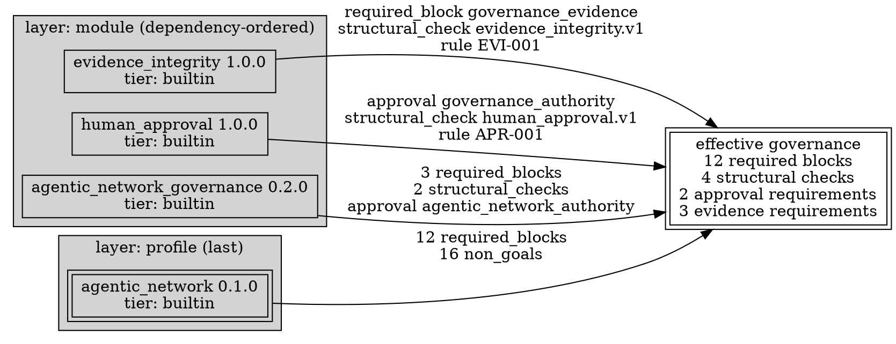

# Enterprise Governance Hierarchies

> **Opening scenario.** Northstar's Risk & Audit function owns one line of policy it considers non-negotiable: `deny secrets_to_llm`. It appears in the organizational charter, it is quoted in the annual control narrative, and the chief risk officer has said in a board meeting that it applies to every AI-assisted system in the company. On a Thursday in March, a Treasury platform engineer removes it. The reason is entirely mundane: a model-assisted refactoring tool keeps failing a check that the rule triggers, the sprint ends Friday, and the rule "obviously does not apply to us because we do not send secrets anywhere." The edit is one line in one file in one repository. It passes review, because the reviewer is a Treasury engineer who has never read the organizational charter. It passes the repository's own drift gate, because the repository's generated artifacts are regenerated from the edited contract and are therefore perfectly consistent with it. Six weeks later an auditor asks Risk & Audit to demonstrate that the control is in force across the estate. There is no artifact anywhere in Northstar that can answer the question, and the honest answer — "we believe so" — is the one answer an auditor cannot accept.

> **Learning objectives.**
> - Lay out a five-level policy stack with an owner, a change cadence, and an artifact per level, and justify why each level exists.
> - State the composition rule that a lower layer may narrow but never silently widen a superior control, and express a necessary weakening as a bounded, owned, expiring exception.
> - Describe precisely what the repository implements today for cross-repository policy consistency, including the exact semantics of the comparison it performs.
> - Read the history of three real defects in that control as a case study in how a control matures.
> - Specify what a full hierarchy engine would additionally require — conflict semantics, weakening reports, exception registries — and identify which of those the project has ruled out on purpose.
> - Reason about policy layering across administrative domains with different owners and change cadences, and explain why attachment to a permissive domain creates no entitlement.

> **Prerequisites.** Chapter 8 (composition operations, silent weakening, provenance, canonicalization, deterministic composition), Chapter 9 (approvals and exception records), Chapter 16 (status badges, version axes), Chapter 18 (profiles, modules, locks, digests), and Chapter 29 (governance in continuous integration (CI)).

## 32.1 Five levels, five owners, five cadences

Chapter 8 established the shape of the problem: policy authority is genuinely distributed, so composition must replace copying. This chapter is about what that costs when the layers are separate repositories, separate teams, and separate approval authorities. Table 32.1 is the anatomy of the <span class="ix" data-ix="policy stack!five-level">five-level policy stack</span> Northstar settles on.

| Level | Owner | Typical cadence | Artifact | What it may do |
|---|---|---|---|---|
| Organization | Risk & Audit | quarterly, board-visible | canonical policies in `northstar-governance` | establish controls that hold everywhere |
| Business unit | Treasury, Engineering Platform | monthly | business-unit contract + selected modules | add unit-specific controls; narrow org controls |
| Application | `payments-api`, support network | per release | the application's `.nyx` contract | add application controls; narrow inherited ones |
| Agent | Atlas, Forge, Ledger agents | per change | identity, capability, membership records | bound one agent's authority |
| Mission | the engagement lead | days | mission restrictions and any exception record | add restrictions for one engagement; hold a bounded waiver |

**Table 32.1 — Northstar's five governance levels.** The cadence column is the reason the levels cannot be collapsed: a control that changes quarterly under board visibility and a restriction that expires on Friday cannot share a review process without one of them being wrong. The right-hand column states the invariant this chapter defends — every level may add and may narrow, and exactly one level-crossing operation is forbidden.

Figure 32.1 shows the same stack as a tree, annotated with where each level's decisions are actually checked.

<figure class="nx-fig" id="fig-32-1">
  <div class="fig-body">
    <div class="hier">
      <ul>
        <li><b>Organization</b> — Risk &amp; Audit · <code>northstar-governance</code> · checked by workspace consistency across every member repository
          <ul>
            <li><b>Business unit: Treasury</b> — payment-specific denials, EU exposure rules · checked by the unit's own contract check and by the org workspace check
              <ul>
                <li><b>Application: payments-api</b> — protected paths, schema-change gates · checked by contract check + drift gate in CI
                  <ul>
                    <li><b>Agent: Ledger executor</b> — capability set, membership, delegation bounds · checked by structural validation and the network lock
                      <ul>
                        <li><b>Mission: MIG-2026-04</b> — extra denials, one bounded exception, expires 2026-04-30 · checked by exception lifecycle validation</li>
                      </ul>
                    </li>
                  </ul>
                </li>
              </ul>
            </li>
          </ul>
        </li>
      </ul>
    </div>
  </div>
  <figcaption><b>Figure 32.1 — The five-level stack with its enforcement points.</b> The tree is Chapter 8's; what is new is the right-hand clause on every node. The teaching purpose is that a hierarchy is only as real as the place each level is checked: three of these five checks exist in the repository today, one is a repository-review control, and one — the cross-level conflict check that would compare a business-unit policy against the organizational policy it inherits — is the extension this chapter designs in Section 32.4.</figcaption>
</figure>

The invariant the stack exists to protect can be stated in one sentence. **A lower layer may <span class="ix" data-ix="narrowing rule">narrow</span> but never <span class="ix" data-ix="silent widening">silently widen</span> a superior control.** Three words carry the meaning. *Narrow* means the set of behaviours the lower layer permits is a subset of the set the superior layer permitted; every guarantee the superior layer offered still holds. *Widen* means the opposite, and is the operation that turns an organizational control into an aspiration. *Silently* is the word that makes the rule implementable: widening cannot be made impossible, because real operations occasionally require it, but it can be made loud.

The loud form is a <span class="ix" data-ix="bounded exception">bounded exception</span>: a record naming the control being relaxed, the reason, the scope, the risk tier, the requester, an accountable owner, an approving authority, compensating controls, supporting evidence, a start time, an expiry, a renewal policy, closure evidence, and a status. That field list is not this book's invention; it is the required field set of the exception schema shipped in the repository **[implemented]**, and Section 32.3 works an example. The design property to notice is that every one of those fields answers a question an auditor will ask, and that a waiver missing any of them is not a weaker waiver but an unanswerable one.

> **Key idea.** Hierarchy is not about who can write policy. It is about which direction guarantees flow. Constraints accumulate downward; permissions do not. A system in which a lower layer can quietly remove an upper layer's constraint has a hierarchy in its documentation and a flat namespace in its behaviour.

## 32.2 What the repository implements today

Three implemented mechanisms cover part of the stack. It is worth being exact about which part, because the gap is the subject of Section 32.4.

**<span class="ix" data-ix="policy reference!to canonical source">Policy references</span> to a canonical source.** A contract may declare a policy by reference rather than by value, with the reference naming a local file and a policy inside it **[implemented]**. The source may be another contract or a workspace manifest. Resolution happens at load time, entirely offline, and compiles the reference into inline rules so that every downstream consumer — checker, generator, drift gate — sees an ordinary policy. Listing 32.1 shows the whole mechanism working across a directory boundary.

```text
$ cat treasury/nornyx.nyx
nornyx: "0.1"
project:
  name: TreasuryPaymentsApi
policies:
  - name: SafeDeliveryPolicy
    ref: ../nornyx.workspace.yaml#SafeDeliveryPolicy

$ nornyx check treasury/nornyx.nyx
Nornyx check passed

$ nornyx generate treasury/nornyx.nyx --out gen && cat gen/policy.yaml
policies:
- name: SafeDeliveryPolicy
  rules:
  - deny secrets_to_llm
  - require tests_if_code_changed
  - require human_approval_before_merge
```

**Listing 32.1 — A policy reference resolved from an organizational manifest.** Real transcript, package 1.11.0, run against a two-directory workspace created for this chapter. The reference is written once in the Treasury contract; the rules appear in the generated artifact because resolution compiles them inline. The Treasury repository therefore contains no copy of the organizational rules to drift, and its generated `policy.yaml` still renders them in full for review.

The mechanism is fail-closed in seven distinct ways, and one of them is worth seeing because it is the failure a reorganization actually produces. Renaming the canonical policy in the manifest — or pointing a member at a policy that never existed — does not degrade to an empty rule set; Listing 32.2 shows the refusal:

```text
$ nornyx check treasury/nornyx.nyx
{
  "level": "error",
  "code": "PARSE_ERROR",
  "message": "policy 'SafeDeliveryPolicy': policy 'NoSuchPolicy' not found in ../nornyx.workspace.yaml"
}
```

**Listing 32.2 — A broken reference is a parse error, not a default.** Real transcript; the exit code is 2, the class reserved for parse and lock failures. Setting both `ref` and `rules` on the same policy, a malformed reference, a remote or device-backed source path, a missing source file, an unparseable source, and a non-mapping source are the other six refusals. The general principle is Chapter 8's: an unresolvable reference must never silently become an absent constraint.

**Workspace checking with normalized rule-set comparison.** A <span class="ix" data-ix="workspace manifest">workspace manifest</span> declares canonical policies once and lists member contracts; the check verifies that each member's named policy matches the canonical rule set **[implemented]**. The comparison is not textual. Both sides are reduced to a normalized set of `deny <token>` and `require <token>` atoms, so shorthand `rules:` strings and explicit `deny:`/`require:` lists compare equal, and rule order and comments are irrelevant — the canonicalization discipline of Section 8.5, applied across repositories. Per member and per policy, the status is one of `ok`, `missing`, `drift` (with sorted `missing` and `extra` rule lists), `contract_missing`, or `synced`. All paths are screened by the governance path-security loader before any filesystem access; local files only, no network.

**<span class="ix" data-ix="surgical write mode">Surgical write mode</span>.** With `--write`, the check does more than report: it rewrites the matched policy's rule block in each diverging member, preserving comments and every other block. What it deliberately does not do is invent anything. A member that does not declare the policy at all, or a member file that does not exist, is reported and left for a human. The module's own comment states the rule: sync edits existing policies, it does not invent new blocks or files **[implemented]**.

**<span class="ix" data-ix="composition!profile and module">Profile and module composition</span>.** The third mechanism operates within a repository and supplies the layering that references cannot: a contract selects a domain profile and a set of governance modules, and composition resolves them in declared dependency order, layers the profile last, refuses declared conflicts, merges monotonically, and stamps every composed element with provenance **[implemented]**. Figure 32.2 shows a real resolution.



**Figure 32.2 — Where each effective element came from.** Values read from `nornyx governance resolve` on `examples/agentic_network_support/support_network.nyx` at the snapshot **[implemented]**. Every edge label is a set of elements whose provenance record names that pack as `source_id`, with its `source_version`, `layer`, `author`, `source_tier`, `source_revision`, and `source_path`. The teaching purpose is that "why is this control in effect?" is answered by a lookup rather than by an investigation — and that the answer includes a *tier*, so a policy about policy sources ("organization-tier packs must be pinned by a committed lock") is expressible.

A single provenance record makes the shape concrete:

```json
{
  "element_kind": "required_block",
  "element_id": "governance_evidence",
  "source_id": "nornyx.builtin.module.evidence_integrity",
  "source_version": "1.0.0",
  "layer": "module",
  "author": "Nornyx maintainers",
  "source_tier": "builtin",
  "source_revision": "governance-program-stage-b",
  "source_path": "nornyx/profiles_data/module_evidence_integrity.yaml"
}
```

**Listing 32.3 — One provenance record from a real resolution.** Emitted by `nornyx governance resolve --json` on the bundled support-network contract. Nine fields, all populated, all machine-readable. An organization that can produce this for every element of its effective policy can answer the two audit questions that otherwise consume days: which controls are in force here, and who put each one there.

### The evolution of a control: three defects, three releases

The workspace check exists because the project attacked its own claim and found it false, and the history is more instructive than the feature. It is recorded in the repository's own case study **[implemented]** and unfolded across releases 1.1.5 through 1.1.9.

The first defect was a <span class="ix" data-ix="cross-repository blind spot">cross-repository blind spot</span>. Two repositories shared a policy; the policy was changed in one; both repositories' own drift gates stayed green. Each gate was correct about its own repository — the generated artifacts matched the contract in each case — and the shared policy had silently diverged anyway. The lesson generalizes far beyond this tool: a consistency check is only a control over the scope it compares. A gate that verifies "this repository is internally consistent" makes no statement whatsoever about the estate, and an organization that reads local greens as an estate-level assurance is making exactly the inference the opening scenario's auditor refuses.

The second defect is the sharper one, because it was in the project's own recommended practice. The drift gate its adoption documentation suggested compared only the generated `AGENTS.md` file. But `AGENTS.md` does not render policy rules — those appear in `policy.yaml`. A policy change therefore left the compared artifact byte-identical, and the gate passed green. The project's own write-up calls this "a false sense of safety," and the general lesson is the one Chapter 14 makes central: a control is defined by its observable, and choosing the wrong observable produces a control that reports success while measuring nothing. The remedy was to compare *every* generated artifact by hash rather than one convenient file.

The third defect was found only by throwing away the author's context: a fresh installation, a fresh reading of the documentation, two scaffolded services, a manifest, and a sync. The sync did nothing. The editor assumed policy list items were indented more deeply than the key, while the scaffolding command emits them at the key's own indent — so on precisely the contracts a new user gets, `--write` either no-opped or left stale rules behind. It was fixed with regression tests for both indentation forms. The lesson is about who can find which defects: the author's knowledge of how contracts "normally look" was exactly what made this class of bug invisible to the author.

> **Design checkpoint.** Take a consistency control you own and answer three questions in writing. What scope does it compare, and what does a green result therefore *not* say? Which observable does it compare, and could that observable be identical across a change you care about? And has anyone without your context ever run it from the documentation alone? Each of the three defects above corresponds to one of those questions, and each of them shipped in a tool built by people who were thinking hard about governance.

## 32.3 Two worked scenes

### A business-unit policy drops an organizational denial

The opening scenario, run under Charter's design. The canonical policy lives once, in the organizational manifest; Treasury's contract declares the same policy name. The engineer removes `deny secrets_to_llm` and adds a Treasury-specific rule. The organization-level check runs in the `northstar-governance` pipeline and produces Listing 32.4.

```text
$ nornyx workspace-check --manifest nornyx.workspace.yaml
Nornyx workspace policy check: NorthstarServices
Status: drift
Canonical policies: SafeDeliveryPolicy

  [DRIFT] treasury/nornyx.nyx
            - SafeDeliveryPolicy missing: deny secrets_to_llm
            + SafeDeliveryPolicy extra:   require payment_exception_dual_control

Run with --write to propagate the canonical policy into diverging members.
```

**Listing 32.4 — The drift the opening scenario could not see.** Real transcript; exit code 1. The `--json` form of the same run emits a `nornyx.workspace_report.v0.1` document with the canonical rule set and, per member and per policy, the sorted `missing` and `extra` lists — a machine-readable input for the review process, not just a console message.

Two things about that output repay attention, and the second is a genuine limitation rather than a feature.

The first is that the removal is reported as `missing`, in CI, against the *organizational* pipeline rather than Treasury's. That is the whole point: the check's scope is the estate, so a green in Treasury's own pipeline can no longer be mistaken for an estate-level statement. The reviewer who sees it is the control owner, not the Treasury engineer who did not know the control existed.

The second is that Treasury's *added* rule — `require payment_exception_dual_control`, a genuine narrowing that makes Treasury stricter than the organization requires — is reported as `extra` and is therefore also drift. The implemented comparison is **set equality**, not the subset relation that the narrowing rule of Section 32.1 would want. The consequence is concrete and must be stated plainly: running `--write` against this member restores `deny secrets_to_llm` *and removes Treasury's stricter rule*, because sync rewrites the matched policy's rule block to the canonical set. That behaviour is correct for the mechanism as designed — a canonical policy is canonical, and the check exists to keep members identical to it — and it is not the five-level narrowing semantics this chapter's model asks for.

The practical workaround inside today's implementation is to keep the canonical policy pure and put local narrowings in a *separate, differently named* policy that the manifest does not govern. That preserves both properties: the organizational policy stays comparable by equality, and Treasury's additional constraint survives a sync. It is a workable convention, and its existence is precisely the argument for Section 32.4: a convention that every team must know and no tool enforces is a control with a human in the loop at the wrong place.

> **Case study — Charter.** Northstar adopts the convention and writes it into the Charter programme's own rules: any policy named in the organizational manifest is canonical and is never locally edited; unit-specific constraints live in `TreasuryDeliveryPolicy`, which the manifest does not list. The workspace check runs in the `northstar-governance` pipeline on every push and on a schedule, because member repositories can drift without the organization's pipeline ever being triggered. And the review rule that closes the opening scenario is procedural rather than technical: a drift report against an organizational policy is routed to the control owner in Risk & Audit, never to the team that produced it.

### A mission waiver done properly

Treasury does eventually need the rule relaxed — not permanently, and not for the reason the March engineer gave. A four-week migration requires a batch job to pass a tokenized reference through a model-assisted mapping step, and the reference matches the organizational rule's pattern although it carries no secret. The correct response is not an edit. It is a <span class="ix" data-ix="mission waiver">mission waiver</span> expressed as an exception record, and the required field set is the schema's, not this book's **[implemented]**.

```yaml
exceptions:
  schema: nornyx.governance_exceptions.v1
  source: project_contract
  entries:
    - id: EXC-TREASURY-MIG-2026-04
      control: SafeDeliveryPolicy.deny_secrets_to_llm
      reason: >-
        Tokenized account references match the control's pattern during the
        MIG-2026-04 mapping step; no secret material is transmitted.
      scope: [mission:MIG-2026-04]
      risk_tier: high
      requester: user:treasury_platform_lead
      accountable_owner: user:treasury_risk_owner
      approving_authority: user:risk_and_audit_control_owner
      compensating_controls:
        - control:tokenization_verified_pre_step
        - control:independent_review_of_mapping_output
      evidence: [exception_review_record, tokenization_verification_report]
      starts_at: "2026-04-06T00:00:00Z"
      expires_at: "2026-04-30T00:00:00Z"
      renewal_policy: manual_reapproval
      closure_evidence: []
      status: active
```

**Listing 32.5 — A bounded exception, in the shipped schema's required shape.** Illustrative content over the real closed field set of `nornyx.governance_exceptions.v1`, which requires every key shown: `id`, `control`, `reason`, `scope`, `risk_tier`, `requester`, `accountable_owner`, `approving_authority`, `compensating_controls`, `evidence`, `starts_at`, `expires_at`, `renewal_policy`, `closure_evidence`, and `status`. The record is in the *mission's* scope, is owned by a named human in Treasury, is approved by the control's owner in Risk & Audit rather than by Treasury, expires in twenty-four days, and cannot renew itself — `renewal_policy: manual_reapproval` is one of exactly two permitted values, the other being `prohibited`.

Compare the two paths. The March edit was one line, took thirty seconds, was reviewed by someone with no standing to approve it, and left no artifact that could be queried. The exception is fifteen fields, takes an afternoon, is approved by the accountable authority, expires on a date, and is a record that a query can find. The difference in cost is real and is the point: the friction is proportional to the consequence, and it lands on the party seeking the relaxation rather than on the party bearing the risk.

> **Misconception.** *"An exception process weakens the control, so a strong regime should not have one."* A regime without an exception path does not eliminate weakening; it drives it underground, into the one-line edit that nobody logs. The measurable property of a governance system is not how few exceptions it has but whether the weakenings that occur are visible, owned, bounded, and expiring. Chapter 9 makes the same argument about approvals; it is the same argument.

## 32.4 What a full hierarchy engine would require

Everything in Section 32.2 is implemented and everything in this section is not. A <span class="ix" data-ix="hierarchy engine">hierarchy engine</span> that realized the five-level model of Figure 32.1 would need four capabilities beyond what exists, and they are worth designing precisely, because the design is where the difficulty actually lives **[extension]**.

**<span class="ix" data-ix="conflict detection">Conflict detection</span> with a stated semantics.** The engine must compare a lower layer's policy against the composed policy it inherits and classify the difference into exactly four outcomes. *Identical* — no difference. *Narrowing* — the lower layer's permitted set is a strict subset of the inherited one; permitted, and recorded. *Widening* — the lower layer permits something the inherited policy prohibited; refused unless a matching exception record covers it. *Incomparable* — the two policies differ in ways that are neither subset nor superset, which is the interesting case and the one most systems get wrong by silently picking a side.

The subset relation is only computable if the rule language supports it, which is the crux. Chapter 7's rule atoms are unordered independent tokens, so for deny and require sets the relation is ordinary set inclusion and the computation is trivial. The moment rules acquire parameters — a denial scoped to a path pattern, an approval with an expiry, a budget with a number — the comparison becomes a decision problem over the parameter language, and every extension to the rule language is an extension to the conflict checker. Cedar's design makes the analogous trade-off explicitly, restricting the language so that automated analysis remains tractable [@cedar]; Rego's greater expressiveness carries the corresponding analytic cost [@opa]. A hierarchy engine designer must decide this before designing anything else: *how much expressiveness is worth the ability to prove narrowing?*

**<span class="ix" data-ix="cross-repository policy reference">Cross-repository policy references</span> — a deliberate non-goal today.** The obvious mechanism for the org-to-unit link is a reference whose source lives in another repository. The project has ruled this out on purpose, and the reasoning is recorded **[implemented]** as a design decision: a cross-repository reference would reopen the frozen v1.0 schema and force a cross-repository resolution and lockfile design, and it would trade away a property the project values — a contract that is auditable on its face, readable without fetching anything. The workspace manifest plus sync gives single-source authoring without those costs. This is worth stating flatly in a textbook because readers frequently assume the absence of a feature is an oversight. Here it is a decision with a stated rationale and a stated cost, and the cost is exactly the convention-not-mechanism gap Section 32.3 hit. An extension that added cross-repository references would have to supply: a resolution order, a pinning mechanism (a lock over remote sources), a trust model for the fetch, an offline mode, and a defined behaviour when the source is unreachable — five design problems, each of which has a fail-open answer that is easy and wrong.

**Weakening reports.** Conflict detection produces per-comparison results; a <span class="ix" data-ix="weakening report">weakening report</span> aggregates them into the artifact an organization actually needs: for a given organizational control, every layer beneath it, the relation each bears to it, and every exception currently relaxing it, with owners and expiry dates. This is the artifact that answers the auditor's question in the opening scenario in one page. Its inputs all exist today — the normalized rule sets, the provenance records, the exception entries — and the missing piece is the aggregation across repositories, which is a reporting problem rather than a semantics problem.

**<span class="ix" data-ix="exception registry">Exception registries</span>.** Exception records exist per contract. An enterprise needs them per *estate*: a registry that can answer "which controls are currently relaxed anywhere," that expires entries without a human remembering to, that refuses renewal by the requester, and that raises the expiry of a high-risk exception as an event before it lapses rather than after. The lifecycle semantics are already defined and validated in the shipped schema; the registry is the missing layer, and it is closer to an operations system than to a language feature — which is why Chapter 33 takes it up as an operated component.

Table 32.2 summarizes the split.

| Capability | Status at the snapshot | What is missing |
|---|---|---|
| Reference a canonical policy, offline and fail-closed | **[implemented]** | nothing within a repository or workspace directory |
| Cross-repository policy reference | **[extension]**; a stated non-goal today | resolution order, remote pinning, trust model, offline behaviour |
| Compare a member policy to a canonical rule set | **[implemented]**, by set equality | subset semantics; narrowing must currently be a naming convention |
| Repair a diverged member | **[implemented]**, surgical, never invents | awareness that a local narrowing will be removed |
| Dependency-ordered, monotone, provenance-stamped composition | **[implemented]**, within a repository | composition across administrative domains |
| Four-outcome conflict classification | **[extension]** | a subset decision procedure matched to the rule language |
| Weakening report across the estate | **[extension]** | cross-repository aggregation of existing inputs |
| Exception registry with lifecycle enforcement | **[extension]** | the registry; the record lifecycle itself is implemented |

**Table 32.2 — Implemented primitives and the engine they do not yet constitute.** Read the table as a build plan rather than as a gap list: every extension row is expressed in terms of artifacts the implemented rows already produce, which is the practical test of whether a design is an extension or a rewrite.

> **Assurance boundary.** Even a complete hierarchy engine would be a Tier 1 control. It would establish that the *declared* policy stack is internally consistent and that no layer widens a superior control without a bounded exception. It would establish nothing about whether any running system honoured the composed result — that is the enforcement question of Chapters 10 and 26 — and nothing about whether the organizational control was the right control. The most an inheritance engine can offer is that the organization's stated intent is coherent and traceable, which is a genuine and currently rare achievement, and is not the same thing as safety.

## Summary

An enterprise policy stack has five levels because it has five owners with five change cadences, and its defining invariant is directional: constraints accumulate downward, permissions do not, and a lower layer may narrow but never *silently* widen a superior control. Weakening is not forbidden; it is converted into a bounded exception with an owner, an approving authority, compensating controls, and an expiry — a record whose fifteen required fields each answer a question an auditor will ask. The directional rule holds across administrative domains as well as within one: a domain may refuse what a superior layer permits, and it may never grant an authority the superior layer does not contain, so attachment to a permissive environment creates no entitlement. What exists today is three implemented primitives — offline fail-closed policy references, workspace checking by normalized rule-set equality with a surgical repair mode, and dependency-ordered monotone composition with per-element provenance — plus a history of three real defects that shows how a consistency control matures: get the scope right, get the observable right, and let someone without your context try it. What does not exist is the engine: four-outcome conflict classification with a subset decision procedure, cross-repository references (a stated non-goal with a stated rationale), estate-wide weakening reports, and an exception registry. The primitives are the right primitives; the assembly is the work.

- Five levels, five owners, five cadences — and one enforcement point named per level.
- Narrow freely; widen only through a record that is owned, bounded, and expiring.
- The implemented comparison is set equality, so a local narrowing reads as drift and a sync will remove it.
- Provenance turns "why is this control in effect?" into a lookup with a source, a version, a layer, and a trust tier.
- A consistency control is defined by its scope and its observable; both of the project's early defects were failures of one or the other.
- Cross-repository references are absent by decision, not by oversight, and the decision has a cost worth naming.

## Review questions

1. State the narrowing rule in your own words, then explain why the word "silently" is what makes it implementable rather than aspirational.
2. Treasury adds `require payment_exception_dual_control` to a policy governed by the organizational manifest. Explain what the implemented workspace check reports, what `--write` would do, and why the behaviour is correct for the mechanism as designed while still being wrong for the five-level model.
3. A Treasury engineer argues that because the Ledger executor runs in an environment whose local contract permits broad file access, the organizational rule `deny secrets_to_llm` "does not apply here." Using the narrowing rule, explain why running in a permissive environment is not an argument that the agent holds an authority, and name the two conditions under which the superior control genuinely would not bind: what kind of record must exist, and who must have issued it.
4. Of the three defects in the workspace control's history, one was found by an adversarial test and one only by a cold-start trial. Explain what made the third invisible to the author, and describe a practice that would catch that class of defect in your own work.
5. A colleague proposes adding parameters to rule atoms so that denials can carry path patterns. Explain the consequence for a four-outcome conflict classifier, and describe the trade-off in terms of expressiveness against analyzability.
6. List four failure modes a cross-repository policy reference must define behaviour for, and give the fail-open answer to each that a careless design would adopt.

## Exercises

1. **Build the two-level workspace.** Outside the repository, create a directory with a `nornyx.workspace.yaml` declaring one canonical policy of at least four rules, and two member contracts. Make one member drift by removing a rule and adding one. Run `nornyx workspace-check` with and without `--json`, then run it with `--write` and diff the member file. Write a half-page note on what the sync did to your added rule and what convention you would adopt to protect it.
2. **Design the conflict classifier.** For the rule language of Chapter 7, write the decision procedure that classifies a lower-layer policy against an inherited one into identical, narrowing, widening, or incomparable. State its complexity. Then extend the rule language by one feature of your choice — a scoped denial, a numeric budget, or an expiry — and rewrite the procedure. Report which of the four outcomes became undecidable or merely expensive, and what you would restrict to get it back.
3. **Write the weakening report.** Using the provenance record shape of Listing 32.3 and the exception shape of Listing 32.5, specify the output document a control owner should receive weekly: its schema, its sort order, its escalation rule for exceptions nearing expiry, and the one thing it must *not* contain. Justify each choice in one sentence.

## Further reading

- [@cedar] — an authorization language designed so that policies remain analyzable; the clearest available treatment of the expressiveness-versus-analysis trade-off a conflict classifier faces.
- [@opa] — the contrasting position, with a general-purpose policy language and correspondingly harder static comparison.
- [@nornyx-repo] — the workspace module, the policy reference mechanism, the composition provenance records, the exception schema, and the multi-repository case study whose three defects Section 32.2 recounts.
