# Operations, Observability, and Incident Response

> **Opening scenario.** At 03:40 UTC, Northstar's on-call platform engineer is paged — not for the payments service, which is healthy, but for its merge lane, which is closed. The drift gate in the `payments-api` pipeline has been failing every build for two hours. The engineer's first instinct is the one every operations culture trains: restore service. Regenerate the artifacts, commit, reopen the lane, investigate in the morning. Her second instinct, arriving a beat later, is the one this chapter exists to install: *the gate is not the outage — the gate is the detector, and it is working.* Something changed the relationship between the reviewed contract and the deployed artifacts, at 01:34, without a corresponding commit to the contract. Regenerating now would not fix that; it would destroy the only evidence of what it was. She freezes the lane, preserves the failing outputs, and opens an incident whose subject is not "drift gate broken" but "unexplained change to governance artifacts." By morning the cause is found — a well-intentioned cleanup script that "normalized" JSON formatting across the repository — and the incident closes with a one-line finding that will echo through this chapter: the governance layer is production, and nobody had been operating it as production.

> **Learning objectives.**
> - Treat contracts, generated artifacts, locks, and evidence stores as production assets with their own availability, integrity, and access requirements.
> - Operate an evidence store: retention, immutability, access control, and the preservation of failed validation outputs as evidence in their own right.
> - Select operational signals for the governance layer itself — drift-gate failures, lock-check failures, denial rates, approval latency, approval-fatigue indicators — and decide which deserve paging.
> - State the relationship between telemetry and bound evidence, and why one cannot substitute for the other.
> - Reconstruct an incident from contract, lock, approvals, and events, and know where reconstruction stops.
> - Design degraded modes and runbooks for governance failures, including change freezes and emergency exceptions handled accountably.

> **Prerequisites.** Chapter 11 (evidence versus logs versus telemetry, retention tension), Chapter 12 (ordering, replay, occurrence identity), Chapter 13 (assurance tiers), Chapter 20 (the evidence architecture and validation pipeline), Chapter 21 (drift gates and workspace checks), Chapter 29 (governance in CI), and Chapters 31–32 for the Ledger and Charter threads this chapter operates. Chapter 36 develops the full audit method previewed in Section 33.5.

## 33.1 The governance layer is production

Every preceding chapter has treated the governance layer as a thing that governs. This chapter inverts the lens: the governance layer is a system, it runs somewhere, its artifacts live somewhere, people and pipelines depend on it, and it can fail. An organization that instruments its payment service to three nines and cannot say where its network lock is stored, who can rewrite it, or what happens to merges when the checker's pipeline is down has governed its product and left its governance ungoverned.

The asset inventory is short and concrete. The **contracts** are source files under version control; their integrity requirement is the repository's (branch protection, review), and their availability requirement is real — if the contract cannot be read, nothing downstream can be checked. The **generated artifacts** are derived, deterministic, and committed; their integrity is exactly what the drift gate checks, and their operational hazard is the opening scenario's: any process that touches them outside generation is indistinguishable from tampering. The **locks** — the profiles lock and the network lock — are small files with outsized consequence, because verification treats a mismatch as a stop condition; a lock is simultaneously the easiest artifact to regenerate and the one whose regeneration must be rarest and most reviewed, since a hostile local writer can regenerate a consistent lock and detecting unauthorized regeneration is a repository control, not a lock property **[implemented]** as a stated limitation. The **evidence stores** — event streams, validation reports, approval records, exception records — are the only assets whose loss is unrecoverable: a contract can be re-reviewed and artifacts regenerated, but an event stream that is gone is a period of history that no longer has an account.

Each asset therefore carries a different requirement profile, and Figure 33.1 arranges them by what failure of each requirement costs.

<figure class="nx-fig" id="fig-33-1">
  <div class="fig-body">
    <div class="layers">
      <div class="layer authority" data-note="integrity: repository review · availability: blocks all checking">contracts — the reviewed source of intent</div>
      <div class="layer" data-note="integrity: drift gate · regeneration outside the generator = incident">generated artifacts — derived, deterministic, committed</div>
      <div class="layer authority" data-note="integrity: verification fails closed · rewrite requires control-owner review">locks — content bindings; small files, stop-condition consequence</div>
      <div class="layer" data-note="integrity + retention + access: loss is unrecoverable history">evidence stores — events, validation reports, approvals, exceptions</div>
      <div class="layer untrusted" data-note="availability only: pipelines, runners, storage — replaceable, but their outage closes lanes">execution substrate — CI runners, artifact storage, schedulers</div>
    </div>
  </div>
  <figcaption><b>Figure 33.1 — The governance layer's production assets, ordered by what failure costs.</b> Double-bordered layers are normative: the contract and the locks are what everything else is compared against. The teaching purpose is the asymmetry between the layers: artifacts and substrate are recoverable by regeneration or replacement, while the evidence layer is the one asset whose loss cannot be repaired afterwards — which is why Section 33.2 gives it an operations discipline of its own.</figcaption>
</figure>

One structural fact makes this layer unusually pleasant to operate, and it is worth naming because it was a design decision, not luck. The entire toolchain is offline and deterministic: checking, generation, locking, and evidence validation read local files, touch no network, and produce byte-identical outputs for identical inputs **[implemented]** — the reference continuous-integration workflow runs all fourteen of its steps without a single credential, and its documentation says so in one sentence: the job needs no secrets. Operationally this means the governance layer has no upstream service dependency to page about, no token to rotate, and no reason its checks cannot run anywhere, including on a laptop during an incident. The availability question reduces to the availability of the pipeline that runs the tools and the storage that holds the artifacts — ordinary problems with ordinary answers [@sre-book].

> **Key idea.** Ask of your governance layer the questions you ask of any production system: what are its assets, what does each require (availability, integrity, access), what monitors those requirements, and who is paged when they fail? A governance layer without an operations answer degrades exactly the way ungoverned systems do — silently, and discovered by an auditor.

## 33.2 Operating the evidence store

Chapter 11 established what evidence is; this section is about keeping it. Four disciplines make an <span class="ix" data-ix="evidence store!operations">evidence store</span> operable, and the fourth is the one engineering instinct gets wrong.

**<span class="ix" data-ix="retention!tiered">Retention</span>.** Evidence exists to answer questions whose arrival time is not chosen by the producer: an audit next quarter, an incident next month, a regulatory inquiry in three years. Retention policy is therefore set by the *question horizon*, not by storage cost, and it interacts with the minimization tension Chapter 11 described — the same record is both an accountability asset and a liability surface. The operational resolution is tiering: binding digests, decisions, and identities are small and long-lived; bulky referenced artifacts can carry shorter horizons, because the events that reference them carry their hashes, so a purged artifact leaves a verifiable absence rather than a silent one — the event's `evidence_artifact` field binds a path and a SHA-256, and validation reports a missing or altered artifact distinctly (`AN_EVT_ARTIFACT_MISSING`, `AN_EVT_ARTIFACT_HASH_MISMATCH`) **[implemented]**.

**Immutability.** An evidence store is <span class="ix" data-ix="append-only store">append-only</span> by policy and, wherever the platform allows, by mechanism: object-store immutability windows, write-once retention locks, or at minimum separated credentials such that the identities that produce evidence cannot delete or rewrite it. Ledger's `audit-store` zone declared this in Chapter 6; here it becomes an infrastructure configuration with an owner. The validation pipeline supports the discipline from its side: streams are bounded (an eight-mebibyte cap on events input), remote and device-backed paths are rejected before any read, and referenced artifacts must resolve *inside* the events file's own directory — escapes and symlinks are refusals, not warnings **[implemented]**.

**Access control.** Evidence is read by more parties than it is written by — incident responders, auditors, control owners — and it contains exactly the material Chapter 6's never-share categories exist to protect from agents. The workable pattern is asymmetric: broad append rights for declared producers, narrow read rights granted per purpose, and no identity anywhere holding both delete rights and production rights. Note what this implies for the `audit-recorder` in Ledger: it appends and does nothing else, and Chapter 34 already flagged the residual risk of the recorder sharing a failure domain with the actor it records.

**Preservation of failures.** When validation fails, the failed stream and its failing report *are the evidence*. The instinct trained by every other operational context — repair the data, re-run the job, get to green — is precisely wrong here, because a repaired stream validates while proving nothing about the period in question, and the repair itself destroys the record of what the producer actually supplied. The rule is absolute: <span class="ix" data-ix="failed validation output!preservation">failed validation outputs are preserved</span>, immutably, alongside passing ones; the investigation works forward from them, and a corrected stream — if one can be legitimately produced — is a *new* artifact with its own provenance, appended beside the failure, never written over it. The tooling cooperates: the validator writes its report deterministically with sorted keys, embeds the four binding digests, and exits nonzero under `--strict` without modifying anything it read — validation never repairs, upgrades, or rewrites a stream, and a legacy-version stream is never silently upgraded **[implemented]**.

> **Misconception.** *"A failing evidence report is a bug ticket."* A failing unit test is a bug ticket. A failing evidence report is a *finding*: it states that what the producer supplied does not conform to the contract the organization reviewed, and the interesting question is why — producer defect, contract change, tampering, or truncation in transit. Two of those four are incidents. Triaging a validation failure as a data-quality chore and "fixing" the data forecloses the investigation that distinguishes them.

## 33.3 Monitoring the governance layer itself

The governance layer emits signals about the governed system — that is its job — and it also emits signals *about itself*, which almost nobody collects. Table 33.1 is the inventory of <span class="ix" data-ix="operational signals!governance layer">operational signals</span> Northstar settles on, with the paging decision made explicit, because a signal without a routing decision is a dashboard nobody opens.

| Signal | Source | What a change means | Page, ticket, or review? |
|---|---|---|---|
| Drift-gate failure | `nornyx drift` / byte-compare step in CI | Generated artifacts no longer match the contract: an ungoverned change to governed artifacts | **Page** the governance owner; freeze the affected lane; never auto-regenerate |
| Lock-check failure | `lock-check`, `AN_LOCK_*` diagnostics; profiles-lock mismatches exit 2 | The reviewed binding between contract, packs, and artifacts is broken or stale | **Page**; same handling as drift — the lock is the detector, not the fault |
| Evidence validation failure | `evidence-validate --strict` nonzero | Supplied records do not conform to the locked contract revision | **Page** if in a production evidence path; preserve outputs per Section 33.2 |
| Workspace drift | `workspace-check` exit 1 | A member repository's policy diverged from the canonical set (Chapter 32) | Ticket to the control owner, same day; page only for controls tagged constitutional |
| Denial rate, by capability and identity | decision events / adapter counters | Baseline shift: new workload, policy bug, probing, or drift between contract and behaviour | Review weekly; alert on sustained deviation, not single denials |
| Approval latency | approval request → grant timestamps | Rising latency predicts workarounds before anyone requests one | Ticket at threshold; page only when a gated lane is fully stalled |
| Approval-fatigue indicators | grant rate ≈ 100 %, decision time ≪ review time, one approver dominant | The human control is degrading into a click-through (Chapter 9) | Review monthly with the control owner; adjust tiers, not people |
| Exception population | exception records: count, age, expiries | Accumulating or near-expiry exceptions are the weakening budget being spent | Review weekly; page only an expired-but-active high-risk exception |
| Governance pipeline health | CI job duration, failure cause classes | The layer's own availability — a flaky gate trains people to bypass it | Ticket; treat sustained flakiness as a control failure, not an annoyance |

**Table 33.1 — Operational signals for the governance layer, with routing decisions.** The paging column is the table's argument. Integrity signals (the first three rows) page because they are binary, actionable, and time-critical: every hour of an unexplained drift is an hour of ungoverned change. Behavioural signals (denial rates, latency, fatigue) are distributions, and paging on distributions produces the alert fatigue that Chapter 9 diagnosed in approvers — the same failure, one layer up [@sre-book].

Two of these signals deserve elaboration because their semantics are commonly misread.

A <span class="ix" data-ix="denial rate">denial-rate</span> change is not directionally interpretable on its own. A spike can mean an attack in progress, a deployment that broke a capability mapping, a contract change that outran the adapter, or a new workload doing exactly what it should and being correctly refused. A drop to zero is at least as alarming as a spike, since denials at zero can mean perfect compliance or a bypassed enforcement point — and Chapter 14 showed those are indistinguishable from the decision log alone. Denial telemetry therefore triages; it never concludes. The conclusion requires the evidence chain.

<span class="ix" data-ix="approval fatigue!operational indicators">Approval-fatigue indicators</span> are the rare case where the governance layer can measure a *human* control degrading. A grant rate asymptotically approaching one hundred percent, median decision time far below plausible review time, and concentration of grants in a single approver are three independently computable symptoms, and all three are computable precisely because Chapter 9 made approval a bound record with an actor, a role, and timestamps rather than a button. The correct response is never "tell approvers to be more careful"; it is to re-tier the gates so that human attention is spent where Table 31.1 put it — on consequence.

> **Nornyx in practice.** The signal sources in Table 33.1 are exit codes and diagnostic streams, which is an operational convenience worth exploiting: the toolchain's exit-code contract reserves 0 for pass, 1 for governance findings, and 2 for parse and lock failures, and every diagnostic is a stable upper-snake code with a path **[implemented]**. A monitoring pipeline therefore needs no parsing heuristics — it counts exit classes and diagnostic codes. What Nornyx does not provide is the monitoring itself: there is no daemon, no metrics endpoint, and no alerting surface, consistent with its declared position that it never operates, observes, or monitors the running network **[implemented]**. The collection, retention, and routing of these signals is the adopting organization's build — ordinary telemetry work, with the one non-ordinary rule that the artifacts the signals are *about* must be preserved, not repaired.

## 33.4 Evidence and observability are different instruments

Chapter 11 drew the distinction as a matter of definition — telemetry is sampled and aggregate, evidence is bound and complete-per-claim. Operations is where the distinction earns its keep, because a mature observability stack will be sitting right there, and the temptation to say "we already have traces, that's our evidence" arrives in every architecture review.

The two instruments answer different questions and fail differently. Telemetry — metrics, traces, logs under a common semantic model [@otel] — answers *how is the system behaving*, in aggregate, now; it is designed for sampling, cardinality management, and retention measured in weeks, and it is trusted because it is boring, not because it is bound. Evidence answers *did this specific governed action occur under this specific authority against this specific contract revision*, and it earns that answer through the properties Chapters 12 and 20 built: per-event binding to contract digest, lock digest, and revision; contiguous ordering; replay fingerprints; closed vocabularies. A trace span asserting a payment adjustment carries none of those bindings; nothing ties it to the revision that was in force, nothing detects its absence, and its retention will quietly expire it before the audit that needs it.

The complementarity runs both ways, and the operational design should use both deliberately. Telemetry is the *detection* layer: it is cheap enough to be everywhere, and Table 33.1's behavioural signals live in it naturally. Evidence is the *reconstruction* layer: expensive per record, complete per claim, and the only input Section 33.5 can use. The healthy pipeline flows detection into reconstruction — an anomalous denial-rate alert opens an investigation whose actual material is the evidence chain — and never the reverse: no claim is ever *supported* by a dashboard.

<span class="ix" data-ix="trace projection!of decision events">Mapping decision events into traces</span> — emitting an OpenTelemetry span per authorization decision, correlated by mission and occurrence identity so that governance decisions appear inline in the same waterfall as the application's spans — is a genuinely useful integration and is an architectural extension beyond the current repository **[extension]**. Its design is straightforward precisely because the identities were designed first: mission maps to trace, occurrence to span, attempt to span retry attributes, and the decision code to a span status. The one rule such an integration must keep is directional: the trace is a *projection* of the evidence, generated from it or alongside it, never the source of it. A projection can be sampled, expired, and pretty; the evidence cannot.

> **Assurance boundary.** Telemetry about the governance layer supports operational claims — the gate ran, the latency rose, the failure count is three. It supports no governance claim: not "the action was authorized," not "the evidence is complete," not "the control operated effectively." Those claims trace to bound evidence or they trace to nothing. An organization whose audit narrative cites Grafana has made a category error that Chapter 36's reconstruction method will surface in the first hour.

## 33.5 Incident response: reconstruction, and a stream that stays broken

Governance incidents divide into two families with opposite instincts. *Incidents in the governed system* — an agent did something harmful or anomalous — are answered by reconstruction: what happened, under what authority, was the behaviour inside or outside the declared model. *Incidents in the governance layer* — drift, lock failures, evidence failures — are answered by preservation and comparison: what changed, when, authorized by whom. Both start the same way: stop the ordinary reflex to restore green, and secure the artifacts.

```dot
// fig=33-2 title="Incident reconstruction from governance artifacts"
digraph G {
  rankdir=LR;
  node [shape=box];
  trigger [label="trigger\nalert · review finding · report", style=rounded];
  freeze [label="freeze & preserve\nlanes frozen, artifacts copied,\nnothing regenerated", peripheries=2];
  rev [label="fix the revision\nwhich subject_revision?\nwhich contract digest?"];
  lockv [label="verify the lock\nlock-check at that revision"];
  lockq [label="lock verifies?", shape=diamond];
  evd [label="validate evidence\nevidence-validate against\nthe locked revision"];
  evq [label="stream conforms?", shape=diamond];
  chain [label="walk the chain\ndecisions → authority basis →\napprovals → occurrences"];
  govinc [label="governance-layer incident\nwhat changed, when,\nauthorized by whom", style=dashed];
  evinc [label="evidence incident\npreserve failing stream + report;\ninvestigate producer path", style=dashed];
  findings [label="findings\ninside/outside declared model;\nresidual: supplied ≠ true", peripheries=2];
  trigger -> freeze -> rev -> lockv -> lockq;
  lockq -> evd [label="yes"];
  lockq -> govinc [label="no", style=dashed];
  evd -> evq;
  evq -> chain [label="yes"];
  evq -> evinc [label="no", style=dashed];
  chain -> findings;
}
```

Figure 33.2 shows the <span class="ix" data-ix="incident reconstruction">incident-reconstruction</span> flow that Chapter 36 develops into a full audit method.



**Figure 33.2 — Incident reconstruction from contract, lock, approvals, and events.** The flow is ordered by dependency, not preference: the revision must be fixed before the lock can be checked, and the lock must verify before evidence validation means anything, because every event binds the lock digest. The two dashed exits are not failures of the method — they are findings of a different kind, each with its own preservation discipline. The teaching purpose is the double-bordered final node's caveat, carried from Chapter 20: the chain reconstructs what was *supplied*, and supplied is not true.

The order matters because each step is the precondition of the next. An investigator who validates events before verifying the lock can be reading a consistent story bound to the wrong revision; one who reads the approval record before fixing the revision cannot know whether the approval was in force for the contract that governed the action. And the terminal caveat is not decoration. The reconstruction establishes the strongest available Tier 2 statement — a conformant, bound, internally consistent account was supplied — and an incident responder must hold open the hypothesis that the account is incomplete, because omission is outside the proof surface entirely.

> **Case study — Ledger.** During a quarterly review of payment-exception evidence, a Treasury analyst runs validation over a week of archived streams and one fails. The transcript is short:
>
> ```text
> $ nornyx agentic-network evidence-validate support_network.nyx \
>     --events events_2026-07-17.json --out report_2026-07-17.json \
>     --as-of 2026-07-17T00:00:00Z --strict --json
> Evidence report written to report_2026-07-17.json
> {
>   "status": "fail",
>   "event_count": 5,
>   "mission_count": 1,
>   "diagnostic_count": 1
> }
> ```
>
> The report names the defect: `AN_EVT_SEQUENCE_GAP` — "Mission 'GOAL-SUPPORT-001' sequences must be contiguous from 1" — an event is missing between sequence 3 and sequence 5. (The transcript is real, produced for this book by validating a recorder-produced stream from the bundled support example with one event deleted; Ledger's streams have the same shape.) The missing sequence sits exactly where a `capability_requested` event for the responding agent should be. The analyst's predecessor-culture instinct — renumber the surviving events, revalidate, file the green report — would have produced a conformant stream *and destroyed the finding*, because a renumbered stream validates while erasing the only signal that a record was lost or removed. Instead the analyst follows Section 33.2: the failing stream and its failing report are copied into the evidence store under retention lock, the pass/fail status is recorded in the review log as *fail, preserved*, and an incident is opened on the producer path — was the event never emitted (a coverage gap), dropped in transit (an infrastructure defect), or removed (tampering)? Three weeks later the answer turns out to be the middle one, a truncated write during a storage failover; the corrected pipeline produces complete streams thereafter, the incident record links the preserved failure, and the week in question is carried in the audit narrative as a period with a known, documented evidence gap. That sentence — *known, documented gap* — is what the preserved failure buys. A repaired stream would have bought its opposite: an undocumented gap wearing a green checkmark.

What the reconstruction flow yields when it completes is worth stating in the eight-questions frame, briefly, because it is the deliverable Chapter 36 packages. What is established: the contract revision in force; that the locked bindings verified; that the supplied account conforms; which decisions were made on which basis; which human approved what, bound to which revision. Which component establishes each: repository history, lock verification, evidence validation, the decision events, the approval records. What remains unproven: everything about events not supplied, and the truth of events that were.

## 33.6 Degraded modes, freezes, and runbooks

The governance layer will fail — its pipeline will be down, its storage will be slow, its checks will be wrong in both directions — and the <span class="ix" data-ix="degraded mode">degraded-mode</span> behaviour must be *designed*, because the default behaviour is whatever the surrounding scripts happen to do, which Chapter 10 showed is usually fail-open with good intentions.

The design rule is a two-question test applied per dependency, not a single posture. First: *does this path decide authority?* Everything that gates a consequential action — the drift gate ahead of a merge, lock verification ahead of artifact use, the approval check ahead of a gated capability — <span class="ix" data-ix="fail-closed!operational policy">fails closed</span>, and the closure is a lane closure, not a system outage: merges wait, submissions queue, drafts accumulate. Second: *does this path only record or report?* Reading generated artifacts that were previously verified, serving dashboards, running the governed system's already-authorized workloads — these keep serving through a governance-layer outage, because their authority was decided while the layer was healthy. The line between the two is exactly the line between decision and observation that the architecture has maintained since Chapter 10, and drawing it in the runbook is drawing it one more time, for the operator at 03:40. Evidence production is the deliberate edge case: recording must keep working during enforcement degradation if at all possible, because a gap in enforcement with a continuous evidence record is an incident, while a simultaneous gap in both is an unknowable.

A <span class="ix" data-ix="change freeze!governance">change freeze</span> is the coarse degraded mode, and its trigger condition should be written down before it is needed: unexplained drift or lock failure on a governance artifact freezes the affected lane automatically (the gate already does this — the freeze "decision" is just not overriding it); a compromised approval path or evidence store freezes every lane whose gates depend on it. The operationally hard part of a freeze is not entering it but leaving it: exit requires an explanation of the discrepancy, not merely a re-run that passes — because regeneration will always produce consistency, and consistency with an unexplained past is exactly what the gate exists to refuse.

The <span class="ix" data-ix="emergency exception">emergency exception</span> is the pressure valve, and it must be the same instrument as Chapter 32's mission waiver — a bounded, owned, expiring exception record with an approving authority and compensating controls — created *fast*. The design work is entirely in reconciling "fast" with "accountable," and the resolution is sequencing, not omission: the record is created and approved before the exceptional action (a fifteen-minute path, pre-templated, with a named on-call approving authority), while the supporting evidence and review may follow within a declared window. What may never follow later is the record itself: a retroactive exception is a diary entry about a bypass, not a control. The shipped exception lifecycle supports the accountable half — the record cannot renew itself (`renewal_policy` is `manual_reapproval` or `prohibited`), it expires on a date, and its status transitions are validated fail-closed **[implemented]**; the fifteen-minute path is the organization's to build.

<span class="ix" data-ix="runbook!governance">Runbooks</span> tie the section together, and governance runbooks have one property ordinary runbooks lack: they must instruct the operator *not* to do the restorative thing. Listing 33.1 shows the shape.

```text
RUNBOOK GOV-2 — Drift gate failure on a governance artifact
Trigger: drift gate nonzero in any governed lane (repo drift, byte-compare,
         or lock-check class AN_LOCK_*)
Sev:     high if the affected lane gates production consequence

1. DO NOT regenerate. DO NOT re-run with --write. DO NOT commit artifacts.
2. Confirm the lane is frozen (the failing gate freezes it; do not override).
3. Preserve: copy the failing gate output, the artifact directory, and the
   lock into the incident store, retention-locked.
4. Identify the change: last commit touching contract vs. artifacts vs. lock;
   any process with write access to generated paths since last green.
5. Classify:
   a. Contract changed with review, artifacts stale → regenerate via the
      normal authoring workflow (Ch. 28); gate passes; close.
   b. Artifacts changed, no contract change → treat as unauthorized change
      to governed artifacts; security incident until shown benign.
   c. Lock changed, no reviewed regeneration → same as (b).
6. Exit: lane reopens only with (a) a green gate AND (b) a written
   explanation of the discrepancy, acknowledged by the control owner.
Emergency path: if the frozen lane blocks an action with material
   consequence, use the emergency exception template (GOV-EX-1); the
   exception is approved before the action, expires in 72h, and names
   this incident.
```

**Listing 33.1 — A governance runbook, abbreviated.** Illustrative — not drawn from the repository. Step 1 exists because it will be violated otherwise: every operational instinct and most organizational incentives point toward regeneration, and the runbook's job is to make the preserving path the path of least resistance [@sre-book]. Step 6's two-part exit condition operationalizes the freeze rule: green is necessary and not sufficient.

> **Design checkpoint.** For each gate in your governance layer, answer in writing: what happens to the gated lane when the gate's own infrastructure is down — and is that the answer you chose or the answer you inherited? Who is the named approving authority for an emergency exception at 03:40, and how long does the template take to complete? And for your evidence store: who holds delete rights, and can any identity that produces evidence also destroy it?

## Summary

The governance layer is a production system whose assets — contracts, generated artifacts, locks, evidence stores — carry distinct availability, integrity, and access requirements, with evidence uniquely unrecoverable and therefore uniquely disciplined: retained by question horizon, immutable by mechanism where possible, accessed asymmetrically, and never repaired — failed validation outputs are preserved as findings, and corrections are new artifacts beside them, not overwrites. The layer's own health is monitorable through a small signal set with explicit routing: integrity signals (drift, lock, evidence failures) page, behavioural signals (denial rates, approval latency, fatigue indicators) trend, and the toolchain's stable exit codes and diagnostic codes make collection mechanical while the collection itself remains the adopter's build. Telemetry and evidence are complementary instruments — detection and reconstruction respectively — and projecting decision events into traces is a useful extension whose one rule is direction: the trace projects the evidence, never sources it. Incident reconstruction proceeds in dependency order — revision, lock, evidence, chain — and terminates at the standing caveat that supplied is not true. Degraded modes are decided by a two-question test (does the path decide authority, or only record and report), freezes are easy to enter and deliberately hard to exit, and emergency exceptions are the ordinary exception record made fast, never made retroactive.

- The gate that fails is usually the detector, not the fault; the first runbook step is *do not restore green*.
- Evidence is the only unrecoverable asset; operate it like one.
- Page on integrity, trend on behaviour.
- Telemetry detects; evidence reconstructs; no governance claim cites a dashboard.
- Fail closed on authority, keep serving on observation, and keep recording through everything.
- An exception created after the action is a diary entry, not a control.

## Review questions

1. The opening scenario's engineer nearly regenerated the drifted artifacts. Explain concretely what would have been lost, and why the resulting green gate would have been worse than the red one.
2. Classify each of the following as page, ticket, or periodic review, and justify each in one sentence: a lock-check failure in the payments lane; denial rate for one capability doubling over a week; an approval whose median decision time falls to four seconds; a workspace drift report on a business-unit repository.
3. A colleague proposes replacing the evidence store with the organization's tracing backend, arguing that spans already record every tool call. Give three specific properties of bound evidence that the proposal loses, and one legitimate role the tracing backend should keep.
4. In the Ledger scene, list the three candidate explanations for the sequence gap and, for each, the artifact or investigation that would distinguish it. Why does renumbering the stream destroy the ability to distinguish all three?
5. Apply the two-question degraded-mode test to: the drift gate, the evidence recorder, a dashboard reading validation reports, and the approval check on a gated capability. State each answer and the resulting failure behaviour.
6. Why must an emergency exception's *record* precede the action while its *evidence* may follow? What claim becomes unmakeable if the order is reversed?

## Exercises

1. **Instrument the layer.** For a governed pipeline you operate or design, implement collection for three signals from Table 33.1 using only exit codes and diagnostic-code counts. Write the alert rule for each, including the routing decision and the suppression logic that prevents a single root cause (for example, a bad commit) from firing all three. Document what each alert's runbook forbids.
2. **Break a stream, preserve it, explain it.** Generate and lock the bundled support example, record a short valid stream through the software product interface's recorder, and validate it. Then produce three invalid variants — a deleted event, a duplicated event, and an event with an altered capability reference — validate each with `--out`, and preserve all six artifacts (three streams, three reports) under a naming scheme an auditor could follow. Write the one-paragraph "known gap" narrative for the deleted-event case as it would appear in a quarterly review.
3. **Write GOV-EX-1.** Draft the emergency-exception template Listing 33.1 references: the pre-filled fields, the fields the requester must complete, the named approving-authority rota, the expiry default, and the follow-up evidence window. Then red-team your own template: find the fastest path by which it could be used to make a bypass look accountable, and add the control that closes it.

## Further reading

- [@sre-book] — the operational canon this chapter borrows its paging discipline, runbook philosophy, and error-budget thinking from; read it alongside the caveat that governance gates invert its "restore service first" instinct.
- [@otel] — the telemetry specification whose semantic model a decision-event trace projection would target, and whose sampling design explains why traces cannot serve as evidence.
- [@soc2] — the trust-services criteria whose availability, integrity, and confidentiality framing maps naturally onto the governance layer's own assets.
- [@nist-ssdf] — secure development practices for the pipelines that build and gate software, applicable verbatim to the pipeline that builds and gates governance artifacts.
- [@nornyx-repo] — the validation pipeline, lock verification, exception lifecycle, and credential-free reference CI cited throughout this chapter.
