# Threat Modeling Governed Agentic Systems

> **Opening scenario.** Northstar Services' Treasury division has run its payment-exception workflow under governance for two quarters, and Risk & Audit has called a threat-modeling workshop before the system is extended to a second payment corridor. The room contains the usual participants and one unusual one: the workshop's facilitator has put a printed page on the wall that is not a data-flow diagram. It is the control description the division gave its regulator, seven sentences long. Her opening instruction is: *treat this page as an asset. Someone's objective may be to make one of these sentences false without anyone noticing, and that is a different attack from stealing the money.* The room's first reaction is that this is a category error — claims are documentation, not systems. By the end of the session the group has identified four ways to falsify sentence three without touching a single payment record, three of which nobody would have found by modeling data flows.

> **Learning objectives.**
> - Enumerate the assets of a governed agentic system, including claims, coverage matrices, and approval records, and explain why a data-centric asset list is incomplete.
> - Characterize six attacker models specific to governed agentic systems and identify which assets each is positioned to reach.
> - Build threat trees for contract parsing, declaration smuggling, lock substitution, approval spoofing, replay and ordering manipulation, adapter bypass, and tool-package supply chain.
> - Map each threat to a mitigation, the evidence that the mitigation is in place, the residual risk after mitigation, and a named owner.
> - Argue why overclaiming is a security vulnerability rather than a communication defect, and trace a concrete harm path from an inflated claim to a loss.

> **Prerequisites.** Chapter 6 (trust zones, context origin and taint, prompt injection as authority confusion), Chapter 9 (approvals as bound records), Chapter 12 (integrity, replay, ordering, the mission/operation/occurrence/attempt hierarchy), Chapter 13 (assurance tiers), Chapter 14 (coverage, bypass, and claim qualification), and Chapter 27 (Model Context Protocol packages as untrusted inert input). Status badges follow the convention introduced in Chapter 16.

## 34.1 The asset list is longer than you think

Conventional threat modeling begins by asking what an attacker wants. The answers are usually data, money, availability, and access. Those answers remain correct for governed agentic systems, and they are incomplete in a way that matters.

A governance layer produces a second class of asset: <span class="ix" data-ix="assurance artifact">assurance artifacts</span>, whose value lies not in their content but in what an organization has been permitted to conclude from them. A contract is one. So are lock files, evidence streams, approval records, coverage inventories, conformance results, and — most importantly and least often modeled — the <span class="ix" data-ix="claim register">claim register</span>, the set of sentences the organization asserts about what its systems will and will not do.

Assurance artifacts have a distinctive property: compromising them causes no immediate harm. Nothing breaks, no money moves, no data leaves. The harm is deferred and indirect — a decision is made on the strength of a claim that is no longer supported, and the loss arrives later, through a channel the compromised artifact was supposed to be watching. Because it is deferred, this class of attack is under-modeled; because it is indirect, it is under-attributed when it lands.

Figure 34.1 lays out the asset classes and the relationships that make the second class load-bearing.

<figure class="nx-fig" id="fig-34-1">
  <div class="fig-body">
    <div class="layers">
      <div class="layer authority" data-note="what the organization tells regulators, customers, and itself">Claims — the claim register, control descriptions, assurance-tier assignments</div>
      <div class="layer" data-note="what makes the claims checkable">Scope artifacts — coverage inventories, conformance results, declared non-goals</div>
      <div class="layer" data-note="what makes the claims reconstructable">Records — evidence streams, approval records, decision logs</div>
      <div class="layer" data-note="what binds the records to a reviewed revision">Integrity artifacts — locks, digests, content-addressed revisions</div>
      <div class="layer" data-note="what the records are about">Authority artifacts — contracts, profiles, modules, identity and capability declarations</div>
      <div class="layer untrusted" data-note="the conventional asset list, and only the bottom of this one">Operational assets — data, funds, credentials, availability, source code</div>
    </div>
  </div>
  <figcaption><b>Figure 34.1 — Six asset classes, only one of which most threat models enumerate.</b> Reading upward, each band derives its value from the band below and confers meaning on the band above: an integrity artifact is worthless without the authority artifact it binds, and a claim is worthless without the records and scope artifacts that support it. The teaching purpose is directional: an attacker who cannot reach the bottom band may still profitably attack any band above it, because the bands above are what determine how hard anyone tries to defend the bottom.</figcaption>
</figure>

The <span class="ix" data-ix="coverage matrix">coverage matrix</span> deserves a note, because it is the asset whose compromise is cheapest and least visible. Chapter 14 established that a coverage inventory is what makes a claim falsifiable; it follows that quietly widening one — adding a surface to the wrapped list that is not in fact wrapped, or dropping an unsupported entry during a refactor — converts a precise claim into an overclaim with no code change and no test failure. In the Nornyx adapters the inventory is a frozen structure asserted by dedicated tests, including one checking that it never claims surfaces it has not named **[implemented]**, precisely because the artifact is otherwise a soft target.

## 34.2 Attacker models

A threat model is only as good as its attacker list, and generic lists — "external attacker," "malicious insider" — produce generic mitigations. Six <span class="ix" data-ix="attacker model">attacker models</span> recur in governed agentic systems and each is positioned differently against the asset classes of Figure 34.1.

| Attacker | Position and capability | Primary asset classes reached | Distinctive objective |
|---|---|---|---|
| Malicious contract author | Writes or reviews governance declarations; may hold commit rights on the governance repository | Authority, scope | Encode weakened authority that reads as strengthened, or smuggle executable meaning into a declaration |
| Compromised runtime | Executes inside the agent process; holds every credential the process holds | Operational, records | Act with the agent's authority while producing records that look ordinary |
| Hostile tool package | Supplies a tool, plugin, or protocol server the agent installs | Operational, authority | Obtain execution at install time, or obtain capability by declaration |
| Prompt-injecting content source | Controls text the agent retrieves; no code execution | Operational | Redirect the planner's intent using the agent's own authority |
| Over-permissive operator | Legitimately configures the deployment; not adversarial | Scope, claims | None — the damage is unintentional, which is why it is common |
| Dishonest evidence producer | Emits the records the governance layer validates | Records, claims | Make a run appear compliant that was not, by omission or fabrication |

**Table 34.1 — Six attacker models for governed agentic systems.** The teaching purpose is the last column. Each attacker has an objective that a data-centric model would not generate: the second and sixth rows are about the *record*, the first and third are about *authority by declaration*, and the fifth is not adversarial at all yet accounts for a large share of realized risk.

Three of these deserve elaboration because they are unfamiliar.

The **dishonest evidence producer** most sharply bounds what any cooperative governance layer can claim. Evidence in a cooperative architecture is supplied by the runtime, not observed by an independent party, so a producer can omit an event or emit a well-formed event describing something that did not happen. The Nornyx evidence validator binds every event to a network identifier, a contract digest, a lock digest, and a subject revision, and rejects streams with sequence gaps, duplicate identifiers, contradictory decisions, or ordering violations **[implemented]** — raising the cost of *inconsistent* fabrication substantially. None of it addresses *consistent* fabrication, and the limitation text embedded in every validation report says so: validated evidence proves conformance of supplied records only; hash validity proves content binding, not event truth. Closing that gap requires an independent observer — a Tier 3 architecture beyond what the toolchain supplies **[extension]**.

The **over-permissive operator** is not an attacker at all, and including them is a deliberate modeling choice. Their configurations are, in effect, indistinguishable from a subtle adversary's: an exception granted without expiry, a module omitted from a composition, a strict-mode flag left off in the pipeline. Threat models that exclude non-adversarial actors underweight the most frequent cause of control failure.

The **hostile tool package** attacks along two routes that are easy to conflate: ordinary supply-chain execution through an install hook or lifecycle script [@nist-scrm], and something with no analogue in conventional dependency risk — the package *declares capabilities*, and a governance layer that takes those declarations as authority rather than as claims has let the package grant itself permission by writing a file. Section 34.5 develops both.

> **Case study — Ledger.** The workshop runs each of the six attacker models against Treasury's four agents, and two findings survive to the risk register. Against the dishonest-evidence-producer model: the `audit-recorder` identity is the sole producer of the evidence stream and runs in the same process group as the `executor`, so a compromise of the execution environment compromises both the action and the account of it. The mitigation is architectural rather than declarative — move the recorder, or accept a stated residual risk — and the group records the residual risk with a named owner rather than pretending the binding digests solve it. Against the over-permissive-operator model: a participant demonstrates in the session that the `executor` can call the bank's application programming interface directly, outside the governed surface entirely, while the ingress gate on the `payment-exec` zone continues to work exactly as designed for traffic that enters through the declared path. That is the bypass risk Chapter 31 flagged, now written down as a threat with an owner rather than an architectural footnote — and it reopens the mandatory-gateway proposal.

## 34.3 Threat tree: subverting the contract

```dot
// fig=34-2 title="Subverting the contract"
digraph G {
  rankdir=TB;
  goal [label="Goal: enforced policy differs\nfrom reviewed policy", peripheries=2];

  parse [label="Parser produces a structure\nthe reviewer did not read"];
  smuggle [label="Declaration carries\noperational meaning"];
  goal -> parse; goal -> smuggle;

  dup [label="Duplicate mapping key:\nlast value silently wins", style=dashed];
  bool [label="Type coercion: a key such as\n'on:' parsed as a boolean", style=dashed];
  uni [label="Unicode / casing collision\nbetween two identifiers", style=dashed];
  path [label="Path traversal, symlink,\nUNC or device path", style=dashed];
  parse -> dup; parse -> bool; parse -> uni; parse -> path;

  endp [label="Endpoint, host, port or URL\nfield in a declaration", style=dashed];
  cred [label="Credential, token or\nkey material field", style=dashed];
  cmd [label="Command, shell or\nscript field", style=dashed];
  ipv4 [label="IP literal hidden in\nan innocuous field value", style=dashed];
  smuggle -> endp; smuggle -> cred; smuggle -> cmd; smuggle -> ipv4;

  m1 [label="Duplicate-key rejection\nat every nesting level"];
  m2 [label="Implicit booleans restricted\nto true/false only"];
  m3 [label="NFKC casefold collision check\n(AN_NORMALIZATION_COLLISION)"];
  m4 [label="Lexical path rejector before\nany filesystem access"];
  m5 [label="Closed schemas\n(additionalProperties: false)"];
  m6 [label="Generation-time key and value scan\n(AN_ARTIFACT_FORBIDDEN_FIELD / _VALUE)"];
  dup -> m1; bool -> m2; uni -> m3; path -> m4;
  endp -> m5; cred -> m5; cmd -> m5;
  endp -> m6; cred -> m6; cmd -> m6; ipv4 -> m6;
}
```

The first <span class="ix" data-ix="threat tree">threat tree</span> covers attacks whose objective is to make the governed system's authoritative declaration mean something other than what a reviewer believed it meant. This has two families: making the *parser* produce a different structure than the reviewer read, and smuggling *operational meaning* into a document that is supposed to be inert.



**Figure 34.2 — Threat tree: subverting the contract.** Dashed nodes are attack steps; plain boxes at the leaves are the mitigations that terminate them. The teaching purpose is that both families are *parser and schema* problems rather than policy problems: the policy language can be perfectly designed and still be subverted by a loader that resolves a duplicate key silently or a schema that tolerates an unexpected field.

Each branch corresponds to a real hardening measure, and together they show what "fail closed on malformed input" means concretely.

**Duplicate keys.** A YAML mapping with a repeated key is accepted by most loaders, last value winning. In a governance document this is a silent-weakening primitive: a reviewer reads `deny: [secrets_to_llm]` near the top of a block, and a second `deny: []` two hundred lines down is what takes effect. The Nornyx loader rejects every duplicate mapping key at any nesting level, raising a construction error rather than resolving it **[implemented]**.

**Type coercion.** The same loader restricts implicit boolean resolution to `true` and `false`, so `on`, `off`, `yes`, and `no` remain strings **[implemented]**. This began as a functional bug — a repair-condition key `on:` parsed as the boolean `True`, losing the key — but the security shape is general: any silent coercion between the key an author wrote and the key the system stores is an opportunity to make the reviewed document differ from the loaded one.

**Identifier collisions.** Two identifiers a human reads as distinct can be equal after Unicode normalization, or distinct after normalization while looking identical on screen. Either direction is exploitable where identifiers are references. The delegation checker normalizes under Unicode Normalization Form KC with case folding and raises `AN_NORMALIZATION_COLLISION` when two distinct source strings collapse to one normalized key **[implemented]**.

**Path handling.** Contract paths, policy-reference paths, workspace member paths, and evidence-artifact paths are all attacker-influenced in some deployment. The toolchain screens them through a deliberately *lexical, host-independent* rejector applied before any filesystem access: uniform resource identifier schemes (excepting drive-qualified Windows paths), universal-naming-convention prefixes, Windows device prefixes, and Windows device component names anywhere in the path **[implemented]**. Host-independence is the interesting decision — a Linux runner rejects Windows device paths too, so a cross-platform repository cannot be attacked by choosing the runner. The governance loader adds symlink containment, rejecting unresolved symlink components from the filesystem anchor **[implemented]**.

**<span class="ix" data-ix="declaration-as-code smuggling">Declaration-as-code smuggling</span>.** The second family assumes the parser is sound and attacks the *content*. If a declaration can carry an endpoint, a credential, or a command, then a governance artifact becomes a configuration file for something executable, and review of the artifact stops being review of the behavior. Two independent mechanisms address this. The block schemas are closed — unknown fields are rejected rather than ignored, so a credential-shaped field cannot be expressed at all **[implemented]**. And artifact generation scans keys and values for transport, credential, and execution material, failing closed rather than emitting the artifact. Listing 34.1 shows the scanner's vocabulary.

```python
_FORBIDDEN_KEY_SEGMENTS = frozenset(
    {
        "apikey", "bearer", "cmd", "command", "commands", "credential",
        "credentials", "endpoint", "endpoints", "host", "hostname", "hosts",
        "ip", "password", "passwords", "port", "ports", "secret", "secrets",
        "session", "sessions", "shell", "token", "tokens", "uri", "url", "urls",
    }
)
_FORBIDDEN_KEY_PAIRS = frozenset(
    {("api", "key"), ("key", "material"), ("private", "key"), ("access", "key")}
)
_KEY_SPLIT_RE = re.compile(r"[^a-z0-9]+")
_IPV4_RE = re.compile(r"^(?:\d{1,3}\.){3}\d{1,3}$")
```

**Listing 34.1 — Forbidden field and value vocabulary, scanned at generation time.** From `nornyx/agentic_artifacts.py`. Keys are split on non-alphanumeric characters and matched by *segment*, which the source comment explains is deliberate: segment matching avoids false positives on reviewed declaration fields such as `execution_mode` and `agent_key` while still catching `api_key` and `apiKey`. The value scan catches an address literal placed in a field whose name is innocuous. A violation produces `AN_ARTIFACT_FORBIDDEN_FIELD` or `AN_ARTIFACT_FORBIDDEN_VALUE` and generation fails **[implemented]**.

Note what the pair does *not* claim. A closed schema plus a keyword scan raises the cost of smuggling; it does not prove that no declaration carries operational meaning, and a determined author can encode intent in a permitted field's free text. The control that closes the remaining gap is human review of a small, readable artifact — which is why "no cross-repository policy reference" is a declared non-goal in the toolchain, made explicitly to preserve face-auditable contracts.

## 34.4 Threat tree: subverting the record

The second tree covers attacks on the integrity artifacts and records — the bands of Figure 34.1 that make a claim reconstructable. The attacker's objective here is not to change what the system does but to change what can later be shown about what it did.

```dot
// fig=34-3 title="Subverting the record"
digraph G {
  rankdir=TB;
  goal [label="Goal: the account of the run\ndiffers from the run", peripheries=2];

  lock [label="Lock substitution"];
  appr [label="Approval spoofing"];
  ord [label="Replay and ordering\nmanipulation"];
  goal -> lock; goal -> appr; goal -> ord;

  l1 [label="Swap artifacts under\nan unchanged lock", style=dashed];
  l2 [label="Point the lock at a\nmutable revision (branch)", style=dashed];
  l3 [label="Regenerate a consistent lock\nafter editing the contract", style=dashed];
  lock -> l1; lock -> l2; lock -> l3;

  a1 [label="Approval issued by an AI\ntool or execution surface", style=dashed];
  a2 [label="Approval reused for a\ndifferent action", style=dashed];
  a3 [label="Approval reused after the\nrevision changed", style=dashed];
  a4 [label="Expired approval\npresented as current", style=dashed];
  a5 [label="Impersonation of a\nhuman approver", style=dashed];
  appr -> a1; appr -> a2; appr -> a3; appr -> a4; appr -> a5;

  o1 [label="Duplicate an event to claim\nwork happened twice", style=dashed];
  o2 [label="Restamp a duplicate with\na new timestamp", style=dashed];
  o3 [label="Retry after a successful\nattempt to relitigate", style=dashed];
  o4 [label="Omit events entirely", style=dashed];
  ord -> o1; ord -> o2; ord -> o3; ord -> o4;

  m1 [label="Per-artifact sha256 in the lock;\nmismatch/missing/unexpected codes"];
  m2 [label="Content-addressed revisions only\n(AN_LOCK_REVISION_MUTABLE)"];
  m3 [label="RESIDUAL: repository history\nand human review", style=dashed, peripheries=2];
  l1 -> m1; l2 -> m2; l3 -> m3;

  n1 [label="Non-human actor types can\nnever approve (four layers)"];
  n2 [label="Action scope binding\n(APPROVAL_ACTION_MISMATCH)"];
  n3 [label="Exact revision binding\n(APPROVAL_REVISION_MISMATCH)"];
  n4 [label="Expiry evaluated at the supplied\ninstant (APPROVAL_STALE)"];
  n5 [label="RESIDUAL: no approver\nauthentication", style=dashed, peripheries=2];
  a1 -> n1; a2 -> n2; a3 -> n3; a4 -> n4; a5 -> n5;

  p1 [label="Semantic replay fingerprint\n(AN_EVT_REPLAY)"];
  p2 [label="Fingerprint excludes timestamp\nin explicit occurrence mode"];
  p3 [label="Success closes an occurrence\n(AN_EVT_ATTEMPT_AFTER_SUCCESS)"];
  p4 [label="RESIDUAL: omission is outside\nthe proof surface", style=dashed, peripheries=2];
  o1 -> p1; o2 -> p2; o3 -> p3; o4 -> p4;
}
```



**Figure 34.3 — Threat tree: subverting the record.** Three of the twelve leaves terminate in a residual-risk node rather than a mitigation, drawn with a double border to mark it as an authoritative statement of limitation. The teaching purpose is that an honest threat tree has such leaves; a tree in which every branch terminates in a control is a marketing diagram.

**<span class="ix" data-ix="lock substitution">Lock substitution</span>.** A lock binds a reviewed set of bytes: the contract digest, the immutable subject revision, the identity and content hash of every governance pack, the block schemas and structural checks in force, the runtime-events schema version, per-record digests, and a hash for every generated artifact. Verification is field by field, with distinct diagnostics — a stale contract digest is `AN_LOCK_SOURCE_STALE`, an artifact whose hash no longer matches is `AN_LOCK_ARTIFACT_MISMATCH`, an artifact present on disk but absent from the lock is `AN_LOCK_ARTIFACT_UNEXPECTED` **[implemented]**. A subject revision that is not content-addressed — a branch name rather than a commit hash — fails lock construction outright **[implemented]**, which forecloses the whole family of attacks that move the target after review.

What the lock does not do is stated plainly in its own schema description: it proves reviewed-content binding only, and never attests runtime behavior, producer identity, or truth. An attacker with repository write access can edit the contract and regenerate a perfectly consistent lock; the control for that is repository history and human review, not the lock. This is the sort of statement that makes a threat model useful — it names the control you are actually relying on.

**<span class="ix" data-ix="approval spoofing">Approval spoofing</span>.** Chapter 9 established the bindings an approval must carry; the threat model asks what happens when each binding is attacked. Four of the five leaves have layered mitigations. An approval claiming a non-human actor type is refused at the evaluation engine, in static contract checking, in evidence validation, and at the adapter boundary, with the categories that can never hold approval authority unioned back into every composition regardless of what any pack declares **[implemented]** — a design choice that makes the invariant unrepresentable rather than merely enforced. An approval bound to a different action fails action-scope checking; one bound to a different revision fails exact-revision binding; an expired one fails temporal validity evaluated at the supplied decision instant rather than the wall clock **[implemented]**.

The fifth leaf has no mitigation. Nothing in the layer authenticates the human claimed to have approved: the approval is an assertion supplied by the caller, validated for structure, scope, binding, and timeliness, and no more. The benchmark's reviewer documentation puts it precisely — identity resolution is binding, not authentication. Authenticating approvers requires an identity provider and a signing scheme, an integration the governance layer does not supply **[extension]**.

**Replay and ordering.** The evidence validator computes a content fingerprint for each event over the event minus its transport fields, so a duplicate re-emitted with a fresh identifier and sequence number is still detected as a replay. In explicit occurrence mode the timestamp is also excluded, which the source comment justifies directly: a producer cannot evade exact replay detection merely by restamping a duplicate with a new timestamp **[implemented]**. Ordering is closed rather than advisory — sequences unique and contiguous from one within a mission, timestamps non-decreasing, declared dependencies preceding their dependents, paired transitions paired **[implemented]**. The occurrence model adds a rule with an adversarial flavor: a successful occurrence cannot be retried, so a completed operation cannot be re-opened and attempted again under the same identity **[implemented]**.

The residual is omission. A producer that never emits an event produces a shorter stream, and an internally consistent short stream validates. Ordering checks constrain what a stream can *say*, never what it declines to say — the dishonest-evidence-producer boundary, reached from the other direction.

## 34.5 Subverting the path: bypass and tool-package supply chain

Two threats resist tree structure because their branching is shallow and their consequence is total.

**Adapter bypass.** Chapter 14 treated this at length; the threat-modeling contribution is to place it correctly in the register. Cooperative in-process enforcement covers the paths that traverse the wrapper; every other path is ungoverned, and the repository declares this rather than defending against it — bypassing the adapter bypasses the hook, stated as a residual risk and pinned by a test that asserts a directly invoked callable runs with no authorization check **[implemented]**. The correct register entry is therefore not "adapter bypass — mitigated by adapter" but "adapter bypass — accepted residual risk at Tier 2; mitigation requires an enforcement point the operation cannot avoid" **[extension]**. The distinction determines whether anyone funds the gateway.

**<span class="ix" data-ix="supply chain!tool package">Tool-package supply chain</span>.** An agentic system installs tools, plugins, and protocol servers, and each is a package written by someone else [@nist-scrm; @owasp-agentic]. Two routes matter, and conflating them produces the wrong control.

The first is execution at acquisition time — the conventional route. The Nornyx package scanner addresses it by inspecting a package's *inert content*: it inventories every file with size, type, and hash; matches credential-shaped patterns including cloud access keys, provider tokens, and private-key headers; detects hook paths and hook-content keywords; identifies Model Context Protocol (MCP) server definitions and escalates severity when they request broad filesystem paths; classifies endpoints as callback, execution, upload, or download; matches twenty-three dangerous-command patterns including pipe-to-shell installers, encoded shell invocations, privileged container flags, and infrastructure-destroying commands; and flags setup, install, and lifecycle scripts **[implemented]**. Secret-like values are redacted before reaching any report, with `raw_secret_stored` fixed false **[implemented]**, so the scanner does not become a secret store. The scan is local, deterministic, and never executes the payload; external reports such as a software bill of materials can be *imported*, but the toolchain never runs those tools itself **[implemented]**.

The second route has no conventional analogue: the package *claims* things. Its README says it is documentation-only; its manifest says it makes no network calls. A governance layer that treats such statements as authority lets a hostile package grant itself trust by writing a sentence. The scanner's response is to model claims as adversarial input. Every claim source is labeled an <span class="ix" data-ix="untrusted claim">untrusted claim</span>, and six claim-versus-evidence checks compare stated properties against observed content: documentation-only packages that contain risk surfaces, no-network claims contradicted by endpoints, no-execution claims contradicted by scripts, no-secrets claims contradicted by credential patterns, template-only claims contradicted by executables, and local-only claims contradicted by remote endpoints **[implemented]**. This is the untrusted-context principle of Chapter 6 applied to supply chain: content the system did not author may inform a decision but must never define one.

The scanner's declared limit is as important as its detectors, and the repository states it in the generated report itself: the toolchain may claim that a package was inventoried, risk-surfaced, evidence-bound, hash-locked, and approval-gated. It must not claim that the package is safe **[implemented]** as a declared non-goal. A threat model that records "supply-chain risk — mitigated by scanning" has just committed the error Section 34.7 is about.

> **Misconception.** *"Prompt injection is the central threat, so a governance layer should focus on filtering retrieved content."* Injection is a delivery mechanism, not an objective [@greshake-injection; @owasp-llm]. The injected instruction still has to reach an effect, and it reaches it through a tool the agent is permitted to invoke. A governance layer's contribution is to bound what the planner's authority *can accomplish*, so a successful injection produces a denied request and a recorded policy violation rather than a payment. Filtering content is a probabilistic control on the delivery mechanism; bounding authority is a deterministic control on the outcome.

## 34.6 From threats to a defensible register

The output of a threat-modeling session is not a diagram but a table of five columns, of which <span class="ix" data-ix="residual risk">residual risk</span> and owner are what make it an engineering artifact rather than a workshop souvenir. Table 34.2 shows the form, populated from this chapter's trees.

| Threat | Mitigation | Evidence the mitigation is in place | Residual risk | Owner |
|---|---|---|---|---|
| Duplicate-key or coercion attack | Loader rejects duplicate keys at any depth; implicit booleans restricted to `true`/`false` **[implemented]** | Parser regression tests; the contract fails to load rather than loading differently | Misleading structures that parse correctly | Platform |
| Path traversal, symlink, or device-path escape | Lexical host-independent path rejector before filesystem access; symlink containment in the loader **[implemented]** | Path and lock security suites; cross-platform tests | Paths supplied from outside the screened set | Platform |
| Credential or endpoint smuggled into a declaration | Closed schemas plus generation-time key and value scanning **[implemented]** | Generation fails with `AN_ARTIFACT_FORBIDDEN_FIELD` / `_VALUE` | Operational intent encoded in permitted free-text fields | Governance author + reviewer |
| Artifact swapped under an unchanged lock | Per-artifact digest verification, field-by-field lock check **[implemented]** | `lock-check` in the pipeline; distinct mismatch/missing/unexpected codes | A writer with repository access regenerating a consistent lock | Repository owner (branch protection, review) |
| Non-human or out-of-scope approval | Non-human actor types denied at engine, static-check, evidence, and adapter layers; action and exact-revision binding **[implemented]** | Approval-integrity suites; decision codes in the stream | No authentication of the claimed approver | Identity platform **[extension]** |
| Replay or ordering manipulation | Semantic replay fingerprints, closed ordering model, success closes an occurrence **[implemented]** | Evidence validation report with zero diagnostics | Omission and internally consistent fabrication | Runtime operator; independent observer **[extension]** |
| Adapter bypass | None available at Tier 2; declared in the coverage inventory and pinned by a test **[implemented]** | Coverage inventory; bypass test; benchmark control scenario | Total for any path not traversing the wrapper | Application team; gateway programme **[extension]** |
| Hostile tool package | Inert scan across the declared finding categories; claims modeled as untrusted; import-only external evidence **[implemented]** | Scan reports, risk tier and score, hash-locked registration | No safety claim is made about any package | Supply-chain owner |

**Table 34.2 — A layered mitigation register.** The teaching purpose is the fourth column. A register whose residual-risk column is empty has not been completed; it has been abandoned partway. The fifth column is what converts residual risk from a statement into an obligation — and note that three of the eight owners are outside the governance layer entirely, which is the register telling you where the programme's real dependencies are.

Two conventions make such a register survive contact with an organization. A residual risk owned outside the team must carry the owning team's name and a date, or it reverts silently to the governance team, who cannot act on it. And every row marked as an extension must trace to work that is funded or explicitly deferred; a register full of unfunded extensions describes a system nobody is building.

## 34.7 Overclaiming as a vulnerability

The last threat in this chapter has no attacker. It is generated by the defending organization, and it is more common than every attack above.

An <span class="ix" data-ix="overclaim">overclaim</span> is a governance statement whose scope, mechanism, or tier exceeds what the system supports. Chapter 14 treated it as a writing failure; here it is a vulnerability, because it satisfies the working definition of one: a property of the system as deployed that an adversary can rely on, that causes harm when exercised, and that is remediable.

The harm path is worth walking concretely, because the mechanism is indirect enough to dismiss.

Northstar Treasury's control description states: *no payment adjustment executes without an approval bound to the exact case revision.* The sentence is true of the governed path. It is silent about the surface, and the workshop of Section 34.2 established that the `executor` can reach the bank's interface without traversing that surface. Four consequences follow in order.

First, **risk assessment consumes the sentence, not the system.** The control is rated effective and residual risk for the corridor is recorded as low. Nobody in that process reads adapter source.

Second, **defensive investment is reallocated away from the gap.** A proposed mandatory enforcement point is descoped, on the correct-sounding grounds that the risk it addresses is already rated low. This is where the overclaim causes real damage: it does not merely misdescribe the system, it *removes the funding for the control that would have made the description true*.

Third, **the gap is exercised.** The mechanism matters little — a compromised runtime, an injected instruction reaching an unwrapped path, or an ordinary mistake like the retry handler of Chapter 14's opening scenario. The exposure was created by step two, not by the immediate cause.

Fourth, **the account of the incident is unavailable.** The action never traversed the governed surface, so no decision was evaluated and no evidence event produced. The reconstruction discipline of Chapter 33 has nothing to work from, and the organization discovers the boundary of its evidence at the moment it most needs the evidence.

Three properties of this path deserve naming. It is *deferred*: the interval between overclaim and loss is measured in quarters, which is why overclaims are rarely attributed to their authors. It is *reinforcing*: an inflated claim attracts higher-consequence workloads, so exposure grows in proportion to confidence. And it is *evidence-destroying*: the gap that permitted the action prevented its recording, so the analysis concludes that the control failed rather than that it was never in the path — and the wrong control gets strengthened.

> **Assurance boundary.** The remedy is procedural and cheap. Every claim in the register carries its qualification structure from Chapter 14 — surface, mechanism, condition, tier — and a pointer to the test that supports it, in the form of Chapter 15's five-test rule. A claim without a supporting test is recorded as unsupported, not deleted and not quietly kept. Reviewing the register then becomes mechanical: which claims changed, which supporting tests changed, which residual risks moved. The repository's own decision record models the tone, deliberately avoiding the word "guarantee" because a design-time tier does not guarantee runtime behavior and an independent-enforcement tier is not delivered by the toolchain alone. These are assurance tiers with claim boundaries, not product guarantees.

## Summary

Threat modeling a governed agentic system requires an asset list extending past data and money to the artifacts that make claims meaningful: contracts, locks, evidence streams, approval records, coverage matrices, and the claim register. Six attacker models — malicious contract author, compromised runtime, hostile tool package, prompt-injecting content source, over-permissive operator, dishonest evidence producer — reach those assets along different routes and pursue objectives a data-centric model does not generate. Trees over contract parsing and declaration smuggling terminate in loader and schema hardening: duplicate-key rejection, restricted type coercion, Unicode collision detection, lexical path rejection, closed schemas, and generation-time scanning for transport and credential material. Trees over lock substitution, approval spoofing, and replay terminate partly in mitigations and partly in stated residual risks, and an honest tree shows those leaves. Adapter bypass and tool-package supply chain are shallow but total, and both are governed by declaration rather than defeated. The resulting register is defensible only if every row carries a residual risk and an owner. Finally, overclaiming belongs in the register as a vulnerability with a traceable harm path, because an inflated claim withdraws funding from the control that would have made it true.

- Assurance artifacts are assets: compromising them causes deferred, indirect, under-attributed harm.
- The coverage matrix is the cheapest asset to compromise and the least visible when compromised.
- The over-permissive operator is not adversarial and accounts for much realized control failure; model them anyway.
- Parser and schema hardening are governance controls: they decide whether the enforced document equals the reviewed one.
- A threat tree with no residual-risk leaves is a marketing diagram.
- Overclaiming is remediable, exploitable, and harmful — the definition of a vulnerability, not of a communication problem.

## Review questions

1. Explain why a coverage matrix is an asset. Describe a change to a coverage inventory that causes no test to fail, no code to change, and no immediate harm, and trace the deferred consequence.
2. For each attacker model in Table 34.1, name the asset class from Figure 34.1 the attacker is best positioned to reach, and one mitigation that does *not* help against them.
3. Duplicate mapping keys and implicit boolean coercion are both parser behaviors. Explain, for each, how it becomes a governance weakening primitive, and why rejecting rather than resolving is the correct design.
4. Three leaves in Figure 34.3 terminate in residual risks. State each precisely, name the control the organization is actually relying on in its place, and say who owns that control.
5. Distinguish the two attack routes of a hostile tool package. Which of the two is addressed by conventional software-composition analysis, and which requires the claim-versus-evidence discipline described in Section 34.5?
6. Walk the four-step harm path of Section 34.7 for a claim in a system you know. At which step would the harm have been prevented by an honest qualification, and what would that qualification have cost?

## Exercises

1. **Extend a tree.** Add a fifth parser-family branch to Figure 34.2 for an attack it does not cover — schema-version confusion, an oversized document, or a reference that resolves differently on two platforms. For each new leaf, state the mitigation you would build, the evidence that it is in place, and its residual risk. Then check the branch against the repository's actual behavior and record where your assumption was wrong.
2. **Build the register.** For one governed workflow you operate, produce Table 34.2 in full, with a minimum of eight rows. Enforce two rules strictly: no row may have an empty residual-risk cell, and every owner outside your team must be named and dated. Present the finished register to the owning teams and record which residual risks they accept, dispute, or had not previously known about.
3. **Audit your own claims.** Take your organization's control descriptions for one agentic system. For each sentence, mark the surface, mechanism, condition, and tier, mark the supporting test, and classify the sentence as supported, partially supported, or unsupported. For each unsupported claim, write the four-step harm path of Section 34.7 concretely enough that a risk owner could act on it.

## Further reading

- [@owasp-agentic] — a maintained catalogue of agentic threats and mitigations; the closest published counterpart to this chapter's attacker models, and a useful cross-check that your own list is not idiosyncratic.
- [@owasp-llm] — LLM application risks including prompt injection and excessive agency; read alongside Section 34.5 to see why injection is a delivery mechanism rather than an objective.
- [@nist-scrm] — supply-chain risk management practices; the framework within which the tool-package threats of Section 34.5 sit, and the source of the acquisition-time controls this chapter's scanner complements rather than replaces.
- [@greshake-injection] — the empirical demonstration of indirect prompt injection against deployed applications; the evidence base for treating retrieved content as an attacker-controlled channel.
- [@in-toto] — supply-chain attestation with verifiable layout enforcement; a concrete example of the independent-observer architecture that Sections 34.4 and 34.6 mark as an extension.
