# Mapping Controls to Standards

> **Opening scenario.** A vendor's response to Northstar Services' request for information arrives as a spreadsheet with 214 rows and a column of green ticks. Row 47 reads: "EU AI Act Article 14 — Human oversight — SATISFIED — our platform requires approval for sensitive actions." Northstar's Risk & Audit chief does not dispute the row. She asks a smaller question: *what would I have to read to check it?* The answer arrives two days and three escalations later, and it is a link to a marketing page. She then runs the same question against her own team's internal mapping — shorter, honest, produced by engineers who have read the code — and discovers that eleven of its forty rows also fail the test: they assert an outcome without naming the mechanism, the evidence, or the conditions under which the outcome does not hold. The vendor's spreadsheet was not the problem. The genre was.

> **Learning objectives.**
> - Explain why a standards mapping is an interpretive argument that can be wrong, and never an automatic statement of compliance.
> - Name the seven fields that make a mapping row checkable, and identify which of them most mappings omit.
> - Construct interpretive mappings from governed-agentic-system controls to risk-management frameworks, secure-development practices, management-system clauses, information-security control families, supply-chain levels, zero-trust architecture, and published regulatory obligations.
> - Turn a single mapping row into an auditor-ready argument with named evidence and explicitly stated caveats.
> - Recognize compliance-washing, checkbox mapping, and the tool-implies-conformity fallacy in mappings you receive and in mappings you write.

> **Prerequisites.** Chapter 3 (the eight assurance questions), Chapter 9 (approvals as bound records), Chapter 11 (supplied versus observed evidence), Chapter 13 (assurance tiers and the surface-scoping rule), Chapter 14 (coverage inventories and claim qualification), and Chapter 34 (threat modeling, the claim register, and overclaiming as a vulnerability). Status badges follow Chapter 16.

## 35.1 What a mapping is, and what it is not

Standards and implemented controls are written in different languages, and the difficulty of mapping between them is not clerical.

A standard speaks in <span class="ix" data-ix="outcome language">outcomes and processes</span>. It says that an organization shall establish a risk-management process, that high-risk systems shall be designed so natural persons can effectively oversee them, that access shall be restricted according to an access-control policy, that logs shall be produced and retained. These sentences are deliberately mechanism-neutral, because a standard that named mechanisms would be obsolete within a product cycle and inapplicable across industries. Their generality is a feature.

An implemented control speaks in <span class="ix" data-ix="mechanism language">mechanisms</span>. It says that a request carrying an approval assertion whose `subject_revision` differs from the contract's revision is denied with a specific decision code; that a generated artifact whose SHA-256 hash does not match a lock entry fails verification; that a wrapper around one named framework method evaluates a contract before invoking the underlying callable. These sentences are precise, falsifiable, and narrow.

A <span class="ix" data-ix="standards mapping">mapping</span> is a claim that a particular mechanism, operating under particular conditions, contributes to a particular outcome. It is therefore an *argument*, with premises that can be false, an inference that can be invalid, and a scope that can be overstated. That is the whole of the chapter's discipline, and it is worth stating in the most uncomfortable available form: **a mapping row is a hypothesis about your own system, and some of your rows are wrong right now.**

Three consequences follow. First, a mapping is not a compliance statement. Conformity with a management-system standard is assessed by an accredited certification body against the organization's own documented system; conformity with a regulation is a legal determination; a service-organization report is an opinion issued by an independent practitioner about controls the practitioner tested [@soc2]. No table produced by an engineering team, and no output produced by a tool, is any of those things. Nothing in this chapter, and nothing a governance toolchain emits, constitutes certification, formal compliance, legal sufficiency, or regulatory approval.

Second, a mapping has a direction, and the useful direction is the unintuitive one. Mapping *from* the standard *to* your controls produces coverage anxiety and invites the empty row to be filled with prose. Mapping *from* your controls *to* the standard produces a shorter, more defensible artifact and leaves gaps visible as gaps. Northstar's internal mapping was better than the vendor's precisely because it was built that way.

Third, a mapping row is only as good as its <span class="ix" data-ix="caveat column">caveats column</span>, the field most mappings lack. The caveat is not a disclaimer appended for legal comfort. It is the technical statement of the conditions under which the row's inference fails — the same content as Chapter 13's "what remains unproven" cell and Chapter 34's residual-risk column, relocated into the mapping.

| Field | What it holds | Failure if omitted |
|---|---|---|
| Standard element | The exact clause, practice, function, or article, cited by identifier and edition | The row cannot be checked against the published text |
| Interpretation | The reading of that element the organization has adopted, in one sentence | Two reviewers silently apply different readings |
| Control | The governed-agentic-system control, stated mechanism-neutrally | The row becomes vendor-specific and cannot survive a tool change |
| Realization | The concrete implementation, with a status label | Design intent is read as deployed behavior |
| Evidence | The named artifact a reader can open, with its producer | "Satisfied" rests on assertion |
| Caveat | The conditions under which the inference does not hold | The row becomes an overclaim, per Chapter 34 |
| Owner and date | Who maintains the row and when it was last checked | The mapping decays invisibly |

**Table 35.1 — The anatomy of a mapping row.** The teaching purpose is the fourth column: every omitted field converts into a specific, predictable failure, and the two fields most often missing — realization status and caveat — produce exactly the two failures that matter most in an audit. A mapping with only the first and last columns filled is a spreadsheet of aspirations.

Figure 35.1 shows why the middle fields cannot be skipped. Between an outcome sentence and a hash comparison there are three layers of interpretation, and each one is a place where a mapping can go wrong without anyone noticing.

<figure class="nx-fig" id="fig-35-1">
  <div class="fig-body">
    <div class="layers">
      <div class="layer authority" data-note="written by standards bodies and legislators; mechanism-neutral by design">Standard element — an outcome or process obligation</div>
      <div class="layer" data-note="the organization's adopted reading; the first place a mapping can be wrong">Interpretation — what we take this element to require of us</div>
      <div class="layer" data-note="mechanism-neutral, portable across tools; the layer a mapping should be built from">Control — a governed-agentic-system control objective</div>
      <div class="layer" data-note="carries [implemented] / [guidance] / [extension]; the second place a mapping can be wrong">Realization — the concrete implementation in this deployment</div>
      <div class="layer" data-note="what an auditor opens; produced by a named component at a named revision">Evidence — an artifact with a producer and a digest</div>
      <div class="layer untrusted" data-note="the conditions under which the layers above do not compose">Caveat — surface, mechanism, tier, and assumption boundaries</div>
    </div>
  </div>
  <figcaption><b>Figure 35.1 — The interpretive distance between a standard and a mechanism.</b> Reading downward, each layer is a claim about the layer above it, and only the fifth layer can be opened and checked. The teaching purpose is that the two internal layers — interpretation and realization — are where mappings fail, and both are invisible in the common two-column format that pairs a clause identifier directly with a product feature.</figcaption>
</figure>

> **Key idea.** A mapping does not transfer authority from the standard to your control. It transfers *obligation* from your control to your evidence. After writing a row, you owe a reader an artifact; if you cannot name one, the row is not finished, and marking it "satisfied" is the overclaim Chapter 34 classified as a vulnerability.

## 35.2 Risk-management and management-system frameworks

The first family of standards asks whether an organization has a *process* for identifying, analyzing, treating, and monitoring risk, and whether that process is governed, resourced, and improved.

The NIST AI Risk Management Framework organizes this into four functions — GOVERN, MAP, MEASURE, MANAGE — of which GOVERN is cross-cutting and the other three are performed iteratively across a lifecycle [@nist-ai-rmf]. Its generative-AI companion profile adds risk categories characteristic of generative and agentic systems, including information-security and information-integrity risks arising from a system's capacity to act through tools and to consume attacker-influenced content [@nist-ai-600-1]. ISO/IEC 23894 supplies AI risk-management guidance aligned with the general risk-management process: establish scope, context, and criteria; identify, analyze, and evaluate risk; treat it; monitor and review; record and report throughout [@iso-23894]. ISO/IEC 42001 wraps the same subject matter in a management-system structure — context, leadership, planning, support, operation, performance evaluation, improvement — with an annex of control objectives covering AI policy, roles, impact assessment, the system lifecycle, data, and third-party relationships [@iso-42001].

What a governed agentic system contributes here is specific and limited. It does not perform risk management. It supplies the <span class="ix" data-ix="machine-checkable substrate">machine-checkable substrate</span> on which several of the frameworks' outcomes can be evidenced rather than asserted: an explicit statement of what a system may do, a record of who approved it, a way to detect that the statement changed, and a record of decisions made against it.

| Standard element (interpretation) | Control | Nornyx realization | Evidence | Caveats |
|---|---|---|---|---|
| AI RMF **GOVERN** — policies, roles, and accountability are documented and operationalized [@nist-ai-rmf] | Authority is declared, not implied: identities, capabilities, zones, and approval authority live in one reviewed document | Contract with closed block schemas; approval requirements normalized and composed with per-element provenance **[implemented]** | The contract at a pinned revision; `governance explain` output naming profile, modules, policies, approvals | Documents authority; enforces nothing at runtime. Committee charters and escalation paths are untouched |
| AI RMF **MAP** — context, capabilities, and risk are identified for the system as deployed [@nist-ai-rmf] | The authorized set is enumerable, with risk levels and sharing boundaries attached | Capability declarations carrying `risk` and scope references; trust zones with non-empty `never_share` **[implemented]** | Generated capability matrix and trust-zone map; the adapter coverage inventory | Enumerates what was *declared*. Undeclared surfaces are invisible to the enumeration — Chapter 14's completeness gap |
| AI RMF **MEASURE** — risk is analyzed and control effectiveness assessed [@nist-ai-rmf; @nist-ai-600-1] | Effectiveness is tested, not assumed: each surface owes allow, deny, failure, bypass, and evidence tests | Deny-path validation as a tier-eligibility criterion; a bypass test asserting a direct call runs unauthorized **[implemented]** | Pipeline test results; the benchmark side-effect ledger; validation reports | Measures the governance layer, not the model — nothing here concerns output quality, bias, or accuracy |
| AI RMF **MANAGE** — risks are prioritized, responded to, and monitored after deployment [@nist-ai-rmf] | Residual risk carries an owner; drift between reviewed and deployed artifacts is detectable | Lock verification with per-field diagnostics; a drift gate comparing every artifact by hash **[implemented]**; monitoring the governance layer itself **[guidance]** | Lock-check results; drift exit codes; the Chapter 34 claim register | Detects artifact drift, not behavioral drift. Monitoring the *agent* needs observability this layer lacks |
| ISO/IEC 23894 — risk identification, analysis, evaluation, treatment, recording [@iso-23894] | Threat trees and the mitigation register of Chapter 34, versioned alongside the contract | None: the register is an organizational artifact **[extension]** | The threat model, the register, its review history | No toolchain produces or validates a risk register; reading tool output as risk analysis is the error of Section 35.6 |
| ISO/IEC 42001 — operation: the lifecycle is planned, controlled, documented; changes managed [@iso-42001] | Governance change is a reviewed, versioned, approved change like any code change | Contract under version control; deterministic generation making diffs semantic; approvals bound to an exact revision and invalidated by revision change **[implemented]** | Repository history; generation manifests; approval `invalidation_conditions` | Covers the *governance artifacts'* lifecycle only. Model, data, and supplier lifecycles are separate obligations |
| ISO/IEC 42001 — performance evaluation: monitoring, analysis, internal audit [@iso-42001] | Audit questions are answerable by reconstruction from revision-bound evidence | Evidence validation producing a deterministic report with binding digests and an embedded limitations list **[implemented]** | The evidence report; the audit package of Chapter 36 | Validated evidence proves conformance of supplied records only; it is not an internal audit |

**Table 35.2 — Interpretive mapping to AI risk-management and management-system frameworks.** The teaching purpose is that two of the seven rows have no implemented realization: risk analysis and post-deployment behavioral monitoring are organizational and observability obligations a design-time layer does not discharge. A mapping that leaves those rows green is the compliance-washing pattern of Section 35.6.

> **Misconception.** *"If our controls map to every function of a risk framework, our risk management is complete."* The functions are dimensions of a process, not a checklist of controls; mapping measures traceability, not adequacy. A system can map cleanly to all four AI RMF functions and still be governed at the wrong tier for its consequence class — a determination Chapter 13's consequence-and-adversary analysis makes and no mapping table can.

## 35.3 Secure development, information security, supply chain, and zero trust

The second family is older, better understood, and often the more useful place to attach an agentic-governance control, because these standards already have vocabulary for artifact integrity, access restriction, logging, and separation of duties.

Secure software development practices group into preparing the organization, protecting the software, producing well-secured software, and responding to vulnerabilities [@nist-ssdf]. A governance contract and its generated artifacts are *software artifacts*, so the practices that apply to source code apply to them: protect them from unauthorized change, verify release integrity, review human-readable material, test executable behavior. Information-security management supplies control families for access restriction, logging, monitoring, secure coding, and supplier relationships [@iso-27001]. Supply-chain assurance supplies a level model for build provenance [@slsa], and the zero-trust literature supplies the structural argument for enforcement points a subject cannot route around, along with the policy-decision-point and policy-enforcement-point decomposition used since Chapter 10 [@nist-zta].

| Standard element (interpretation) | Control | Nornyx realization | Evidence | Caveats |
|---|---|---|---|---|
| SSDF **PO.1** — define security requirements for the software and its development [@nist-ssdf] | Governance requirements are a checkable artifact, not a policy document | Closed block schemas; a hard-coded checker with stable diagnostic codes **[implemented]** | Checker output at a pinned revision; the schema files | Checks structure and reference integrity, never the adequacy of what was expressed |
| SSDF **PS.1** — protect all forms of code from unauthorized access and tampering [@nist-ssdf] | The reviewed artifact set is bound so any change to it is detectable | Content-addressed lock over contract digest, pack hashes, block schemas, structural checks, per-record digests, and per-artifact hashes **[implemented]** | `lock-check` results with per-field diagnostics | <span class="ix" data-ix="lock!binds bytes not producers">The lock binds bytes, not producers</span>: a writer with repository access regenerates a consistent lock. The real control is history plus review |
| SSDF **PS.2**, **PS.3** — verify release integrity; archive and protect each release [@nist-ssdf] | Governance releases are reproducible and archived with their evidence | Byte-deterministic generation; tag-bound trusted publishing with a fail-closed tag-format gate **[implemented]** | Regenerate-and-compare drift results; release workflow logs | Reproducibility of artifacts is not reproducibility of behavior [@reproducible-builds] |
| SSDF **PW.7**, **PW.8** — review human-readable code; test executable code [@nist-ssdf] | Governance changes are reviewed as diffs of a small, face-auditable document and tested before merge | One contract per repository, no cross-repository policy reference, kept deliberately reviewable; governance tests in the pipeline **[implemented]** | Review records; test results | A face-auditable artifact makes review *possible*, not effective |
| ISO/IEC 27001 **A.5**/**A.8** — access control, information access restriction, privileged access [@iso-27001] | Least privilege as declared capabilities scoped to contexts, with delegation bounded in depth and time | Scoped capability declarations, delegation depth limits, default-deny for undeclared capabilities **[implemented]** | Capability matrix; delegation bundle; decision records | Constrains the decision engine. Credentials the runtime holds beyond the declared set are outside the layer |
| ISO/IEC 27001 **A.8.15**, **A.8.16** — logging and monitoring [@iso-27001] | Decisions and consequential actions produce records bound to the policy revision they were evaluated against | Closed eighteen-type event schema; every event binds network, contract digest, lock digest, and subject revision; ordering and replay checks **[implemented]** | Event streams; the deterministic evidence report | Evidence is supplied, not observed. Omission is undetectable and consistent fabrication validates |
| ISO/IEC 27001 **A.8.28** secure coding; **A.5.19–A.5.23** supplier relationships [@iso-27001; @nist-scrm] | Installed tool packages are untrusted inert input; their claims are adversarial | Local deterministic scanning across hook, protocol-server, secret, endpoint, command, script, and claim-versus-evidence detectors; import-only external evidence **[implemented]** | Scan reports with risk tier and score; hash-locked registration | The toolchain refuses to claim a package is safe. A scan is inventory and risk surfacing, not clearance |
| SLSA build track — provenance for build artifacts, with platform requirements rising by level [@slsa] | Generated artifacts have provenance tying them to a reviewed source | Generation manifest with per-artifact hashes; lock binding source to artifacts; packs carrying author, source tier, and revision **[implemented]**; signed attestations **[extension]** | Generation manifest; lock; pack provenance records | Artifact-to-source binding is not signed provenance; attested build platforms need machinery outside the layer [@in-toto; @sigstore] |
| Zero-trust architecture — no implicit trust; per-request authorization at an unavoidable enforcement point [@nist-zta] | Decision and enforcement separated; the enforcement point's position sets the assurance tier | Decision point published as an in-process interface; cooperative enforcement over named framework surfaces **[implemented]**; gateway, sandbox, mesh, or identity-boundary enforcement **[extension]** | Coverage inventory; decision records; gateway configuration where one exists | Cooperative enforcement inverts one tenet exactly: the subject chooses to consult the decision point. The most important caveat in this table |

**Table 35.3 — Interpretive mapping to secure-development, information-security, supply-chain, and zero-trust standards.** The teaching purpose is the last row. A system can adopt the zero-trust decomposition faithfully — separate decision from enforcement, authorize per request, deny by default — and still sit below the tier its tenets require, because the tenets concern the *position* of the enforcement point rather than the shape of the decision logic.

## 35.4 Agentic-specific guidance and published regulatory obligations

The third family is the youngest and the most directly aimed at the systems this book is about. Application-security guidance for large-language-model applications catalogues risks including prompt injection, sensitive-information disclosure, supply-chain compromise, improper output handling, and excessive agency [@owasp-llm]; agentic guidance extends this to threats arising from autonomy itself — tool misuse, privilege compromise, repudiation and untraceability, identity spoofing, and the overwhelming of human reviewers [@owasp-agentic]. These are the closest published counterparts to this book's subject matter, and the mapping is correspondingly direct.

Regulatory obligations are different in kind. The European Union's artificial-intelligence regulation establishes, for systems it classifies as high-risk, obligations including a risk-management system maintained across the lifecycle, technical documentation prepared before placing on the market and kept up to date, automatic recording of events over the system's lifetime, design enabling effective oversight by natural persons, and appropriate accuracy, robustness, and cybersecurity [@eu-ai-act]. **This chapter describes those obligations at the level of the published regulation only.** Whether a particular system falls within the regulation's scope, which classification applies, which obligations attach to which actor in the value chain, and whether any control satisfies any obligation are legal determinations. Nothing here is legal advice, and no row below asserts conformity.

| Standard element (interpretation) | Control | Nornyx realization | Evidence | Caveats |
|---|---|---|---|---|
| LLM guidance — **excessive agency**: limit functionality, permissions, and autonomy [@owasp-llm] | The authorized set is closed and default-deny; capability is not permission and not authority | Undeclared capabilities denied; capabilities scoped to declared contexts; non-delegable capabilities marked **[implemented]** | Capability matrix; denial decision codes | Bounds what the *decision layer* authorizes. An agent holding a live credential acts outside the layer |
| LLM guidance — **prompt injection** [@owasp-llm; @greshake-injection] | Retrieved content may inform a decision and must never define one | Ordered authority patterns and per-channel taint recorded in context packs, which the repository itself calls advisory metadata until a later enforcement goal **[implemented]** as provenance | Context packs with per-file digests, channel, taint, authority rank | Taint is recorded here, not enforced. The deterministic control is bounding what the planner's authority can accomplish |
| Agentic guidance — **tool misuse**, **privilege compromise** [@owasp-agentic] | Every consequential surface is named, bound to an identity and capability, evaluated before invocation | Surface bindings built from static adapter configuration, never from raw framework arguments; evaluate-record-execute ordering **[implemented]** | Coverage inventory; per-call decision records | Named wrapped surfaces only; unsupported and unwrapped surfaces are declared, not defended |
| Agentic guidance — **repudiation and untraceability** [@owasp-agentic] | Actions are attributable to a declared identity, a policy revision, and an occurrence | Events bind actor, contract digest, lock digest, subject revision; mission, operation, occurrence, attempt identity **[implemented]** | Event stream; evidence report with binding digests | <span class="ix" data-ix="binding versus authentication">Attribution is binding, not authentication</span>: no producer and no approver is authenticated |
| Agentic guidance — **overwhelming the human reviewer** [@owasp-agentic] | Approval requirements are scoped by risk so the approval channel stays meaningful | Approvals declared per action class with required roles, expiry, invalidation conditions **[implemented]**; approval-volume management **[extension]** | Approval declarations; approval records and expiry | Nothing measures reviewer load. Approval fatigue is an organizational failure mode; Chapter 37 treats it |
| Regulation — **risk-management system** established and maintained across the lifecycle [@eu-ai-act] | Risk analysis is a maintained artifact tied to a contract revision | Threat model and register **[extension]**; contract and lock supply the versioned subject | The register; the revision it was written against | Supplies the subject of the analysis, not the analysis. Scope, classification, and sufficiency are legal determinations |
| Regulation — **record-keeping**: automatic recording of events over the system's lifetime [@eu-ai-act] | Governance-relevant events are recorded in a closed schema, ordered, and bound to the policy in force | Closed schema with contiguous sequences, non-decreasing timestamps, dependency grounding, paired transitions, replay fingerprints **[implemented]** | Event streams; validation report; retention policy | Records are *supplied by the runtime*. Recording by an independent observer is a different property and a Tier 3 problem |
| Regulation — **human oversight**: design enabling natural persons to oversee and intervene [@eu-ai-act] | Defined high-impact actions do not execute without a human approval bound to the exact reviewed revision | Human-only approval authority enforced at the engine, in static checking, in evidence validation, and at the adapter boundary, with non-human categories unioned back into every composition **[implemented]** | Approval declaration; effective-approval envelope; `approval_granted` events with `approver.actor_type: human` | The approval is an assertion supplied by the caller, validated for structure, scope, binding, and timeliness. No human is authenticated. Section 35.5 develops this row |
| Regulation — **technical documentation** drawn up and kept up to date [@eu-ai-act] | The description of the controls is generated from the controls, so it cannot drift from them | Deterministic generation from one source; drift gate failing the build on any hash mismatch **[implemented]** | Generated artifacts; drift results; generation manifest | Generated documentation describes *declarations*. Data, training, performance, and lifecycle documentation are out of scope |

**Table 35.4 — Interpretive mapping to agentic-security guidance and published regulatory obligations.** Read the caveats of the last four rows as one sentence: the layer supplies subjects, bindings, and records, and supplies neither analysis, observation, authentication, nor legal conclusions. The regulatory rows are where a mapping is most tempted to overreach and where overreach is least recoverable.

## 35.5 A worked mapping: one row into an auditor-ready argument

Take the human-oversight row of Table 35.4 and do what a mapping row obliges you to do: produce the argument and name the evidence. The claim under construction is not "we satisfy the human-oversight obligation." It is narrower, and the narrowness is what makes it defensible:

> Under contract revision `git:feedface…` of the governed support network, an action in the declared class `approve_agentic_network_contract` cannot be authorized by the in-process decision engine unless the caller supplies an approval assertion that names a human actor type, carries a role inside the composed approval authority, binds to that exact revision, matches the action scope, is not expired at the decision instant, and is marked granted. Approvals asserted by AI tools, models, connectors, autonomous agents, execution surfaces, or generated output are refused at four independent layers.

Every clause is checkable against a named artifact. Listing 35.1 shows the first: the declaration itself.

```yaml
approvals:
  - name: agentic_network_authority
    required_roles: [network_governance_owner]
    eligible_roles: [network_governance_owner, security_reviewer, architecture_reviewer]
    denied_actor_types: [ai_tool, execution_surface, autonomous_agent, model, connector, generated_output]
    required_evidence: [approval_record, agentic_network_contract_review]
    required_for: [approve_agentic_network_contract, external_share, handoff]
    timing: before_action
    accountable_authority: network_governance_owner
    revision_binding:
      kind: git
      revision: git:feedfacefeedfacefeedfacefeedfacefeedface
      exact: true
    invalidation_conditions: [revision_change, identity_change, capability_change, trust_zone_change, membership_change]
    expires_at: "2026-07-24T00:00:00Z"
```

**Listing 35.1 — The approval declaration under review.** From `examples/agentic_network_support/support_network.nyx`. Six fields carry the argument: the role sets, the denied actor types, the action scope, the timing, the exact revision binding, and the expiry. Note that the denial list is a *declaration* of six categories, and that the composed result adds the intrinsic categories back regardless of what any pack declares **[implemented]** — a declaration cannot weaken the invariant.

The second artifact is the composed effective approval — what the engine actually evaluates after composition, produced deterministically by a read-only inspection command. Listing 35.2 is a real excerpt.

```json
{
  "schema": "nornyx.effective_approval.v1",
  "id": "agentic_network_authority",
  "required_roles": ["network_governance_owner"],
  "eligible_roles": ["network_governance_owner", "security_reviewer", "architecture_reviewer"],
  "denied_actor_types": ["ai_tool", "autonomous_agent", "model", "connector",
                         "generated_output", "execution_surface"],
  "actions_requiring_approval": ["approve_agentic_network_contract"],
  "timing": "before_action",
  "accountable_authority": "network_governance_owner",
  "exact_revision_required": true,
  "expires_after": "P7D",
  "operation": "nornyx.monotonic_approval_composition.v1",
  "decisions": {
    "eligible_roles": "intersection_of_non_empty_sets",
    "required_roles": "ordered_union_then_subset_check",
    "denials": "ordered_union_with_intrinsic_core",
    "scalar_fields": "equal_or_single_declared_value"
  },
  "sources": [{"position": 0, "hash": "sha256:602ad00a90e8a36210d8abf0b4e0ee06e84a4a0d98beecc0db508852ccf3cea9"}]
}
```

**Listing 35.2 — The composed approval an auditor should actually read.** Real output, abridged, from `nornyx governance explain examples/agentic_network_support/support_network.nyx --as-of 2026-07-17T00:00:00Z --json` at the book's pinned snapshot. Two fields are load-bearing for a mapping. The `decisions` block states the composition rule applied to each field, so a reviewer can see that denials are an ordered union *with the intrinsic core* rather than whatever the last pack said. The `sources` entry carries a hash of the retained source approval, so the envelope can be replayed rather than trusted.

Figure 35.2 assembles the argument, including the branches that terminate in a caveat rather than evidence.

```dot
// fig=35-2 title="One mapping row as an argument tree"
digraph G {
  rankdir=TB;
  claim [label="Row claim: high-impact actions require\na bound human approval", peripheries=2];

  p1 [label="P1: the requirement is declared\nfor this action class"];
  p2 [label="P2: non-human approvers are\nrefused at every layer"];
  p3 [label="P3: the approval binds to the\nexact reviewed revision"];
  p4 [label="P4: the decision path is\nactually in the call path"];
  claim -> p1; claim -> p2; claim -> p3; claim -> p4;

  e1 [label="Contract approval block\n(Listing 35.1)"];
  e2 [label="Composed effective approval\n(Listing 35.2)"];
  e3 [label="Engine refusal codes\nAPPROVAL_NON_HUMAN, APPROVAL_ROLE_INVALID"];
  e4 [label="Evidence rule: approval_granted\nrequires actor_type human"];
  e5 [label="Static check\nAN_APPROVAL_HUMAN_REQUIRED"];
  e6 [label="Lock: contract digest +\nimmutable subject revision"];
  e7 [label="Engine code\nAPPROVAL_REVISION_MISMATCH"];
  e8 [label="Coverage inventory\nnaming wrapped surfaces"];
  p1 -> e1; p1 -> e2;
  p2 -> e3; p2 -> e4; p2 -> e5;
  p3 -> e6; p3 -> e7;
  p4 -> e8;

  c1 [label="CAVEAT: no approver\nauthentication", style=dashed, peripheries=2];
  c2 [label="CAVEAT: cooperative surfaces only;\nbypass leaves no trace", style=dashed, peripheries=2];
  c3 [label="CAVEAT: evidence supplied,\nnot observed", style=dashed, peripheries=2];
  p2 -> c1; p4 -> c2; p1 -> c3;
}
```



**Figure 35.2 — One mapping row expanded into an argument with named evidence and named caveats.** Solid leaves are artifacts or diagnostics a reader can check; dashed double-bordered leaves are caveats that no artifact discharges. The teaching purpose is that a complete mapping row has both kinds of leaf, and that the caveats attach to specific premises rather than floating at the bottom of the page as a general disclaimer — which is what makes them actionable rather than decorative.

The auditor-ready form of the row is then a short document, much of it deliberately negative space.

```text
ROW: Human oversight of high-impact actions
STANDARD ELEMENT: EU AI Act Art. 14 (human oversight), as published; interpretation
  adopted: defined high-impact actions must not execute without an identified
  natural person's decision recorded against the reviewed system version.
CONTROL: No action in class `approve_agentic_network_contract` is authorized
  without a granted, in-scope, unexpired approval naming a human actor type and
  an eligible role, bound to the exact subject revision.
REALIZATION: Nornyx 1.11.0, agentic SPI 1.2 [implemented]; cooperative
  enforcement over the surfaces named in the adapter coverage inventory.
SCOPE: Contract revision git:feedface…; the two surfaces named in the inventory;
  the decision engine reached through those surfaces.
EVIDENCE: (1) contract approvals block; (2) `governance explain` effective
  approval envelope with source hash; (3) engine decision codes on refusal;
  (4) evidence-validation report over the runtime event stream; (5) network lock
  binding contract, revision, packs, schemas, records, and artifacts.
NOT CLAIMED: that the person named in the approval is who they say they are; that
  no unwrapped path exists to the same effect; that the event stream is complete;
  that this control satisfies any legal obligation. Independent enforcement and
  attestation are not supplied.
TIER: 1 for the declaration and binding; 2, cooperative and declared surfaces
  only, for the in-path refusal.
OWNER: Platform governance. LAST CHECKED: 2026-08-03 against revision 70d2b40.
```

**Listing 35.3 — The row as an auditor would receive it.** Illustrative — the framing document is written for this book; every artifact it names is real and was produced at the pinned snapshot. The "NOT CLAIMED" block is four lines long and is the section an experienced auditor reads first, because it is the only part of the document that tells them where to spend their remaining time.

> **Assurance boundary.** Run the eight questions against this row. *What is guaranteed*: that the decision engine will not return an allow for the declared action class without a conforming approval assertion. *Which component enforces it*: the in-process decision engine, invoked by a cooperative wrapper. *What evidence supports it*: the five artifacts named above. *What assumptions are required*: that the wrapper is in the path, that the caller supplies the assertion honestly, and that the repository history is controlled. *How can it be bypassed*: call the underlying surface directly. *What happens when the enforcing component fails*: the load path fails closed with a load-code taxonomy, and no decision is returned. *What level of independence does the claim rest on*: Tiers 1 and 2, never 3. *What remains unproven*: approver identity, stream completeness, and the absence of an undeclared path. Notice that this is the same eight-question analysis Chapter 13 performs on a *claim* — a mapping row simply is a claim, wearing a clause identifier.

## 35.6 Three anti-patterns

**<span class="ix" data-ix="compliance-washing">Compliance-washing</span>** is the use of standards vocabulary to raise the perceived assurance of a control without changing the control. Its diagnostic sign is a mapping whose rows became green without any engineering work between two versions of the document. It is usually good-faith drift: a control description is summarized for a management review, summarized again for an external submission, and each summary drops a qualifier the next reader has no reason to reinstate. The countermeasure is structural, not moral: require every row to name an artifact and a revision, re-derive rows from artifacts on a schedule, and demote rather than delete rows that cannot be re-derived — a demoted row is information; a deleted row is a silent gap.

**<span class="ix" data-ix="checkbox mapping">Checkbox mapping</span>** treats a clause as satisfied when *some* control is associated with it, without asking whether the control's mechanism produces the clause's outcome under the conditions that matter. It produces rows like "Article 12 record-keeping — SATISFIED — we log everything" — but logging is a mechanism, and the clause is about records that support later determination of what a system did; the two coincide only when the records bind to the policy in force, survive the producing system, and cover the relevant actions. Checkbox mapping is detectable by an inversion test: for each row, describe a plausible failure of the outcome and ask whether the named control would have prevented or detected it. Rows that cannot answer are checkboxes.

**<span class="ix" data-ix="tool-implies-conformity fallacy">The tool-implies-conformity fallacy</span>** is the inference from *we adopted a governance tool* to *we conform* — the most consequential of the three, because it reallocates budget. Its structure is not obviously invalid: the tool implements mechanisms; the mechanisms map to clauses; therefore adopting the tool satisfies the clauses. It fails at two joints. Adopting a tool is not deploying it over the surfaces that matter — Chapter 13's coverage inflation, arriving in a compliance document. And a tool that supports a control does not perform its organizational half: a toolchain can bind an approval to a revision; it cannot constitute an approval authority, define who is eligible, or notice that the same person approves everything.

A fourth pattern belongs here though it is not a mapping error. A mapping is a *derived* artifact, and it drifts from its source. The rows in this chapter are pinned to one repository revision and one set of standard editions; a mapping without both pins has the defect of an unpinned audit report (Chapter 16), and it decays the same way — silently, and fastest in the rows that matter most.

> **Case study — Charter.** Northstar's Risk & Audit division rebuilds its mapping in the control-to-standard direction and the artifact shrinks from 214 rows to 61. Three unexpected things happen. Eighteen rows collapse into six, because the same mechanism — revision-bound approval — had been mapped separately against a management-system clause, a regulatory article, two information-security controls, and an internal policy; the six survivors each carry all five identifiers. Nine rows move into the risk register with owners and dates, because their honest realization status is **[extension]**: controls Northstar intends to build. And one row is deleted outright — a claim that the governance layer provided monitoring — after the inversion test finds no monitoring failure the layer would detect. The chief records the shrinkage as the quarter's most useful result: the 214-row version had never been read by anyone, and the 61-row version was read twice in its first month.

## Summary

A standards mapping is an interpretive argument connecting outcome-language obligations to mechanism-language controls, and it can be wrong in ways a two-column table makes invisible. A checkable row carries seven fields — standard element, interpretation, control, realization with a status label, evidence, caveat, owner with a date — of which the realization status and the caveat are the two most often missing and the two that matter most. Built in the control-to-standard direction, mappings from a governed agentic system reach risk-management functions, management-system clauses, secure-development practices, information-security control families, supply-chain provenance levels, zero-trust architecture, agentic-security guidance, and published regulatory obligations concerning risk management, record-keeping, human oversight, and technical documentation. Every mapping carries caveats that are technical rather than legal: declarations are not enforcement, supplied evidence is not observation, bindings are not authentications, named surfaces are not applications. A single row expands into an argument tree whose leaves are partly artifacts and partly caveats; its auditor-ready form is a short document whose most-read section lists what is not claimed. The failure modes are compliance-washing, checkbox mapping, and the inference from tool adoption to conformity — and none of this constitutes certification, formal compliance, legal sufficiency, or regulatory approval.

- A mapping row is a hypothesis about your own system; some of your rows are wrong now.
- Map from your controls to the standard, not the other way, and let the gaps stay visible.
- The caveats column is the technical content of the row, not a disclaimer attached to it.
- Two rows in any honest mapping have no implemented realization: risk analysis and behavioral monitoring.
- Cooperative enforcement inverts one zero-trust tenet exactly: the subject chooses to consult the decision point.
- Pin the mapping to a repository revision and to standard editions, or it decays silently.
- Adopting a tool is not deploying it, and deploying it is not conforming.

## Review questions

1. Explain, using Figure 35.1, why a two-column mapping that pairs a clause identifier directly with a product feature cannot be checked. Which two layers does it elide, and what specific error does each elision produce?
2. Take any row from Table 35.3 and apply the inversion test of Section 35.6: describe a plausible failure of the standard's outcome and determine whether the named realization would prevent or detect it. State your conclusion as "prevents", "detects", or "neither, and here is why the row is still worth keeping".
3. The zero-trust row of Table 35.3 says cooperative enforcement inverts one tenet exactly. State the tenet, state the inversion, and explain why the rest of the zero-trust decomposition can still be adopted faithfully.
4. Listing 35.3 contains a four-line "NOT CLAIMED" block. For each of the four items, name the tier transition or the external system that would allow the item to move from "not claimed" to "claimed".
5. Distinguish compliance-washing from checkbox mapping using an example of each drawn from a mapping you have seen. Which one is detectable by re-deriving a row from its artifact, and which one survives that check?
6. A colleague proposes recording standards mappings as generated output of the governance toolchain, so that they cannot drift. Give the strongest argument for the proposal and the strongest argument against it, and say what you would generate and what you would keep hand-written.

## Exercises

1. **Rebuild one mapping in the correct direction.** Take an existing standards mapping for a system you work on and rewrite ten rows starting from the controls rather than from the clauses. Use all seven fields of Table 35.1. Record how many of the original rows survive, how many merge, how many move to a risk register with an owner, and how many are deleted. Report the ratios rather than the rows.
2. **Write the argument tree.** Choose one row whose outcome your organization considers important and build Figure 35.2 for it: premises, evidence leaves that a reader can open, and caveat leaves that no artifact discharges. Then give the tree to someone who did not build it and ask them to attack one premise. Record which premise they chose and whether your caveat leaves already covered their attack.
3. **Audit your caveats.** Collect the caveats column of your whole mapping into one list and sort it by how many rows depend on each caveat. The caveats appearing most often are your programme's structural limitations, not per-row footnotes. Write one paragraph per top-three caveat stating what it would cost to remove, and take that paragraph — not the mapping — to your next risk-committee meeting.

## Further reading

- [@nist-ai-rmf; @nist-ai-600-1] — the framework and its generative-AI profile; read the profile's suggested actions alongside Table 35.2 to see how much of the MEASURE function a governance layer cannot reach.
- [@iso-42001; @iso-23894] — the AI management-system standard and the risk-management guidance it assumes; the clause structure is what makes the control-to-standard mapping direction practical.
- [@nist-ssdf] — secure-development practices; the most productive standard to map governance artifacts against, because it already treats them as software.
- [@eu-ai-act] — the published regulation; read the articles on risk management, record-keeping, human oversight, and technical documentation directly rather than through any summary, including this one.
- [@owasp-agentic; @owasp-llm] — the agentic and LLM-application risk catalogues; the closest published vocabulary to this book's controls and a useful check that your mapping's control column is not idiosyncratic.
