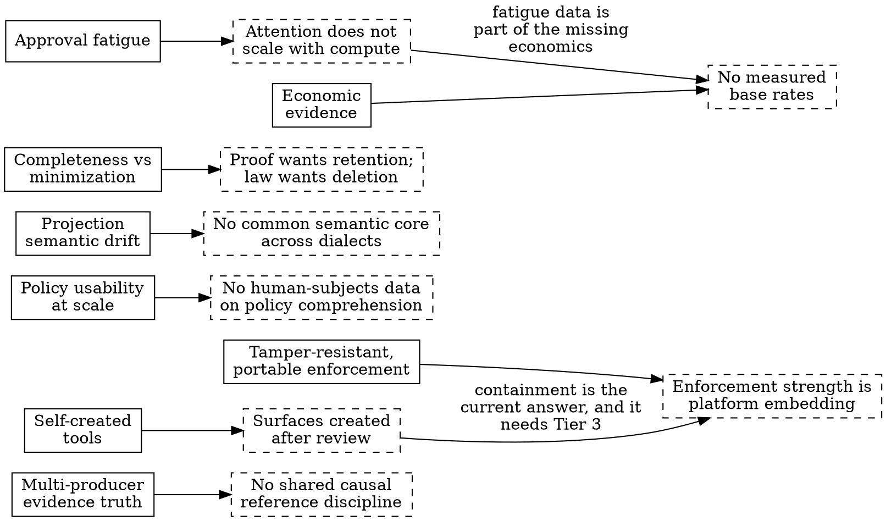

# Limitations, Open Problems, and Research Directions

> **Opening scenario.** At Northstar's year-end governance review, the five thread registers — Atlas, Forge, Ledger, Gateway, Charter — are merged into one document for the first time, and the chief of Risk & Audit does something unusual with it. She does not read the claims column aloud. She reads the *residual* column: no approver is authenticated; a bypassed wrapper leaves no trace; the evidence stream's completeness is unprovable; the lock would verify a hostile regeneration; the inheritance engine is a design, not a deployment; nobody can say what the program is worth in money. Thirty-one entries. When she finishes, she says the sentence this chapter is built around: *"This is the best document the program has produced, and I want it maintained with more care than the claims. The claims tell us what we bought. This tells us what we still owe."* No one disagrees, which itself is the year's real achievement — two years earlier, that list would have been read as an indictment.

> **Learning objectives.**
> - Enumerate what Nornyx does not govern, grounded in its own declared non-goals and stated limitations rather than in criticism from outside.
> - Distinguish limitations of one implementation from open problems of the discipline, and state eight of the latter precisely.
> - Connect each open problem to the research literature that frames it, and assess what a solution would have to provide.
> - State what evidence would falsify this book's own tier claims, and why publishing that list strengthens rather than weakens them.
> - Give a measured, defensible account of what deterministic governance boundaries genuinely buy.

> **Prerequisites.** This chapter synthesizes rather than introduces: it presupposes the tier model (Chapter 13), coverage and bypass (Chapter 14), the evidence proof boundary (Chapters 11 and 20), the threat model (Chapter 34), and the adoption economics (Chapter 37). It adds no new case scenes. Status badges follow Chapter 16 — and this chapter is where the **[extension]** badge earns its keep, because most of what follows is precisely what no badge can claim.

## 38.1 What Nornyx does not govern

An honest limitations chapter starts at home, and it has an unusual advantage here: the repository states most of its own limits, in schema descriptions, module docstrings, security documents, and the text embedded in every validation report. This section is therefore not an exposé. It is a consolidation — and the consolidation is itself the point, because limits stated in nine scattered places function as fine print, while limits stated in one place function as an engineering boundary.

**<span class="ix" data-ix="supplied evidence!as limitation">Evidence is supplied, not observed</span>.** Every evidence report the validator emits embeds the same three-sentence limitations block, and Listing 38.1 shows it as it appears in source.

```python
LIMITATIONS = (
    "Validated evidence proves conformance of supplied records only.",
    "Hash validity proves content binding, not event truth.",
    "Nornyx does not observe, operate, or monitor the runtime.",
)
```

**Listing 38.1 — The proof boundary, shipped inside every report.** From `nornyx/agentic_evidence.py`; the tuple is copied into the `limitations` field of each validation report the tool produces **[implemented]**. The security documentation states the consequence without softening: omission and fabrication are outside the proof surface, and a cooperative producer can falsely claim a new occurrence — occurrence validation proves structural consistency, not independent execution truth. Everything Chapters 11, 20, and 36 built rests on records the runtime chose to write.

**<span class="ix" data-ix="cooperative bypass">Enforcement is cooperative, and bypass is total</span>.** "Adapter enforcement is cooperative; bypassing the adapter bypasses the hook" is the repository's own sentence, and the coverage boundary behind it is narrow when stated exactly: one synchronous tool method in one framework at one pinned version, one synchronous graph-node surface in another **[implemented]**, with asynchronous variants, agent and task surfaces, delegation internals, subgraphs, and remote execution all declared unsupported. A bypassed call is not merely unenforced — it is unrecorded, so the layer's own evidence cannot reveal the layer's own coverage failures.

**<span class="ix" data-ix="lock!binds bytes not producers">The lock binds bytes, not producers</span>.** The lock schema's description says it plainly: reviewed-content binding only, never runtime behavior, producer identity, or truth. A hostile writer with repository access edits the contract, regenerates, re-locks, and every check passes; the control against that is repository history and human review, which are not properties of the lock. Structural `signature_ref` fields are identifier-shaped strings, not verified signatures — no cryptographic verification is claimed anywhere in the layer.

**<span class="ix" data-ix="identity provider!absence of">There is no human identity provider</span>.** The system that insists, at four independent layers, that only humans approve **[implemented]** cannot verify that any particular human did. Identity resolution is binding, not authentication — the benchmark's reviewer documentation uses exactly those words — and an approval assertion's `claimed_approver_ref` is claimed in the schema's own field name. The strongest identity statement the layer can support is: *this record names this identity, and the naming is consistent across the package.*

**It is not a runtime, and its inert posture is structural.** The README's boundary — an executable specification layer, not a runtime — is enforced by what the code refuses to represent: protocol declarations pin `execution_mode` to the constant `contract_only` and `live_connector_execution` to the constant `false`; scanner and validator reports embed safety blocks asserting no models called, no tools executed, no network used **[implemented]**. The overview document's non-goal list is long and worth reading as a single breath: not a runtime control plane, policy proxy, agent orchestrator, observability backend, identity provider, secrets manager, protocol runtime, or deployment system. Every one of those absences is a dependency the deploying organization must supply.

**The distribution edges are honest and thin.** The compatibility shim that carries legacy integrations onto the supported interface is merged at the pinned revision but *unpackaged* — it ships in neither the core wheel nor the adapter distribution, and sits under an "Unreleased" changelog heading **[implemented]** as repository code only. The adapter distribution itself is version 0.2.0, classified Development Status Alpha, with exact framework pins (`crewai==1.15.4`, `langgraph==1.2.2`) whose declared rationale is that no wider range has test evidence. An organization staking a production control on that stack is staking it on an Alpha package and two exact pins, and should say so in its register.

**<span class="ix" data-ix="two-verb policy language">The core policy language has two verbs</span>, and only one of them acts.** The `.nyx` policy runtime recognizes exactly the prefixes `deny` and `require`; any other rule string is bucketed into `require` **[implemented]**. Deny rules are matched by five hardcoded substring families over step text — production, secret, destructive, connector, self-modification — which Chapter 17 showed is a real, deterministic, and deliberately coarse computation. And <span class="ix" data-ix="require rules!as pending evidence">require rules are never executed at all</span>: they are recorded as `pending_evidence` obligations in the planning report **[implemented]**, which means every `require` in every contract is a promissory note whose redemption depends entirely on downstream process. A reviewer who reads `require human_approval_before_merge` as an enforcement statement has been misled by grammar; it is an obligation ledger entry. The richer semantics — three-valued decisions, revision-bound approvals, zone crossings — live in the agentic authorization engine, which governs only declared agentic-network concepts and never parses commands, paths, or tool arguments.

Table 38.1 consolidates, with one column the scattered statements lack: what each limit costs the deploying organization.

| Limitation | Where the repository states it | What the deployer must supply |
|---|---|---|
| Supplied, not observed, evidence | `LIMITATIONS` in every report; security-boundaries doc | An independent observer, or acceptance of the completeness gap in every claim |
| Cooperative enforcement; total, traceless bypass | Security-boundaries doc; coverage inventories; a pinned bypass test | Enforcement points the workload cannot avoid, on surfaces where consequence demands them |
| Lock binds bytes, not producers | Lock schema description; network-lock doc | Repository controls: protected branches, review, history integrity |
| No approver or producer authentication | Reviewer documentation; ADR-0040 | An identity provider and a signing scheme, integrated end to end |
| Not a runtime; no observation, no execution | README; overview non-goals; schema constants | The entire runtime, its observability, and its incident response |
| Shim unpackaged; adapters Alpha with exact pins | Changelog "Unreleased"; adapter metadata | Version-pin maintenance as a permanent cost; risk acceptance for Alpha status |
| Two-verb language; deny by substring; require as pending evidence | Policy-runtime source; security model doc | Process that actually discharges every pending obligation; review that reads rules as they compute, not as they read |
| Context authority and taint are advisory metadata | The context builder's own pack text | Enforcement of the trust model at whatever layer consumes the pack |

**Table 38.1 — Nornyx's stated limits, consolidated, with the bill attached.** The teaching purpose is the third column: a stated limitation is not a closed issue but a transferred obligation, and a deployment that has not budgeted the right-hand column has not adopted the tool — it has adopted the tool's marketing surface, which in this case is honest enough to make that mistake harder than usual.

> **Key idea.** None of the rows in Table 38.1 is a defect. Each is a boundary the project drew on purpose and defends in code, tests, and documentation — and Chapter 16 argued that this is exactly what makes its claims believable. The chapter's real subject begins now: the limits that are *not* anyone's design decision, because nobody knows how to remove them.

## 38.2 What the discipline has not solved

Eight problems recur across every governance architecture this book has examined, including the extensions and the competitor systems. They are stated here as problems — with what a solution would have to provide — not as roadmap items, because for most of them no one has a credible roadmap.

**1. <span class="ix" data-ix="multi-producer causality">Distributed evidence truth and multi-producer causality</span>.** Everything in Part III validates *one producer's stream against itself*. The repository is explicit that its resume machinery supports a single cumulative stream — differential chunks and multi-producer merging are not supported — and that validation does not solve distributed causality and cannot prove events across systems happened in the claimed order **[implemented]** as a declared boundary. But real agentic systems are multi-producer by construction: Ledger's five agents, a gateway, and a banking interface each observe fragments of one causal story. Timestamps cannot merge the fragments — that has been settled since the happened-before relation was formalized [@lamport-clocks] — and declared causal references only work between producers that share an identifier space and choose to cooperate. What a solution must provide: a causal-reference discipline that survives producers who did not coordinate beforehand, plus a merge semantics whose validation is as closed as the single-stream case. Nothing deployed today has both.

**2. <span class="ix" data-ix="tamper-resistant enforcement">Tamper-resistant enforcement without platform lock-in</span>.** Chapter 13's Tier 3 requires an enforcement point the workload cannot route around; Chapter 37 located those points inside specific platforms' control planes. The tension is structural: enforcement is strong *because* it is embedded in a platform, and portable *because* it is not. Today an organization chooses between cooperative enforcement that travels and mandatory enforcement that binds it to a provider's identity model, failure semantics, and roadmap. What a solution must provide: an enforcement substrate with mandatory interposition whose policy interface is portable across platforms — the analogue of what portable instruction sets did for computation. Confidential-computing attestation and mesh-style authorization each supply a fragment; neither supplies the portable governance vocabulary.

**3. Policy usability at organizational scale.** Chapter 37's nineteen-day latency and disputed ownership cells are the visible symptoms of a deeper unknown: nobody knows how to keep a policy corpus *comprehensible* past a few dozen contracts. Composition with provenance **[implemented]** tells you where a rule came from; it does not tell a business-unit author what the org layer will do to their change, or a reviewer which of two thousand composed rules actually bind this workflow. The two-verb core language is a deliberate floor on expressiveness; every step above that floor — toward the expressiveness of general policy engines — buys precision and pays in reviewability, and the exchange rate is unmeasured. What a solution must provide: evidence, not intuition, about how policy comprehension degrades with corpus size, and authoring abstractions whose effect on review accuracy has been tested on humans.

**4. <span class="ix" data-ix="semantic drift!between projections">Semantic drift between projected policies</span>.** The platform strategy of Chapter 37 depends on projecting one contract into several enforcement dialects — identity policies, egress rules, engine rules **[extension]**. Each projection is a translation, and no mechanism verifies that two translations mean the same thing; the drift taxonomy of Chapter 2 gains a fifth member the moment the second projection exists. Testing helps but cannot close it: conformance suites sample the behavior space, and the dialects differ exactly in their corners — default dispositions, failure semantics, evaluation order. What a solution must provide: either a common semantic core into which both the contract and each dialect provably compile, or per-projection refinement proofs. Both exist in the programming-languages literature; neither exists for any governance stack in production use.

**5. <span class="ix" data-ix="data minimization!versus evidence completeness">Evidence completeness versus data minimization</span>.** The audit chain of Chapter 36 wants everything preserved forever; privacy obligations want the minimum, briefly. Digest-binding payloads instead of embedding them **[implemented]** in the evidence-artifact mechanism is the standard reconciliation, and it quietly shifts the problem: a digest without its payload proves that *something* matched, and when the payload is lawfully deleted, step 6 of every future reconstruction fails by design. The organization must then choose, per artifact class, which future question it is willing to become unable to answer — a choice currently made implicitly by retention schedules written for other purposes. What a solution must provide: evidence structures that support *bounded* disclosure — proving properties of deleted content without retaining it — at engineering cost an ordinary program can afford. The cryptographic ingredients exist; the practice does not.

**6. Approval fatigue at enterprise scale.** Chapter 9 introduced it, Chapter 37 managed it, and this chapter files it as unsolved because the management techniques — thresholds, expiry, class-level approvals, latency monitoring — all *ration* human attention; none *multiplies* it. Agent throughput grows with compute; reviewer attention does not. Every architecture in this book ultimately routes its highest-consequence decisions through a human, which means every architecture in this book has a scaling ceiling set by the sincerity of human review, and no one has demonstrated a mechanism that preserves the accountability content of approval — a nameable person who actually considered the action — at ten thousand approvals a day. Delegation to risk-scoring models moves the decision, not the problem: now the model is the approver, which is precisely what four layers of this stack exist to forbid.

**7. <span class="ix" data-ix="self-created tools">Governing agents that create their own tools</span>.** The entire declaration-first architecture assumes the tool inventory is enumerable at review time: capabilities name actions, coverage inventories name surfaces, package scanning inspects artifacts that exist **[implemented]**. An agent that writes and executes new code at runtime — the explicit ambition of current agent research — creates surfaces after the review, and every mechanism in this book is blind to them by construction: nothing declared, nothing wrapped, nothing scanned. The problem is not hypothetical, and the honest current answer is containment, not governance: deny code-execution capability, or sandbox it at Tier 3 and govern the sandbox boundary instead of the tools inside it. What a solution must provide: a way for dynamically created capabilities to *inherit* bounded authority from their creator without human review of each — which is a capability-discipline problem before it is an AI problem [@miller-ocap].

**8. <span class="ix" data-ix="economic evidence!absence of">The absence of economic evidence</span>.** Chapter 37's cost ledger has real numbers on one page and, on the facing page, counted incidents and saved audit hours that no one can convert into a defensible return figure — because the discipline has no measured base rates. What is the incident probability of an ungoverned agent workflow of a given consequence class? How much does a Tier 2 boundary reduce it? No published data answers either question; the repository's own positioning document declines, correctly, to make performance, adoption, enterprise, or cost claims **[implemented]** as a stated boundary. Until the discipline has actuarial evidence, every governance budget is an argument from prudence competing against arguments from revenue, and Chapter 37's staff-engineer memo will keep being written. What a solution must provide is unglamorous: incident base rates, controlled comparisons, and loss data — the work that turned fire safety from moral exhortation into building codes.



**Figure 38.1 — Eight open problems, each with the obstacle that makes it a problem rather than a backlog item.** Dashed nodes are the blocking facts. The teaching purpose is the two cross-edges: the problems are not independent — governing self-created tools currently reduces to containment, which requires the portable mandatory enforcement of problem 2; and the fatigue ceiling of problem 6 is one of the quantities the missing economics of problem 8 would have to measure. A research program that treats these as eight separate tickets will rediscover the dependencies the hard way.

> **Misconception.** *"These problems will be solved by better models — a sufficiently aligned agent does not need external governance."* This inverts the book's founding argument. Chapter 1 established that the governance gap is a property of *probabilistic actors holding real authority*, not of any particular capability level, and Chapter 3 established that assurance is about what can be *demonstrated to someone else*, not about what is internally true. A perfectly aligned agent still cannot prove to an auditor that it was aligned yesterday; the record, the binding, and the boundary are what make the proof, and they are external by definition. Better models shrink the expected frequency of violations. They do not touch a single row of Table 38.1.

## 38.3 Research directions

Four directions connect the open problems to literature mature enough to build on. Each is stated as a direction with a first falsifiable milestone, because a research agenda without milestones is a mood.

**Characterize what governance boundaries can enforce — and exploit the gap.** The classical result is exact: execution monitors enforce precisely the safety properties — violations detectable on a finite prefix of one execution — and cannot enforce liveness or cross-execution properties [@schneider-enforceable]. Every enforcement point in this book, cooperative or independent, is an execution monitor, so the theorem bounds the entire discipline: "never share credentials across this boundary" is enforceable in principle; "the agent eventually files its evidence" and "outputs are statistically unbiased across runs" are not, by any monitor, at any tier. The research direction is to map the governance properties organizations actually want onto this boundary honestly — the taint and information-flow rules of Chapter 6 are the urgent case, since noninterference-style properties fall outside the enforceable class in general and every practical system approximates them conservatively — and then to characterize what the *combination* of monitors plus after-the-fact evidence audit can establish that monitors alone cannot. First milestone: a published classification of, say, fifty real contract rules into enforceable, approximable, and audit-only, with the approximation stated for each.

**Causal structure for multi-producer evidence.** The happened-before relation and its clock constructions [@lamport-clocks] are sixty years from being news, and yet no deployed agentic-evidence format carries causal metadata across producers. The direction is unglamorous standards work with a sharp technical core: extend an event schema of the Chapter 20 kind so that cross-producer references are first-class, define the closed validation semantics for a merged multi-stream package, and determine what the merge can prove when a subset of producers is dishonest — which is where the difficulty actually lives, because causal metadata from a lying producer is just more supplied evidence. First milestone: a two-producer reconstruction of one Ledger-class workflow in which the validated merge detects a reordering that both single-stream validations pass.

**Layered attestation from artifact to action.** Supply-chain attestation already demonstrates the pattern the evidence gap needs: independent, signed link metadata for each step of a chain, verified against a layout that says who may attest what [@in-toto], with signing infrastructure that removed most key-management friction [@sigstore]. The direction is to carry that pattern from build steps to *decisions*: an attestation over "this decision point, running this verified policy revision, evaluated this request" produced by something the workload does not control. This is the concrete engineering path from Tier 2 to Tier 3 evidence — it attacks producer identity and policy-deployment binding, two rows of Table 38.1 at once — and its hard residue is precisely the part attestation cannot reach: an attested decision point still consumes unattested inputs from the agent's context. First milestone: one wrapped surface whose evidence stream carries verifiable attestations binding each decision to a hardware-rooted identity and the exact lock digest, with the claim register rewritten to say what changed tier and what did not.

**Capability discipline for self-created tools.** The <span class="ix" data-ix="object-capability discipline">object-capability tradition</span> solved a structurally identical problem decades ago: how to let a program create new components at runtime whose authority is *bounded by construction* — a component holds exactly the capabilities passed to it, no ambient authority exists to steal, and attenuation is the default composition pattern [@miller-ocap]. The direction is to make tool-creating agents live inside that discipline: a runtime in which a generated tool physically cannot exceed its creator's authority minus an explicit attenuation, plus a governance-layer representation of *capability derivation* — so that the audit chain of Chapter 36 can reconstruct not just what a tool did but from whose authority it was carved. The gap between the ocap literature and current agent frameworks, which pass ambient credentials through environment variables, is enormous and mostly cultural. First milestone: one agent workflow in which a runtime-generated tool is exercised under derived, attenuated authority, with the derivation recorded and validated in the evidence stream.

## 38.4 What would falsify this book's claims

A book that spends thirty-eight chapters demanding falsifiable claims owes the reader its own <span class="ix" data-ix="falsification conditions">falsification conditions</span>. The tier claims of Chapter 13, as instantiated by the toolchain throughout Parts IV–VI, would be materially falsified by any of the following observations — each stated so that a motivated reader could attempt it.

*Against the Tier 1 claims.* A contract that produces different checker diagnostics or different generated bytes on two conforming platforms without any input change — determinism is load-bearing, and Chapter 12 showed a nondeterministic generator converts drift gates into noise. A duplicate-key or coercion input accepted silently by the parser. Two artifact sets with distinct reviewed content verifying against the same lock without a hash collision of the underlying function — the lock's arity argument fails if binding is looser than per-record digests claim. An approval evaluated as valid against a revision other than its exact binding.

*Against the Tier 2 claims.* A call traversing a declared wrapped surface that executes without a prior evaluation, or after a deny — the evaluate-record-execute ordering is asserted as a breaking-change boundary, and its violation on any covered path falsifies the enforcement claim for that adapter. An evidence stream violating the closed ordering model — a sequence gap, a retry after success, an unpaired transition — that validates as `pass`. An approval assertion with a non-human actor type producing an allow anywhere in the four layers that refuse it. Any of these found in the wild would be a defect; found *unacknowledged after report*, they would falsify something larger — the claim-discipline culture the book has treated as the toolchain's distinguishing evidence.

*Against the book's framing itself.* Two falsifiers matter more than the mechanical ones. First: a demonstrated attack class that defeats the boundary *within its stated assumptions* — not a bypass (declared), not producer dishonesty (declared), but, say, a systematic way to author contracts whose reviewed meaning and evaluated meaning diverge that the Chapter 34 mitigations miss. The parser-hardening history shows near-misses of exactly this shape; the claim is that the known families are closed, and that claim is exactly as good as the next finding. Second, and most uncomfortable: longitudinal evidence that organizations operating these boundaries at Tier 2 suffer governance losses at rates indistinguishable from organizations that merely document controls. The book's core wager is that deterministic boundaries plus honest claims outperform documentation plus optimism; that wager is empirical, the data does not yet exist (problem 8), and intellectual honesty requires saying that the wager could lose.

Publishing this list is not modesty theater. It is the same move the register in the opening scenario makes: the falsification conditions are the *maintenance specification* for the claims, telling every future reader exactly which observation should change their mind, and by how much.

## 38.5 What deterministic governance boundaries genuinely buy

After thirty-one residual entries, eight open problems, and a falsifiability list, the closing question is what remains standing. The answer is specific, and it is enough.

A deterministic governance boundary buys four things that nothing else in the current stack supplies. It buys an **explicit authorized set**: for the first time in most organizations, the sentence "what may this agent do?" has an answer that is written down, versioned, composed with visible provenance, and diffable — closing the gap Chapter 1 opened, independently of any enforcement at all. It buys **change visibility**: locks, digests, and drift gates convert "did the controls change?" from archaeology into a computation whose failure blocks a pipeline **[implemented]**. It buys **reconstructable decisions on the covered surfaces**: within the coverage inventory and the honesty of the producers, Chapter 36's chain turns "was this authorized?" into a mechanical check with a human conclusion at the end. And it buys **honest claim boundaries** — the tier vocabulary, the coverage inventory, the "not claimed" list — which is the purchase that compounds, because it makes every other purchase auditable and every gap fundable: Chapter 34 showed that the alternative to an honest boundary is not a stronger system but an inflated claim that silently defunds the control that would have made it true.

What the boundary does not buy has filled this chapter, and the two lists coexist without contradiction. The discipline this book teaches is not "governance solves agentic risk." It is narrower and more durable: *make the deterministic part of the system actually deterministic, bind the probabilistic part to it at named surfaces, record what crossed, and say exactly which of the eight questions each claim can answer.* That discipline was worth building when the agents were research assistants filing summaries. It becomes more valuable, not less, as the agents grow more capable — because every increase in capability widens the gap between what an organization's systems do and what its sentences about them say, and the boundary is the only instrument in the stack whose entire purpose is to keep those two things checkably close.

> **Assurance boundary.** Applied one final time, to this chapter's own content. *What is guaranteed*: that the limitations in Section 38.1 are stated by the repository at the pinned revision — every one is checkable against a cited artifact. *What is argued but not guaranteed*: the eight open problems' framing and the research directions — they are the authors' judgment, connected to literature but not derived from it. *What is explicitly a wager*: Section 38.4's second framing falsifier — the empirical value of the discipline — which no one can currently prove and this book has tried never to overstate. A reader who has internalized the difference among those three sentence classes has extracted the book's actual method, and can now apply it to systems, vendors, and books that do not volunteer it.

## Summary

Nornyx's limits are stated by Nornyx: evidence is supplied rather than observed, with omission and fabrication outside the proof surface; enforcement is cooperative and bypass is traceless; locks bind bytes rather than producers; no human is authenticated anywhere in the layer; the toolchain is not a runtime and structurally refuses to become one; the compatibility shim is unpackaged, the adapter distribution is Alpha with exact framework pins; and the core policy language has two verbs, of which deny matches five substring families and require compiles to pending-evidence obligations that only organizational process can discharge. Consolidated, these limits are transferred obligations with a bill attached. Beyond any one implementation, the discipline has eight open problems: multi-producer evidence truth, tamper-resistant enforcement without platform lock-in, policy usability at scale, semantic drift between projections, completeness versus minimization, approval fatigue, self-created tools, and the absence of economic evidence — interdependent, and none with a credible roadmap. Four research directions connect them to mature literature: the enforceable-properties boundary, causal ordering for merged evidence, layered attestation from artifact to decision, and object-capability discipline for generated tools. The book's own claims carry published falsification conditions, mechanical and empirical. What survives all of it is specific: an explicit authorized set, computable change visibility, reconstructable decisions on covered surfaces, and honest claim boundaries — the purchase that makes the other three auditable.

- A stated limitation is a transferred obligation; budget the right-hand column or you have not adopted the tool.
- Require rules are promissory notes; deny rules are the only verb that computes.
- The eight open problems are interdependent — containment needs portable enforcement, fatigue data is missing economics.
- Execution monitors enforce safety properties only; the interesting research is in what monitors plus audit can establish together.
- The book's wager — deterministic boundaries plus honest claims beat documentation plus optimism — is empirical and could lose.
- What the boundary buys is exact: the authorized set, change visibility, reconstruction, and claim honesty.

## Review questions

1. Take three rows of Table 38.1 and, for each, name the chapter that introduced the limitation, the artifact in which the repository states it, and the concrete thing a deployer must build or buy to compensate.
2. Explain why "require rules recorded as pending evidence" is a more consequential limitation than "deny rules matched by substring," even though the second sounds worse. Which organizational failure does each invite?
3. Problems 2 and 7 of Section 38.2 are connected by a cross-edge in Figure 38.1. Reconstruct the argument: why does the current best answer to self-created tools depend on solving portable mandatory enforcement?
4. State Schneider's boundary in one sentence, then classify these rules as enforceable, approximable, or audit-only: "never share tokens across the partner boundary"; "every mission eventually produces an evidence package"; "no two approvals in a quarter come from the same reviewer for the same requester."
5. Section 38.4 distinguishes mechanical falsifiers from framing falsifiers. Why would an unacknowledged mechanical defect falsify more than the mechanism it breaks? Connect the answer to Chapter 16's reading of release histories.
6. A vendor cites this chapter and says: "even the discipline's own textbook admits governance is unproven — so skip it." Write the two-paragraph reply, using only claims Section 38.5 actually supports.

## Exercises

1. **Build your own Table 38.1.** For the governance stack your organization runs (any vendor, any architecture), produce the three-column table: limitation, where the supplier states it (or "unstated — inferred from"), and what you must supply. Rows whose middle column is "unstated" are your action items, and their count is a supplier-quality metric worth reporting.
2. **Attempt a falsification.** Choose one mechanical falsifier from Section 38.4 that can be attempted against the pinned repository — nondeterministic generation, duplicate-key acceptance, an ordering violation validating as pass — and attempt it honestly for a timeboxed day. Write up the result either way: a reproduction is a responsible disclosure; a failure to reproduce is a verified claim, and your write-up is the evidence artifact.
3. **Fund one research direction.** Pick the open problem that most constrains your organization and write a one-page internal research brief: the problem in your context, the first falsifiable milestone from Section 38.3 adapted to your stack, the literature entry point, and what a milestone success would let your claim register say that it cannot say today. The last section is the one that gets it funded.

## Further reading

- [@schneider-enforceable] — the boundary of what any execution monitor can enforce; the single most clarifying theoretical result for this discipline, and the reason Section 38.3's first direction exists.
- [@lamport-clocks] — happened-before and logical clocks; the sixty-year-old answer to why timestamps cannot merge multi-producer evidence, still unabsorbed by current practice.
- [@in-toto] — layered, signed attestation across a chain of steps; the engineering template for closing the producer-identity rows of Table 38.1.
- [@miller-ocap] — object-capability composition; the discipline that self-created tools will need, worked out before agents existed to need it.
- [@saltzer-schroeder] — the 1975 design principles; read last, to notice how many of this chapter's open problems are new instances of failures the field named fifty years ago.
