# Capstone: Designing the Complete Northstar System

> **Opening scenario.** Eighteen months after the first whiteboard session of Chapter 16, Northstar Services' CTO and Risk & Audit chief co-sign a one-page commission: *"Deliver one governed system covering the research assistant, the development agent, and the treasury workflow, under one governance source, with a claim register we can defend to a regulator."* The platform team's first instinct is to start writing contracts. Their architect stops them with a question that this book has spent thirty-eight chapters equipping them to answer: "Before anyone writes a line of YAML — for every action this system can take, who could defeat the control we put on it, and how much does one failure cost? Because those two answers, not the feature list, decide which machinery each action gets." The design that follows is the subject of this chapter. The build, its deliberate sabotage, and its assurance review are the subject of Chapter 40.

> **Learning objectives.**
> - Compose the five Northstar threads — Atlas, Forge, Ledger, Gateway, and Charter — into one system design with a single governance source.
> - Lay out a workspace governance repository with canonical policies and per-application contracts that reference them, using implemented mechanisms only.
> - Produce a consolidated identity, capability, and trust-zone inventory across all agents.
> - Select an assurance tier for every governed action class from consequence and adversary, and name the enforcing component for each.
> - Design the approval structure (roles, maker–checker, escalation) and the evidence structure (what is recorded where, and for how long).
> - Deliver a claim register as a first-class artifact, and isolate the extension machinery so the implemented parts stand on their own.

> **Prerequisites.** This chapter assumes all of Parts I–VII and cites rather than re-teaches. It leans hardest on Chapter 13 (tier selection), Chapter 14 (coverage and bypass), Chapters 17–21 (the contract language, locks, the authorization SPI, evidence), Chapters 22–25 (adapters), Chapters 30–32 (the Forge, Ledger, and Charter threads in depth), and Chapter 36 (audit reconstruction).

## 39.1 The commission, and the method

A capstone design is a test of judgment more than of syntax. Northstar's commission names three applications with radically different consequence profiles: <span class="ix" data-ix="Northstar Services!capstone">Atlas</span>, a single research agent whose worst routine failure is a mis-filed summary; Forge, a development agent whose worst failure alters production software; and Ledger, a multi-agent treasury workflow whose worst failure moves money. The commission also names two constraints that shape everything: *one governance source* (the Charter thread — org policy defined once, narrowed but never silently weakened below), and *a defensible claim register* (every assurance claim written with its tier, its evidence, and its residual dependency, in the discipline of Chapter 13).

The method is the one this book has been building throughout, applied in order. First, fix the system context and its boundary, so that every later claim has a diagram to point at. Second, lay out the governance source: where policy lives, how applications consume it, and which mechanism catches divergence. Third, inventory identity, capability, and zone — the nouns of authority — across all agents at once, because the capstone's distinctive risks live in the seams between applications, not inside any one of them. Fourth, walk every governed action class through the tier-selection question of Chapter 13 and record the answer as a decision table. Fifth, design approvals and evidence as structures, not features. Last, write the claim register, and draw a hard line around everything that is **[extension]** so that removing it leaves a working, honestly-described system.

One discipline governs the whole chapter: the design uses implemented Nornyx machinery wherever it suffices, marks the two places where it does not — an external <span class="ix" data-ix="gateway!external enforcement">gateway</span> for production actions and a hierarchy <span class="ix" data-ix="hierarchy engine">conflict engine</span> — as **[extension]**, and never lets the second category prop up a claim made by the first.

## 39.2 System context

Figure 39.1 is the capstone's system-context diagram, in the C4 style of Chapter 16 [@c4model]. It is deliberately busier than Figure 16.1 because it now must carry all five threads, but the same two reading rules apply: the governance toolchain touches only local files and CI exit codes, and every component that performs real-world work is connected by edges the toolchain neither invokes nor observes.

```dot
// fig=39-1 title="Northstar system context — all five threads"
digraph G {
  rankdir=LR;
  node [shape=box];
  subgraph cluster_gov {
    label="northstar-governance (workspace repo)";
    style=filled; fillcolor="#f2f2f2";
    manifest [label="nornyx.workspace.yaml\n(canonical policies)"];
    orgpol [label="org_policies.nyx"];
  }
  subgraph cluster_apps {
    label="application repositories";
    style=filled; fillcolor="#f2f2f2";
    atlas_c [label="atlas.nyx\n(Thread A)"];
    forge_c [label="forge.nyx\n(Thread B)"];
    ledger_c [label="ledger.nyx +\nnetwork lock (Thread C)"];
  }
  nornyx [label="Nornyx toolchain in CI\ncheck · generate · drift\n· workspace-check · lock\n· evidence-validate", peripheries=2];
  artifacts [label="generated artifacts,\nprofiles + network locks"];
  evstore [label="evidence store\n(append-only: audit-store)"];
  approver [label="Approvers\n(named human roles)", shape=box, style=rounded, peripheries=2];
  auditor [label="Risk & Audit", shape=box, style=rounded];
  crewai [label="CrewAI process\n(Atlas tool wrapper)", style=dashed];
  lgraph [label="LangGraph process\n(Ledger graph nodes)", style=dashed];
  branchprot [label="GitHub branch protection\n(existing independent control)", peripheries=2];
  gateway [label="Production / banking gateway\n[extension]", style=dashed, peripheries=2];
  world [label="Refund service ·\nbank API · production", style=dashed];
  manifest -> nornyx; orgpol -> atlas_c [label="ref"]; orgpol -> forge_c [label="ref"];
  orgpol -> ledger_c [label="ref"];
  atlas_c -> nornyx; forge_c -> nornyx; ledger_c -> nornyx;
  nornyx -> artifacts [label="generates,\nlocks"];
  crewai -> evstore [label="event streams", style=dashed];
  lgraph -> evstore [label="event streams", style=dashed];
  evstore -> nornyx [label="validated against\nlocked revision"];
  artifacts -> crewai [label="authorizer +\nrecorder", style=dashed];
  artifacts -> lgraph [style=dashed];
  approver -> forge_c [label="revision-bound\napproval"];
  approver -> ledger_c;
  forge_c -> branchprot [label="merge lane", style=dashed];
  lgraph -> gateway [style=dashed]; crewai -> gateway [style=dashed];
  gateway -> world [style=dashed];
  nornyx -> auditor [label="reports, digests,\nclaim register"];
}
```



**Figure 39.1 — Northstar system context, all five threads.** Solid edges are interactions the governance layer actually performs; dashed edges are paths it describes, configures, or hopes for but does not touch. Two components are double-bordered *and* outside the toolchain: branch protection, an independent enforcement point Northstar already owns, and the production/banking gateway, which does not yet exist and is marked **[extension]**. The teaching purpose is that the capstone's Tier 3 story rests entirely on those two boxes — one real, one designed — and on nothing inside the solid region.

Three architectural decisions are visible in the figure and worth stating before any artifact exists. First, there is exactly one governance source: the `northstar-governance` repository holds the canonical policy definitions and the workspace manifest, and application contracts *reference* the canonical policies rather than copying them. Second, the runtime touchpoints are cooperative adapters inside the agent processes — the CrewAI tool wrapper for Atlas and the LangGraph node wrappers for Ledger — so everything they support is Tier 2, cooperative, declared surfaces only. Third, the actions whose consequence exceeds what Tier 2 can defend are routed to independent enforcement points: the existing branch-protection control for Forge's merge lane, and the **[extension]** gateway for payment submission and external publication.

## 39.3 The governance source layout

Thread E's requirement — a lower layer may narrow but never silently widen a superior control — becomes concrete as a repository layout. The `northstar-governance` repository holds two files that matter: a canonical policy contract and a workspace manifest. Listing 39.1 shows both, exactly as built and verified for this capstone.

```yaml
# northstar-governance/org_policies.nyx — the single canonical definition
nornyx: "0.1"
project:
  name: NorthstarOrgPolicies
  description: "Canonical Northstar org policies. Application contracts
    reference these; they never copy them."
policies:
  - name: NorthstarBaseline
    rules:
      - deny secrets_to_llm
      - deny production_write_without_approval
      - require tests_if_code_changed
      - require evidence_if_harness_completed
      - require human_approval_before_merge

# nornyx.workspace.yaml — canonical rules plus the member list
workspace: NorthstarServices
policies:
  NorthstarBaseline:
    - deny secrets_to_llm
    - deny production_write_without_approval
    - require tests_if_code_changed
    - require evidence_if_harness_completed
    - require human_approval_before_merge
members:
  - path: atlas/atlas.nyx
  - path: payments-api/forge.nyx
  - path: treasury-ledger/ledger.nyx
```

**Listing 39.1 — The Northstar governance source.** Built for this capstone in the shape of `nornyx/examples/org_policies.nyx` and the workspace manifest format of `docs/USE_IN_YOUR_REPO.md`; checked and enforced by the transcripts in this chapter and Chapter 40. The rule strings are the canonical forms from `examples/governed_delivery_control_plane.nyx`.

Each application contract consumes the canonical policy through the <span class="ix" data-ix="policy ref">`ref` mechanism</span> **[implemented]**: `ref: ../northstar-governance/org_policies.nyx#NorthstarBaseline`. Resolution happens at load time, offline, against a local file only; remote sources are rejected, a missing source or policy fails the parse closed, and the compiled result is ordinary inline rules that every downstream consumer — checker, generator, drift gate — sees identically (`nornyx/parser.py`, shipped in 1.3.0). The layout consequence deserves a sentence of honesty: `ref` targets a *local* path, so it works because Northstar's governance CI checks the repositories out side by side; Nornyx deliberately has no cross-repository reference in the language, a decision its own multi-repo case study records as intentional (`docs/CASE_STUDY_multi_repo_governance.md`).

The independent verification that the effective rules actually match is `nornyx workspace-check` **[implemented]**: the manifest declares the canonical rule set once, and the check compares every member's named policy against it as normalized rule sets, reporting `ok`, `missing`, `drift` (with the exact missing and extra rules), `contract_missing`, or — in `--write` sync mode — `synced`. Run against the three assembled contracts, the capstone workspace reports `"status": "pass"` with all three members `ok`, and exits 0.

> **Case study — Charter.** The signature Charter scene is now runnable rather than hypothetical. A Treasury platform engineer, tidying the Forge contract, replaces the `ref` with an inline copy and drops `deny secrets_to_llm` — exactly the silent weakening Chapter 32 warned about. The repo-local gate stays green: `nornyx check payments-api/forge.nyx` passes, because the contract is still internally coherent. The org-level gate does not: `nornyx workspace-check` returns `"status": "drift"` with the member entry `{"policy": "NorthstarBaseline", "status": "drift", "missing": ["deny secrets_to_llm"], "extra": []}` and exit code 1 — a transcript reproduced verbatim in Chapter 40. The weakening is visible, attributable to a file and a diff, and blocks the pipeline. What Nornyx does *not* do is decide whether the weakening was legitimate: a genuine mission-specific relaxation must travel as an explicit exception record with an owner, an expiry, and an approving authority — the `nornyx.governance_exceptions.v1` shape **[implemented]** as a schema and structural check — never as a quiet diff.

What the layout does *not* provide is equally part of the design. The full five-level Charter hierarchy — org charter, business unit, application, agent, mission — with automatic conflict detection between levels is an **[extension]**; Chapter 32 designed it and Section 39.7 isolates it. What ships today is two levels done well: canonical source plus members, with `ref` for authoring-time single-sourcing and `workspace-check` for verification. Northstar's design maps its five conceptual levels onto those two mechanical ones — org policy in the manifest, everything below it in per-application contracts — and accepts that inter-level conflicts beyond rule-set equality are found by human review.

## 39.4 Identity, capability, and zone inventory

A capstone-scale system needs its authority nouns in one table, because the risks worth designing against are cross-application: an identity that quietly accumulates capabilities across contracts, a zone name that means different things in two repos, a capability string that one team treats as low-risk and another gates. Table 39.1 consolidates the inventory across all three applications.

| Identity (namespace / subject) | Application | Capabilities held | Home zone | Notes |
|---|---|---|---|---|
| `northstar.research` / `atlas` | Atlas | `research.search_approved`, `research.summarize`, `research.file_internal` | `research-internal` | Single agent; CrewAI tool binding; denied surface: `publish_external`, `purchase.*`, any undeclared tool |
| `northstar.treasury.plan` / `planner` | Ledger | `read.exception_case`, `plan.exception_workflow`, `analyze.exposure` | `treasury-plan` | May delegate `analyze.exposure`, depth 1, expiring |
| `northstar.treasury.data` / `analyst` | Ledger | `read.exception_case` (+ `analyze.exposure` by delegation only) | `treasury-data` | Read-only data zone; holds no drafting capability |
| `northstar.treasury.exec` / `executor` | Ledger | `read.exception_case`, `payment.draft` | `treasury-plan` | Drafts adjustments; **does not hold** `payment.submit` |
| `northstar.treasury.approval` / `approval_liaison` | Ledger | `read.exception_case`, `approval.assemble_package` | `treasury-plan` | Assembles packages; cannot decide |
| *(role, not identity)* audit-recorder | Ledger | `audit.record_evidence` | `audit-store` | Realized as the evidence-recorder producer identity, not an agent |
| *(design-level)* Forge | Forge | inspect, propose, test, open PR | repo working zone | Governed by the delivery contract and CI gates, not by an agentic-network identity |

**Table 39.1 — Consolidated identity and capability inventory.** Ledger rows are verbatim from the capstone contract built in Chapter 40; capability names and namespaces are the canonical Northstar forms. Two absences are the table's teaching content: no identity holds `payment.submit` — the capability is declared in the contract's vocabulary so that a request for it can be *evaluated and denied* rather than being unrepresentable, but no membership grants it — and no identity anywhere can approve, because in the identity schema `authority` is the constant `non_human` and `can_approve` the constant `false` **[implemented]** (`schemas/agent_identities_v1.schema.json`).

The zone inventory follows the same consolidation. Atlas contributes `research-internal` and the untrusted `public-web` source zone with never-share categories `customer_data`, `credentials`, `strategy_docs`. Ledger contributes `treasury-plan`, the read-only `treasury-data`, the gated `payment-exec`, and the append-only `audit-store`. In the built network contract, the three in-network Ledger zones are encoded as ids `zone.treasury_plan`, `zone.treasury_data`, and `zone.payment_exec`; `audit-store` is realized not as a network trust zone but as the evidence store itself, whose append-only property is a storage control **[guidance]** rather than a schema fact. Every declared zone must carry a non-empty `never_share` list — the schema makes a zone without one unrepresentable **[implemented]** — and the capstone extends the four universal sensitive categories with Ledger's own: `account_credentials` and `full_pan`. Figure 39.2 draws the map.

<figure class="nx-fig" id="fig-39-2">
  <div class="fig-body">
    <div class="zones">
      <div class="zone" data-name="research-internal (Atlas)">
        <div class="node">atlas</div>
        <div class="node">internal store</div>
      </div>
      <div class="zone untrusted" data-name="public-web — never-share: customer_data, credentials, strategy_docs">
        <div class="node">approved sources (ingress-only content)</div>
      </div>
      <div class="zone" data-name="treasury-plan (Ledger)">
        <div class="node">planner</div>
        <div class="node">executor</div>
        <div class="node">approval_liaison</div>
      </div>
      <div class="zone" data-name="treasury-data — never-share incl. account_credentials, full_pan">
        <div class="node">analyst (read-only)</div>
      </div>
      <div class="zone untrusted" data-name="payment-exec — external_contract_only; ingress gate ⛔">
        <div class="node">adjustment_draft, evidence_digest only</div>
      </div>
      <div class="zone" data-name="audit-store — append-only evidence">
        <div class="node">event streams · validation reports · approval records</div>
      </div>
    </div>
  </div>
  <figcaption><b>Figure 39.2 — The Northstar zone map.</b> Solid zones are governed; dashed zones are untrusted or external. Movement between the treasury zones is gated: the analyst's zone is entered and left only through the analysis-review gate, and <code>payment-exec</code> is classified <code>external_contract_only</code> with an ingress gate that requires policy, human approval, and revision-bound evidence. The teaching purpose is that the map is a set of declarations the engine evaluates against — every crossing, share, and delegation in Chapter 40's transcripts names a zone from this figure — not a network diagram.</figcaption>
</figure>

## 39.5 Tier selection by consequence

The chapter's central deliverable is Table 39.2: every governed action class walked through Chapter 13's two questions — what does one failure cost, and who is trying to cause it — with the resulting tier and, critically, the named component that enforces it. A tier without an enforcing component is a wish.

| Governed action class | Consequence of one failure | Adversary in scope | Tier | Enforcing component |
|---|---|---|---|---|
| Atlas: search, summarize, file internally | Low; recoverable | Accident; prompt injection in retrieved text | 2 | Wrapped CrewAI `BaseTool._run` surface **[implemented]**, separately distributed adapter |
| Atlas: publish externally / share with partner | High; irrecoverable once public | Prompt injection; accident | 2 today, 3 target | Deny by non-declaration + revision-bound human approval **[implemented]**; network egress gateway **[extension]** |
| Forge: read repo, propose on branch, run tests, open PR | Low; humans review | Accident | 1 + 2 | Contract + CI gates **[implemented]**; wrapped tool surface where the agent framework permits |
| Forge: merge to protected branch | High; alters production software | Accident and a compromised agent | 3 | GitHub branch protection — an existing independent enforcement point — with approval-to-revision binding at Tier 1/2 **[guidance]** |
| Forge: production deploy, release, secrets access, destructive change | Severe | Insider; supply-chain compromise | 3 | Deployment gateway / platform IAM boundary **[extension]**; until then the lane is blocked by fail-closed CI and named-role approval |
| Ledger: read case, plan, assemble package | Low | Accident | 2 | Wrapped LangGraph sync node surface **[implemented]** |
| Ledger: `analyze.exposure` (delegated) | Medium | Accident; over-delegation | 2 | Authorization SPI delegation evaluation, depth-bounded, expiring **[implemented]** |
| Ledger: `payment.draft` | High | Accident; confused deputy | 2 | Gate-guarded capability on the wrapped surface **[implemented]** |
| Ledger: `payment.submit` | Severe; financial and regulatory | Insider; compromised dependency | 3 | Banking gateway **[extension]**; today: capability held by no identity, crossing requires human approval — both Tier 2 |
| Third-party tool bundle installation | High | Supply chain | 1 | `nornyx package scan` inventory + risk surface + approval gate **[implemented]**; never claims the package safe |
| Change to the canonical org policy | High | Insider; process drift | 1 | Maker–checker review on `northstar-governance` + `workspace-check` in every member pipeline **[implemented]** |

**Table 39.2 — The capstone tier decision table.** The teaching purpose is the last column read against the badge on it. Every Tier 2 row names an implemented, tested surface with a coverage inventory behind it; every Tier 3 row names either a control Northstar already owns (branch protection) or an **[extension]** — and where the row says extension, the *current* protection is honestly restated one tier lower. No row's claim depends on a component that does not exist.

Two rows repay a closer look. The Forge merge row is the cheapest Tier 3 in the system: Northstar does not build an enforcement point, it *binds* one it already has. Branch protection is independent of the agent — the agent cannot route around it, cannot disable it, and does not produce its evidence — so the tier is real; what Nornyx contributes is the Tier 1 layer beneath it (which approval, bound to which revision, under which policy) and the Tier 2 record of the agent-side request. The `payment.submit` row is the opposite: the defensible tier exceeds anything the implemented machinery can supply, and the design says so. Until the banking gateway exists, the honest sentence is *"payment submission on governed surfaces is denied to every agent identity, and the crossing into `payment-exec` requires a revision-bound human approval — cooperatively enforced, declared surfaces only"* — a Tier 2 sentence, kept deliberately un-inflated, with the bypass named in the claim register.

> **Misconception.** *"The capstone should push everything to the highest tier we can afford."* Table 39.2 deliberately leaves seven of eleven rows at Tier 1 or 2. Chapter 13's argument was that tiers are matched to consequence and adversary, not maximized; the capstone's contribution is the discipline of writing the *whole* table, because tier inflation almost always enters through the rows nobody wrote down. An Atlas summary filed to the wrong folder does not justify gateway latency on every tool call — and a payment submission does not tolerate its absence.

## 39.6 Approval and evidence design

**Roles.** The capstone's approval structure uses the composed module authority as its skeleton. The agentic-network governance module fixes the approval requirement `agentic_network_authority`: required role `network_governance_owner`, eligible roles `network_governance_owner`, `security_reviewer`, and `architecture_reviewer`, all six non-human actor types denied, evidence required, timing `before_action`, exact revision binding, relative expiry `P7D` **[implemented]** (`nornyx/profiles_data/module_agentic_network_governance.yaml`). This produced the capstone's first genuine design lesson, found by running the checker rather than by reading documentation: Northstar's initial Ledger draft declared the treasury officer's own role name in the approval block, and `nornyx check` failed closed with `AN_APPROVAL_DECLARED_ROLE_UNAUTHORIZED` and `AN_APPROVAL_MODULE_ROLE_OMITTED` — a document cannot widen the composed module's authority set. The resolution is organizational, not mechanical: Northstar's treasury officer *holds* the `network_governance_owner` role for the treasury network, and the org's role-to-person mapping lives in its identity provider, outside Nornyx's boundary — which is exactly where Chapter 9 said accountable identity must live.

**Maker–checker.** The <span class="ix" data-ix="maker–checker!capstone design">maker–checker</span> rule — the proposer of a change can never approve it — is enforced at three depths. Structurally, no agent identity can approve at all, so every maker that is an agent is separated from every checker by construction. At the governance layer, the separation-of-duties structural checks reject self-approval and approver-independence overlap in composed governance **[implemented]**. Organizationally, for human-to-human separation (a platform engineer proposing a policy change and a colleague approving it), Northstar relies on repository review rules — a **[guidance]** control the claim register records as such.

**Escalation.** Ledger's escalation-by-amount is designed the only way the engine can see it: amount bands are encoded as *distinct capabilities with distinct control burdens*, in the pattern of the repository's support-network example (`propose_refund_under_limit` versus `escalate_high_value_refund`). A payment adjustment at or below €50,000 is `payment.draft` — gate-guarded, no approval requirement of its own; above €50,000 the case is handed off toward submission, and `payment.submit` carries the human approval requirement outright. The threshold itself — the €50,000 — is enforced by the application code that classifies the case into a capability, which is a Tier 2 cooperative fact the register must state; the engine enforces that whichever capability is requested gets that capability's controls **[implemented]**.

<figure class="nx-fig" id="fig-39-3">
  <div class="fig-body">
    <div class="flow-col">
      <div class="flow">
        <div class="node">Case ≤ €50k</div>
        <div class="arr">→</div>
        <div class="node">executor: payment.draft ✋</div>
        <div class="arr">→</div>
        <div class="node">gate: exec ingress</div>
        <div class="arr">→</div>
        <div class="node">draft recorded 📄</div>
      </div>
      <div class="flow">
        <div class="node">Case &gt; €50k</div>
        <div class="arr">→</div>
        <div class="node">handoff to escalation</div>
        <div class="arr">→</div>
        <div class="node authority">human approval (network_governance_owner)</div>
        <div class="arr">→</div>
        <div class="node">payment.submit — Tier 3 gateway [extension]</div>
      </div>
    </div>
  </div>
  <figcaption><b>Figure 39.3 — Escalation as capability structure.</b> The amount threshold selects which capability the application requests; each capability carries its own gates and approval requirements, which the engine evaluates identically every time. The teaching purpose is that escalation is not an engine feature — it is a design pattern that maps consequence bands onto the capability vocabulary, so the deterministic machinery can do the rest.</figcaption>
</figure>

**Evidence.** The evidence design answers Chapter 11's question — recorded by whom, where, kept how long — per producer. *Pipeline evidence* (checker diagnostics, drift reports, workspace reports, lock-check reports, package-scan reports) is produced by CI runs of the toolchain, written as deterministic JSON, and retained with the build records; because generated artifacts and locks are timestamp-free **[implemented]**, this evidence is keyed by revision, not by clock. *Runtime evidence* (the `nornyx.agentic_runtime_events.v1` streams from the adapters, one per mission, in explicit occurrence mode for Ledger) is written to the append-only audit-store together with its validation report; every event binds network id, contract digest, lock digest, and subject revision **[implemented]**, so a stored stream remains checkable against the exact contract it claims. *Approval evidence* is a hash-bound record in the contract's `governance_evidence` block plus the event-level `approval_granted` entry with its human `actor_type`. Retention periods are organizational: Northstar sets seven years for approval and payment-related evidence to match its financial-records obligations and one year for low-risk research streams — figures the register marks **[guidance]**, since no schema enforces a clock. The proof boundary from Chapter 20 is restated in the design rather than discovered later: every validation report embeds "Validated evidence proves conformance of supplied records only," "Hash validity proves content binding, not event truth," and "Nornyx does not observe, operate, or monitor the runtime" **[implemented]**.

## 39.7 The claim register, and the extension boundary

The claim register is the capstone's contract with its own future auditors: one row per assurance claim, each carrying its scope, the producer of its evidence, its tier, and its residual dependency — the thing that must hold, outside the claim, for the claim to matter. Table 39.3 is Northstar's register at design signoff. Chapter 40 attacks it; Chapter 41 reads its costs.

| ID | Claim | Scope (surfaces) | Evidence producer | Tier | Residual dependency |
|---|---|---|---|---|---|
| NS-ORG-001 | The canonical baseline policy is identical, rule for rule, in every governed repository | All member contracts in the workspace manifest | `workspace-check` in each pipeline | 1 | The gate must run and its exit code must block the merge; an operator can merge past red |
| NS-ORG-002 | Committed control artifacts match their contract source exactly | All generated artifacts per repo | `nornyx drift` full-output gate | 1 | Repository history controls; a hostile committer could regenerate consistently (Ch. 12) |
| NS-ATLAS-001 | Atlas cannot invoke an undeclared tool on the wrapped surface | CrewAI sync `_run` surface only | Adapter decisions + event stream | 2 | Coverage inventory: five of six CrewAI surfaces are not wrapped; direct calls are ungoverned |
| NS-ATLAS-002 | External sharing by Atlas requires a revision-bound human approval | Declared crossing into the external zone | Engine decision + `approval_granted` event | 2 | No network egress control exists; the Tier 3 upgrade is the **[extension]** gateway |
| NS-FORGE-001 | No merge to a protected branch occurs without a named human approval | `payments-api` merge lane | Branch-protection audit log (platform-owned) | 3 | Platform administrators can alter protection settings; independence is organizational |
| NS-FORGE-002 | An approval does not survive the revision it was granted against | All approval-gated actions | Engine `APPROVAL_REVISION_MISMATCH` denials; static `AN_REVISION_MISMATCH` | 2 | The revision must actually change when content changes — content-addressed revisions **[implemented]** |
| NS-LEDGER-001 | No agent identity can hold or exercise approval authority | All identities, all networks | Schema constants; static, engine, and evidence checks | 1 + 2 | Humans misusing their own authority are out of scope; four enforcement layers, one assumption |
| NS-LEDGER-002 | The executor cannot submit a payment on any governed surface | Wrapped LangGraph nodes; declared capabilities | `CAPABILITY_DENIED` decisions + denial events | 2 | A direct bank-API call under the wrapper is unevaluated — the register's most consequential bypass; motivates the gateway |
| NS-LEDGER-003 | Sensitive categories (incl. `account_credentials`, `full_pan`) are never shared across zone boundaries on evaluated paths | Declared share and crossing requests | `SENSITIVE_SHARING` denials; static + evidence checks | 2 | "Evaluated paths" is load-bearing: unevaluated exfiltration channels are outside scope |
| NS-PKG-001 | No third-party tool bundle is installed without inventory, risk surface, and human approval | All bundles entering agent environments | `package scan` reports + approval gate | 1 | The scan never claims the package safe; the gate is process, and the scanner sees only what is in the bundle |

**Table 39.3 — The Northstar claim register at design signoff.** Every row's tier is defensible from Table 39.2, every producer is a component in Figure 39.1, and every residual dependency is a sentence an auditor can test. The teaching purpose is the last column: a register whose residual column is empty has not been finished, it has been inflated.

One register row deserves its long form, because the shape matters as much as the content. Listing 39.2 expands NS-LEDGER-002 in the structure Chapter 13 introduced.

```yaml
claim_id: NS-LEDGER-002
claim: "The Ledger executor cannot submit a payment adjustment."
tier: 2                        # cooperative, declared surfaces only
surfaces_in_scope: [wrapped LangGraph sync nodes, declared capability requests]
evidence: [network lock, CAPABILITY_DENIED decision records,
           capability_denied events bound to revision git:9f3c1a7...,
           validation report status pass]
assumptions: ["payment submission is reachable only through governed surfaces",
              "the event producer neither omits nor fabricates records"]
bypass_paths: ["direct call to the bank client library beneath the wrapper",
               "any asynchronous or undeclared execution path"]
on_component_failure: "fail-closed: load_authorizer refuses a stale or invalid
                       lock; adapter denial raises before the callable runs"
not_claimed: ["network-level prevention", "producer authentication",
              "coverage of unwrapped surfaces", "completeness of the stream"]
```

**Listing 39.2 — NS-LEDGER-002 in full.** Illustrative — the register format is this book's design; every evidence item and diagnostic named in it is real and exercised in Chapter 40. The `assumptions` line is the one the gateway extension exists to delete.

**The extension boundary.** Exactly two pieces of machinery in this design are **[extension]**, and the design isolates them the same way. The *production/banking gateway* — a mandatory enforcement point for `payment.submit`, production deployment, and Atlas's external egress, consuming a projection of the same contracts and producing independently owned evidence — appears in Figure 39.1 as a dashed box, in Table 39.2 as the target tier of three rows, and in the register only inside `not_claimed` and residual-dependency cells. The *hierarchy conflict engine* — Chapter 32's five-level inheritance checker with conflict reporting — appears nowhere in the operational design at all; its function is approximated by two implemented mechanisms (`ref` and `workspace-check`) plus review. The isolation rule is mechanical and worth stating as a checklist: an extension may define a *target* tier, may motivate a residual-dependency sentence, and may consume implemented artifacts as input — but no register row's *current* tier, no CI gate, and no evidence chain may depend on it. Delete both extensions and every sentence in Tables 39.2 and 39.3 remains true. That property — the design degrades to an honestly described smaller system rather than to a false one — is the capstone's quiet answer to the tier inflation of Chapter 13.

> **Design checkpoint.** Before leaving the design phase, Northstar's architect applies three tests. *The deletion test:* remove every **[extension]** box and reread the claim register — does any row overstate? *The seam test:* for each pair of applications, name one identity, one capability string, and one zone that appear in both inventories, and confirm they mean the same thing (the capstone's answer: none do, by construction — the namespaces are disjoint, and the only shared object is the canonical policy). *The commission test:* hand Table 39.3 to the Risk & Audit chief and ask which row they would probe first. The chief picks NS-LEDGER-002's bypass path — which is exactly the failure injection Chapter 40 runs.

> **Assurance boundary.** Everything in this chapter is design plus the Tier 1 evidence that the design's artifacts check, compose, generate, and lock as claimed. Nothing here yet demonstrates a runtime denial, a caught drift, a rejected replay, or a surfaced install hook — those demonstrations, and the eight-questions review of the three most consequential claims, are Chapter 40's burden. A design document that stops here and ships the register anyway has produced Tier 1 claims wearing Tier 2 vocabulary.

## Summary

The capstone design composes the five Northstar threads under two constraints: one governance source, and a claim register defensible to a regulator. The governance source is a workspace repository holding canonical policies once, consumed by application contracts through the offline, fail-closed `ref` mechanism and verified independently by `workspace-check` — both implemented, with the five-level hierarchy engine held strictly as an extension. The consolidated inventory puts every identity, capability, and zone in one place, and its most important entries are absences: no identity holds `payment.submit`, and no identity can approve. Tier selection walks all eleven governed action classes through consequence and adversary, names an enforcing component per row, and restates every extension-dependent row one tier lower for the present. Approvals are structured around the composed module's fixed role authority, maker–checker at three depths, and escalation encoded as capability structure; evidence is designed per producer with revision-keyed retention and the proof boundary stated up front. The claim register — ten rows with scope, producer, tier, and residual dependency — is the deliverable that binds it all, and the extension boundary is enforced by the deletion test: remove the gateway and the hierarchy engine, and every remaining sentence stays true.

- One governance source: canonical policies plus members, `ref` for authoring, `workspace-check` for verification.
- The inventory's absences (unheld capabilities, unapprovable identities) carry more assurance than its entries.
- Every tier assignment names its enforcing component and carries its badge.
- Escalation and thresholds are design patterns over the capability vocabulary, not engine features.
- A claim register row is unfinished until its residual-dependency cell is written.
- Extensions may set targets and motivate residuals; they may never hold up a current claim.

## Review questions

1. Northstar's `ref` mechanism and `workspace-check` overlap: both keep member policy aligned with the canonical source. Explain what each provides that the other does not, and what failure occurs if only one is deployed.
2. Why does the capstone declare `payment.submit` as a capability at all, given that no identity holds it? What does the alternative — leaving it undeclared — change about the engine's behavior and the evidence produced?
3. The Forge merge lane reaches Tier 3 without any new enforcement software. Identify the pre-existing component, state what makes it independent in Chapter 13's sense, and name the part of the claim that remains at Tier 1.
4. The treasury officer cannot be named directly in the Ledger approval block. Explain the diagnostic that enforces this, why the module's fixed role authority is a feature rather than a limitation, and where the person-to-role mapping must live instead.
5. Take claim NS-LEDGER-003 and identify the two words that scope it honestly. Rewrite the claim without them and explain which of Chapter 13's inflation patterns the rewrite commits.
6. Apply the deletion test to a governance design you know: which of its claims survive the removal of components that do not yet exist?

## Exercises

1. **Extend the register.** Write three additional claim-register rows the chapter omitted: one for Atlas's context-taint handling, one for the Ledger delegation (depth, expiry, scope), and one for the drift gate on the Ledger network lock. Each row needs scope, producer, tier, and a residual dependency an auditor could test.
2. **Design the fourth application.** Northstar acquires a customer-operations chatbot. Using this chapter's method — inventory, tier table rows, approval design, register rows — integrate it into the capstone without modifying any existing contract. State explicitly which new zones and never-share categories it introduces and which existing claims its arrival weakens.
3. **Stress the seams.** Construct a plausible cross-application incident: the Atlas agent's summaries are used as retrieved context by the Ledger planner. Trace which zone declarations, taint channels, and register rows are implicated, and propose the smallest design change that makes the seam governed rather than accidental.

## Further reading

- [@c4model] — the system-context altitude used in Figure 39.1; the capstone diagram is deliberately kept at this level to keep boundary arguments checkable.
- [@clark-wilson] — the commercial-integrity model behind maker–checker and separation of duties; the capstone's three-depth separation is an application of its well-formed-transaction idea.
- [@saltzer-schroeder] — least privilege and complete mediation, the two principles Table 39.2 operationalizes; the `payment.submit` row is a direct exercise of both.
- [@nist-ai-rmf] — the risk-management framing under which a tier decision table and claim register can be presented to a governance function.
- [@slsa] — a worked example of level definitions with named residuals, the pattern Table 39.3's last column follows.
