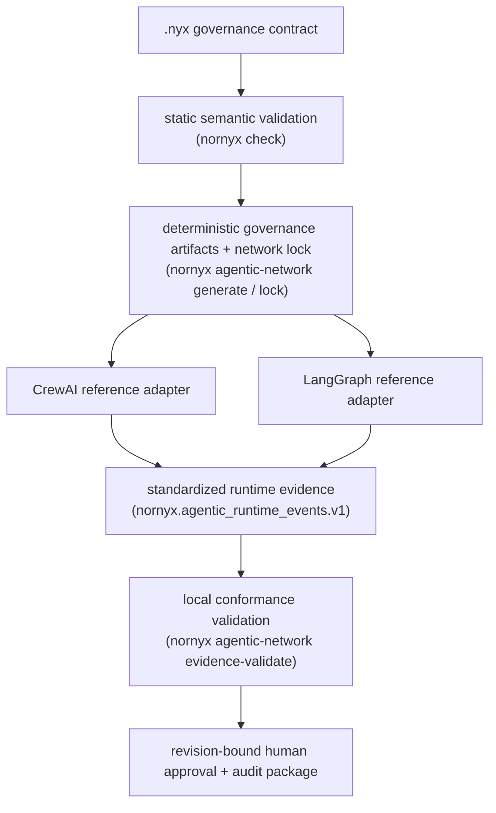

# Agentic-Network Governance — Overview

Nornyx is a design-time governance compiler, deterministic control-artifact
generator, and revision-bound evidence validator for AI software and agentic
systems. The optional `agentic_network` profile lets one `.nyx` contract
declare and validate a bounded agent network — identities, capabilities,
memberships, trust zones, gates, protocol declarations, revocations,
delegations, handoffs, and relations — and then binds generated controls and
supplied runtime evidence to that exact contract revision.

Nornyx is **not** a runtime control plane, policy proxy, agent orchestrator,
observability backend, Promptfoo or LangSmith replacement, identity provider,
secrets manager, MCP runtime, A2A runtime, or deployment system. Specialist
runtimes execute work; Nornyx governs declarations and supplied evidence.

## Operational chain

## What each capability provides

| Capability | Surface | What it proves |
| --- | --- | --- |
| Static network governance (AN-001/AN-002) | `nornyx check` | Declared identities, capabilities, zones, gates, delegations, handoffs, and relations are internally consistent, bounded, and fail closed. |
| Deterministic artifacts + lock (AN-003) | `nornyx agentic-network generate / lock / lock-check` | Generated declarations are byte-stable and content-addressed; drift between contract, composition, and controls is detected. |
| Runtime-event evidence (AN-004) | `nornyx agentic-network evidence-validate` | Supplied local event evidence conforms to the exact contract, lock, and revision. |
| Reference adapters (AN-005) | `integrations/` (not packaged) | One contract governs CrewAI and LangGraph at the adapter boundary with standardized evidence emission. |
| Product proof (AN-006) | `examples/agentic_network_support/` | The full chain runs offline, deterministically, with measured allowed/blocked outcomes. |

## Honest limits

- Validated evidence proves conformance of supplied records only.
- Hashes prove content binding — not truth, identity, safety, or producer
  honesty.
- Adapter enforcement cannot cover every framework escape path; the final
  authority is evidence validation against the lock.
- Nornyx never operates, observes, or monitors the running network, and it
  never grants approvals: high-impact approval remains human,
  revision-bound, expiring, and revocable.

## Documents in this set

1. [End-to-end tutorial](01_TUTORIAL.md)
2. [CrewAI integration guide](02_CREWAI_GUIDE.md)
3. [LangGraph integration guide](03_LANGGRAPH_GUIDE.md)
4. [External evaluation evidence](04_EXTERNAL_EVAL_EVIDENCE.md)
5. [Protocol declarations](05_PROTOCOL_DECLARATIONS.md)
6. [Runtime-event evidence](06_RUNTIME_EVIDENCE.md)
7. [The network lock](07_NETWORK_LOCK.md)
8. [Security boundaries](08_SECURITY_BOUNDARIES.md)
9. [Troubleshooting](09_TROUBLESHOOTING.md)
10. [Before/after and positioning](10_BEFORE_AFTER_AND_POSITIONING.md)
11. [Reference CI](11_REFERENCE_CI.md)
