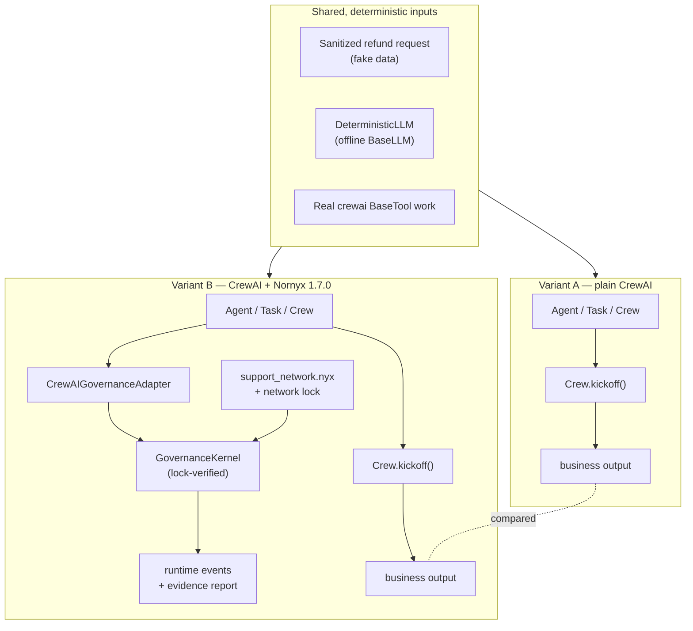

# CrewAI × Nornyx 1.7.0 — a framework-native A/B example

This example runs **one** customer-support workflow in **two controlled
variants** and produces reproducible execution evidence of exactly what Nornyx
adds, costs, prevents, and records — and what stays outside its enforcement
boundary.

- **Variant A — plain CrewAI**: ordinary CrewAI, no Nornyx.
- **Variant B — CrewAI governed by Nornyx 1.7.0**: the *same* agents, tasks,
  tools, deterministic offline model, and inputs, with Nornyx governance applied
  on the integrated path.

Both variants use real CrewAI lifecycle objects — `Agent`, `Task`, `Crew`,
`Process`, `BaseLLM`, `BaseTool`, and `Crew.kickoff()`. The only intended
difference is the presence or absence of Nornyx governance.

> This is not a promotional demo. The denial paths, the bypass path (S14), and
> the honest limitations below are all part of the deliverable.

## Purpose

CrewAI provides agent execution and orchestration. Nornyx provides an external,
revision-bound governance contract, fail-closed authority checks on integrated
paths, deterministic control artifacts, human-approval constraints, and
independently validatable runtime evidence. This example lets you **verify that
statement against actual output** rather than take it on faith.

## Methodology (equivalent execution paths)

Every **runtime** scenario is built identically in both variants: the same
`Agent`, the same `Task`, the same business tool, and a real `Crew.kickoff()`.
The only difference is the callable the tool wraps:

- **Variant A**: the raw business callable (records a side effect, returns output).
- **Variant B**: the *same* business callable, wrapped so a Nornyx check runs
  **immediately before** it. On denial the check refuses and returns a sentinel,
  so the business callable never runs — proved by a **side-effect ledger** that
  stays at zero, not by inferring intent from an exception.

Because the topology is identical, a denied runtime scenario is a genuine
apples-to-apples result: *the same operation, governance on vs off.* Two
scenarios are **not** runtime tool A/B tests and are labelled `initialization`
and `bypass` respectively:

- **S12 (stale lock)** is a control-plane check that happens before any crew can
  run; it is reported separately, never counted among runtime callables prevented.
- **S14 (bypass)** is a negative control: the work runs in both variants.

`compare.py` exits **non-zero** unless the full expected-result contract holds
(`verify_contract`), and the hosted `native-frameworks` CI job runs the tests,
the comparison, an artifact machine-check, and the published-package
verification (see below).

## Architecture



CrewAI runs the crew in both variants. In Variant B the adapter maps each
CrewAI agent `role` to a declared Nornyx identity and wraps tool work in a
fail-closed capability check; the kernel loads and lock-verifies the exact local
contract and emits standardized evidence. Nornyx never operates the crew,
executes the model, or authenticates the agents.

## CrewAI vs Nornyx responsibilities

| Concern | CrewAI | Nornyx 1.7.0 |
|---|---|---|
| Agent execution & orchestration | ✅ | ❌ (never runs the crew) |
| Model / tool execution | ✅ | ❌ |
| Declared identities, capabilities, delegations, handoffs | ❌ | ✅ |
| Fail-closed authority checks on the integrated path | ❌ | ✅ |
| Deterministic control artifacts (contract digest, network lock) | ❌ | ✅ |
| Human-approval constraint (rejects AI approval) | ❌ | ✅ |
| Independently validatable runtime evidence | ❌ | ✅ |
| Agent authentication | ❌ | ❌ (out of scope) |
| Observing code that bypasses the adapter | — | ❌ (see S14) |
| Proving an emitted event is *true* | — | ❌ (content binding only) |

## Installation

```bash
python -m pip install -e ".[dev]"                 # nornyx core (editable) + tooling
python -m pip install "crewai==1.15.4"            # the repository-validated CrewAI
# The CrewAI adapter is NOT in the nornyx wheel; it lives under integrations/.
```

The example imports the unpackaged adapter from `integrations/`. It needs no API
key, no network, and no external model.

## Running

Run the whole A/B comparison:

```bash
python examples/crewai_nornyx_comparison/compare.py --out demo_out
```

Run each variant independently in Python:

```python
from plain_crewai import PlainSupportNetwork          # Variant A
from governed_crewai import GovernedSupportNetwork     # Variant B

# (import `common` first so the telemetry kill switches are set)
```

Verify against the **published** Nornyx 1.7.0 core in a clean venv:

```bash
python examples/crewai_nornyx_comparison/verify_published_nornyx.py
```

## Scenario matrix

`Kind` = `runtime` (identical `Crew.kickoff()` topology, ledger-backed),
`init` (control-plane, before any crew), or `bypass` (negative control).

| # | Scenario | Kind | Plain CrewAI | Governed | Nornyx diagnostic |
|---|----------|------|--------------|----------|-------------------|
| S1 | Valid low-risk capability | runtime | executes | allowed + evidence | — |
| S2 | Undeclared capability (`delete_customer_records`) | runtime | **executes** | denied before work runs | `AN_ADAPTER_CAPABILITY_UNKNOWN` |
| S3 | Known capability, wrong agent | runtime | **executes** | denied | `AN_ADAPTER_CAPABILITY_DENIED` |
| S4 | Valid bounded delegation | runtime | executes (no proof) | allowed w/ delegation ref | — |
| S5 | Escalation without delegation | runtime | **executes** | denied | `AN_ADAPTER_CAPABILITY_DENIED` |
| S6 | Handoff ≠ authority | runtime | **executes** | handoff recorded, capability denied | `AN_ADAPTER_CAPABILITY_DENIED` |
| S7 | High-risk action, no human approval | runtime | **executes** | denied | `AN_ADAPTER_CROSSING_APPROVAL_REQUIRED` |
| S8 | Valid human approval | runtime | executes | allowed (adapter never self-grants) | — |
| S9 | AI-generated approval | runtime | **executes** (naive boolean) | rejected | `AN_ADAPTER_APPROVAL_NON_HUMAN` |
| S10 | Sensitive data sharing (`private_memory`) | runtime | **executes** | denied | `AN_ADAPTER_SENSITIVE_SHARING` |
| S11 | Undeclared trust-zone crossing | runtime | **executes** | denied | `AN_ADAPTER_ZONE_CROSSING_DENIED` |
| S12 | Contract drift / stale lock | init | unaffected | refuses to initialize | `AN_ADAPTER_LOCK_STALE` |
| S13 | Unknown / unbound runtime identity | runtime | **executes** | fails closed | `AN_ADAPTER_IDENTITY_UNKNOWN` |
| S14 | Deliberate adapter bypass | bypass | executes | **also executes** (negative control) | — |

A **side-effect ledger** proves the point mechanically: for every denied
runtime scenario the governed protected-work counter stays at **0** — the work
callable never ran, through the same `Crew.kickoff()` path the baseline used.
Under Nornyx, only the allowed scenarios (S1, S4, S8) and the deliberate bypass
(S14) increment it. The nine denied runtime scenarios are therefore *business
work callables prevented*, reported distinctly from the S12 initialization
failure.

## Representative output

```json
{
  "allowed_output_equivalence": true,
  "runtime_business_callables_executed_in_baseline": 9,
  "runtime_business_callables_prevented_by_nornyx": 9,
  "runtime_prevention_by_category": {
    "approval": 2, "capability": 4, "identity": 1, "sharing": 1, "zone": 1
  },
  "false_denials_of_allowed_actions": 0,
  "governed_events_emitted": 27,
  "evidence_validation_status": "pass",
  "events_bound_to_contract_digest": 27,
  "events_bound_to_network_lock_digest": 27,
  "initialization_failure": "AN_ADAPTER_LOCK_STALE",
  "ai_approval_rejection": "AN_ADAPTER_APPROVAL_NON_HUMAN",
  "identity_binding_enforcement": "AN_ADAPTER_IDENTITY_UNKNOWN",
  "deliberate_bypass_executed_in_both": true
}
```

Both variants produce the *same* business answer on the allowed path
(`"Proposed refund of $12 for case-1001 (under the $50 limit)."`), which shows
Nornyx does not change the model's answer — it governs authority and evidence.

## Generated artifacts

Written under `--out`:

| File | What it is |
|---|---|
| `comparison.json` | Full machine-readable comparison (rows + metrics). |
| `comparison.md` | Human-readable comparison report. |
| `plain_results.json` | Variant A per-scenario results + side-effect ledger. |
| `governed_results.json` | Variant B per-scenario results + ledger + digests. |
| `nornyx_runtime_events.json` | The governed evidence stream (27 events). |
| `nornyx_evidence_report.json` | Nornyx's validation of that stream. |
| `environment.json` | Exact Python / CrewAI / Nornyx / adapter runtime. |
| `nornyx.agentic_network.lock` | The generated, verified network lock. |

## Diagnostic codes

All enforcement is at the adapter boundary and uses stable codes:

- `AN_ADAPTER_CAPABILITY_UNKNOWN` — capability not declared in the contract.
- `AN_ADAPTER_CAPABILITY_DENIED` — identity neither holds nor is validly delegated it.
- `AN_ADAPTER_CROSSING_APPROVAL_REQUIRED` — external crossing needs human approval.
- `AN_ADAPTER_APPROVAL_NON_HUMAN` — a non-human actor cannot approve.
- `AN_ADAPTER_SENSITIVE_SHARING` — a sensitive category is never shareable.
- `AN_ADAPTER_ZONE_CROSSING_DENIED` — the transition is not declared/allowed.
- `AN_ADAPTER_LOCK_STALE` — the lock does not match the contract (drift).
- `AN_ADAPTER_IDENTITY_UNKNOWN` — the CrewAI role has no unique declared binding.

## Evidence validation

Each governed action emits a typed event bound to the exact `contract_digest`
and `network_lock_digest`. `nornyx.agentic_evidence.validate_runtime_events`
re-checks the whole stream against the same contract, composition, and lock and
returns `status: "pass"` only when every event is schema-valid and correctly
bound. In this example all 27 events bind to
`sha256:3cdf632c…ac8eda` (contract) and `sha256:e4725b0a…cbb3ba` (lock).

Validation proves **content binding** — that the records match the declared,
revision-bound governance — not that the events actually happened.

## Honest limitations

- **The adapter is unpackaged in Nornyx 1.7.0.** The core `nornyx` wheel does
  **not** contain the CrewAI adapter. This example uses the reference adapter
  under `integrations/nornyx_agentic_adapters/`. A real consumer wires that tree
  in alongside the published core (see `verify_published_nornyx.py`).
- **Direct bypass remains possible (S14).** Enforcement is cooperative. Code
  that calls the work callable directly, around the adapter, runs — the
  reference adapter cannot intercept arbitrary Python. Final evidence validation
  can flag *missing expected* evidence only when expectations are declared and
  evaluated; it does not retroactively prevent bypassed execution.
- **Nornyx does not attest runtime truth.** A valid evidence report proves the
  emitted records are well-formed and bound to the exact contract and lock. It
  does not prove the emitter told the truth.
- **Prevention vs detection.** Fail-closed prevention applies on the integrated
  adapter path (S2–S11, S13). Drift (S12) is *detected* at initialization.
- **Nornyx does not** improve the model's answers, make CrewAI more intelligent,
  execute or orchestrate the crew, monitor every CrewAI operation, authenticate
  agents, replace CrewAI, or remove the need for application security controls.
- **Timing figures** in `comparison.json` are a local microbenchmark, not a
  production performance claim.

## Troubleshooting

- **`crewai` not installed** → the tests skip and `compare.py` fails on import.
  Install `crewai==1.15.4`.
- **A first-run "Tracing Preference Saved" banner** → `common` sets
  `CREWAI_TESTING=true` and `CREWAI_TRACING_ENABLED=false` before importing
  CrewAI to suppress it; import `common` before `crewai` in your own entrypoint.
- **`AssertionError: external connection blocked`** → the loopback-only guard is
  doing its job; something tried to reach the network. The demo is offline by
  design.
- **`AN_ADAPTER_LOCK_STALE` on your own contract** → regenerate the network lock
  after any governance-relevant contract change.
- **`AN_ADAPTER_IDENTITY_UNKNOWN`** → the CrewAI agent `role` must match a
  `framework_bindings` entry with `framework: crewai` in the contract.

## Layout

```
examples/crewai_nornyx_comparison/
├── README.md
├── __init__.py
├── common.py               # shared config, offline kill switches, network guard
├── deterministic_llm.py    # offline BaseLLM
├── tools.py                # real BaseTool + side-effect ledger
├── crew_runtime.py         # shared Agent/Task/Crew helpers
├── plain_crewai.py         # Variant A
├── governed_crewai.py      # Variant B
├── scenarios.py            # scenario metadata, shared runtime specs, metrics
├── compare.py              # runner + artifacts + strict contract (non-zero exit)
├── expected_results.json   # golden expected outcomes
├── ci_check_artifacts.py   # machine-checks generated artifacts in CI
└── verify_published_nornyx.py  # isolated PyPI-core verification
```

Hosted CI (`.github/workflows/ci.yml`, `native-frameworks` job) runs
`tests/test_crewai_nornyx_comparison.py`, executes `compare.py`, machine-checks
the artifacts with `ci_check_artifacts.py`, and runs
`verify_published_nornyx.py` against the published Nornyx 1.7.0 wheel.

See also the repository's [CrewAI integration guide](../../docs/agentic-network/02_CREWAI_GUIDE.md).
